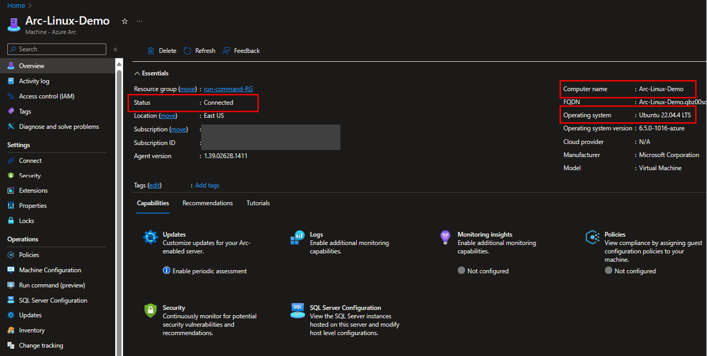
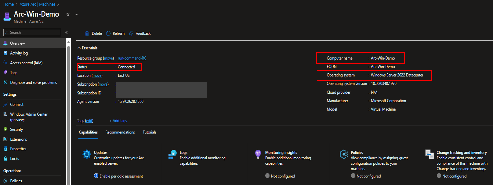
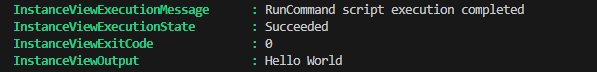
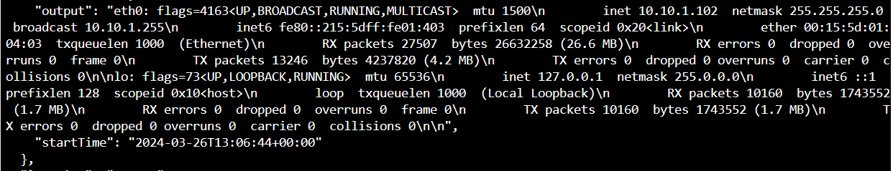

## Run PowerShell and Shell scripts on Azure Arc-enabled servers using the Run command

[The Run command feature](https://learn.microsoft.com/azure/azure-arc/servers/run-command) uses the Connected Machine agent to remotely run PowerShell scripts within an Azure Arc-connected Windows machine and Shell scripts within an Azure Arc-connected Linux machine. This capability is useful in all scenarios where you want to run a script within an Arc-connected machine. It allows you to troubleshoot and remediate a machine that doesn't have the RDP or SSH port open because of improper network or administrative user configuration.

The following Jumpstart scenario will guide you on how to use the Run command on your Arc-connected machine. Use the **Azure Cloud Shell** or **Visual Studio Code** command terminal to follow the instructions in this scenario.

> **NOTE: This scenario assumes you already deployed VMs or servers that are running on-premises or other clouds and you have connected them to Azure Arc. If you haven't, this repository offers you a way to do so in an automated fashion:**

- **[GCP Ubuntu instance](https://jumpstart.azure.com/azure_arc_jumpstart/azure_arc_servers/gcp/gcp_terraform_ubuntu/)**
- **[GCP Windows instance](https://jumpstart.azure.com/azure_arc_jumpstart/azure_arc_servers/gcp/gcp_terraform_windows/)**
- **[AWS Ubuntu EC2 instance](https://jumpstart.azure.com/azure_arc_jumpstart/azure_arc_servers/aws/aws_terraform_ubuntu/)**
- **[AWS Amazon Linux 2 EC2 instance](https://jumpstart.azure.com/azure_arc_jumpstart/azure_arc_servers/aws/aws_terraform_al2/)**
- **[Azure Ubuntu VM](https://jumpstart.azure.com/azure_arc_jumpstart/azure_arc_servers/azure/azure_arm_template_linux/)**
- **[Azure Windows VM](https://jumpstart.azure.com/azure_arc_jumpstart/azure_arc_servers/azure/azure_arm_template_win/)**
- **[VMware vSphere Ubuntu VM](https://jumpstart.azure.com/azure_arc_jumpstart/azure_arc_servers/vmware/vmware_terraform_ubuntu/)**
- **[VMware vSphere Windows Server VM](https://jumpstart.azure.com/azure_arc_jumpstart/azure_arc_servers/vmware/vmware_terraform_winsrv/)**

## Prerequisites

- As mentioned, this scenario starts at the point where you already deployed and connected VMs or servers to Azure Arc. In the screenshots below, you can see a Windows and a Linux server that have been connected with Azure Arc and are visible as resources in Azure.

    

    

    

- [Install or update Azure CLI](https://learn.microsoft.com/cli/azure/install-azure-cli?view=azure-cli-latest) on your client machine. Azure CLI should be running version 2.49.0 or later. Use ```az --version``` to check your current installed version.
- check the version of the Azure CLI extension "connectedmachine" on your client machine using the following command:
```shell
    az extension list --query "[?name=='connectedmachine'].version"
```
- If the version of the Azure CLI extension is older than "0.5.1" then use the following commands to upgrade it:
```shell
    az extension remove --name connectedmachine
    az extension add -- name connectedmachine
```
- Check the version of the Connected Machine agent running on your Arc-connected machine using the following command:

```shell
    az connectedmachine show --name <Machine Name> --resource-group <Resource Group Name> --query "properties.agentVersion"
```
- If the Connected Machine agent version is lower than 1.39 then upgrade the extension using [this guidance](https://learn.microsoft.com/azure/azure-arc/servers/manage-agent).

- To use PowerShell you need to check if the installed version of module _Az.ConnectedMachine_ is 0.6.0 or higher. Use the following PowerShell command to check the installed version:

```powershell
Get-Module -ListAvailable -Name Az.ConnectedMachine
```
Use the following command to install the latest version of the PowerShell module:

```powershell
Install-Module -Name Az.ConnectedMachine -Force 
```

## Use the Run command to execute a simple PowerShell command within an Arc-connected Windows machine

- Run the following Azure CLI command after adding the appropriate resource group, name of the Arc-connected machine, a name identifying the command, and the location of your Arc-connected machine:

```shell
    az connectedmachine run-command create --resource-group <Resource Group Name> --machine-name <Machine Name> --run-command-name <Identifying Name of command> --script "Write-Host 'Hello World'" --location <Location>
```
- It takes a few minutes to run the command and return the results. If the execution is successful then you will see the following within the longer returned JSON string:
    
```shell
    "executionState": "Succeeded",
    "exitCode": 0,
    "output": "Hello World",
```

If you prefer to use PowerShell then use the following command:

```powershell
New-AzConnectedMachineRunCommand -ResourceGroupName "<Resource Group Name>" -Location "<Location>" -SourceScript "Write-Host 'Hello World'" -RunCommandName "<Identifying Name of command>" -MachineName "<Machine Name>"
```

The successful execution of the PowerShell command will show the following output:



## Use the Run command to execute a simple Shell command within an Arc-connected Linux machine

- On your client machine run the following Azure CLI command after adding the appropriate parameters:

```shell
    az connectedmachine run-command create --resource-group <Resource Group Name> --machine-name <Machine Name> --run-command-name <Identifying Name of command> --script "ifconfig" --location <Location>
```

Or in PowerShell:

```powershell
New-AzConnectedMachineRunCommand -ResourceGroupName "<Resource Group Name>" -Location "<Location>" -SourceScript "ifconfig" -RunCommandName "<Identifying Name of command>" -MachineName "<Machine Name>"
```

- If the execution is successful then you should have an output that includes the result of the _ifconfig_ command as a string. Notice that the line breaks are indicated by the "\n" string.
    

## Examine the available options for the Run command

- Run the following command to return the available options of the Run command such as "create", "delete", "list", "show", "update" and "wait":

```shell
    az connectedmachine run-command --help
```

- Investigate the different ways you can run the "create" option by running the following command on your client machine:

```shell
    az connectedmachine run-command create --help
```

## Direct the output of a Run command to Azure storage blob

- Create a storage account (if you do not have one) using the following command after filling in the required parameters:

```shell
    az storage account create --name <Storage account name> --resource-group <Resource Group Name> --location <Location> --sku Standard_LRS --kind storageV2 --allow-blob-public-access false
```
- Create a storage container to which you will direct the output of the run command:

```shell
    az storage container create --name <container name> --account-name <Storage account name> --auth-mode login
```

- Create a blob SAS URI with the following permissions: Read, Write, Create, delete, and append. You will need an end date for the validity of the SAS token, 24 hours from the current date in the following example. Also, to be able to use the SAS URI in our run command you will need to remove any double quotes from the beginning and the end of the generated URI.

```shell
    end=`date -u -d "24 hours" '+%Y-%m-%dT%H:%MZ'`
    sasuri=$(az storage blob generate-sas --account-name <storage account name> --container-name <storage container name> --name <name of blob for command output destination - it will be created if it doesn't exist> --permissions acdrw --expiry $end --full-uri | tr -d '"')
```

```powershell
    $end=`date -u -d "24 hours" '+%Y-%m-%dT%H:%MZ'`
    $sasuri=$(az storage blob generate-sas --account-name <storage account name> --container-name <storage container name> --name <name of blob for command output destination - it will be created if it doesn't exist> --permissions acdrw --expiry $end --full-uri | tr -d '"')
```

- Execute the following _run_ command which runs a PowerShell script within the Arc-enabled Windows machine. The run command directs the output to the append blob.

```shell
    az connectedmachine run-command create --resource-group <Resource Group Name> --machine-name <Machine Name>  --run-command-name <Identifying Name of command> --script "Get-Process | Sort-Object CPU -desc | Select-Object -first 5" --location <Location> --output-blob-uri $sasuri
```

or in PowerShell:

```powershell
New-AzConnectedMachineRunCommand -ResourceGroupName "<Resource Group Name>" -Location "<Location>" -SourceScript "Get-Process | Sort-Object CPU -desc | Select-Object -first 5" -RunCommandName "<Identifying Name of command>" -MachineName "<Machine Name>" -OutputBlobUri $sasuri
```

- Examine the storage container in the Azure portal or using the Azure storage explorer. Look for the output of the command in the blob specified by the SAS URI used in the run command. The output should be the top five processes for CPU usage in the machine.

    

## Clean up environment

Complete the following steps to clean up your environment.

Remove the virtual machines from each environment by following the teardown instructions from each guide.

- **[GCP Ubuntu instance](../../gcp/gcp_terraform_ubuntu/)**
- **[GCP Windows instance](../../gcp/gcp_terraform_windows/)**
- **[AWS Ubuntu EC2 instance](../../aws/aws_terraform_ubuntu/)**
- **[AWS Amazon Linux 2 EC2 instance](../../aws/aws_terraform_al2/)**
- **[Azure Ubuntu VM](../../azure/azure_arm_template_linux/)**
- **[Azure Windows VM](../../azure/azure_arm_template_win/)**
- **[VMware vSphere Ubuntu VM](../../vmware/vmware_terraform_ubuntu/)**
- **[VMware vSphere Windows Server VM](../../vmware/vmware_terraform_winsrv/)**
