## Azure Video Indexer enabled by Arc on AKS Edge Essentials single node deployment (preview)

The following Jumpstart scenario will guide you on deploying [Azure Video Indexer](https://vi.microsoft.com/) at the edge by using [Azure Arc](https://azure.microsoft.com/products/azure-arc) and [AKS Edge Essentials](https://learn.microsoft.com/azure/aks/hybrid/aks-edge-overview). This scenario will deploy the necessary infrastructure in an Azure Virtual Machine, configure an AKS Edge Essentials [single-node deployment](https://learn.microsoft.com/azure/aks/hybrid/aks-edge-howto-single-node-deployment), connect the cluster to Azure Arc, then deploy the Video Indexer extension. The provided Bicep file and PowerShell scripts create the Azure resources and automation needed to configure the Video Indexer extension deployment on the AKS Edge Essentials cluster.

Thie architecture used in this scenario relies on nested virtualization. An Azure virtual machine running Windows Server 2022 is configured as a Hyper-V virtualization host. AKS Edge Essentials is deployed on this host. Because the Video Indexer extension requires a ReadWriteMany (RWX) storage class available on the Kubernetes cluster, this scenario uses [Longhorn](https://longhorn.io/) to provide the RWX storage class by using local disks attached to the Azure VM.

  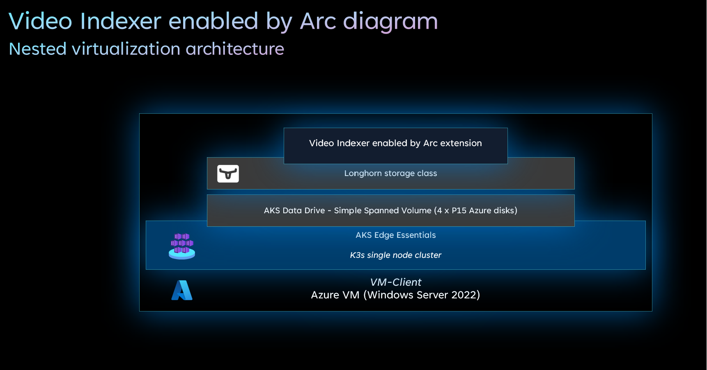

  > **Note:** Azure Video Indexer enabled by Arc is currently in preview and is not officially supported by Microsoft.

## Prerequisites

- You must have your Azure subscription approved to use the Video Indexer enabled by Arc extension. To get your subscription approved please submit [this form](https://aka.ms/vi-register).

- [Install or update Azure CLI to version 2.53.0 and above](https://learn.microsoft.com/cli/azure/install-azure-cli?view=azure-cli-latest). Use the below command to check your current installed version.

  ```shell
  az --version
  ```

- In case you don't already have one, you can [Create a free Azure account](https://azure.microsoft.com/free/).

- Create Azure service principal (SP). An Azure service principal assigned with the _Contributor_ Role-based access control (RBAC) role is required. You can use Azure Cloud Shell (or other Bash shell), or PowerShell to create the service principal.

  - (Option 1) Create service principal using [Azure Cloud Shell](https://shell.azure.com/) or Bash shell with Azure CLI:

    ```shell
    az login
    subscriptionId=$(az account show --query id --output tsv)
    az ad sp create-for-rbac -n "<Unique SP Name>" --role "Contributor" --scopes /subscriptions/$subscriptionId
    ```

    For example:

    ```shell
    az login
    subscriptionId=$(az account show --query id --output tsv)
    az ad sp create-for-rbac -n "JumpstartSPN" --role "Contributor" --scopes /subscriptions/$subscriptionId
    ```

    Output should look similar to this:

    ```json
    {
    "appId": "XXXXXXXXXXXXXXXXXXXXXXXXXXXX",
    "displayName": "JumpstartSPN",
    "password": "XXXXXXXXXXXXXXXXXXXXXXXXXXXX",
    "tenant": "XXXXXXXXXXXXXXXXXXXXXXXXXXXX"
    }
    ```
  
  - (Option 2) Create service principal using PowerShell. If necessary, follow [this documentation](https://learn.microsoft.com/powershell/azure/install-az-ps?view=azps-8.3.0) to install Azure PowerShell modules.

    ```powershell
    $account = Connect-AzAccount
    Set-AzContext -SubscriptionId "<Subscription Id>" # Required if multiple Azure subscriptions available
    $spn = New-AzADServicePrincipal -DisplayName "<Unique SPN name>" -Role "Contributor" -Scope "/subscriptions/$($account.Context.Subscription.Id)"
    echo "SPN App id: $($spn.AppId)"
    echo "SPN secret: $($spn.PasswordCredentials.SecretText)"
    ```

    For example:

    ```powershell
    $account = Connect-AzAccount
    Set-AzContext -SubscriptionId "11111111-2222-3333-4444-555555555555" # Required if multiple Azure subscriptions available
    $spn = New-AzADServicePrincipal -DisplayName "JumpstartSPN" -Role "Contributor" -Scope "/subscriptions/$($account.Context.Subscription.Id)"
    echo "SPN App id: $($spn.AppId)"
    echo "SPN secret: $($spn.PasswordCredentials.SecretText)"
    ```

    > **Note:** If you create multiple subsequent role assignments on the same service principal, your client secret (password) will be destroyed and recreated each time. Therefore, make sure you grab the correct password.

    > **Note:** The Jumpstart scenarios are designed with as much ease of use in-mind and adhering to security-related best practices whenever possible. It is optional but highly recommended to scope the service principal to a specific [Azure subscription and resource group](https://learn.microsoft.com/cli/azure/ad/sp?view=azure-cli-latest) as well considering using a [less privileged service principal account](https://learn.microsoft.com/azure/role-based-access-control/best-practices).

## Automation Flow

This scenario uses automation to configure the Video Indexer solution. The automation steps are described below.

- User edits the Bicep file parameters file (1-time edit). These parameter values are used throughout the deployment.

- User deploys the [main.bicep file](https://github.com/microsoft/azure_arc/blob/main/azure_arc_k8s_jumpstart/aks_hybrid/aks_edge_essentials_single_vi/bicep/main.bicep) to configure the following resources:

  - _Virtual Network_ - Virtual Network for Windows Server Azure VM.
  - _Network Interface_ - Network Interface for Azure Windows Server VM.
  - _Network Security Group_ - Network Security Group to allow access to services.
  - _Virtual Machine_ - Windows Server Azure VM.
  - _Custom script and Azure Desired State Configuration extensions_ - Configure the Azure Windows Server VM to host AKS Edge Essentials.
  - _Video Indexer account_ - Video Indexer account required for using the Video Indexer solution.
  - _Media Services account_ - Media services account associated with the Video Indexer account.
  - _Storage account_ - Storage account backing Media Services account.

- User remotes into client Windows VM, which automatically kicks off the [_LogonScript_](https://github.com/microsoft/azure_arc/blob/main/azure_arc_k8s_jumpstart/aks_hybrid/aks_edge_essentials_single_vi/artifacts/LogonScript.ps1) PowerShell script to:
  - Create the AKS Edge Essentials cluster in the Windows Server VM.
  - Onboard the AKS Edge Essentials cluster to Azure Arc.
  - Deploy Video Indexer solution as Arc extension on the AKS Edge Essentials cluster.

## Deployment

As mentioned, this deployment will leverage ARM templates. You will deploy a single template, responsible for creating all the Azure resources in a single resource group as well onboarding the created VM to Azure Arc.

- Clone the Azure Arc Jumpstart repository

    ```shell
    git clone https://github.com/microsoft/azure_arc.git
    ```

- Before deploying the ARM template, login to Azure using Azure CLI with the *`az login`* command.

- The deployment uses the Bicep parameters file. Before initiating the deployment, edit the [_main.parameters.json_](https://github.com/microsoft/azure_arc/blob/main/azure_arc_k8s_jumpstart/aks_hybrid/aks_edge_essentials_single_vi/bicep/main.parameters.json) file located in your local cloned repository folder. An example parameters file is located [here](https://github.com/microsoft/azure_arc/blob/main/azure_arc_k8s_jumpstart/aks_hybrid/aks_edge_essentials_single_vi/bicep/main.parameters.example.json).

  - _`spnClientId`_ - Your Azure service principal id.
  - _`spnClientSecret`_ - Your Azure service principal secret.
  - _`spnTenantId`_ - Your Azure tenant id.
  - _`windowsAdminUsername`_ - Username for the Windows Client VM.
  - _`windowsAdminPassword`_ - Password for the Windows Client VM.

- To deploy the Bicep file, navigate to the local cloned [deployment folder](https://github.com/microsoft/azure_arc/tree/main/azure_arc_k8s_jumpstart/aks_hybrid/aks_edge_essentials_single_vi/bicep/) and run the below command:

    ```shell
    az group create --name <Name of the Azure resource group> --location <Azure region>
    az deployment group create \
    --resource-group <Name of the Azure resource group> \
    --template-file main.bicep \
    --parameters main.parameters.json
    ```

    For example:

    ```shell
    az group create --name "JumpstartVideoIndexer" --location "eastus"
    az deployment group create \
    --resource-group "JumpstartVideoIndexer" \
    --template-file main.bicep \
    --parameters main.parameters.json
    ```

    > **Note:** If you receive an error message stating that the requested VM size is not available in the desired location (as an example: 'Standard_D8s_v3'), it means that there is currently a capacity restriction for that specific VM size in that particular region. Capacity restrictions can occur due to various reasons, such as high demand or maintenance activities. Microsoft Azure periodically adjusts the available capacity in each region based on usage patterns and resource availability. To continue deploying this scenario, please try to re-run the deployment using another region.

- Once Azure resources have been provisioned, you will be able to see them in Azure portal.

    

    

## Windows Login & Post Deployment

Once the Bicep plan is deployed, you must connect to the _VM-Client_ Azure VM using Remote Desktop.

### Connecting directly with RDP

By design, port 3389 is not allowed on the network security group. Therefore, you must create an NSG rule to allow inbound 3389.

- Open the _NSG-Prod_ resource in Azure portal and click "Add" to add a new rule.

  

- Specify "My IP address" in the Source dropdown, then enter the desired destination port (3389 is default) and click Add.

  

  

    > **Note:** Some Azure environments may have additional [Azure Virtual Network Manager](https://azure.microsoft.com/products/virtual-network-manager) restrictions that prevent RDP access using port 3389. In these cases, you can change the port that RDP listens on by passing a port value to the rdpPort parameter in the Bicep plan parameters file.

### Connect using just-in-time access (JIT)

If you already have [Microsoft Defender for Cloud](https://learn.microsoft.com/azure/defender-for-cloud/just-in-time-access-usage?tabs=jit-config-asc%2Cjit-request-asc) enabled on your subscription and would like to use JIT to access the Azure Client VM, use the following steps:

- In the Client VM configuration pane, enable just-in-time. This will enable the default settings.

  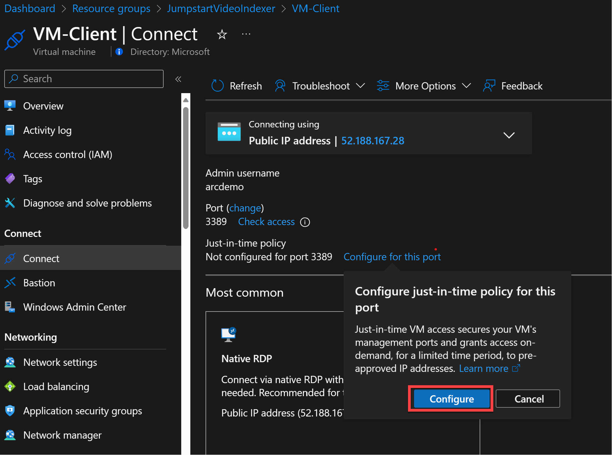

### Post Deployment

- After logging in for the first time a logon script will get executed. This script was created as part of the automated deployment process.

- Let the script to run its course and _do not close_ the Powershell session. It will close automatically once completed.

    > **Note:** The script run time is approximately 15 minutes long. You may see pods in the video-indexer namespace restarting multiple times during configuration.

    

- Upon successful run, a new Azure Arc-enabled Kubernetes cluster will be added to the resource group.

    

- You can also run _kubectl get nodes -o wide_ to check the cluster node status and _kubectl get pod -A_ to check the status of the system pods, [the Arc-enabled Kubernetes extension pods](https://learn.microsoft.com/azure/azure-arc/kubernetes/extensions), and [Azure Monitor extension pods](https://learn.microsoft.com/azure/azure-monitor/containers/container-insights-overview).

    

    

    > **Note:** It is normal for the pods in the video-indexer namespace to display some restarts.

## Using Video Indexer enabled by Arc

The Video Indexer enabled by Arc can be used in two ways, either through the dedicated [Video Indexer web portal](#video-indexer-web-portal) or [directly via API calls](#video-indexer-web-api). Both methods are described below.

### Video Indexer Web Portal

The [Video Indexer web portal](https://www.videoindexer.ai/) can be used with the Video Indexer enabled by Arc extension. In production scenarios you would normally have a valid TLS certificate securing your web api endpoint. In our scenario we are not using a valid TLS and access to the web API is over unsecured HTTPS. In order to use the web portal, you must first allow your browser to connect over unsecure connections via a browser to your extension's API endpoint.

- Open the Azure portal and enter ```https://<your VM public IP>/info``` in the address bar. To bypass the warning about unsecure HTTPS in Microsoft Edge you can type ```thisisunsafe``` with the browser in the foreground.

  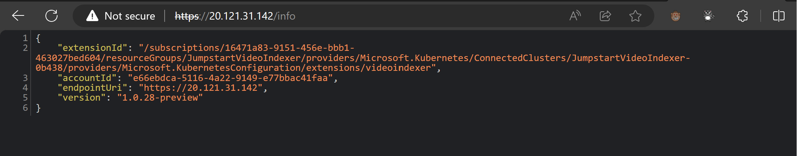

- Open the [Video Indexer web portal](https://www.videoindexer.ai/) and sign in with your AAD account.

  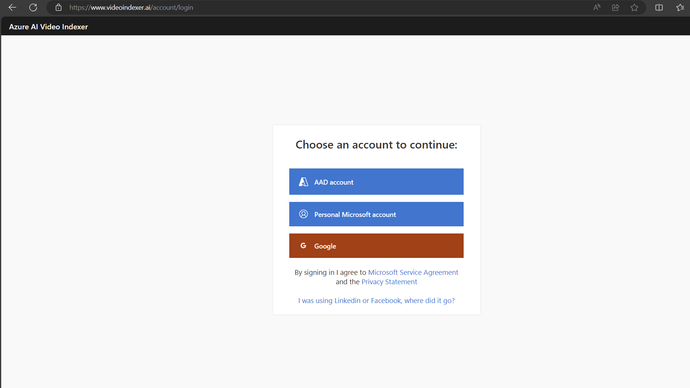

- Switch to the Video Indexer extension by clicking the dropdown in the upper right corner where your account GUID is shown.

  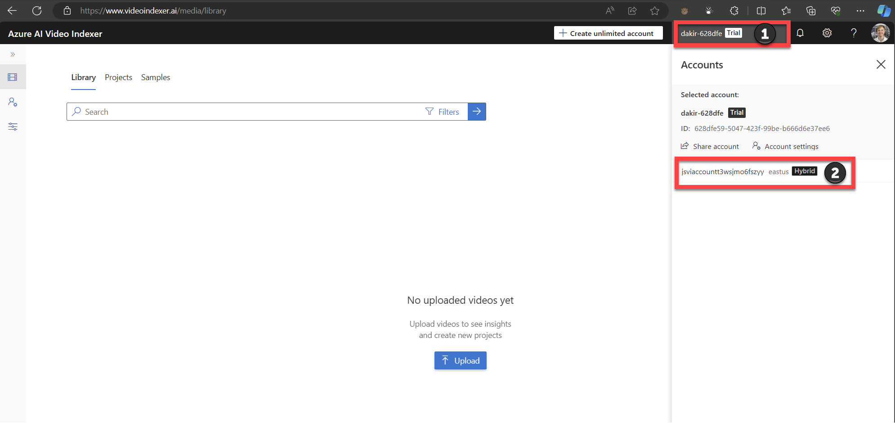

- Select the extension from the left pane and then click the "Upload" button.

  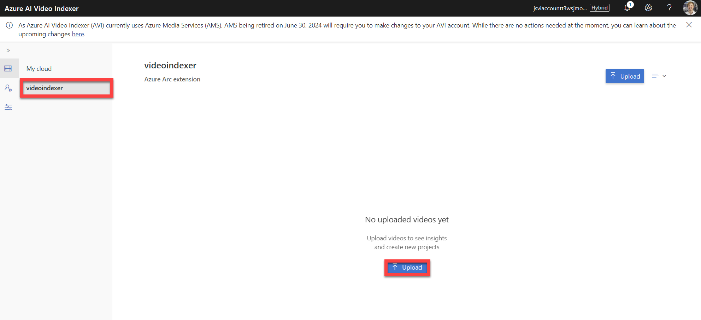

- You can upload your own video or you can use the one included on the Client VM located at "C:\Temp\video.mp4". Select the video you want to upload, set the video name and source language, then check the consent checkbox to agree to the terms and conditions.

  > **Note:** You can upload up to 10 video files at a time.

  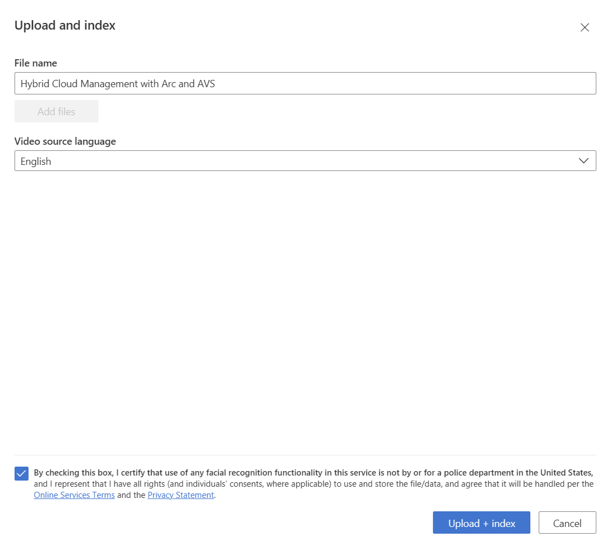

- Click on "Advance settings" and then "Indexing". Here you can choose the set of AIs to use when indexing your video content. For this scenario we will choose the "Basic video + audio" preset.

  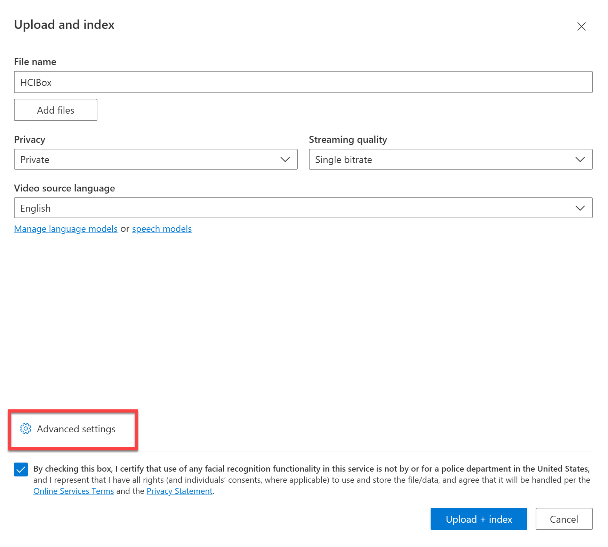

  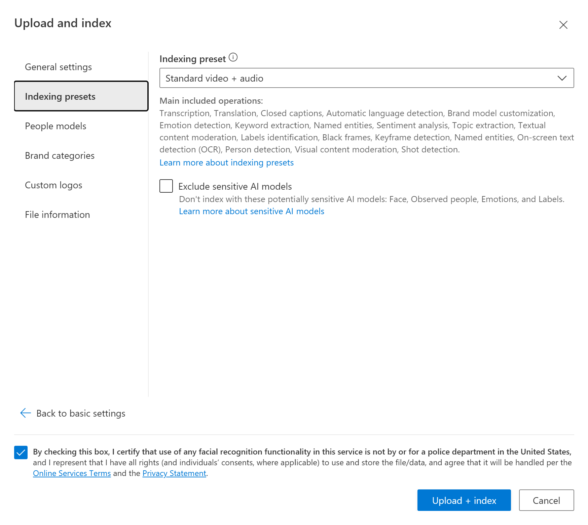

- Click on "Upload + index" to start the upload process. Once the upload process is finished, you may close the dialog box.

  

- The uploaded video will be added to the Video library page, and a progress bar will appear to indicate the indexing process.

  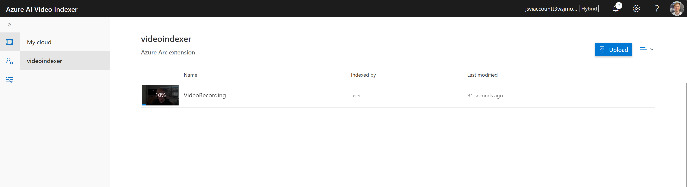

- After the indexing is done, you can view the insights by selecting the video. Go to the video page by clicking on the indexed video.

  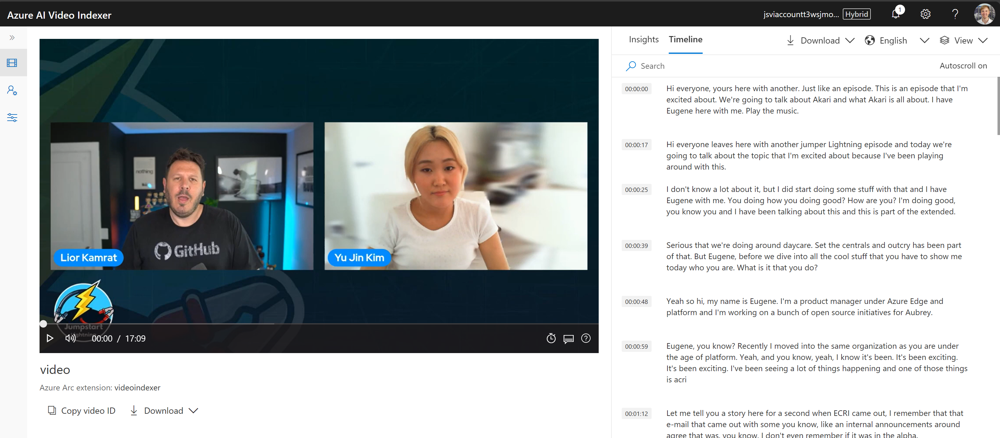

- First, click on play video. The video will be streamed from the local location set at the extension installation.

  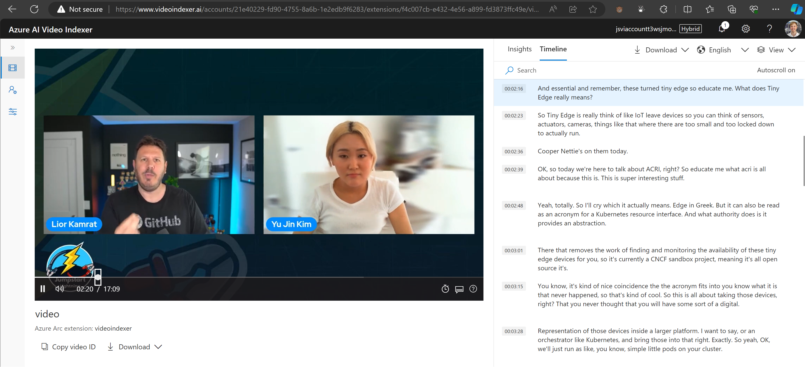

- Click on "Timeline" to view the video transcription including the time stamps. Check that while the video is playing the correct transcript line is highlighted. The text can be translated to one of the supported languages: English (US), Spanish, German, French, Italian, Chinese (Simplified) and Arabic. Click on the dropdown on the top right of the page and select German.

  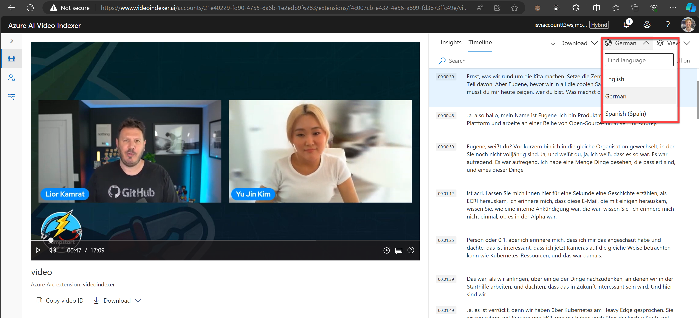

- Now the transcript shown on the right of the page will display the translated transcript in the selected language.

  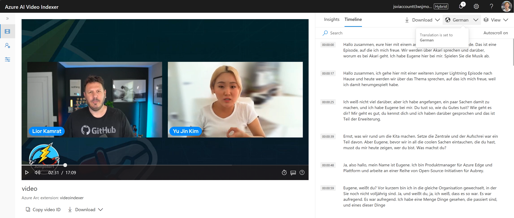

- Turn on the captions by clicking on the text bubble icon on the bottom right side of the player and selecting one of the supported languages. Captions should start to show while the video is playing.

  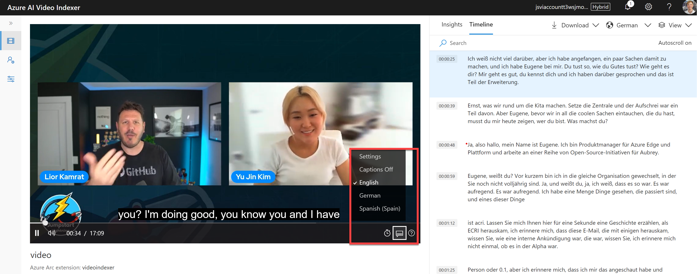

### Video Indexer Web API

The Video Indexer API is available and running on the AKS cluster. You can make direct calls to the API by using the included Postman application on the Client VM. Follow these steps to work with the API via Postman.

- First, verify that the extension deployed successfully by using Azure CLI. Replace the resource group and cluster name with the values from your deployment. Cluster name is the name of the Arc-enabled Kubernetes cluster as seen from inside your resource group:

  ```shell
    az k8s-extension show --name videoindexer `
      --cluster-type connectedClusters `
      --resource-group <name of your resource group> `
      --cluster-name <name of your connected cluster> -o table
  ```

  

- You will need the IP address of the Video Indexer Web API ingress. By default the address should be 192.168.0.4.

  ```shell
    kubectl get ing -n video-indexer
  ```

  

Now we will use the Web API to index a video by making API calls through the Postman client.

- From Azure portal, navigate to the Azure AI Video Indexer resource and then click "Management API". Change the Permission dropdown to Contributor, then click Generate and copy the Access.

  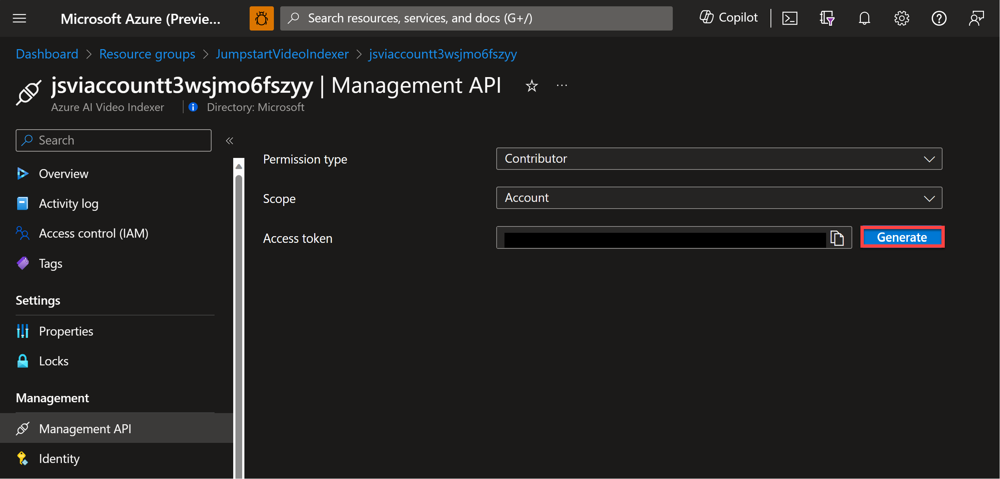

- Open the Postman client from the shortcut on the Client VM desktop, and then select "lightweight API client".

  

- Using Postman, make a GET request to the Web API info function. Enter *`https://192.168.0.4/info`* for the URI and click Send. You should get a JSON object back representing the extension info and public endpoint. Note the "accountId" field as you will need it in the next step.

  

- Next, change the request type to POST and the URI to *`https://192.168.0.4/Accounts/<accountId>/Videos`*, where accountId is your Video Indexer account ID retrieved in the previous step.

  

- In the Key/value table, enter a new key with the name "name" and the value "SampleVideo" as seen in the screenshot below.

  

- Switch to the "Authorization" tab and change the Type dropdown to "Bearer Token". In the Token field enter the Bearer token you generated from the Azure portal.

  

- Switch to the "Body" tab. In the Key/value table enter a new key with name "fileName" and then and select the "File" option from the dropdown under the Key column.

  

- Choose "Select file" under the "Value" column and navigate to C:\Temp\video.mp4 to select the sample video to upload.

  

- Finally, click the "Send" button to send the request. If you've done things correctly, you will see the video id and the "processing" status in the JSON response.

  

At this point the video is being indexed by the Video Indexer extension. This step will take some time. You can monitor the progress as follows:

- Using Postman, make a new GET request to the following URI - *`https://192.168.0.4/Accounts/{accountId}/Videos?name=SampleVideo`* where accountId is your Video Indexer account id. In the example below the video processing is 10% complete, as seen in the JSON response.

  

- You can repeat the same API call to monitor the progress. When complete, the state will change to "Processed" and the processingProgress should show 100%. Note the id field for the next step.

  

Now we can use other API calls to examine the indexed video content.

- From the Postman client, make a new GET request to the following URI - *`https://192.168.0.4/Accounts/{accountId}/Videos/{videoId}/Index`* where AccountID is your Video Indexer account id and videoId is the id of the video. Review the JSON response to see insights of the video extracted by the Video Indexer extension.

  

## Exploring logs from the Client VM

Occasionally, you may need to review log output from scripts that run on the _AKS-EE-Demo_ VM in case of deployment failures. To make troubleshooting easier, the scenario deployment scripts collect all relevant logs in the _C:\Temp_ folder on _AKS-EE-Demo_ Azure VM. A short description of the logs and their purpose can be seen in the list below:

| Log file | Description |
| ------- | ----------- |
| _C:\Temp\Bootstrap.log_ | Output from the initial _bootstrapping.ps1_ script that runs on _AKS-EE-Demo_ Azure VM. |
| _C:\Temp\LogonScript.log_ | Output of _LogonScript.ps1_ which creates the AKS Edge Essentials cluster, onboard it with Azure Arc creating the needed extensions as well as onboard the Azure VM. |


## Cleanup

- If you want to delete the entire environment, simply delete the deployment resource group from the Azure portal.

    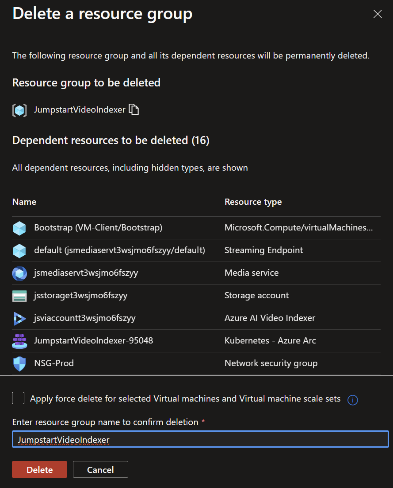
