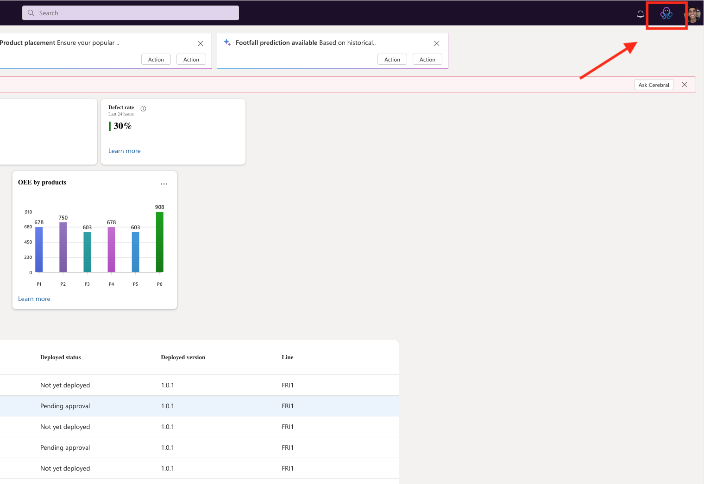
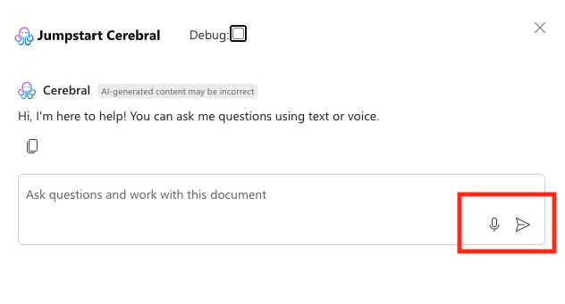
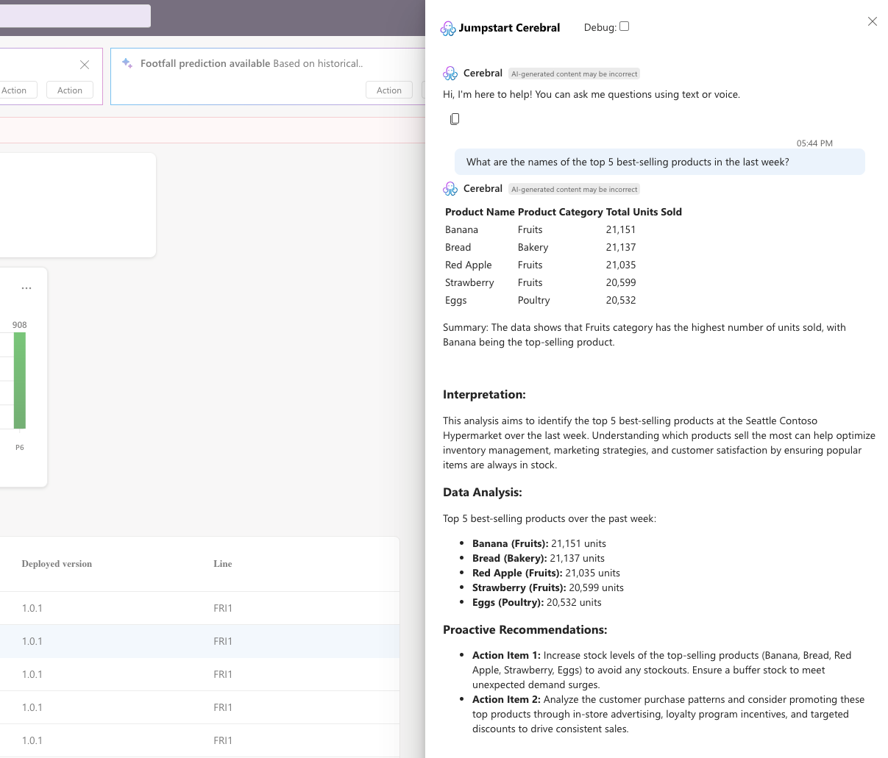
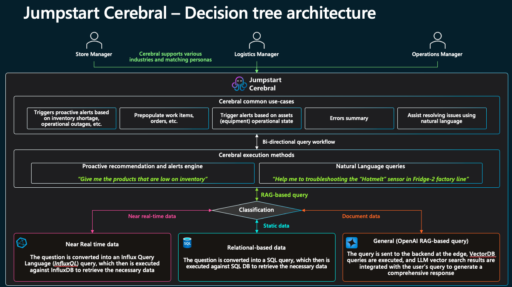

# Cerebral - Gen AI Commercial and Operations assistance

## Overview

### Overview


Cerebral is an advanced Generative AI assistant that revolutionizes how store personnel interact with critical information across Contoso Hypermarket's diverse data sources. By combining powerful large language models with specialized databases, Cerebral delivers contextual assistance and intelligent insights through natural language interactions. The system leverages [Retrieval Augmented Generation (RAG)](https://azure.microsoft.com/products/phi) to synthesize information from technical documentation, real-time metrics, and business data into comprehensive, tailored responses.

Cerebral innovative hybrid architecture optimally balances edge computing with cloud capabilities. Whether processing queries via [Azure OpenAI](https://learn.microsoft.com/azure/ai-services/openai/overview) in the cloud or utilizing [Small Language Models (SLM)](https://azure.microsoft.com/products/phi) at the edge, Cerebral intelligently routes and handles requests based on their complexity and urgency. Through its deep understanding of industry context and user roles, Cerebral acts as an intelligent partner that enables staff to focus on value-adding activities rather than searching through multiple systems.

> **Learn More**: For detailed information about Cerebral's Generative AI capabilities, explore the [Azure OpenAI Service documentation](https://learn.microsoft.com/azure/ai-services/openai/overview) and [Microsoft Phi-3 - small language models (SLMs)](https://azure.microsoft.com/blog/introducing-phi-3-redefining-whats-possible-with-slms/)

### Business Challenges

In today's complex retail environment, organizations face critical operational challenges that impact efficiency and decision-making capabilities. Store managers and staff often struggle with fragmented information spread across multiple systems, leading to delayed responses to critical inventory and operational issues. New employees face steep learning curves as they attempt to navigate various platforms and documentation sources, while maintenance teams lose valuable time searching through scattered technical documentation for troubleshooting procedures.

Cerebral addresses these pain points by providing a unified, intelligent interface that breaks down information silos and streamlines access to critical data and documentation. By leveraging natural language processing and contextual understanding, it transforms complex data retrieval and decision-making processes into simple, conversational interactions. This approach significantly reduces response times to operational issues, accelerates employee onboarding, and enables more efficient maintenance operations through instant access to relevant technical information.


## Architecture

The power of Cerebral lies in its sophisticated hybrid architecture that balances local processing with cloud capabilities. At its core, Cerebral operates on an edge-located [Arc-enabled Kubernetes cluster](https://learn.microsoft.com/azure/azure-arc/kubernetes/overview), which hosts the local language model (Microsoft Phi-3 Mini-4k) for rapid response to common queries. This edge infrastructure connects seamlessly with cloud services through [Azure IoT Operations](https://azure.microsoft.com/products/iot-operations), enabling a robust and scalable system that can handle everything from simple information requests to complex analytical queries.

Cerebral exposes its functionality through a comprehensive API layer that supports both REST and WebSocket connections, enabling real-time interactions and seamless integration with applications like the Contoso Hypermarket web interface.

At its core, Cerebral employs a query processing orchestrator that intelligently routes requests to appropriate data sources based on the nature of the query. For commercial data such as sales, inventory, and customer information, the system interfaces with SQL Server. Real-time device metrics and operational data are managed through InfluxDB, a specialized time-series database that captures everything from equipment performance to environmental readings. Technical documentation and operational procedures are accessed through a [Chroma vector database](https://www.trychroma.com/), enabling powerful RAG (Retrieval Augmented Generation) capabilities.


The system's AI processing capabilities are designed for flexibility, with the ability to leverage either Azure OpenAI for complex cloud-based processing or Small Language Models (SLM) for edge processing. This hybrid approach ensures optimal performance while maintaining data privacy and enabling offline operations when needed.

To support development, testing, and demonstrations, Cerebral includes a sophisticated data simulator that generates realistic streams of commercial transactions, device telemetry, and equipment status updates. This simulation capability is crucial for system validation and training scenarios.

> **Learn More**: 
> - To understand how Cerebral integrates with Contoso Hypermarket's data infrastructure, explore [Data Pipeline Architecture](../data_pipeline/_index.md).

While currently demonstrated within Contoso Hypermarket's retail environment, the architecture is inherently designed for multi-industry adaptation. New data sources, industry verticals, and processing pipelines can be seamlessly integrated, ensuring that Cerebral can evolve to meet the needs of diverse operational contexts while maintaining consistent performance and reliability.


## Interacting with Cerebral

### Accessing Cerebral

Throughout the Contoso Hypermarket interface, whether you're a store manager reviewing sales data, a maintenance technician checking equipment status, or a shopper seeking assistance, Cerebral is your AI-powered assistant ready to help with any query. The system provides an intuitive and seamless way to access information across all store systems and documentation.

> **Note**: To learn more about using the Contoso Hypermarket web applications and how Cerebral integrates with different operational interfaces, please refer to our [Shopper Insights Guide](../shopper_insights/_index.md). 

#### Getting Started with Cerebral

1. **Accessing the Assistant**
   - Locate the Cerebral icon in the top-right corner of any page
   - Click the icon to open the sliding sidebar interface
   - The sidebar will smoothly slide in from the right side of the screen





2. **Interface Overview**
   - The sidebar presents a clean, focused chat interface
   - You'll see a welcome message: "Hi, I'm here to help! You can ask me questions using text or voice."
   - A text input field is available at the bottom of the panel
   - Voice input can be activated using the microphone icon
   - For technical users, a "Debug" checkbox is available to view backend processing details


3. **Interaction Methods**
   - Type your question directly into the text field and press enter or click the send button
   - Click the microphone icon to use voice input
   - Cerebral will process your query and provide relevant information, data, or procedures based on your request



The interface is designed to be non-intrusive while remaining easily accessible throughout your work session. You can minimize the sidebar at any time by clicking the 'X' in the top-right corner, and reopen it whenever you need assistance.

> **Note**: For more information about Cerebral's voice interaction capabilities, see our detailed guide on [Speech-to-Text Integration](../speech_to_text/_index.md).

The interaction is straightforward and natural - simply type your question or click the microphone icon to speak. Cerebral understands natural language queries across a wide range of topics, for example:


| Type of Query | Example Question | Sample Response |
|--------------|------------------|-----------------|
| Technical Support | "The cash dispenser in POS-01 is stuck. How do I fix it?" |  |
| Sales Analysis | "What are our top 5 selling products this week?" |   |
| Equipment Monitoring | "What's the power usage for HVAC unit 02?" |  |
| Inventory Management | "Show me all products below reorder threshold" |  |

> **Note**: The examples and screenshots shown in this documentation are for illustration purposes only. Actual results and responses from Cerebral may vary depending on:
> - Current data in your systems
> - Real-time operational status
> - Specific store configuration
> - Updated procedures and documentation
> 
> While the core functionality remains the same, Cerebral's responses are dynamic and contextual to your specific situation and the latest available information.


Based on your query, Cerebral automatically classifies the type of request and routes it to the appropriate system (documentation, real-time data, or business intelligence) to provide relevant and contextual responses. For demonstration purposes, users can enable the "Debug" checkbox in the interface to view behind-the-scenes details such as:

- Query classification (documentation, data, or relational)
- Generated database queries
- Data processing steps
- Response construction logic

This transparency helps users understand how Cerebral processes their requests while providing valuable insights into the system's decision-making process.


> **Important**: 
> - For detailed information about data types and how Cerebral processes different sources of information, see the [Unified Data Sources](#unified-data-sources) section.
> - For examples of how to formulate questions and understand query types, refer to our comprehensive list of [Example Queries](#example-questions-by-category).
> - Common questions include:
>   * Documentation: "How do I calibrate Scale-02?"
>   * Commercial: "What are our top 5 selling products this week?"
>   * Real-time: "What's the current temperature of HVAC unit 02?"


### Data Integration and Query Processing

At the heart of Cerebral's architecture lies a sophisticated data integration system that seamlessly connects diverse information sources through an intelligent query processing pipeline. This unified approach transforms how organizations access and utilize their operational data.

#### Unified Data Sources

The system orchestrates three specialized databases, each optimized for specific types of information and query patterns:

**InfluxDB** powers Cerebral's real-time operational insights by managing time-series data from store equipment and systems. This specialized database captures everything from refrigeration temperatures to checkout queue lengths, enabling rapid analysis of current conditions and historical trends. Its optimized time-series capabilities ensure swift access to performance metrics and environmental data when seconds matter.

* Captures real-time metrics from store equipment
* Monitors system performance data
* Tracks operational status
* Stores historical trending data


The following table details the equipment types and metrics being simulated through MQTT for Contoso Hypermarket's operations:

| Equipment Type | Device Format | Fields Monitored | Example Metrics |
|---------------|---------------|------------------|-----------------|
| Refrigerator | `Refrigerator{01..XX}` | - temperature_celsius<br>- door_open<br>- power_usage_kwh | - Current temperature<br>- Door status (open/closed)<br>- Power consumption |
| Scale | `Scale{01..XX}` | - weight_kg<br>- tare_weight_kg | - Current weight<br>- Tare weight settings |
| POS | `POS{01..XX}` | - items_sold<br>- total_amount_usd<br>- payment_method<br>- failure_type | - Transaction volume<br>- Sales amount<br>- Payment types<br>- Error states |
| SmartShelf | `SmartShelf{01..XX}` | - product_id<br>- stock_level<br>- threshold_stock_level<br>- last_restocked | - Current inventory<br>- Stock thresholds<br>- Restock timing |
| HVAC | `HVAC{01..XX}` | - temperature_celsius<br>- humidity_percent<br>- power_usage_kwh<br>- operating_mode | - Air temperature<br>- Humidity levels<br>- Energy usage<br>- Mode (heating/cooling) |
| LightingSystem | `LightingSystem{01..XX}` | - brightness_level<br>- power_usage_kwh<br>- status | - Light intensity<br>- Power consumption<br>- Operational status |
| AutomatedCheckout | `AutomatedCheckout{01..XX}` | - items_scanned<br>- total_amount_usd<br>- payment_method<br>- errors<br>- queueLength<br>- avgWaitTime | - Scanning activity<br>- Transaction values<br>- Error states<br>- Queue metrics |

> **Note**: The simulation generates realistic data streams for each device type, enabling testing, demonstrations, and development. Device IDs are formatted with sequential numbering (e.g., Refrigerator01, Refrigerator02). All metrics are published to the MQTT broker and InflixDB and can be queried through Cerebral using natural language.


**SQL Server** handles all commercial operations data, providing a robust foundation for business intelligence. From transaction processing to inventory management, this relational database ensures accurate tracking of sales patterns, stock levels, and customer interactions, enabling data-driven decision making across the organization.

* Manages transaction records
* Tracks inventory levels
* Stores customer data
* Handles business intelligence queries

The following table details the relational database structure used in Contoso Hypermarket for commercial and operational data:

| Table Name | Description | Key Fields | Example Data |
|------------|-------------|------------|--------------|
| Sales | Transaction records | - sale_id VARCHAR(50)<br>- sale_date DATETIME2<br>- store_id VARCHAR(10)<br>- store_city VARCHAR(100)<br>- product_id VARCHAR(50)<br>- quantity INT<br>- item_total DECIMAL(10,2)<br>- payment_method VARCHAR(50)<br>- customer_id VARCHAR(50)<br>- register_id VARCHAR(20) | - 'SAL20240312001'<br>- '2024-03-12 14:30:00'<br>- 'SEA'<br>- 'Seattle'<br>- 'PROD001'<br>- 2<br>- 4.99<br>- 'credit_card'<br>- 'CUST123'<br>- 'REG01' |
| Products | Product catalog | - product_id VARCHAR(50)<br>- name VARCHAR(200)<br>- category VARCHAR(100)<br>- price_min DECIMAL(10,2)<br>- price_max DECIMAL(10,2)<br>- stock INT<br>- photo_path VARCHAR(500) | - 'PROD001'<br>- 'Red Apple'<br>- 'Fruits'<br>- 0.20<br>- 0.40<br>- 1000<br>- '/img/products/apple.jpg' |
| Inventory | Current stock levels | - id INT<br>- date_time DATETIME2<br>- store_id VARCHAR(10)<br>- product_id VARCHAR(50)<br>- retail_price DECIMAL(10,2)<br>- in_stock INT<br>- reorder_threshold INT<br>- last_restocked DATETIME2 | - 1<br>- '2024-03-12 15:00:00'<br>- 'SEA'<br>- 'PROD001'<br>- 0.35<br>- 850<br>- 200<br>- '2024-03-11 08:00:00' |
| Stores | Store locations | - store_id VARCHAR(10)<br>- city VARCHAR(100)<br>- state VARCHAR(50)<br>- country VARCHAR(100) | - 'SEA'<br>- 'Seattle'<br>- 'WA'<br>- 'United States' |
| DeviceMetrics | Equipment telemetry history | - id INT<br>- timestamp DATETIME2<br>- device_id VARCHAR(50)<br>- equipment_type VARCHAR(50)<br>- metric_name VARCHAR(100)<br>- metric_value DECIMAL(18,4)<br>- metric_unit VARCHAR(20) | - 1<br>- '2024-03-12 15:01:00'<br>- 'HVAC01'<br>- 'HVAC'<br>- 'temperature'<br>- 22.5<br>- 'celsius' |

**Chroma Vector Database** serves as the foundation for Cerebral's documentation intelligence. By indexing technical manuals, maintenance procedures, and operational guides, it enables sophisticated semantic search capabilities through Retrieval Augmented Generation (RAG). This allows Cerebral to understand the context and intent behind documentation queries, delivering precise and relevant information to users.
  
* Stores and indexes technical documentation
* Enables semantic search capabilities
* Manages operational procedures and maintenance guides
* Facilitates contextual information retrieval

#### Available Technical Manuals

| System | Description | Documentation |
|--------|-------------|---------------|
| Automated Checkout | Complete guide for operation and maintenance of self-checkout systems | [User Manual](https://download.microsoft.com/download/3ae1d7aa-a642-48cf-b848-67b4eaa81292/Automated%20Checkout%20System%20User%20Manual%20for%20Contoso%20Hypermarket.pdf) |
| SmartShelf | Technical documentation for electronic shelf labeling and inventory tracking | [User Manual](https://download.microsoft.com/download/3ae1d7aa-a642-48cf-b848-67b4eaa81292/SmartShelf%20System%20User%20Manual%20for%20Contoso%20Hypermarket.pdf) |
| Refrigeration | Maintenance and operation guides for refrigeration units | [User Manual](https://download.microsoft.com/download/3ae1d7aa-a642-48cf-b848-67b4eaa81292/Refrigeration%20System%20User%20Manual%20for%20Contoso%20Hypermarket.pdf) |
| HVAC | Environmental control system documentation | [User Manual](https://download.microsoft.com/download/3ae1d7aa-a642-48cf-b848-67b4eaa81292/HVAC%20System%20User%20Manual%20for%20Contoso%20Hypermarket.pdf) |
| Scale Systems | Calibration and operation procedures for weighing equipment | [User Manual](https://download.microsoft.com/download/3ae1d7aa-a642-48cf-b848-67b4eaa81292/Scale%20System%20User%20Manual%20for%20Contoso%20Hypermarket.pdf) |

> **Note**: All technical documentation is automatically indexed and processed by Cerebral's RAG system, enabling natural language queries about any aspect of these systems. Instead of manually searching through PDFs, users can simply ask Cerebral specific questions about equipment operation, maintenance procedures, or troubleshooting steps.


#### Intelligent Query Routing



When a user interacts with Cerebral, their natural language query flows through a sophisticated decision tree that determines the optimal processing path. Questions about maintenance procedures are seamlessly routed to the vector database, equipment status checks are directed to the time-series database, and sales inquiries are processed through the relational database. This intelligent routing ensures that each query is handled by the most appropriate system, delivering fast, accurate responses while maintaining system efficiency.

For example, when a maintenance technician asks "How do I calibrate Scale-02?", Cerebral recognizes this as a documentation query and leverages RAG to search the vector database for relevant procedures. Conversely, a store manager asking "What were our top-selling products today?" triggers a SQL query to analyze recent transaction data.


## Industry and Role Adaptability

While Cerebral is currently showcased within Contoso Hypermarket's retail environment, its architecture is designed to be inherently multi-industry and role-adaptive. Through a sophisticated prompt catalog system, Cerebral can be customized to understand and respond to the unique contexts of different industries and professional roles.

### Industry and Role Support

Current supported industries and roles include:

| Industry | Roles | Examples |
|----------|-------|----------|
| Retail | - Store Manager<br>- Inventory Manager<br>- Maintenance Worker | - Store performance metrics<br>- Stock level monitoring<br>- Equipment maintenance |
| Manufacturing | - Maintenance Engineer<br>- Shift Supervisor<br>- Production Manager | - Machine diagnostics<br>- Production line metrics<br>- Quality control data |
| Automotive | - Line Supervisor<br>- Quality Inspector<br>- Maintenance Technician | - Assembly line monitoring<br>- Quality assurance checks<br>- Equipment maintenance |
| Hypermarket | - Store Manager<br>- Shopper<br>- Maintenance Worker | - Sales analytics<br>- Product location<br>- Facility maintenance |

### Example Questions by Category

| Category | Query Example | Expected Response Type |
|----------|--------------|----------------------|
| **Documentation & Procedures** | 1. "What are the steps to close the store at the end of the day?" | Step-by-step procedure with checklist |
| | 2. "How do I perform the daily cleaning routine for the meat department?" | Detailed cleaning protocol with safety guidelines |
| | 3. "What's the emergency shutdown procedure for the refrigeration system?" | Emergency procedure with critical steps highlighted |
| | 4. "Show me the maintenance checklist for the automated checkout machines" | Maintenance checklist with technical specifications |
| | 5. "What are the safety protocols for handling spills in the produce area?" | Safety guidelines and cleaning procedures |
| **Real-time Operations** | 1. "What's the current capacity of all automated checkouts in use?" | Real-time usage metrics and availability status |
| | 2. "Show me the temperature trends for all refrigeration units in the last hour" | Temperature graphs and anomaly indicators |
| | 3. "Are any SmartShelves reporting low stock alerts right now?" | Current stock alerts and locations |
| | 4. "What's the average wait time at the deli counter currently?" | Current wait times and historical comparison |
| | 5. "How is HVAC-02 performing compared to its normal baseline?" | Performance metrics with baseline comparison |
| **Commercial Data** | 1. "Which products in the dairy section need restocking?" | List of products below threshold with quantities |
| | 2. "What was our busiest hour for sales yesterday?" | Sales volume analysis with peak times |
| | 3. "Show me the performance of our seasonal products this month" | Sales trends and inventory analysis |
| | 4. "What's the current inventory level for fresh produce?" | Current stock levels with reorder recommendations |
| | 5. "Which payment method was most used in the last week?" | Payment method breakdown with percentages |

> **Note**: These examples represent common queries that Cerebral can handle. The system understands variations in phrasing and can maintain context through follow-up questions. For more information about data sources and query processing, see the [Unified Data Sources](#unified-data-sources) section.

### Prompt Catalog System

Cerebral's flexibility comes from its extensible prompt catalog, which enables:

1. **Industry-Specific Context**
   - Customized terminology
   - Industry-relevant metrics
   - Sector-specific compliance requirements
   - Domain-specific best practices

2. **Role-Based Responses**
   - Tailored information access
   - Role-appropriate technical depth
   - Relevant recommendations
   - Authorized data visibility

### Example Prompt Customization

```json
{
    "industries": {
        "retail": {
            "roles": {
                "store_manager": {
                    "classification_prompt": "...",
                    "query_prompt": "...",
                    "response_prompt": "..."
                }
            }
        },
        "manufacturing": {
            "roles": {
                "maintenance_engineer": {
                    "classification_prompt": "...",
                    "query_prompt": "...",
                    "response_prompt": "..."
                }
            }
        }
    }
}
```

### Benefits of Multi-Industry Design

Cerebral's multi-industry architecture delivers three fundamental advantages that make it a powerful solution across different sectors and roles. At its core, the system's scalability ensures that organizations can easily expand their implementation to new industries and roles without significant restructuring. This scalability is complemented by a flexible prompt management system and an extensible knowledge base that grows with each implementation, allowing the system to continuously learn and adapt to new domains.

The system maintains unwavering consistency across all implementations through standardized response formats and uniform query handling mechanisms. This consistency ensures that whether users are accessing Cerebral in a retail environment or a manufacturing facility, they experience the same reliable, intuitive interaction patterns and dependable data processing. This standardization doesn't just benefit end users; it also streamlines maintenance and updates across different industry deployments.

Perhaps most importantly, Cerebral offers deep customization capabilities that allow it to speak the language of each industry it serves. From adapting to industry-specific terminology to implementing role-based access controls, each instance of Cerebral can be precisely tailored to its operational context. This customization extends to response formatting and recommendations, ensuring that each user receives information in the most relevant and actionable format for their role and industry context. Whether it's a store manager reviewing sales metrics or a maintenance engineer diagnosing equipment issues, Cerebral adapts its communication style and content depth to match the user's needs and expertise level.
