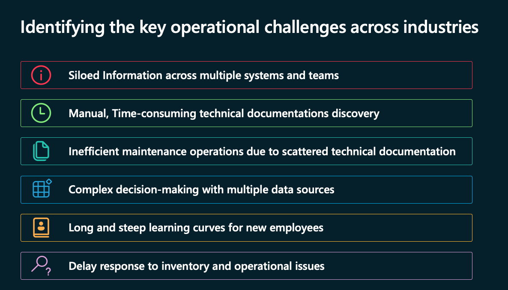

# Cerebral - Gen AI Commercial and Operations assistance

## Overview

Contoso Hypermarket leverages Cerebral, an advanced AI assistant, to transform how store personnel interact with their operational systems and access critical information. This innovative solution combines edge computing with cloud capabilities to deliver contextual assistance while maintaining responsive performance and data security. By understanding industry-specific context and adapting to different user roles, Cerebral serves as an intelligent partner that helps staff focus on value-adding activities rather than searching for information or navigating complex systems.

### Business Challenges

In today's complex retail environment, organizations face critical operational challenges that impact efficiency and decision-making capabilities. Store managers and staff often struggle with fragmented information spread across multiple systems, leading to delayed responses to critical inventory and operational issues. New employees face steep learning curves as they attempt to navigate various platforms and documentation sources, while maintenance teams lose valuable time searching through scattered technical documentation for troubleshooting procedures.

Cerebral addresses these pain points by providing a unified, intelligent interface that breaks down information silos and streamlines access to critical data and documentation. By leveraging natural language processing and contextual understanding, it transforms complex data retrieval and decision-making processes into simple, conversational interactions. This approach significantly reduces response times to operational issues, accelerates employee onboarding, and enables more efficient maintenance operations through instant access to relevant technical information.



## Architecture

The power of Cerebral lies in its sophisticated hybrid architecture that balances local processing with cloud capabilities. At its core, Cerebral operates on an edge-located Arc-enabled Kubernetes cluster, which hosts the local language model (Microsoft Phi-3 Mini-4k) for rapid response to common queries. This edge infrastructure connects seamlessly with cloud services through Azure IoT Operations, enabling a robust and scalable system that can handle everything from simple information requests to complex analytical queries.

Cerebral exposes its functionality through a comprehensive API layer that supports both REST and WebSocket connections, enabling real-time interactions and seamless integration with applications like the Contoso Hypermarket web interface.

At its core, Cerebral employs a sophisticated query processing orchestrator that intelligently routes requests to appropriate data sources based on the nature of the query. For commercial data such as sales, inventory, and customer information, the system interfaces with SQL Server. Real-time device metrics and operational data are managed through InfluxDB, a specialized time-series database that captures everything from equipment performance to environmental readings. Technical documentation and operational procedures are accessed through a Chroma vector database, enabling powerful RAG (Retrieval Augmented Generation) capabilities.


The system's AI processing capabilities are designed for flexibility, with the ability to leverage either Azure OpenAI for complex cloud-based processing or Small Language Models (SLM) for edge processing. This hybrid approach ensures optimal performance while maintaining data privacy and enabling offline operations when needed.

To support development, testing, and demonstrations, Cerebral includes a sophisticated data simulator that generates realistic streams of commercial transactions, device telemetry, and equipment status updates. This simulation capability is crucial for system validation and training scenarios.

While currently demonstrated within Contoso Hypermarket's retail environment, the architecture is inherently designed for multi-industry adaptation. New data sources, industry verticals, and processing pipelines can be seamlessly integrated, ensuring that Cerebral can evolve to meet the needs of diverse operational contexts while maintaining consistent performance and reliability.


### Data Integration and Query Processing

At the heart of Cerebral's architecture lies a sophisticated data integration system that seamlessly connects diverse information sources through an intelligent query processing pipeline. This unified approach transforms how organizations access and utilize their operational data.

#### Unified Data Sources

The system orchestrates three specialized databases, each optimized for specific types of information and query patterns:

**Chroma Vector Database** serves as the foundation for Cerebral's documentation intelligence. By indexing technical manuals, maintenance procedures, and operational guides, it enables sophisticated semantic search capabilities through Retrieval Augmented Generation (RAG). This allows Cerebral to understand the context and intent behind documentation queries, delivering precise and relevant information to users.
  
* Stores and indexes technical documentation
* Enables semantic search capabilities
* Manages operational procedures and maintenance guides
* Facilitates contextual information retrieval

**InfluxDB** powers Cerebral's real-time operational insights by managing time-series data from store equipment and systems. This specialized database captures everything from refrigeration temperatures to checkout queue lengths, enabling rapid analysis of current conditions and historical trends. Its optimized time-series capabilities ensure swift access to performance metrics and environmental data when seconds matter.

* Captures real-time metrics from store equipment
* Monitors system performance data
* Tracks operational status
* Stores historical trending data

**SQL Server** handles all commercial operations data, providing a robust foundation for business intelligence. From transaction processing to inventory management, this relational database ensures accurate tracking of sales patterns, stock levels, and customer interactions, enabling data-driven decision making across the organization.

* Manages transaction records
* Tracks inventory levels
* Stores customer data
* Handles business intelligence queries

#### Intelligent Query Routing


When a user interacts with Cerebral, their natural language query flows through a sophisticated decision tree that determines the optimal processing path. Questions about maintenance procedures are seamlessly routed to the vector database, equipment status checks are directed to the time-series database, and sales inquiries are processed through the relational database. This intelligent routing ensures that each query is handled by the most appropriate system, delivering fast, accurate responses while maintaining system efficiency.

For example, when a maintenance technician asks "How do I calibrate Scale-02?", Cerebral recognizes this as a documentation query and leverages RAG to search the vector database for relevant procedures. Conversely, a store manager asking "What were our top-selling products today?" triggers a SQL query to analyze recent transaction data.


## Interacting with Cerebral

Throughout the Contoso Hypermarket interface, whether you're a store manager reviewing sales data, a maintenance technician checking equipment status, or a shopper seeking assistance, you'll find the Cerebral AI assistant readily available through its distinctive icon  located in the top navigation bar. Clicking this icon opens a sliding panel interface where you can seamlessly interact with Cerebral using either text or voice input.

The interaction is straightforward and natural - simply type your question or click the microphone icon to speak. Cerebral understands natural language queries across a wide range of topics, for example:

- Technical support: "The cash dispenser in POS-01 is stuck. How do I fix it?"
- Sales analysis: "What are our top 5 selling products this week?"
- Equipment monitoring: "What's the power usage for HVAC unit 02?"
- Inventory queries: "Show me all products below reorder threshold"


### Example Interactions

| Type of Query | Example Question | Sample Response |
|--------------|------------------|-----------------|
| Technical Support | "The cash dispenser in POS-01 is stuck. How do I fix it?" |  |
| Sales Analysis | "What are our top 5 selling products this week?" |   |
| Equipment Monitoring | "What's the power usage for HVAC unit 02?" |  |
| Inventory Management | "Show me all products below reorder threshold" |  |

> **Note**: Each response includes interpretation, analysis, and proactive recommendations tailored to the query type and context.

Based on your query, Cerebral automatically classifies the type of request and routes it to the appropriate system (documentation, real-time data, or business intelligence) to provide relevant and contextual responses. For demonstration purposes, users can enable the "Debug" checkbox in the interface to view behind-the-scenes details such as:

- Query classification (documentation, data, or relational)
- Generated database queries
- Data processing steps
- Response construction logic

This transparency helps users understand how Cerebral processes their requests while providing valuable insights into the system's decision-making process.


## Industry and Role Adaptability

While Cerebral is currently showcased within Contoso Hypermarket's retail environment, its architecture is designed to be inherently multi-industry and role-adaptive. Through a sophisticated prompt catalog system, Cerebral can be customized to understand and respond to the unique contexts of different industries and professional roles.

### Industry and Role Support

Current supported industries and roles include:

| Industry | Roles | Examples |
|----------|-------|----------|
| Retail | - Store Manager<br>- Inventory Manager<br>- Maintenance Worker | - Store performance metrics<br>- Stock level monitoring<br>- Equipment maintenance |
| Manufacturing | - Maintenance Engineer<br>- Shift Supervisor<br>- Production Manager | - Machine diagnostics<br>- Production line metrics<br>- Quality control data |
| Automotive | - Line Supervisor<br>- Quality Inspector<br>- Maintenance Technician | - Assembly line monitoring<br>- Quality assurance checks<br>- Equipment maintenance |
| Hypermarket | - Store Manager<br>- Shopper<br>- Maintenance Worker | - Sales analytics<br>- Product location<br>- Facility maintenance |

### Prompt Catalog System

Cerebral's flexibility comes from its extensible prompt catalog, which enables:

1. **Industry-Specific Context**
   - Customized terminology
   - Industry-relevant metrics
   - Sector-specific compliance requirements
   - Domain-specific best practices

2. **Role-Based Responses**
   - Tailored information access
   - Role-appropriate technical depth
   - Relevant recommendations
   - Authorized data visibility

### Example Prompt Customization

```json
{
    "industries": {
        "retail": {
            "roles": {
                "store_manager": {
                    "classification_prompt": "...",
                    "query_prompt": "...",
                    "response_prompt": "..."
                }
            }
        },
        "manufacturing": {
            "roles": {
                "maintenance_engineer": {
                    "classification_prompt": "...",
                    "query_prompt": "...",
                    "response_prompt": "..."
                }
            }
        }
    }
}
```

### Benefits of Multi-Industry Design

Cerebral's multi-industry architecture delivers three fundamental advantages that make it a powerful solution across different sectors and roles. At its core, the system's scalability ensures that organizations can easily expand their implementation to new industries and roles without significant restructuring. This scalability is complemented by a flexible prompt management system and an extensible knowledge base that grows with each implementation, allowing the system to continuously learn and adapt to new domains.

The system maintains unwavering consistency across all implementations through standardized response formats and uniform query handling mechanisms. This consistency ensures that whether users are accessing Cerebral in a retail environment or a manufacturing facility, they experience the same reliable, intuitive interaction patterns and dependable data processing. This standardization doesn't just benefit end users; it also streamlines maintenance and updates across different industry deployments.

Perhaps most importantly, Cerebral offers deep customization capabilities that allow it to speak the language of each industry it serves. From adapting to industry-specific terminology to implementing role-based access controls, each instance of Cerebral can be precisely tailored to its operational context. This customization extends to response formatting and recommendations, ensuring that each user receives information in the most relevant and actionable format for their role and industry context. Whether it's a store manager reviewing sales metrics or a maintenance engineer diagnosing equipment issues, Cerebral adapts its communication style and content depth to match the user's needs and expertise level.


END
###################
PENDING ...


## Key Capabilities

### Natural Language Understanding

Cerebral excels at understanding natural language queries across multiple domains:

* Interprets retail-specific terminology
* Processes context-aware questions
* Handles technical and business inquiries
* Supports various user expertise levels

### Proactive Operations Support

Beyond reactive query responses, Cerebral actively monitors store systems:

* Tracks critical system metrics
* Sends automated alerts
* Monitors equipment performance
* Predicts potential issues

### Real-time Analytics and Reporting

The system transforms raw data into actionable insights:

* Generates instant sales analysis
* Monitors inventory levels
* Tracks operational metrics
* Provides historical comparisons

## Real-World Applications

### Store Operations

```
Example Query: "What's our current checkout wait time?"
Response includes:
- Current wait time metrics
- Historical comparison
- Peak time analysis
- Staffing recommendations
```

### Maintenance Support

```
Example Query: "How do I troubleshoot Refrigerator-01?"
Response includes:
- Step-by-step guide
- Current temperature readings
- Historical performance data
- Safety precautions
```

### Inventory Management

```
Example Query: "Show me products below reorder point"
Response includes:
- Current stock levels
- Historical sales data
- Reorder recommendations
- Supplier information
```

## Query Examples

### Technical Support
```
Q: "How do I reset an automated checkout system when it's frozen?"
Q: "What's the procedure for cleaning the refrigeration units?"
Q: "Can you explain the steps for processing a customer refund?"
```

### Operational Monitoring
```
Q: "What's the current temperature of Refrigerator01?"
Q: "How many people are waiting at automated checkouts?"
Q: "Show me the power usage trend of HVAC systems"
```

### Commercial Data
```
Q: "What were our top 5 selling products this month?"
Q: "Show me all items that need reordering"
Q: "What's our average transaction value by payment method?"
```


## Benefits

### Business Impact
- Reduced operational costs
- Improved decision-making
- Faster employee onboarding
- Enhanced maintenance efficiency
- Better inventory management

### Technical Advantages
- Hybrid architecture combining edge and cloud
- Scalable Kubernetes-based deployment
- Real-time processing capabilities
- Robust data security and privacy

## Future Enhancements
- Advanced predictive analytics
- Enhanced multi-language support
- Extended IoT device integration
- Advanced visualization capabilities
- Expanded use case coverage
