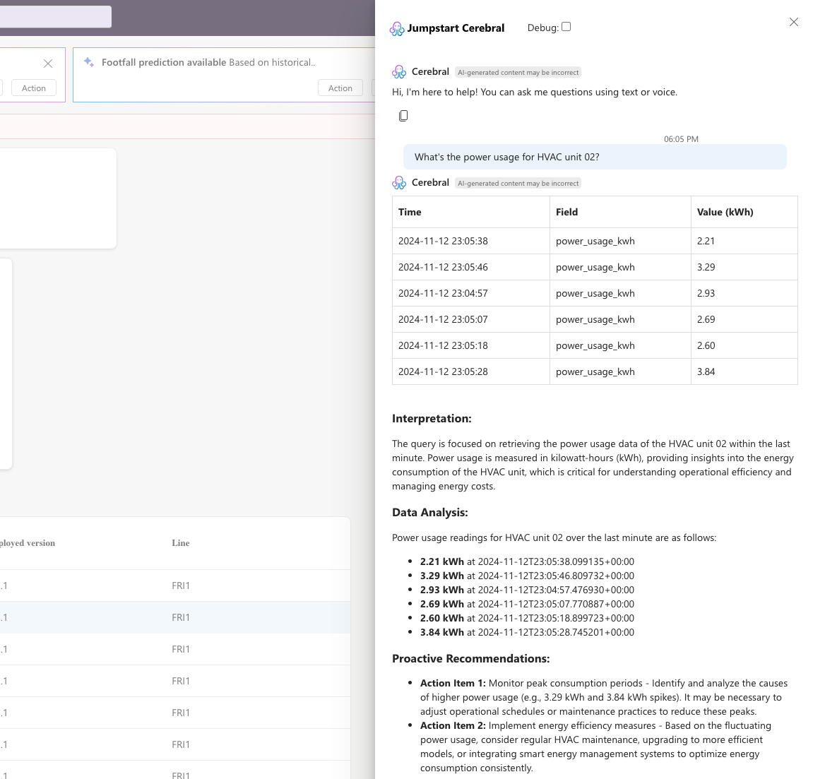
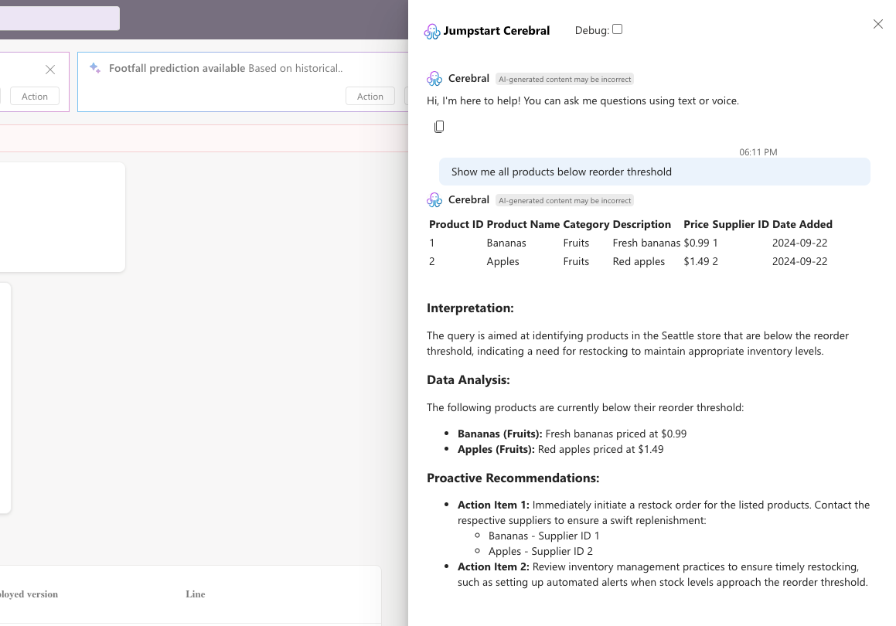

# Jumpstart Cerebral - Appendix

## Prompt examples

The following table details the various Cerebral user prompt examples:

| Type of Query         | Example Question                                | Sample Response                       |
|-----------------------|-------------------------------------------------|---------------------------------------|
| Technical Support     | "The cash dispenser in POS-01 is stuck. How do I fix it?" |  |
| Sales Analysis        | "What are our top 5 selling products this week?" |  |
| Equipment Monitoring  | "What's the power usage for HVAC unit 02?"      |  |
| Inventory Management  | "Show me all products below reorder threshold"  |  |

## MQTT simulated equipment metrics

The following table details the various types and metrics being simulated through MQTT for Contoso Hypermarket's operations:

> **Note**: The simulation generates realistic data streams for each device type, enabling testing, demonstrations, and development. Device IDs are formatted with sequential numbering (e.g., Refrigerator01, Refrigerator02). All metrics are published to the MQTT broker and InfluxDB and can be queried through Cerebral using natural language.

| Equipment Type     | Device Format         | Fields Monitored                                                                 | Example Metrics                              |
|--------------------|-----------------------|----------------------------------------------------------------------------------|----------------------------------------------|
| Refrigerator       | `Refrigerator{01..XX}`| - temperature_celsius - door_open - power_usage_kwh                         | - Current temperature - Door status (open/closed) - Power consumption |
| Scale              | `Scale{01..XX}`       | - weight_kg - tare_weight_kg                                                   | - Current weight - Tare weight settings   |
| POS                | `POS{01..XX}`         | - items_sold - total_amount_usd - payment_method - failure_type          | - Transaction volume - Sales amount - Payment types - Error states |
| SmartShelf         | `SmartShelf{01..XX}`  | - product_id - stock_level - threshold_stock_level - last_restocked      | - Current inventory - Stock thresholds - Restock timing |
| HVAC               | `HVAC{01..XX}`        | - temperature_celsius - humidity_percent - power_usage_kwh - operating_mode | - Air temperature - Humidity levels - Energy usage - Mode (heating/cooling) |
| LightingSystem     | `LightingSystem{01..XX}` | - brightness_level - power_usage_kwh - status                               | - Light intensity - Power consumption - Operational status |
| AutomatedCheckout  | `AutomatedCheckout{01..XX}` | - items_scanned - total_amount_usd - payment_method - errors - queueLength - avgWaitTime | - Scanning activity - Transaction values - Error states - Queue metrics |

## Relational database structure

The following table details the relational database structure used by Contoso Hypermarket for commercial and operational data:

| Table Name     | Description               | Key Fields                                                                                                           | Example Data                                                                                   |
|----------------|---------------------------|----------------------------------------------------------------------------------------------------------------------|------------------------------------------------------------------------------------------------|
| Sales          | Transaction records       | - sale_id VARCHAR(50)   - sale_date DATETIME2   - store_id VARCHAR(10)   - store_city VARCHAR(100)   - product_id VARCHAR(50)   - quantity INT   - item_total DECIMAL(10,2)   - payment_method VARCHAR(50)   - customer_id VARCHAR(50)   - register_id VARCHAR(20) | - 'SAL20240312001'   - '2024-03-12 14:30:00'   - 'SEA'   - 'Seattle'   - 'PROD001'   - 2   - 4.99   - 'credit_card'   - 'CUST123'   - 'REG01' |
| Products       | Product catalog           | - product_id VARCHAR(50)   - name VARCHAR(200)   - category VARCHAR(100)   - price_min DECIMAL(10,2)   - price_max DECIMAL(10,2)   - stock INT   - photo_path VARCHAR(500) | - 'PROD001'   - 'Red Apple'   - 'Fruits'   - 0.20   - 0.40   - 1000   - '/img/products/apple.jpg' |
| Inventory      | Current stock levels      | - id INT   - date_time DATETIME2   - store_id VARCHAR(10)   - product_id VARCHAR(50)   - retail_price DECIMAL(10,2)   - in_stock INT   - reorder_threshold INT   - last_restocked DATETIME2 | - 1   - '2024-03-12 15:00:00'   - 'SEA'   - 'PROD001'   - 0.35   - 850   - 200   - '2024-03-11 08:00:00' |
| Stores         | Store locations           | - store_id VARCHAR(10)   - city VARCHAR(100)   - state VARCHAR(50)   - country VARCHAR(100)                       | - 'SEA'   - 'Seattle'   - 'WA'   - 'United States'                                           |
| DeviceMetrics  | Equipment telemetry history | - id INT   - timestamp DATETIME2   - device_id VARCHAR(50)   - equipment_type VARCHAR(50)   - metric_name VARCHAR(100)   - metric_value DECIMAL(18,4)   - metric_unit VARCHAR(20) | - 1   - '2024-03-12 15:01:00'   - 'HVAC01'   - 'HVAC'   - 'temperature'   - 22.5   - 'celsius' |

## Industry and Role support

The following table details the current supported industries and roles by Cerebral:

| Industry | Roles | Examples |
|----------|-------|----------|
| Retail | - Store Manager - Inventory Manager - Maintenance Worker | - Store performance metrics - Stock level monitoring - Equipment maintenance |
| Manufacturing | - Maintenance Engineer - Shift Supervisor - Production Manager | - Machine diagnostics - Production line metrics - Quality control data |
| Automotive | - Line Supervisor - Quality Inspector - Maintenance Technician | - Assembly line monitoring - Quality assurance checks - Equipment maintenance |
| Hypermarket | - Store Manager - Shopper - Maintenance Worker | - Sales analytics - Product location - Facility maintenance |

