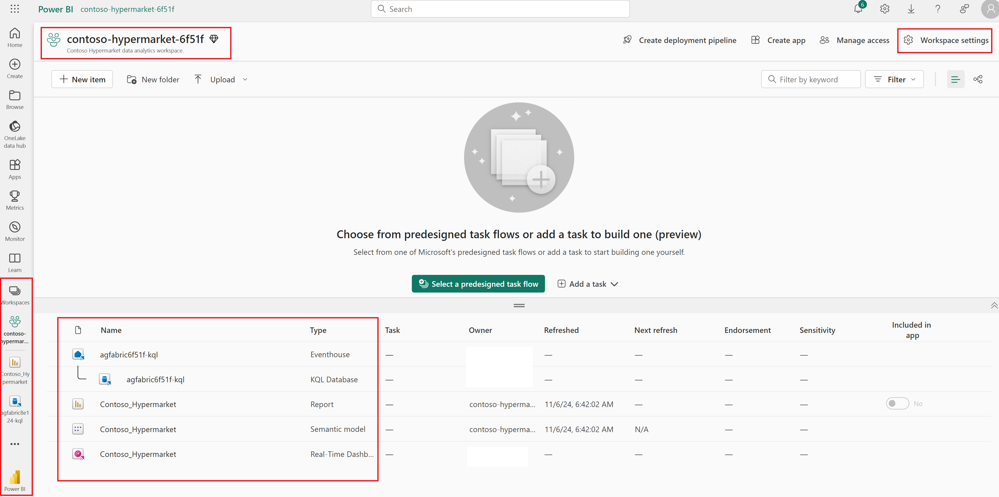

# Commercial data pipeline and reporting across cloud and edge

One of Contoso's biggest objectives is how to use the data coming from their stores and visualize it for business intelligence by leveraging the power of the cloud.

Contoso Hypermarket's commercial data pipeline is designed to streamline and optimize the flow of data related to store orders and inventory management. This robust pipeline integrates data from various stores across the country, ensuring that all relevant information is collected, processed, and analyzed efficiently in the cloud. By leveraging this data pipeline, Contoso Hypermarket can generate valuable commercial insights that are crucial for corporate leadership. These insights help in making informed decisions, improving operational efficiency, and enhancing overall business performance. The data pipeline ensures that the leadership team has a comprehensive view of the store operations, enabling them to identify trends, forecast demand, and manage inventory effectively.

## Architecture

Below is an architecture diagram that shows how the data flows from the store edge locations into the Microsoft Fabric to generate near real-time reports of orders received and processed across various supermarket store locations. This architecture includes a local MQTT broker to relay commercial data to the Event Hub in the Azure Cloud. Azure IoT operations dataflow(s) are implemented to connect edge locations to the cloud to relay commercial data.

## Microsoft Fabric

[Microsoft Fabric](https://learn.microsoft.com/fabric/get-started/microsoft-fabric-overview) is a unified platform that integrates various data services to streamline data management and analytics. It includes Event House for event streaming, KQL database for querying large datasets, and PowerBI for creating interactive dashboards. The Realtime dashboard provides up-to-the-minute insights, while Notebook offers a collaborative environment for data exploration and analysis.

### Fabric workspace

The [Fabric workspace](https://learn.microsoft.com/fabric/get-started/workspaces) is a collaborative environment within Microsoft Fabric where data engineers, data scientists, and business analysts can work together on data projects. It provides tools for data ingestion, transformation, and analysis, enabling teams to build and manage data pipelines, create machine learning models, and develop interactive reports. The workspace supports version control, allowing users to track changes and collaborate effectively on data-driven initiatives.

As part of the Contoso Hypermarket deployment Fabric workspace created with all the items required to support data pipeline. Screenshot below shows Contoso Hypermarket Fabric workspace and items created to support the scenario.

### KQL database

### PowerBI report

### MQTT Explorer

### Sales forecast notebook
