## Overview

One of Contoso's primary objectives is to utilize store data for business intelligence by leveraging cloud capabilities.

Contoso Hypermarket's commercial data pipeline is designed to streamline and optimize the flow of data related to store orders and inventory management. This robust pipeline integrates data from various stores across the country, ensuring that all relevant information is collected, processed, and analyzed efficiently in the cloud. By leveraging this data pipeline, Contoso Hypermarket can generate valuable commercial insights that are crucial for corporate leadership. These insights help in making informed decisions, improving operational efficiency, and enhancing overall business performance. The data pipeline ensures that the leadership team has a comprehensive view of the store operations, enabling them to identify trends, forecast demand, and manage inventory effectively.

## Architecture

Below is an architecture diagram that shows how the data flows from the store edge locations into the Microsoft Fabric to generate near real-time reports of orders received and processed across various supermarket store locations. This architecture includes a local MQTT broker to relay commercial data to the Event Hub in the Azure Cloud. Azure IoT Operations Dataflows are implemented to connect edge locations to the cloud to relay commercial data.


## Edge components in the solution architecture

The edge location components of the Contoso Hypermarket solution include SQL Server, Cerebral data simulator, Azure IoT Operations, and MQTT Explorer. These components work together to ensure seamless data collection, storage, and transmission from the edge to the cloud. The SQL Server stores commercial data generated by the Cerebral simulator, which mimics real-world operations. Azure IoT Operations manages the secure and efficient data flow from edge devices to the cloud, while MQTT Explorer allows users to monitor and validate the data pipeline. Together, these components form a robust edge infrastructure that supports real-time data processing and analysis for Contoso Hypermarket.

### SQL Server

The SQL Server at the edge location is responsible for storing and managing the commercial data generated by the Cerebral simulator. It ensures that the data is readily available for processing and analysis. The SQL Server is configured to handle large volumes of data efficiently, providing a reliable storage solution for the edge components. Follow instructions below to view SQL Server pods running on the Edge Kubernetes cluster and connect to SQL Server using Azure Data Studio (ADS) and SQL Server Management Studio (SSMS).

- Log into the _Ag-VM-Client_ VM using the username and password provided in the deployment.
- On the desktop locate _Windows Terminal_ shortcut and double click to open the terminal window.

  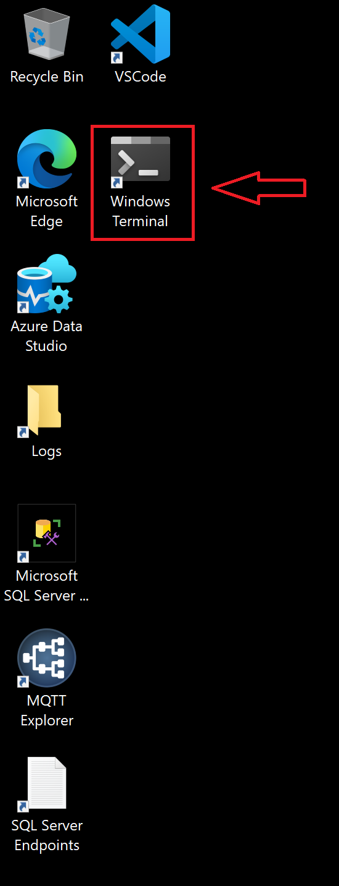

- Run _kubectx_ command to verify current Kubernetes context configured. Make sure it shows _seattle_, if not change the context by running _kubectx seattle_ command to switch Kubernetes context.

  

- Locate the SQL Server pods running on the Edge Kubernetes cluster by running the following command in the terminal window:

  ```sh
  kubectl get pods -n contoso-hypermarket
  ```

  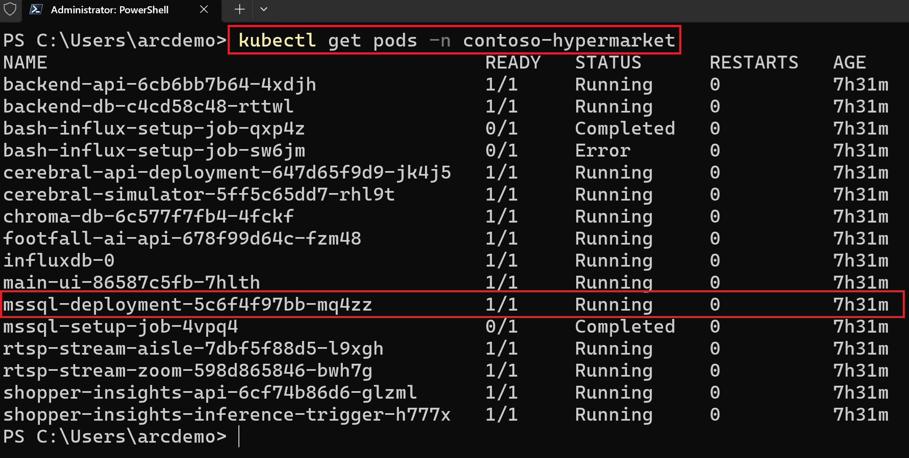

- As part of the Contoso Hypermarket deployment SQL Server connections to these pods are created in ADS and _SQL Server Endpoints_ shortcut on the desktop to connect using SSMS using the SQL Server endpoints and credentials to connect.

### Connect to SQL Server using ADS

- Open the Azure Data Studio from the desktop shortcut.

  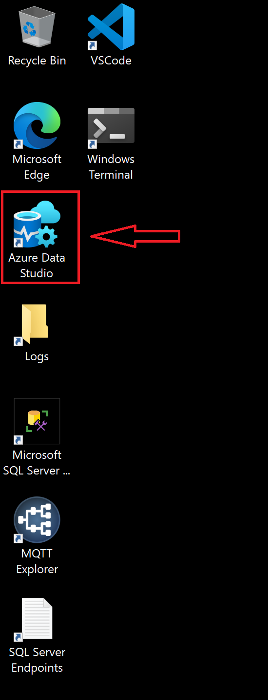

- Notice pre-configured SQL Server connections of the edge locations Chicago and Seattle. Click on 1) Connections to view these connections.
  
  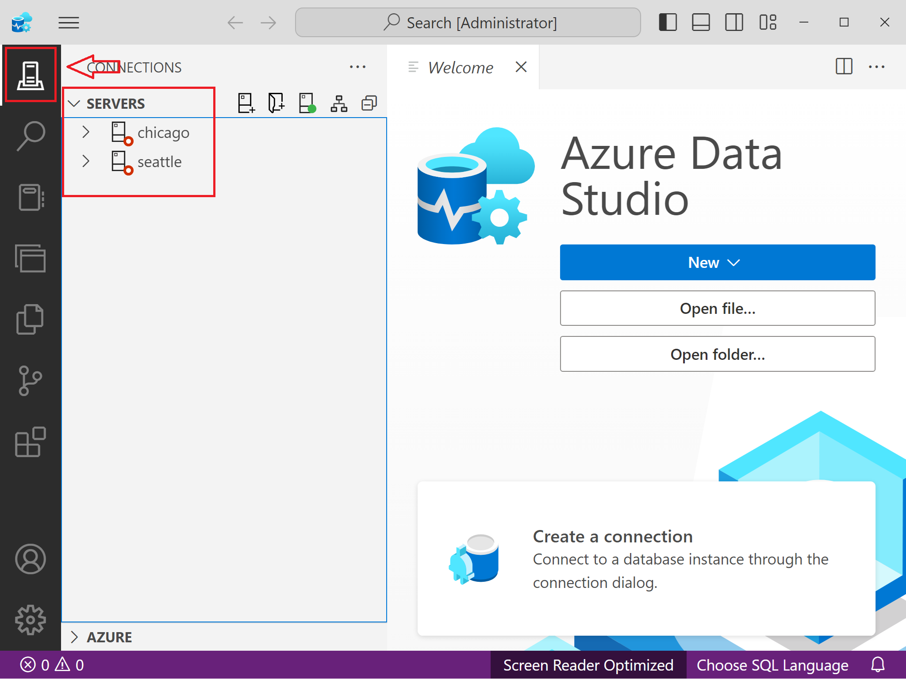

- Click on _Seattle_ SQL Server connection to verify the database and tables created for storing commercial data by expanding _RetailDB_ database and tables.

  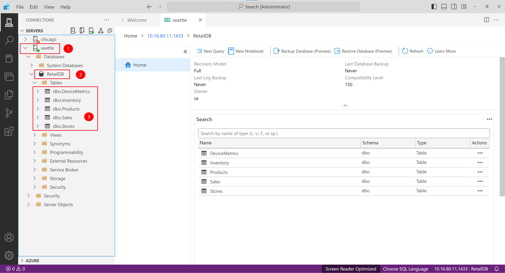

- Run queries to validate the data being stored and ensure it matches the expected format.

  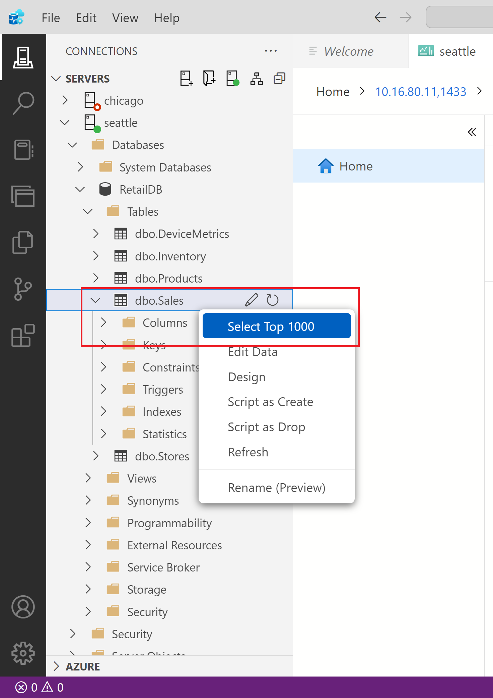

- View _Sales_ table data from the query results.

  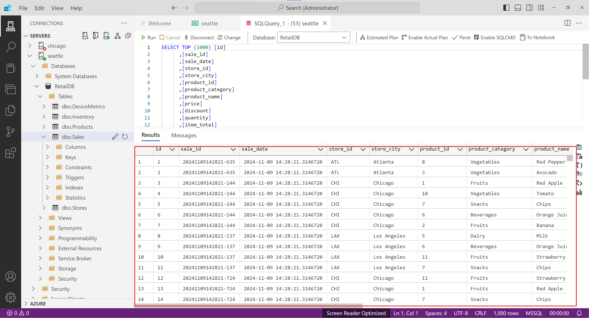

- Explore other tables and data as needed.

### Connect to SQL Server using SSMS

- Locate _SQL Server Endpoints_ shortcut on the Desktop and open file in notepad to view SQL Server endpoints and credentials and keep it handy to connect using SSMS.

  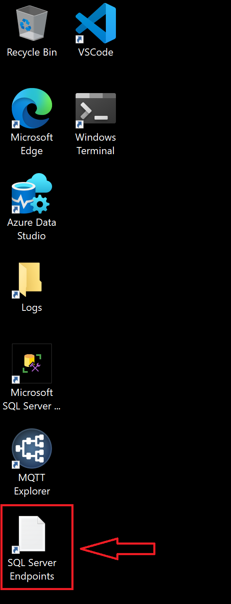

  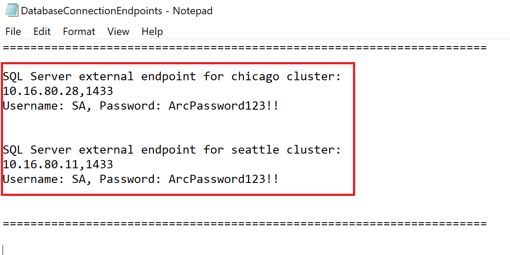

- Locate _SQL Server Management Studio_ shortcut on the Desktop and double-click to connect SQL Server databases in _Seattle_ edge location.

  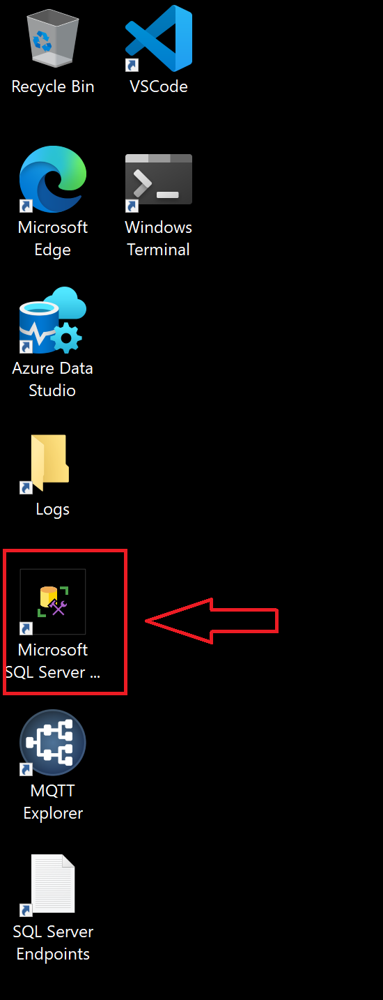

- Use _Seattle_ edge location SQL Server details and connect to the SQL Server as shown below.

  

- Locate RetailDB database, expand tables, and query _Sales_ table to view sales data.

  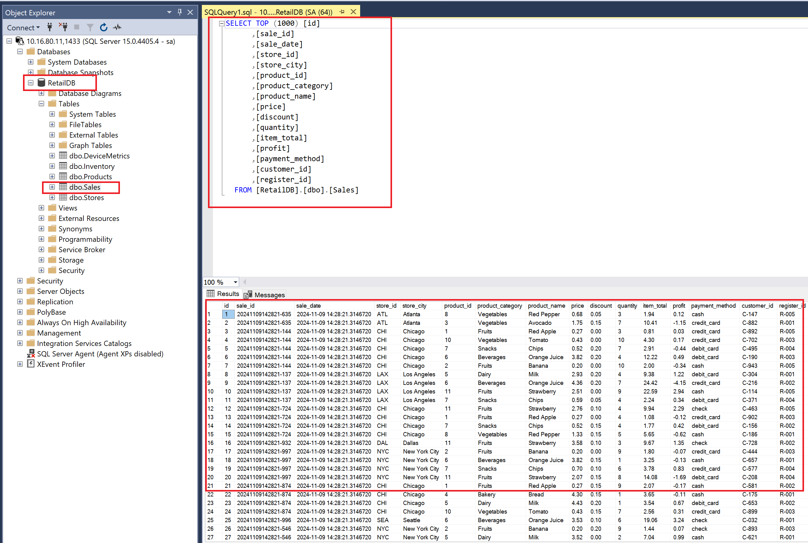

### Cerebral data simulator

The Cerebral data simulator is a critical component of the Contoso Hypermarket solution, designed to generate realistic commercial and operational data. This simulator helps in testing and validating the data pipeline by creating various scenarios that mimic real-world operations. Cerebral simulator is pre-configured to generate simulation data at regular intervals and can be monitored using MQTT Explorer installed on _Ag-Client-VM_.

- Use the simulator to test different scenarios and validate the data pipeline's performance.

- Screenshot below shows the Cerebral Simulator pod running on the edge Kubernetes cluster.

  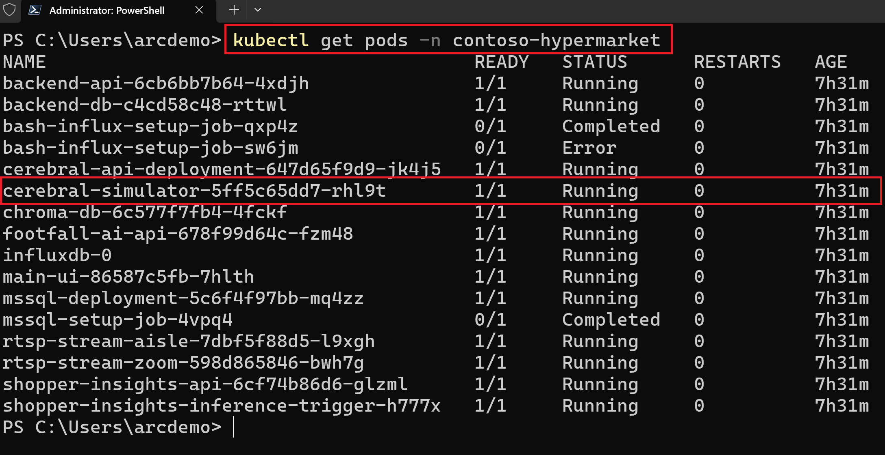

- Monitor the data being generated using MQTT Explorer as described in the following sections to ensure it is being transmitted to the MQTT broker.

### Azure IoT Operations

Azure IoT Operations is responsible for managing the data flow from the edge devices to the cloud. It ensures that the commercial data generated by the Cerebral simulator is transmitted securely and efficiently to the Azure Event Hubs Namespace.

- Access the [Azure IoT Operations portal](https://iotoperations.azure.com/sites/_/_/_/instances) to view IoT clusters deployed.

  

- Select one of the instances to view dataflow endpoints and dataflows that are being used to relay data from edge to cloud.

  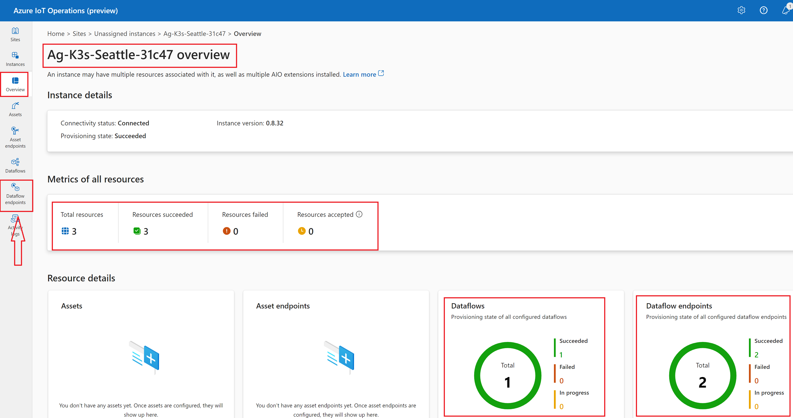

- Click on Dataflow endpoints to view endpoints created for datapipeline.

  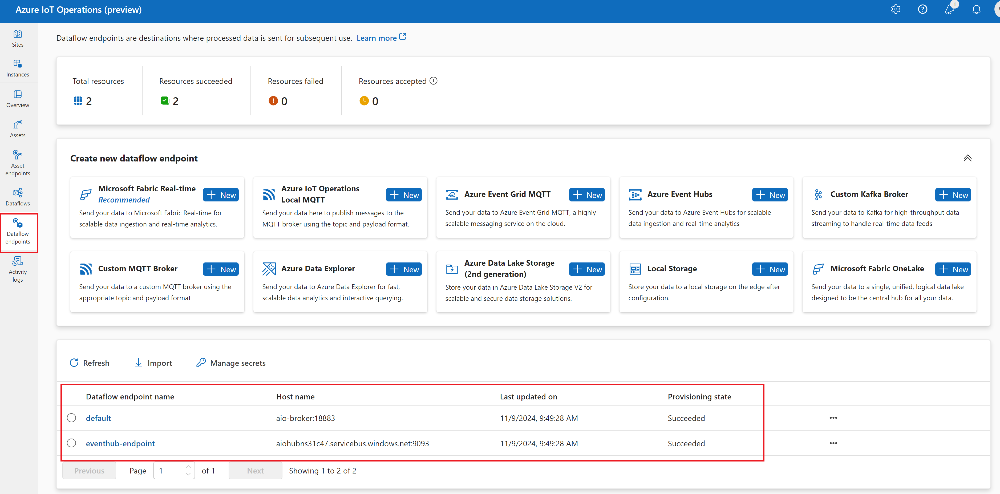

- Click on Dataflows to view dataflows created for datapipeline.

  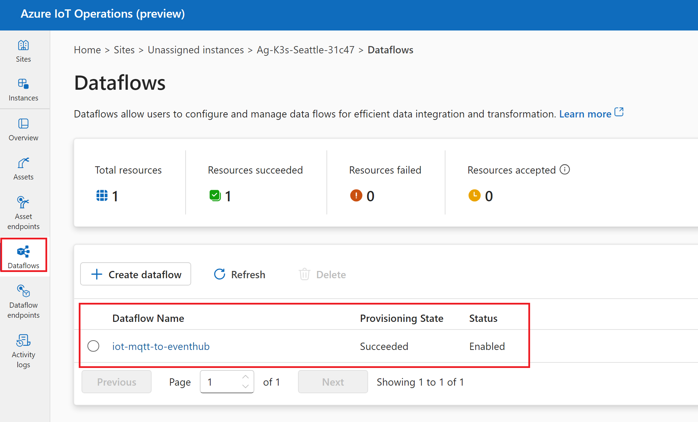

- Monitor the data flow and ensure that the commercial data is being transmitted without any issues. Refer Event Hub section below for more details on monitoring messages delivered by dataflows.

- Troubleshoot any connectivity issues and ensure the data pipeline is functioning correctly.

### MQTT Explorer

The MQTT Explorer is a desktop tool included in the Contoso Hypermarket setup. It allows end users to connect to the MQTT listener running in IoT Operations at the edge, observe messages generated by the Cerebral simulator, and send test messages to validate the data pipeline during troubleshooting.

- Open the MQTT explorer desktop shortcut, it is already configured to connect to the MQTT listener on the cluster.

  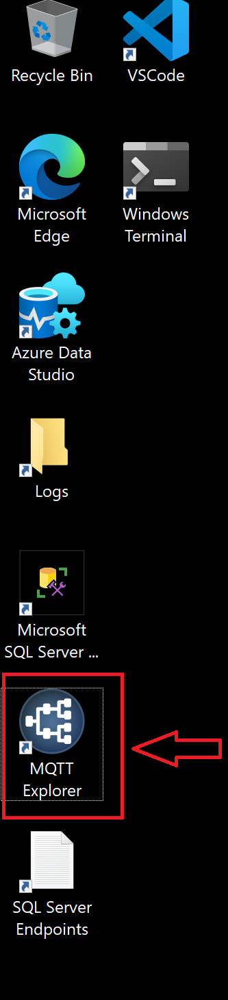

- Notice pre-configured MQTT connections to connect to the MQTT listeners running in Azure IoT Operations. Select one of the edge site and click _Connect_

  

- Once connected, you will start seeing simulated data being transmitted with various metrics from the plant assets.
  1. Topic for the commercial data message publication.
  2. Message received from the Cerebral simulator.
  3. Previous message published in the commercial topic.

  

## Azure services in the solution architecture

### Azure Event Hubs Namespace

Azure Event Hubs Namespace is a key component in the Contoso Hypermarket data pipeline, facilitating the seamless delivery of messages from Azure IoT Operations to the Event Hub. This service ensures that commercial data generated at the edge locations is securely and efficiently transmitted to the cloud. Once the data reaches the Event Hub, it is subsequently ingested into the Microsoft Fabric KQL Database for further processing and analysis. By leveraging Azure Event Hubs Namespace, Contoso Hypermarket can achieve real-time data streaming and maintain a robust and scalable data pipeline that supports their business intelligence and operational needs. Follow the steps below to view messages received from MQTT broker through Azure IoT Operations Dataflow.

- Log into [Azure Portal](https://portal.azure.com/) and go to the resource group where Contoso Hypermarket is deployed.
- Locate Azure Event Hubs Namespace resource created in the deployment and open resource.

  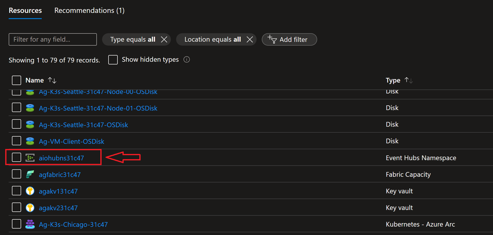

- Click on Event Hub name as shown in the screenshot below to open Event Hub instance.

  

- Click on _Data Explorer (preview)_ to view events. Select _Newest position_ option under Event position and click _View events_.

  

- Find any Event with Event body contains _subject="topic/sales"_ and click on the Event and review message JSON. These Events are received from MQTT broker using Azure IoT Operations Dataflow.

  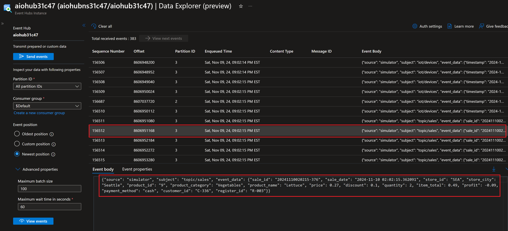

### Microsoft Fabric

[Microsoft Fabric](https://learn.microsoft.com/fabric/get-started/microsoft-fabric-overview) is a unified platform that integrates various data services to streamline data management and analytics. It includes Event House for event streaming, KQL Database for querying large datasets, and Power BI for creating interactive dashboards. The Realtime dashboard provides up-to-the-minute insights, while Notebook offers a collaborative environment for data exploration and analysis.

### Fabric workspace

The [Fabric workspace](https://learn.microsoft.com/fabric/get-started/workspaces) is a collaborative environment within Microsoft Fabric where data engineers, data scientists, and business analysts can work together on data projects. It provides tools for data ingestion, transformation, and analysis, enabling teams to build and manage data pipelines, create machine learning models, and develop interactive reports. The workspace supports version control, allowing users to track changes and collaborate effectively on data-driven initiatives.As part of the Contoso Hypermarket deployment Fabric workspace created with all the items required to support data pipeline. Follow the instructions below to access Microsoft Fabric workspaces

- Access Microsoft Fabric using [URL](https://app.fabric.microsoft.com/) and complete login using the identity used deploying Hypermarket.


- Click on _Workspaces_ as shown in the screenshot above and open the workspace created as part of post deployment steps.

> **Note:** If you haven't completed the post deployment step to setup Microsoft Fabric workspace, go to the deployment guide and complete Microsoft Fabric Setup.


- Screenshot below shows Contoso Hypermarket Fabric workspace and items to support the scenario.

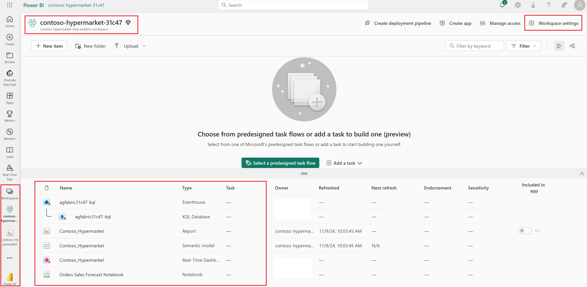

### KQL Database

The KQL Database in Microsoft Fabric is a powerful tool designed for querying and analyzing large datasets. In the context of Contoso Hypermarket, the KQL Database is used to ingest commercial data flowing from edge locations to Azure Event Hubs Namespace. This data includes store orders and inventory information, which is then processed and stored in the KQL Database. The database allows for efficient querying and analysis of this data, enabling the generation of real-time insights and reports. By leveraging the KQL Database, Contoso Hypermarket can quickly access and analyze critical commercial data to support decision-making and operational efficiency.

Data ingested into KQL Database is used by the Power BI reports create for commercial data insights and analysis by the Contoso leadership team.

- In the Fabric workspace, locate KQL Database created and click on the KQL Database name to open database details view.

  

- Below is the screenshot of KQL Database created in the Fabric workspace and it's details.
  1. KQL Database name
  2. Database tables used in the Contoso Hypermarket for data ingestion and reports
  3. Datapipeline data ingestion over the time
  4. Database tables ingestion details
  5. KQL Database details

  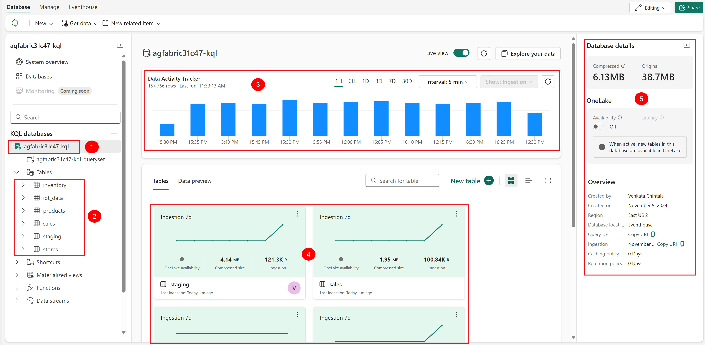

- Navigate through different KQL Database features like functions, Data streams to understand more about these features.

### Power BI Report

The Power BI report created for Contoso Hypermarket provides comprehensive insights and analytics on commercial data collected from various store locations. This report leverages the data ingested into the KQL Database, offering interactive visualizations and dashboards that help the leadership team monitor key performance indicators, track sales trends, and analyze inventory levels. By utilizing Power BI's robust data visualization capabilities, Contoso Hypermarket can make data-driven decisions, identify opportunities for improvement, and enhance overall business performance. The report is designed to be user-friendly, enabling stakeholders to explore the data and gain valuable insights with ease. Follow the steps below to location and view Power BI report created for Contoso Hypermarket.

- In the Fabric workspace, locate Power BI report created and click on the Power BI report name to open the report view.

  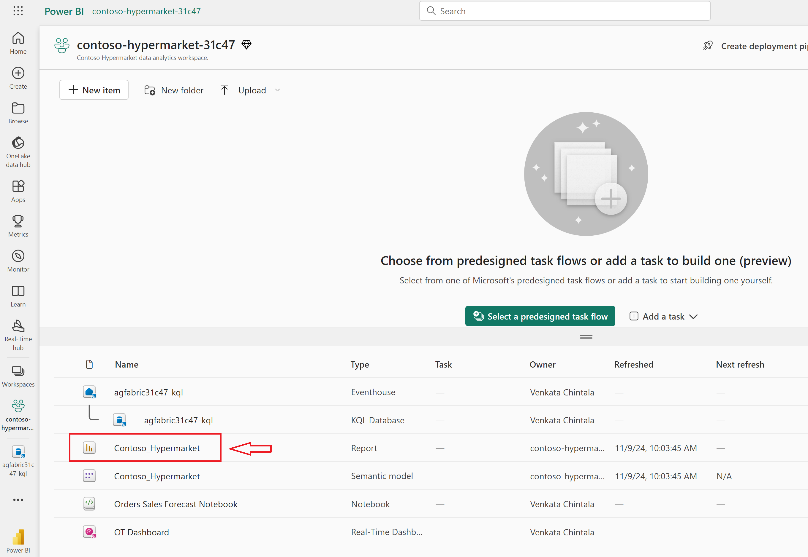

- Screenshot below shows Contoso Hypermarket weekly sales report across the stores.

  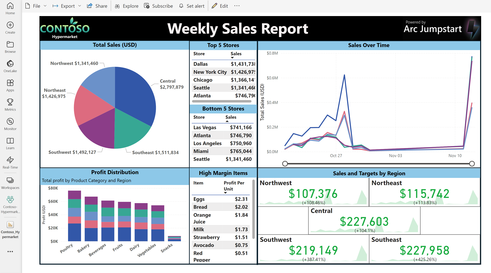

### Sales forecast Jupyter Notebook

The Microsoft Fabric Notebooks are an integral part of the Contoso Hypermarket's data pipeline, specifically designed to forecast sales and assist the leadership team in making critical business decisions. These notebooks provide a collaborative environment where data scientists and analysts can develop and execute complex data models using Python and KQL. By leveraging historical sales data and advanced machine learning algorithms, the notebooks generate accurate sales forecasts that help the leadership team anticipate future demand, optimize inventory levels, and plan marketing strategies. The interactive nature of the notebooks allows for real-time data exploration and scenario analysis, enabling Contoso's leadership to make informed decisions that drive business growth and operational efficiency.

- In the Microsoft Fabric workspace locate Jupyter notebook and open to view notebook in the Edge browser.

  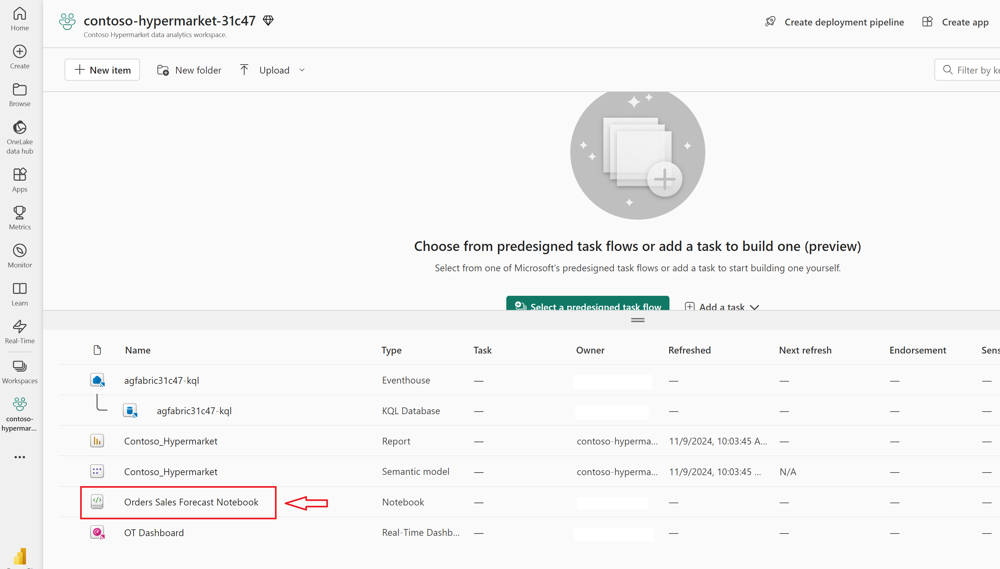

- Notebook is pre-configured to connect to the KQL Database within the workspace.

  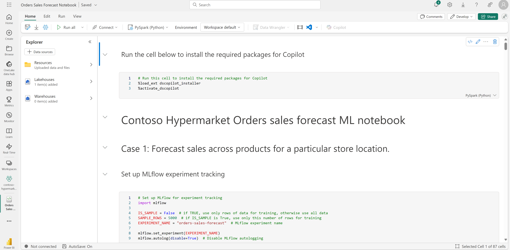

  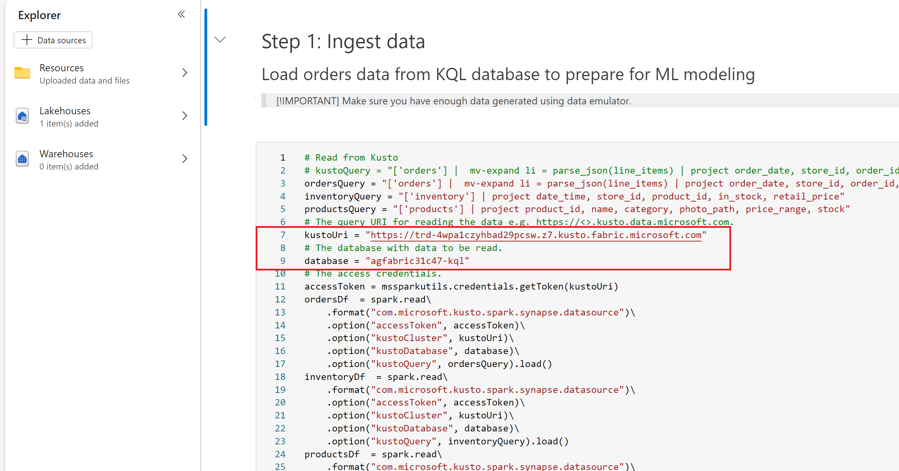

- Follow instructions provided in the Notebook to run experiments and forecast sales.

  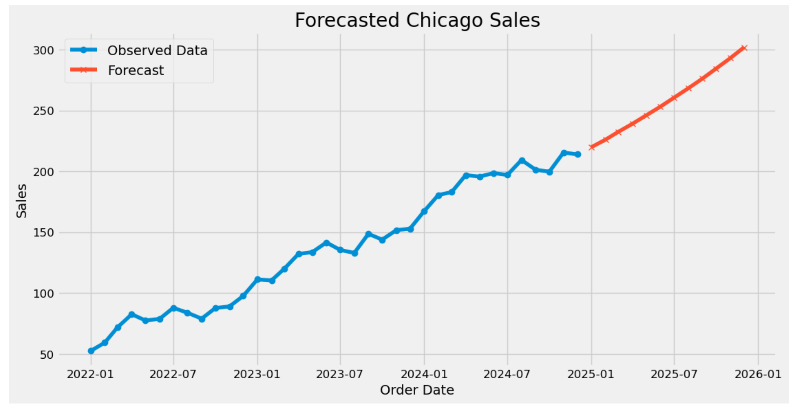

- Try changing the forecast model to use different product than the one used in the Notebook to learn more.

## Next steps

Now that you have completed the first data pipeline scenario, it's time to continue to the next scenario, [Contoso Hypermarket Operational Data pipeline](../operational/).
