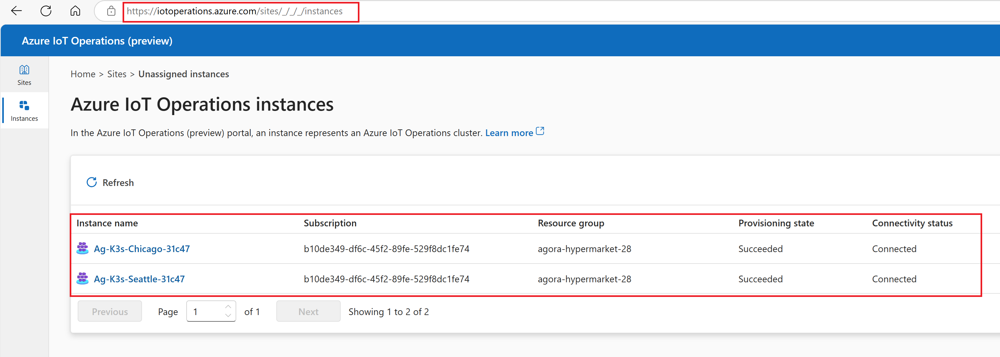
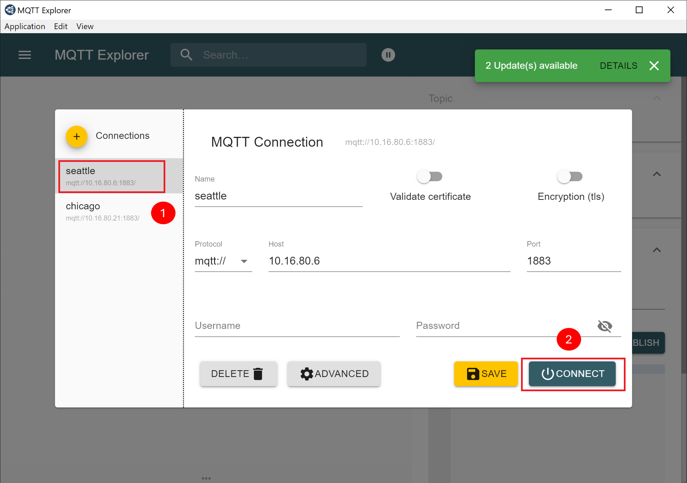
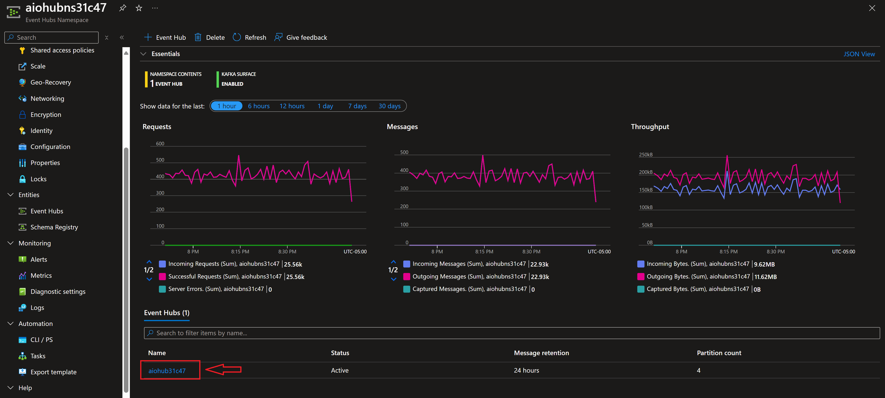
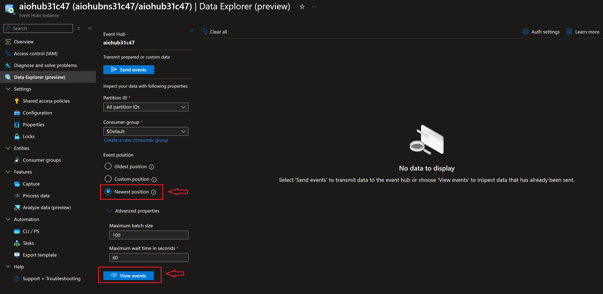
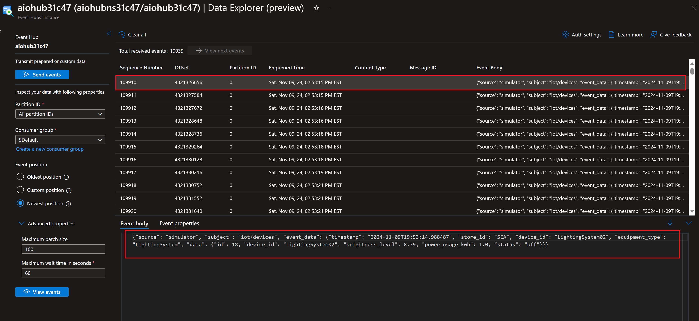
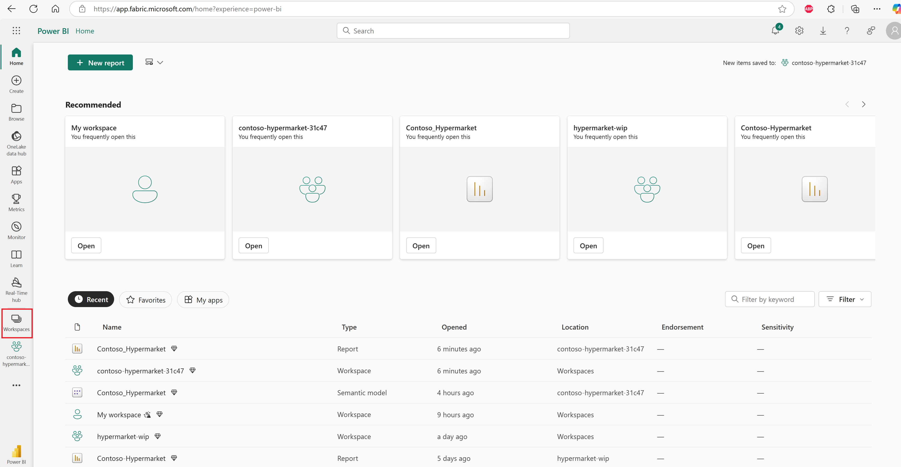
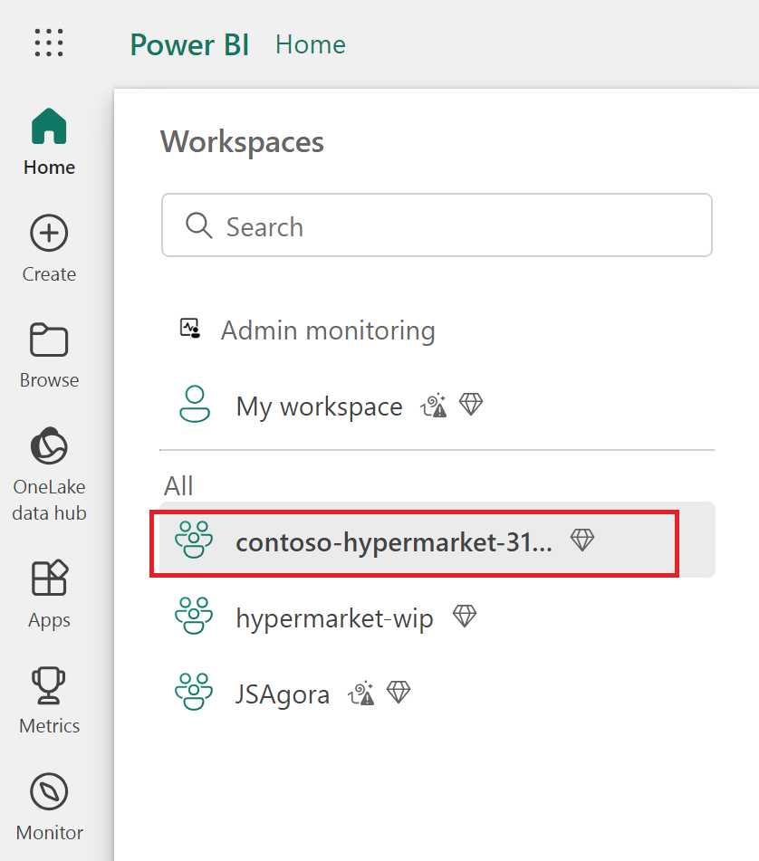
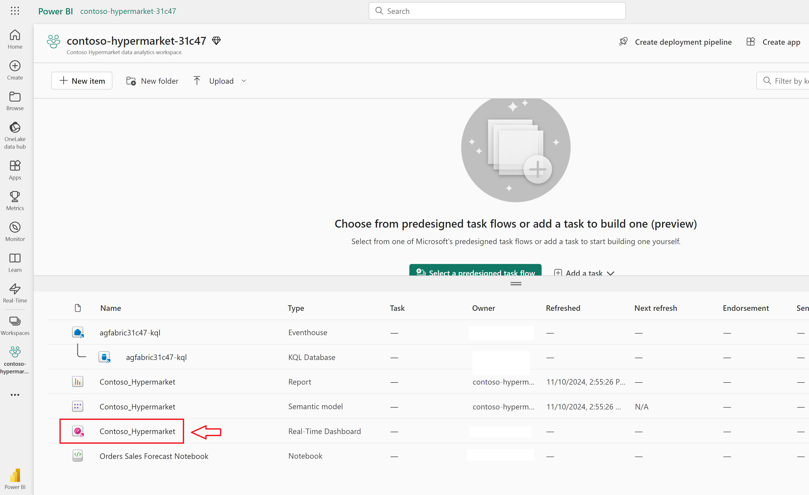
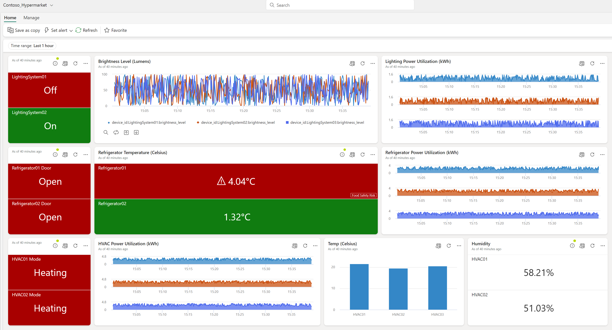

# Data pipeline and reporting for operational technology (OT)

## Overview

One of Contoso's biggest objectives is how to use the data coming from their stores and visualize it for business intelligence by leveraging the power of the cloud.

Contoso Hypermarket's operational data pipeline is designed to streamline and optimize the flow of data related to store orders and inventory management. This robust pipeline integrates data from various stores across the country, ensuring that all relevant information is collected, processed, and analyzed efficiently in the cloud. By leveraging this data pipeline, Contoso Hypermarket can generate valuable operational insights that are crucial for corporate leadership. These insights help in making informed decisions, improving operational efficiency, and enhancing overall business performance. The data pipeline ensures that the leadership team has a comprehensive view of the store operations, enabling them to identify trends, forecast demand, and manage inventory effectively.

## Architecture

Below is an architecture diagram that shows how the data flows from the store edge locations into the Microsoft Fabric to generate near real-time reports of operational data of the equipment across various supermarket store locations. This architecture includes a local MQTT broker to relay operational data to the Event Hub in the Azure Cloud. Azure IoT Operations Dataflows are implemented to connect edge locations to the cloud to relay operational data.

## Edge components in the solution architecture

The edge location components of the Contoso Hypermarket solution include SQL Server, Cerebral data simulator, Azure IoT Operations, and MQTT Explorer. These components work together to ensure seamless data collection, storage, and transmission from the edge to the cloud. The SQL Server stores operational data generated by the Cerebral simulator, which mimics real-world operations. Azure IoT Operations manages the secure and efficient dataflow from edge devices to the cloud, while MQTT Explorer allows users to monitor and validate the data pipeline. Together, these components form a robust edge infrastructure that supports real-time data processing and analysis for Contoso Hypermarket.

### Cerebral data simulator

The Cerebral data simulator is a critical component of the Contoso Hypermarket solution, designed to generate realistic commercial and operational data. This simulator helps in testing and validating the data pipeline by creating various scenarios that mimic real-world operations. Cerebral simulator is pre-configured to generation simulation data at regular intervals and can be monitored using MQTT Explorer installed on _Ag-Client-VM_.

- Use the simulator to test different scenarios and validate the data pipeline's performance.

- Screenshot below shows the Cerebral Simulator pod running on the edge Kubernetes cluster.

  

- Monitor the data being generated using MQTT Explorer as described in the following sections to ensure it is being transmitted to the MQTT broker.

### Azure IoT Operations

[Azure IoT Operations](https://learn.microsoft.com/azure/iot-operations/overview-iot-operations) is responsible for managing the dataflow from the edge devices to the cloud. It ensures that the operational data generated by the Cerebral simulator is transmitted securely and efficiently to the Azure Event Hubs Namespace.

- Access the [Azure IoT Operations portal](https://iotoperations.azure.com/sites/_/_/_/instances) to view IoT clusters deployed.

  

- Select one of the instances to view Dataflow endpoints and Dataflow that are being used to relay data from edge to cloud.

  

- Click on Dataflow endpoints to view endpoints created for data pipeline.

  

- Click on Dataflows to view dataflows created for data pipeline.

  

- Monitor the dataflow and ensure that the operational data is being transmitted without any issues. Refer Event Hub section below for more details on monitoring messages delivered by dataflows.

- Troubleshoot any connectivity issues and ensure the data pipeline is functioning correctly.

### MQTT Explorer

The MQTT Explorer is a desktop tool included in the Contoso Hypermarket setup. It allows end users to connect to the MQTT listener running in Azure IoT Operations at the edge, observe messages generated by the Cerebral simulator, and send test messages to validate the data pipeline during troubleshooting.

- Open the MQTT explorer desktop shortcut, it is already configured to connect to the MQTT listener on the cluster.

  

- Notice pre-configured MQTT connections to connect to the MQTT listeners running in Azure IoT Operations. Select one of the edge sites and click _Connect_

  

- Once connected, you will start seeing simulated data being transmitted with various metrics from the plant assets.
  1. Topic for the operational data message publication.
  2. Message received from the Cerebral simulator.
  3. Previous message published in the operational topic.

  

## Azure services in the solution architecture

### Azure Event Hubs Namespace

A[Azure Event Hubs Namespace](https://learn.microsoft.com/azure/event-hubs/event-hubs-about) is a key component in the Contoso Hypermarket data pipeline, facilitating the seamless delivery of messages from Azure IoT Operations to the Event Hub. This service ensures that operational data generated at the edge locations is securely and efficiently transmitted to the cloud. Once the data reaches the Event Hub, it is subsequently ingested into the Microsoft Fabric KQL Database for further processing and analysis. By leveraging Azure Event Hubs Namespace, Contoso Hypermarket can achieve real-time data streaming and maintain a robust and scalable data pipeline that supports their business intelligence and operational needs. Follow the steps below to view messages received from MQTT broker through Azure IoT Operations Dataflow.

- Log into [Azure Portal](https://portal.azure.com/) and go to the resource group where Contoso Hypermarket is deployed.
- Locate Azure Event Hubs Namespace resource created in the deployment and open resource.

  

- Click on Event Hub name as shown in the screenshot below to open Event Hub instance.

  

- Click on _Data Explorer (preview)_ to view events. Select _Newest position_ option under Event position and click _View events_.

  

- Find any Event with Event body contains _subject="iot/devices"_ and click on the Event and review message JSON. These Events are received from MQTT broker using Azure IoT Operations Dataflow.

  

### Microsoft Fabric

[Microsoft Fabric](https://learn.microsoft.com/fabric/get-started/microsoft-fabric-overview) is a unified platform that integrates various data services to streamline data management and analytics. It includes Event House for event streaming, KQL Database for querying large datasets, and Power BI for creating interactive dashboards. The Real-Time Dashboard provides up-to-the-minute insights, while Notebook offers a collaborative environment for data exploration and analysis.

### Fabric workspace

The [Fabric workspace](https://learn.microsoft.com/fabric/get-started/workspaces) is a collaborative environment within Microsoft Fabric where data engineers, data scientists, and business analysts can work together on data projects. It provides tools for data ingestion, transformation, and analysis, enabling teams to build and manage data pipelines, create machine learning models, and develop interactive reports. The workspace supports version control, allowing users to track changes and collaborate effectively on data-driven initiatives.As part of the Contoso Hypermarket deployment Fabric workspace created with all the items required to support data pipeline. Follow the instructions below to access Microsoft Fabric workspaces

- Access Microsoft Fabric using [URL](https://app.fabric.microsoft.com/) and complete login using the identity used deploying Hypermarket.

- Click on _Workspaces_ as shown in the screenshot above and open the workspace created as part of post deployment steps.

> **Note:** If you haven't completed the post deployment step to setup Microsoft Fabric workspace, go to the deployment guide and complete Microsoft Fabric Setup.

- Screenshot below shows Contoso Hypermarket Fabric workspace and items to support the scenario.

### KQL Database

The [KQL Database](https://learn.microsoft.com/fabric/real-time-intelligence/create-database) in Microsoft Fabric is a powerful tool designed for querying and analyzing large datasets. In the context of Contoso Hypermarket, the KQL Database is used to ingest operational data flowing from edge locations to Azure Event Hubs Namespace. This data includes store orders and inventory information, which is then processed and stored in the KQL Database. The database allows for efficient querying and analysis of this data, enabling the generation of real-time insights and reports. By leveraging the KQL Database, Contoso Hypermarket can quickly access and analyze critical operational data to support decision-making and operational efficiency.

Data ingested into the KQL Database is used by the Power BI reports created for operational data insights and analysis by the Contoso leadership team.

- In the Fabric workspace, locate KQL Database created and click on the KQL Database name to open database details view.

  

- Below is the screenshot of KQL Database created in the Fabric workspace and it's details.
  1. KQL Database name
  2. Database tables used in the Contoso Hypermarket for data ingestion and reports
  3. Data pipeline data ingestion over the time
  4. Database tables ingestion details
  5. KQL Database details

  

- Navigate through different KQL Database features like functions, Data streams to understand more about these features.

### Operational Telemetry Real-Time Dashboard Report

The Operational Telemetry [Real-Time Dashboard](https://learn.microsoft.com/fabric/real-time-intelligence/dashboard-real-time-create) Report in Microsoft Fabric provides Contoso Hypermarket with up-to-the-minute insights into their store operations. This interactive dashboard leverages data ingested into the KQL Database, displaying key metrics and trends related to equipment performance. By visualizing this data in real-time, the dashboard enables the leadership team to make informed decisions quickly, respond to operational issues promptly, and optimize overall business performance. The report's intuitive interface and powerful analytics capabilities ensure that critical operational data is always accessible and actionable.

- Go to Contoso Hypermarket Fabric workspace to open Real-Time dashboard reports

  

- Screenshot below shows Operational Telemetry Real-Time Dashboard Report

  

## Next steps

Now that you have completed the first data pipeline scenario, it's time to continue to the next scenario, ["Data pipeline and reporting for commercial sales"](../commercial/).
