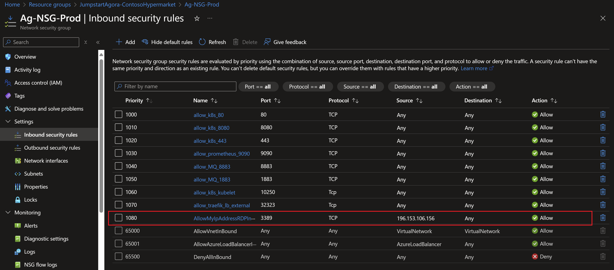

# Deployment guide

## Overview

Jumpstart Agora provides a simple deployment process using Azure Bicep and PowerShell that minimizes user interaction. This automation automatically configures the Contoso Hypermarket scenario environment, including the infrastructure, the Contoso Hypermarket AI applications, CI/CD artifacts, observability components, and cloud architecture. The diagram below details the high-level architecture that's deployed and configured as part of the automation.


Deploying the "Contoso Hypermarket" scenario consists of the following steps (once prerequisites are met).

  1. Deploy infrastructure - The user deploys a Bicep file that creates the infrastructure in an Azure resource group.
  2. Bicep template deploys multiple Azure resources including the Client virtual machine.
  3. Client VM uses a custom script extension to run the Bootstrap PowerShell script which initializes the environment.
  4. Bootstrap script injects the Logon script to the Client VM.
  5. User logs in to the _Agora-VM-Client_ Azure virtual machine.
  6. After login the _Agora-VM-Client_ PowerShell scripts automatically run that configure the infrastructure, applications and CI/CD. These scripts will take some time to run.

Once automation is complete, users can immediately start enjoying the Contoso Hypermarket experience.


## Prerequisites

- [Install or update Azure CLI to version 2.65.0 or above](https://learn.microsoft.com/cli/azure/install-azure-cli?view=azure-cli-latest). Use the following command to check your current installed version.

    ```shell
    az --version
    ```

- Login to Azure CLI using the *`az login`* command.

- Ensure that you have selected the correct subscription you want to deploy Agora to by using the *`az account list --query "[?isDefault]"`* command. If you need to adjust the active subscription used by az CLI, follow [this guidance](https://learn.microsoft.com/cli/azure/manage-azure-subscriptions-azure-cli#change-the-active-subscription).

### Regions and capacity

- Agora deploys multiple Azure services that are available in specific regions across the globe like Azure OpenAI and Azure IoT operations. The list of supported regions per service is always expanding as Azure grows. At the moment, Agora must be deployed to one of the following regions to make sure you have a successful deployment. **Deploying Agora outside of these regions may result in unexpected results, deployment errors as some of the services deployed might not support that region.**

  - East US
  - East US 2
  - West US 2
  - West US 3
  - West Europe

> **Note:** Every subscription has different capacity restrictions and quotas so it is very critical to ensure you have sufficient vCPU quota available in your selected Azure subscription and the region where you plan to deploy Agora. If you encounter any capacity constraints error , please try another region from the list above.

- **Agora requires 32 Ds-series vCPUs and 8 Bs-series vCPUs**. You can use the below az CLI command to check your vCPU utilization.

  ```shell
  az vm list-usage --location <your location> --output table
  ```

  

- Contoso Hypermarket allows an option to deploy GPU-enabled worker nodes for the K3s Kubernetes clusters. If you select that option in the parameters file, then you can select one of a pre-defined list of GPU-enabled Virtual machines based on your subscription's available quotas. You can use the below az CLI command to check your vCPU utilization.

  ```shell
  az vm list-usage --location <your location> --output table
  ```

- Register necessary Azure resource providers by running the following commands.

  ```shell
  az provider register --namespace Microsoft.Kubernetes --wait
  az provider register --namespace Microsoft.KubernetesConfiguration --wait
  az provider register --namespace Microsoft.ExtendedLocation --wait
  az provider register --namespace Microsoft.HybridCompute --wait
  az provider register --namespace Microsoft.OperationsManagement --wait
  az provider register --namespace Microsoft.DeviceRegistry --wait
  az provider register --namespace Microsoft.EventGrid --wait
  az provider register --namespace Microsoft.IoTOperationsOrchestrator --wait
  az provider register --namespace Microsoft.IoTOperations --wait
  az provider register --namespace Microsoft.Fabric --wait
  az provider register --namespace Microsoft.SecretSyncController --wait
  ```

> **Note:** The Jumpstart scenarios are designed with as much ease of use in mind and adhering to security-related best practices whenever possible. It's optional but highly recommended to scope the service principal to a specific [Azure subscription and resource group](https://learn.microsoft.com/cli/azure/ad/sp?view=azure-cli-latest) as well as considering using a [less privileged service principal account](https://learn.microsoft.com/azure/role-based-access-control/best-practices).

- Clone the Azure Arc Jumpstart repository

  ```shell
  git clone https://github.com/microsoft/azure_arc.git
  ```

- Azure IoT Operations requires creating a "user_impersonation" delegated permission on Azure Key Vault for this service principal.

  - Navigate to *Microsoft Entra Id* (previously known as Azure Active Directory) in the Azure portal.

    

  - Click on "App registrations" and search for the name of the service principal you created.

    

  - Click on "API permissions" and add a new permission.

    

  - Select "Azure Key Vault".

    

  - Click on "Delegated permissions" and select the "user_impersonation" permission.

    

    

## Deployment: Bicep deployment via Azure CLI

- Upgrade to latest Bicep version

  ```shell
  az bicep upgrade
  ```

- Edit the [main.parameters.json](https://github.com/microsoft/azure_arc/blob/main/azure_jumpstart_ag/contoso_Hypermarket/bicep/main.parameters.json) template parameters file and supply some values for your environment.
  - _`tenantId`_ - Your Azure tenant id
  - _`windowsAdminUsername`_ - Client Windows VM Administrator username
  - _`windowsAdminPassword`_ - Client Windows VM Password. Password must have 3 of the following: 1 lower case character, 1 upper case character, 1 number, and 1 special character. The value must be between 12 and 123 characters long.
  - _`deployBastion`_ - Option to deploy using Azure Bastion instead of traditional RDP. Set to *`true`* or *`false`*.
  - _`customLocationRPOID`_ - Custom location resource provider id.
  - _`fabricCapacityAdmin`_ - Microsoft Fabric capacity admin (admin user ins the same Entra ID tenant).
  - _`deployGPUNodes`_ - Option to deploy GPU-enabled worker nodes for the K3s clusters.

  

- You will need to get the Azure Custom Location Resource Provider (RP) Object ID (OID) and export it as an environment variable. This is required to enable [Custom Location](https://learn.microsoft.com/azure/azure-arc/platform/conceptual-custom-locations) on your cluster.

> **Note:** You need permissions to list all the service principals.

### Option 1: Bash

  ```shell
  customLocationRPOID=$(az ad sp list --filter "displayname eq 'Custom Locations RP'" --query "[?appDisplayName=='Custom Locations RP'].id" -o tsv)
  ```

### Option 2: PowerShell

  ```powershell
  $customLocationRPOID=(az ad sp list --filter "displayname eq 'Custom Locations RP'" --query "[?appDisplayName=='Custom Locations RP'].id" -o tsv)
  ```

- Now you will deploy the Bicep file. Navigate to the local cloned [deployment folder](https://github.com/microsoft/azure_arc/tree/main/azure_jumpstart_ag/contoso_Hypermarket/bicep) and run the below command:

  ```shell
  az login
  az group create --name "<resource-group-name>"  --location "<preferred-location>"
  az deployment group create -g "<resource-group-name>" -f "main.bicep" -p "main.parameters.json" -p customLocationRPOID="$customLocationRPOID"
  ```

    > **Note:** If you see any failure in the deployment, please check the [troubleshooting guide](../troubleshooting/).

## Start post-deployment automation

Once your deployment is complete, you can open the Azure portal and see the Agora scenario resources inside your resource group. You will be using the _Agora-Client-VM_ Azure virtual machine to explore various capabilities of Agora. You will need to remotely access _Agora-Client-VM_.

  

   > **Note:** For enhanced Agora security posture, RDP (3389) and SSH (22) ports aren't open by default in Agora deployments. You will need to create a network security group (NSG) rule to allow network access to port 3389, or use [Azure Bastion](https://learn.microsoft.com/azure/bastion/bastion-overview) or [Just-in-Time (JIT)](https://learn.microsoft.com/azure/defender-for-cloud/just-in-time-access-usage?tabs=jit-config-asc%2Cjit-request-asc) access to connect to the VM.

### Connecting to the Agora Client virtual machine

Various options are available to connect to _Agora-Client-VM_, depending on the parameters you supplied during deployment.

- [RDP](../deployment/#connecting-directly-with-rdp) - available after configuring access to port 3389 on the _Agora-NSG-Prod_, or by enabling [Just-in-Time access (JIT)](../deployment/#connect-using-just-in-time-access-jit).
- [Azure Bastion](../deployment/#connect-using-azure-bastion) - available if *`true`* was the value of your _`deployBastion`_ parameter during deployment.

#### Connecting directly with RDP

By design, Agora doesn't open port 3389 on the network security group. Therefore, you must create an NSG rule to allow inbound 3389.

- Open the _Agora-NSG-Prod_ resource in Azure portal and click "Add" to add a new rule.

  

- Select My IP address from the dropdown.

  

  <br/>

  

  

#### Connect using Azure Bastion

- If you have chosen to deploy Azure Bastion in your deployment, use it to connect to the VM.

  

  > **Note:** When using Azure Bastion, the desktop background image isn't visible. Therefore some screenshots in this guide may not exactly match your experience if you are connecting to _Agora-Client-VM_ with Azure Bastion.

#### Connect using just-in-time access (JIT)

If you already have [Microsoft Defender for Cloud](https://learn.microsoft.com/azure/defender-for-cloud/just-in-time-access-usage?tabs=jit-config-asc%2Cjit-request-asc) enabled on your subscription and would like to use JIT to access the Client VM, use the following steps:

- In the Client VM configuration pane, enable just-in-time. This will enable the default settings.

  

  

### The Logon scripts

- Once you log into the _Agora-Client-VM_, multiple automated scripts will open and start running. These scripts usually take around thirty minutes to finish, and once completed, the script windows will close automatically. At this point, the deployment is complete.

  

- Deployment is complete! Let's begin exploring the features of Contoso Hypermarket!

  

  

## Next steps

Once deployment is complete its time to start experimenting with the various scenarios under the “Contoso Hypermarket” experience, starting with the [“Data pipeline and reporting across cloud and edge for Contoso Hypermarket”](../data_pipeline/).
