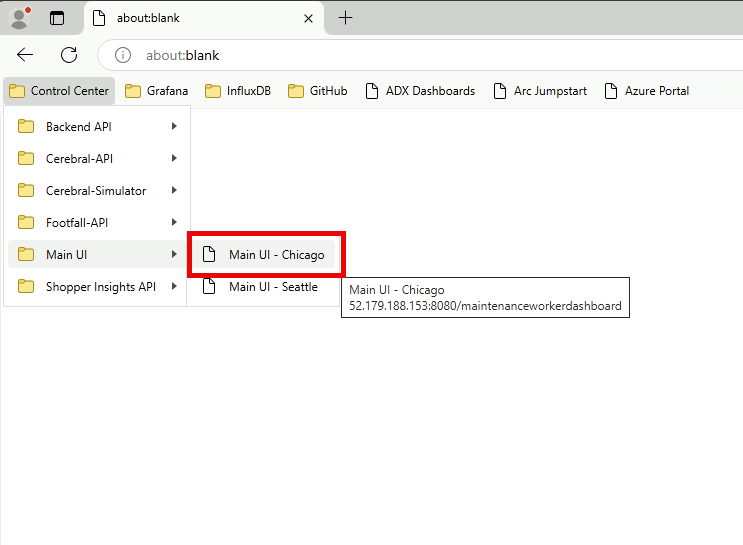
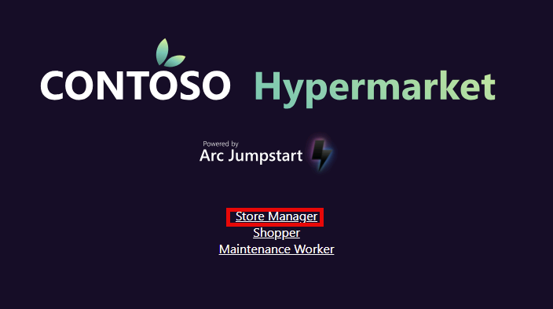
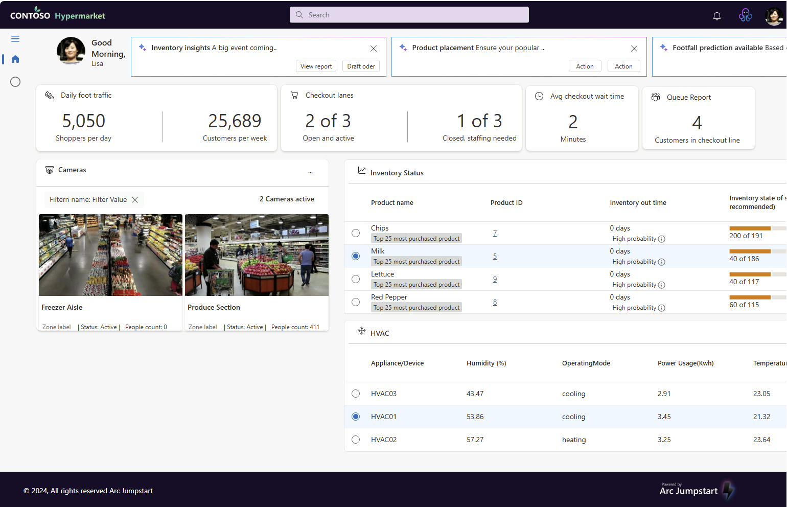
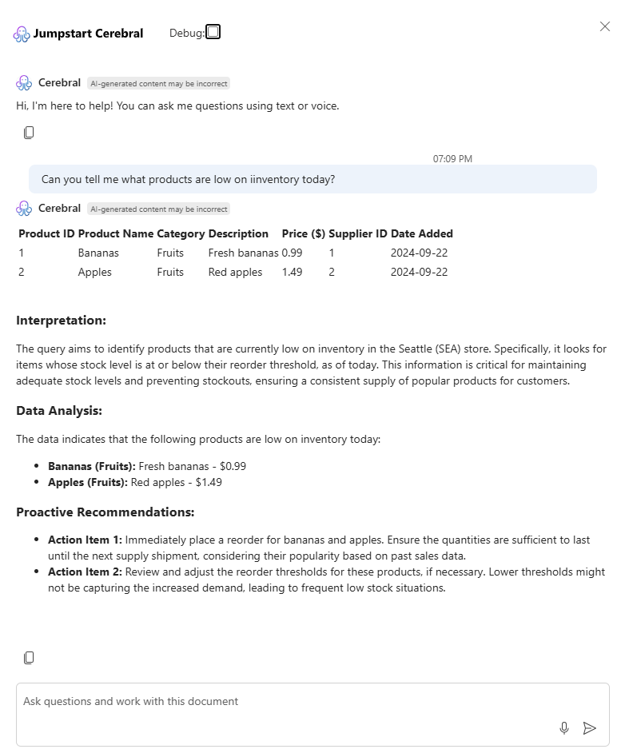
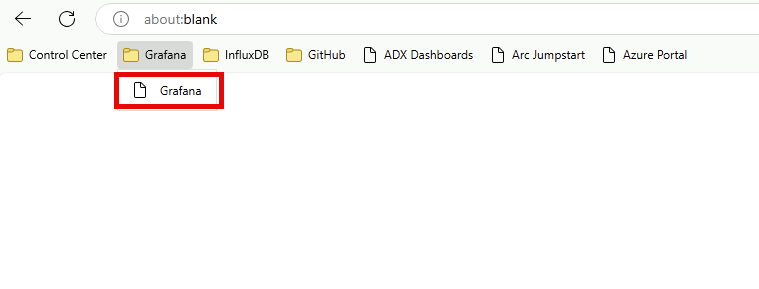
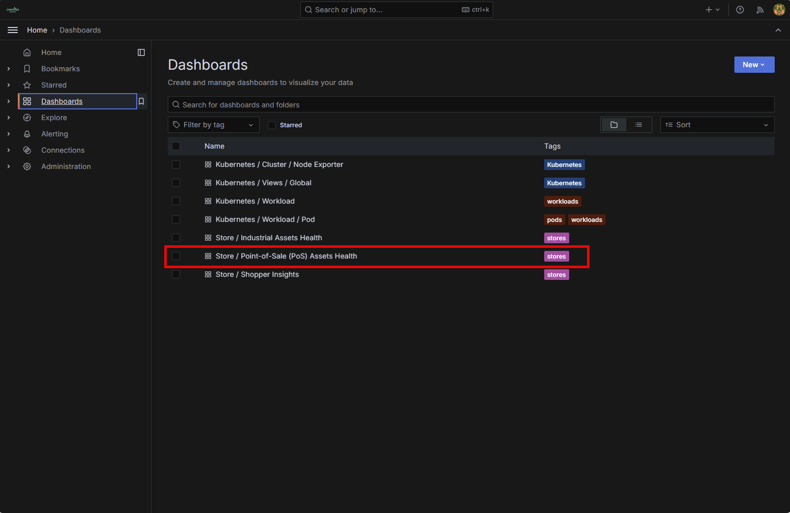
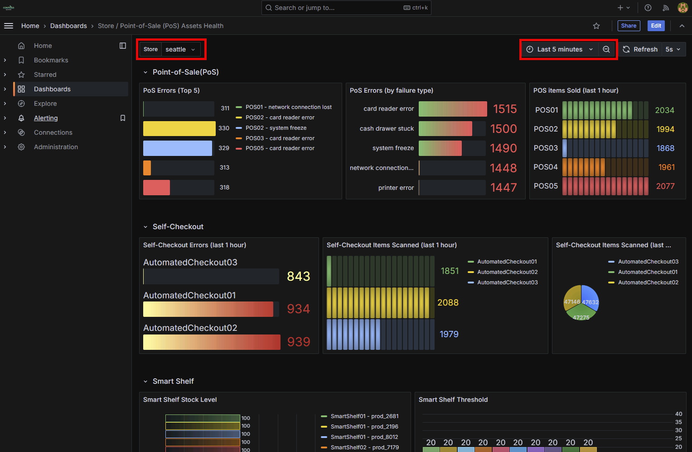
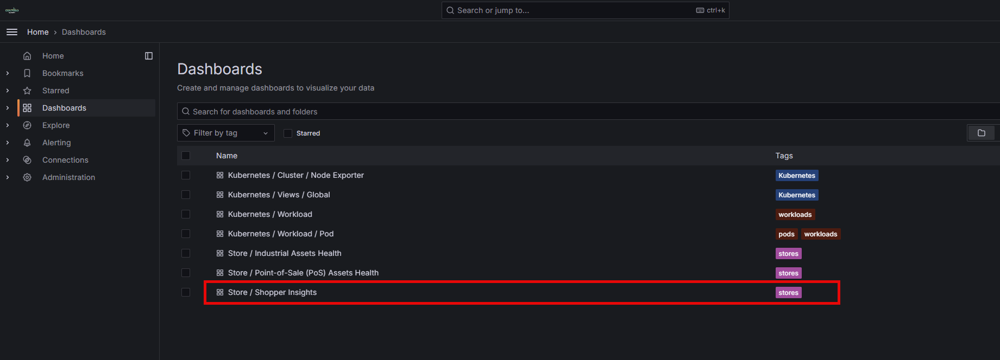
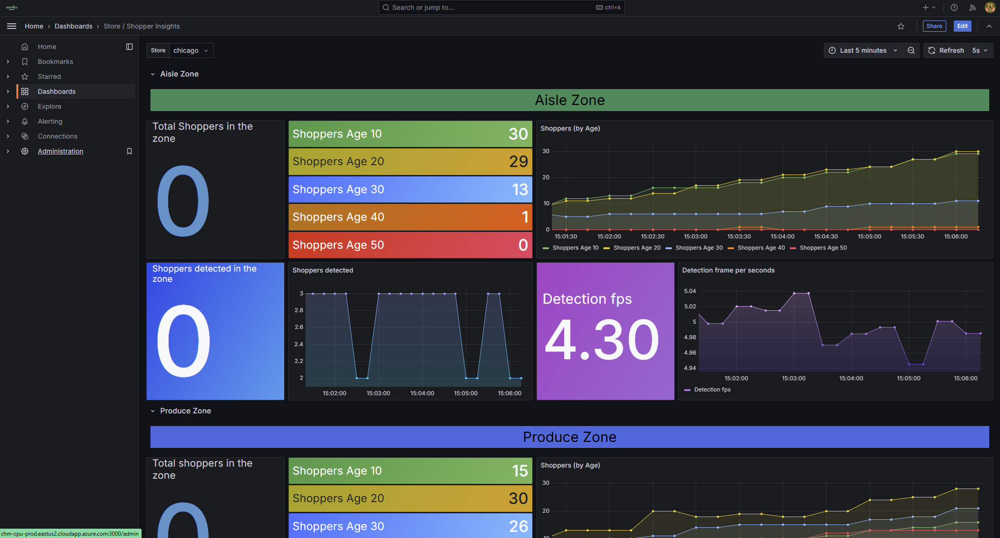
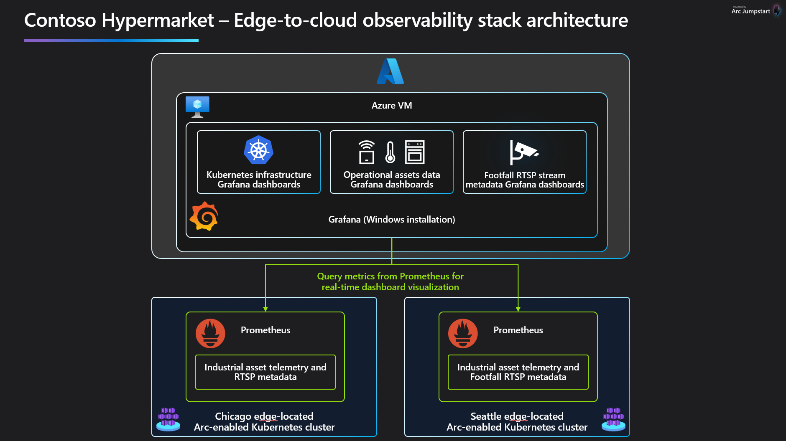

# Shopper insights observability

## Overview

Contoso Hypermarket uses computer vision in their retail store locations to improve store sales, optimize product placements, and increase efficiency for store employees. Store managers and other users can view data collected by the [shopper insights](../../shopper_insights/) computer vision system and from point-of-sale and other retail industry assets.

Retail industry assets data is collected and managed using [Azure IoT Operations](https://learn.microsoft.com/azure/iot-operations/overview-iot-operations) and sent through an [edge-to-cloud data pipeline](../../data_pipeline/) where it can then be visualized using [Grafana](https://grafana.com/) or other tools.

## View shopper insights in the Contoso Hypermarket application

Store managers can use the Contoso Hypermarket application to view data from the shopper insights platform.

- Open Microsoft Edge on the _Ag-Client_VM_ desktop and then click on the bookmarks toolbar and find the bookmark folder for Main UI.

    

- Click on the link for Store Managers

    

- In this screen, store managers can view the status of ovens, refrigerators, and point-of-sale assets such as automated checkouts or smart shelves.

    

- Users can also interact with Contoso Hypermarket using natural language. Click on the [Jumpstart Cerebral](../../cerebral/) icon in the upper right to ask a question about the status of industrial assets.

    

    

## View shopper and point-of-sale insights in a Grafana dashboard

Users also have the ability to use [Grafana](https://grafana.com/) to build, view and customize dashboards for industrial assets telemetry.

- Open Microsoft Edge and click on the Grafana bookmark.

    

- Navigate to the Industrial Assets Health dashboard.

    

- From this view, users can view real-time telemetry from industrial assets and filter by store and time dimension.

    

- Navigate to the Shopper Insights dashboard.

    

- From this view, users can view real-time telemetry from industrial assets and filter by store and time dimension.

    

## Observability architecture components

The Contoso Hypermarket observability architecture uses [Azure IoT Operations](https://learn.microsoft.com/azure/iot-operations/overview-iot-operations) to collect and send industrial assets telemetry using MQTT, an industry standard protocol. Assets including refrigerators, ovens, HVACs, and retail smart shelves send telemetry through the [MQTT Broker](https://learn.microsoft.com/azure/iot-operations/manage-mqtt-broker/overview-iot-mq)] using an [edge-to-cloud data pipeline](../../data_pipeline/operational/_index.md).

- [**Azure IoT Operations**](https://learn.microsoft.com/azure/iot-operations/overview-iot-operations): Facilitates the connection and management of IoT devices, enabling real-time monitoring and control of industrial assets.
- [**MQTT**](https://learn.microsoft.com/azure/iot-operations/manage-mqtt-broker/overview-iot-mq): A lightweight messaging protocol used for efficient communication between IoT devices and the cloud.
- [**Prometheus**](https://prometheus.io/docs/introduction/overview/): An open-source monitoring and alerting toolkit used to collect and store metrics from industrial assets.
- [**Grafana**](https://grafana.com/): A multi-platform open-source analytics and interactive visualization web application used to create dashboards and graphs from the metrics collected by Prometheus.
- [**Azure Arc-enabled Kubernetes**](https://learn.microsoft.com/azure/azure-arc/kubernetes/overview): Manage and configure Kubernetes clusters running anywhere using Azure.

## Next steps

Now that you have completed the _Shopper insights observability_ scenario, it's time to continue to the next one, [Kubernetes observability](../infrastructure/).
