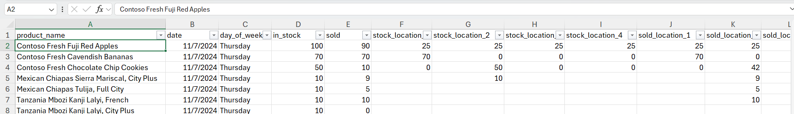
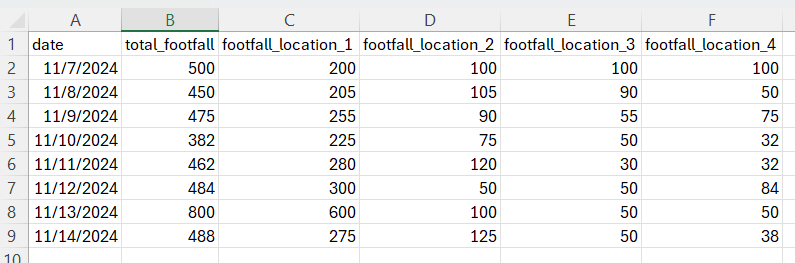
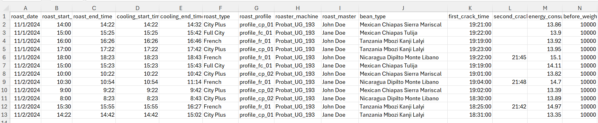
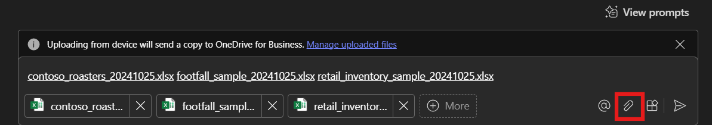
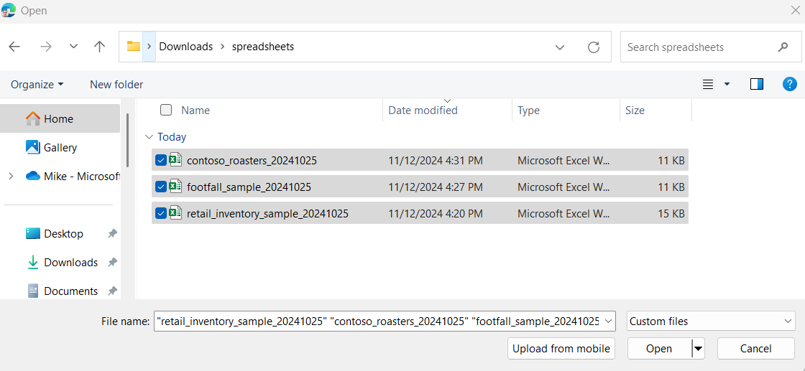
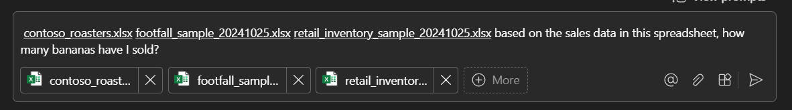
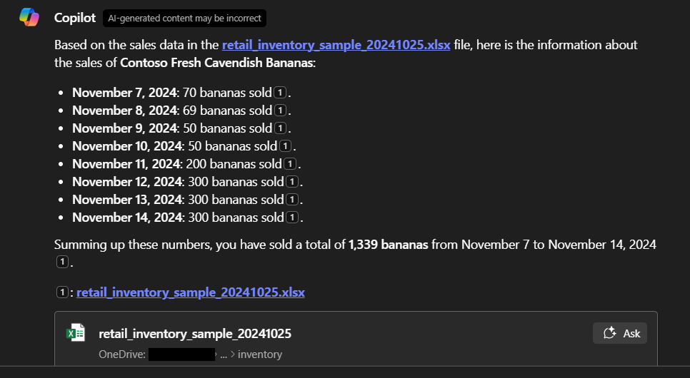
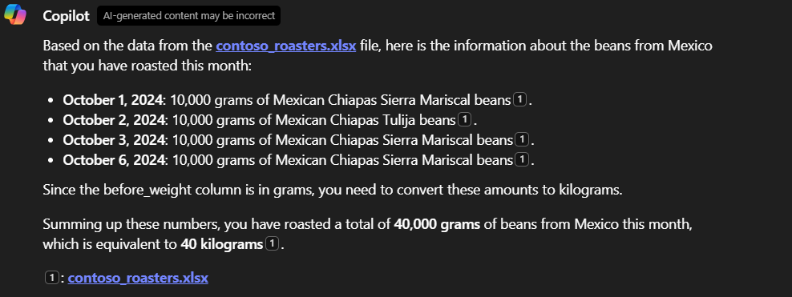

# Predictive Analytics using Microsoft 365 Copilot

## Overview

Contoso Hypermarket uses Microsoft 365 Copilot to analyze vast amounts of data and generate actionable insights. By integrating Copilot into their existing systems, Contoso can predict trends, optimize inventory, and improve customer satisfaction.  Copilot acts as another employee managers and staff can interact with.

## Working with Spreadsheets

Despite the advancements in technology, spreadsheets remain a crucial tool for many businesses, including Contoso Hypermarket. Microsoft 365 Copilot seamlessly integrates with older formats like spreadsheets, allowing Contoso to:

- Import and Analyze Data: Copilot can import data from spreadsheets, analyze it, and provide insights without the need for manual data entry.
- Generate Reports: Automatically generate comprehensive reports based on the data in spreadsheets, saving time and reducing errors.
- Predictive Modeling: Use historical data from spreadsheets to build predictive models that forecast future trends and demands.

## Key Benefits

Using Copilot in this way offers several benefits including:

- Efficiency: Automates data analysis and report generation, freeing up valuable time for employees.
- Accuracy: Reduces the risk of human error in data analysis and reporting.
- Scalability: Handles large datasets and complex calculations with ease.

## Prerequisites

This scenario requires access to Microsoft 365 Copilot.  For information on enabling this within your organization, please refer to [this](https://learn.microsoft.com/copilot/microsoft-365/microsoft-365-copilot-enable-users) document.

## Getting Started

> **Note:** AI-generated content may be incorrect.  In addition, the Screenshots and Copilot responses may differ.

To begin, download the three spreadsheets:

- [*retail_inventory_sample*](https://download.microsoft.com/download/0832a0b6-bf27-4a3f-bf65-b3404233f9cb/retail_inventory_sample_20241025.xlsx) - this simulates inventory and sales data for Contoso Hypermarket.
- [*footfall_sample*](https://download.microsoft.com/download/3fe05ab3-2aa7-4c59-8260-d90a92888432/footfall_sample_20241025.xlsx) - this simulates footfall data derived from in-store cameras.  Footfall is the traffic count inside the store and is useful for store managers to understand what parts of the store get the most visitors.  Refer to the [Contoso Hypermarket footfall documentation](../footfall/) to understand how footfall is implemented in this scenario.
- [*contoso_roasters*](https://download.microsoft.com/download/3fe05ab3-2aa7-4c59-8260-d90a92888432/contoso_roasters_20241025.xlsx) - this is a production log of coffee roasting

Let's explore the data contained in these spreadsheets.  The **retail inventory sample** data contains data on the stocked products, their location in the store, and the amount of product sold for each day.  The fields representing stock location (e.g. stock_location_1, stock_location_2, etc.) are intended to convey the specific location in the store where a product was placed.

Inside the **footfall** spreadsheet are counts of the total footfall for specific locations in the store (e.g. footfall_location_1, footfall_location_2, etc.) as well as the total footfall for the store.

The **Contoso Roasters** spreadsheet contains information about the coffee roasting of Contoso Hypermarket.  It tracks the variety of green coffee roasted and specific attributes about the roast itself, like the roast level (e.g. City Plus, Full City, etc.).

## Using Microsoft 365 Copilot

To use the below prompts, visit [Microsoft 365 Copilot](https://copilot.microsoft.com/).  As shown in the image below, click on the paperclip icon.

Next, select **upload from device**

Browse to the spreadsheets you downloaded to upload them.

With these spreadsheets uploaded, now you can enter prompts.  Copy and paste one of the prompts from the table above, or create your own prompt.

View the resulting prompt.  The example below shows the response to, "based on the sales data in this spreadsheet, how many bananas have I sold?"

Take note that Copilot can infer meaning and context from the data in the spreadsheet.  For example, in the Screenshot below, Copilot lists the two variety of Mexican coffee beans roasted (Chiapas Tulija and Chiapas Sierra Mariscal) without additional prompting to explain that both are Mexican coffee beans.

> **Note**: For applicable prompt examples relevant for this scenario, please refer to the ["Prompt examples"](https://github.com/Azure/arc_jumpstart_docs/blob/canary/docs/azure_jumpstart_ag/contoso_hypermarket/predictive_analytics/predictive_analytics_appendix.md#prompt-examples) section in the Predictive Analytics appendix file.

## Next steps

Now that you have successfully completed all of the Contoso Hypermarket scenarios, continue to the next step to learn how to [cleanup the deployment](../cleanup/).
