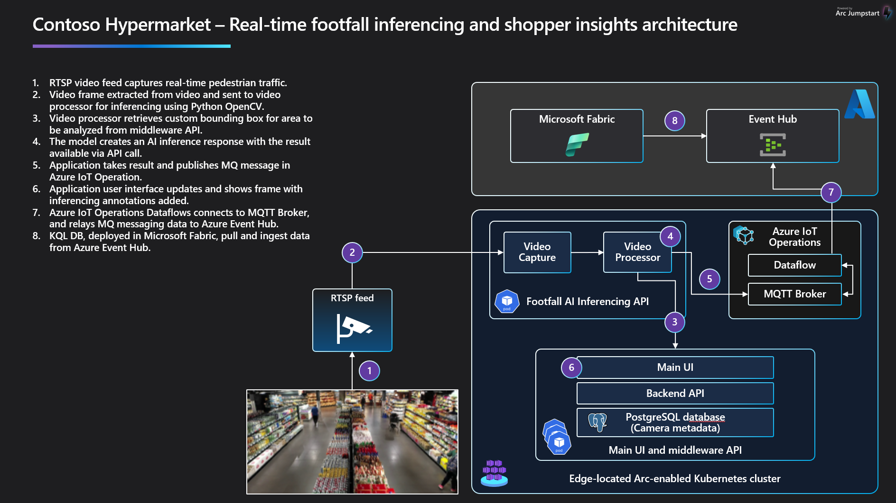

## Real-time footfall inferencing and shopper insights

Contoso Hypermarket uses computer vision to enhance the customer in-store experience and to provide employees with advanced tools for improving store operations. In-store cameras detect shopper behavior such as foot traffic, time spent in certain zones of the store, and shopper-specific identifiers that personalize the shopping experience.

## Enhancing store operations with footfall detection

The store manager uses the UI to monitor shopper behaviors and patterns. This includes identifying high traffic areas within the store, which helps in optimizing store layout and product placement. The manager can also configure cameras and zones for computer vision, ensuring that the system accurately captures and analyzes shopper movements. This setup allows the store manager to make data-driven decisions to enhance the shopping experience and improve store operations.

### Store manager - monitor foot traffic

The store manager uses the main_ui web app to monitor foot traffic within the store. This tool provides real-time data on shopper movements, allowing the manager to identify high traffic areas and adjust store layouts accordingly. By analyzing foot traffic patterns, the store manager can optimize product placement and improve overall store efficiency.

#### guide on how to do this in UX

Lorem ipsum dolor whatev

### Store manager - Configure cameraas and zones

Using the main_ui web app, the store manager can configure cameras and define zones for computer vision. This involves setting up the cameras to cover specific areas of the store and configuring the system to recognize and analyze shopper movements within these zones. Proper configuration ensures accurate data collection and meaningful insights, enabling the store manager to make informed decisions about store operations.

#### Guide on how to do this in UX

Lorem ipsum dolor whatev

#### Regional manager / data analyst

The regional manager will leverage the footfall and shopper insights data from various stores through aggregated dashboards in Fabric. These dashboards provide a comprehensive view of shopper behaviors and patterns across multiple locations, enabling the regional manager to identify trends and make informed decisions. By analyzing high traffic areas, peak shopping times, and customer preferences, the regional manager can optimize store layouts, improve product placement, and tailor marketing strategies to enhance the overall shopping experience. Additionally, the insights gathered from the dashboards help in identifying operational inefficiencies and areas for improvement, ensuring that each store operates at its best.

learn more about the [Contoso Hypermarket edge-to-cloud data pipeline](../data_pipeline/_index.md)

### Architecture

### Jump to other Contoso Hypermarket guides

[Deployment](../deployment/_index.md)
[Commercial gen-AI](../cerebral/_index.md)
[Observability](../observability/_index.md)
[Predictive Analytics](../predictive_analytics/_index.md)
[Speech-to-text](../speech_to_text/_index.md)
[Cleanup](../cleanup/_index.md)
[Troubleshooting](../troubleshooting/_index.md)
