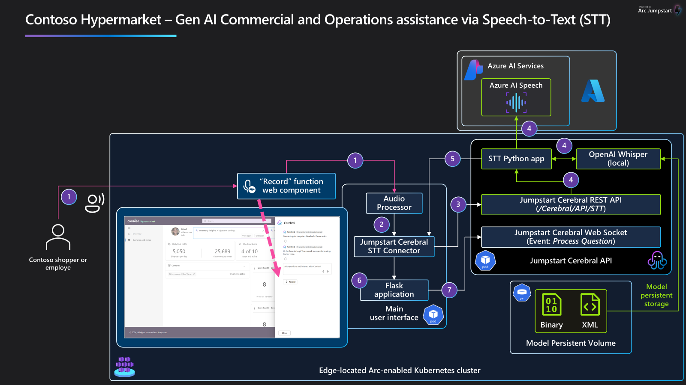
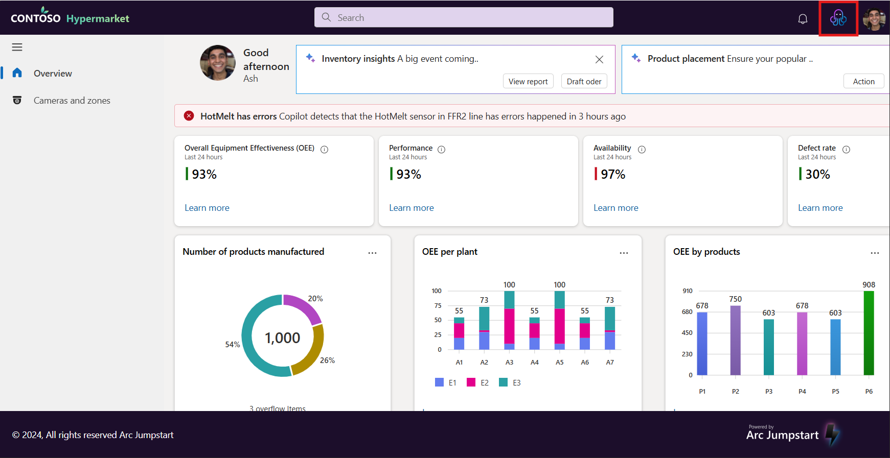
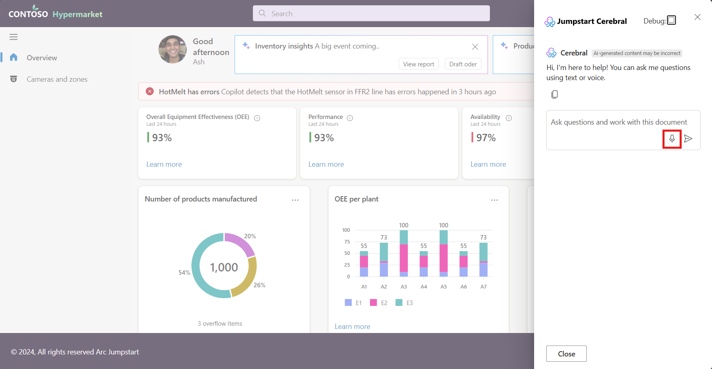
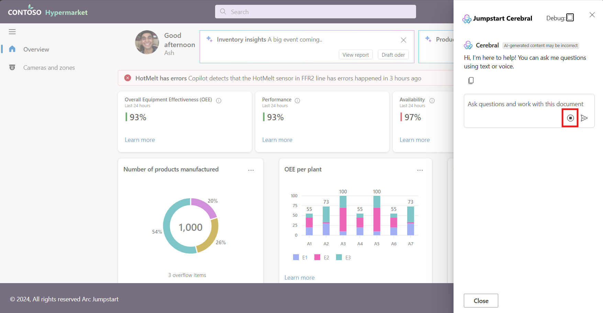
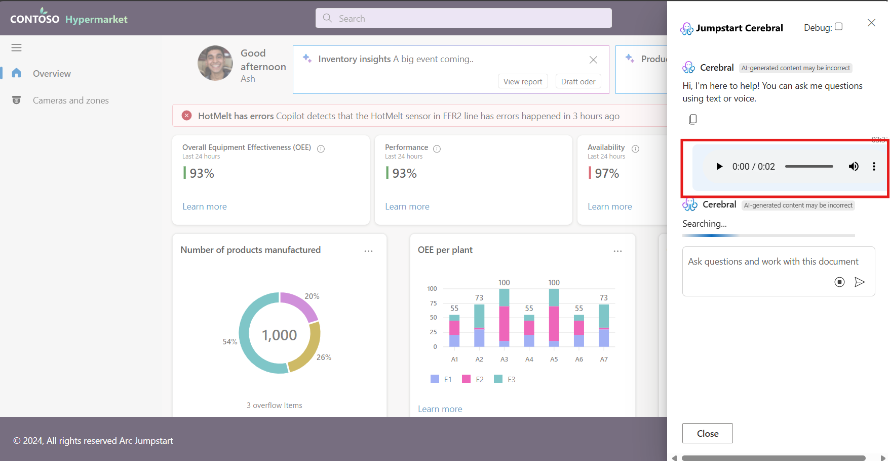
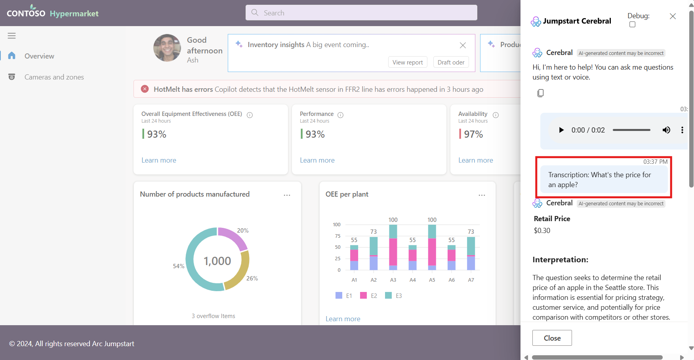

## Overview

This document describes the architecture of a Speech-to-Text (STT) solution implemented for **Contoso Hypermarket**. This feature enables Contoso Hypermarket shoppers and employees to ask questions through voice input, which are processed through Jumpstart Cerebral to provide real-time responses. The solution uses a combination of local and cloud-based AI services to ensure efficient processing, accuracy, and scalability.

### What is Speech to Text?

Speech to Text (STT) is a technology that converts spoken language into written text using advanced algorithms and machine learning models. The process involves capturing audio input, preprocessing it to remove noise, extracting relevant features, recognizing speech patterns, and generating text output. This a technology that is widely to enable seamless interaction between humans and machines.

## Architecture

Below is an architecture diagram that shows how the audio data flows from the user's microphone and into the STT system to generate real-time transcriptions of spoken language. This architecture includes a local instance of [OpenAI Whisper](https://github.com/openai/whisper) running at the edge in the Contoso Hypermarket, [Azure AI Speech](https://learn.microsoft.com/azure/ai-services/speech-service/overview) in the Azure cloud, and various components to process and route the audio data. The microphone captures audio input, which is processed locally or sent to the cloud for transcription. The transcribed text is then used to generate responses and provide real-time assistance to users.

### User Flow

> **WARNING**: Due to the lack of HTTPS in the Contoso Hypermarket Main UI deployment, some browsers may limit access to the microphone.
>
> To ignore the browsers secure origin policy, follow these steps:
> 1. Navigate to `chrome://flags/#unsafely-treat-insecure-origin-as-secure` in Chrome.
> 2. Find and enable the "Insecure origins treated as secure" section.
> 3. Add any addresses you want to ignore the secure origin policy for. Remember to include the port number if required.
> 4. Save and restart Chrome.

> **Note**: This is for development purposes only. To avoid this limitation, the app will need to be hosted on HTTPS for users to be able to use their microphone or camera.

1. **Microphone Audio Feed Captures User Questions** – The system starts by capturing audio from the user via a microphone connected to the main interface.
2. **Audio Processor** – An audio processing function detects if there is voice input. Once detected, the audio is converted to a blob format suitable for submission to the Jumpstart Cerebral system.
3. The **Jumpstart Cerebral STT Connector** submits the audio blob to the Jumpstart Cerebral API (`/Cerebral/Api/Stt`) for transcription.
4. The **Jumpstart Cerebral API** endpoint receives the requests, and handles it to the **STT function**. This logic checks whether a local model is available. If a local model is available, it uses [OpenAI Whisper](https://github.com/openai/whisper) for transcription; otherwise, it routes the request to [Azure AI Speech](https://learn.microsoft.com/azure/ai-services/speech-service/overview) within Azure services.
   - **Local Model Available**: The system uses the OpenAI Whisper model locally deployed on the edge infrastructure. Whisper is a general-purpose speech recognition model. This approach minimizes latency and maintains data privacy by keeping data processing on-premises.
   - **No Local Model**: If a local model is not present or available, the audio is sent to [Azure AI Speech](https://learn.microsoft.com/azure/ai-services/speech-service/overview) for transcription. This is a service of the [Azure AI Services](https://azure.microsoft.com/products/ai-services) family that provides high-accuracy transcription with a scalable cloud-based model.
5. **Transcription Processing** – Once the transcription is received, it is verified for accuracy and returned to the main user interface.
6. **UI Rendering** – The transcription result is displayed in the user interface, allowing the user to view the text representation of their question.
7. **Question Processing** – The transcribed question is then sent to the **Jumpstart Cerebral API**, which triggers a **"Process Question"** event. This event initiates further processing to deliver the appropriate response, following the [Jumpstart Cerebral processing](./../cerebral/_index.md) flow.

## Comparing Cloud vs Edge STT

### OpenAI Whisper

[OpenAI Whisper](https://github.com/openai/whisper) is a general-purpose speech recognition model that excels at various tasks, including multilingual speech recognition, speech translation, and language identification. Whisper has been trained on a large dataset of diverse audio samples, which enables it to handle different languages, accents, and speech nuances effectively.

Whisper is deployed locally in the Contoso Hypermarket's STT architecture to provide quick and accurate transcription without requiring internet connectivity. This local deployment allows for:
- **Reduced Latency**: Since transcription is processed on-premises, there is minimal delay in response time.
- **Data Privacy**: By keeping data on local infrastructure, the system minimizes exposure to external networks, enhancing data security.
- **Multilingual Support**: Whisper can automatically recognize and transcribe multiple languages, making it versatile in a multicultural retail environment.

### Azure AI Speech Service

[Azure AI Speech](https://learn.microsoft.com/azure/ai-services/speech-service/overview) is a cloud-based speech recognition service provided by Microsoft. When the local Whisper model is unavailable, the Contoso Hypermarket system routes audio data to Azure AI Speech for transcription. This service offers high-accuracy transcription with the added benefits of Azure's scalability and reliability.

Key features of Azure AI Speech used in this architecture include:
- **Scalability**: Azure Speech can handle large-scale requests and can be adjusted based on demand, making it suitable for a dynamic retail environment.
- **Accuracy and Language Support**: Azure AI Speech provides high-accuracy transcription for numerous languages and dialects, ensuring inclusivity for a diverse customer base.
- **Integration with Azure services**: Azure AI Speech integrates seamlessly with other Azure services, allowing for efficient deployment, monitoring, and maintenance.

This hybrid approach—using OpenAI Whisper locally and Azure AI Speech when necessary—ensures that Contoso Hypermarket can maintain consistent transcription quality while optimizing for performance, data privacy, and cost.

## Speech To Text Experience

### Key Steps

1. **Access the Interface**: The users accesses the **Contoso Hypermarket** interface on a local workstation or device.
1. **Access Jumpstart Cerebral**: The users clicks the Jumpstart Cerebral logo in the right-side part of the header to open the Cerebral chat panel.

    

1. **Activate Recording**: The user clicks the "Record" button in the UI to begin capturing audio input. If **Microphone Access** was not granted before, the user needs to accept enabling this access.

    

1. **Stop Recording**: The user clicks the "Stop" button to end the audio capture. The recorded audio is then processed for checks and transcriptions.

    

1. **STT Process**: The captured audio is processed, checked for voice content, and then sent through the STT connector.

    

1. The user can play the recorded audio for better understanding

    

1. **Real-time Response**: The transcribed text is displayed in the main interface for immediate feedback.

    

1. **Process Question Event**: The question is submitted to the Cerebral API, triggering further analysis and response generation.

## Next Steps

For more information on configuring and scaling this architecture, please refer to:
- [Troubleshooting](./../troubleshooting/_index.md)
- [Azure AI Speech Services](https://docs.microsoft.com/azure/cognitive-services/speech-service/)
- [OpenAI Whisper Model](https://openai.com/whisper)
