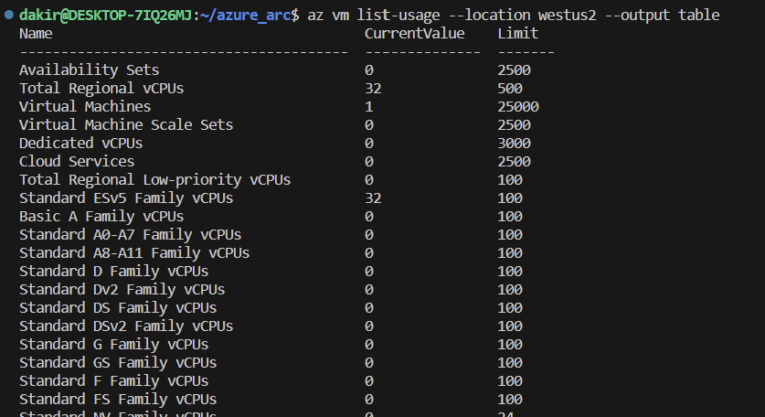

## Basic troubleshooting

Occasionally deployments of Jumpstart Agora Contoso Hypermarket may fail at various stages. Common reasons for failed deployments include:

- Invalid Azure credentials such as service principal id, service principal secret, service principal Azure tenant ID, or custom location resource provider id provided in _main.parameters.json_ file.

- Not enough vCPU quota available in your target Azure region - check vCPU quota and ensure you have at least 32 available vCPU.
  - You can use the command *`az vm list-usage --location <your location> --output table`* to check your available vCPU quota.

    

    

- Target Azure region doesn't support all required Azure services - ensure you are running Agora in one of the supported regions listed in the [deployment guide](../deployment/).

- Not enough AI services quota in your target subscription and region - check AI services quota using the command *`az cognitiveservices usage list -l <your location> -o table --query "[].{Name:name.value, currentValue:currentValue, limit:limit}"`*.

    

- Not enough Microsoft Entra ID quota to create additional service principals. You may receive a message stating "The directory object quota limit for the Principal has been exceeded. Please ask your administrator to increase the quota limit or delete objects to reduce the used quota."
  - If this occurs, you must delete some of your unused service principals and try the deployment again.

    

### Exploring logs from the _Ag-VM-Client_ virtual machine

Occasionally, you may need to review log output from scripts that run on the _Ag-VM-Client_ virtual machine in case of deployment failures. To make troubleshooting easier, the Agora deployment scripts collect all relevant logs in the _C:\Ag\Logs_ folder on _Ag-VM-Client_. A short description of the logs and their purpose can be seen in the list below:

| Log file | Description |
| ------- | ----------- |
| _C:\Ag\Logs\AgLogonScript.log_ | Output from the primary PowerShell script that drives most of the automation tasks. |
| _C:\Ag\Logs\ArcConnectivity.log_ | Output from the tasks that onboard servers and Kubernetes clusters to Azure Arc. |
| _C:\Ag\Logs\AzCLI.log_ | Output from az CLI login. |
| _C:\Ag\Logs\AzPowerShell.log_ | Output from the installation of PowerShell modules. |
| _C:\Ag\Logs\Bookmarks.log_ | Output from the configuration of Microsoft Edge bookmarks. |
| _C:\Ag\Logs\Bootstrap.log_ | Output from the initial bootstrapping script that runs on _Ag-VM-Client_. |
| _C:\Ag\Logs\ClusterSecrets.log_ | Output of secret creation on Kubernetes clusters. |
| _C:\Ag\Logs\GitOps-Ag-*.log_ | Output of scripts that collect GitOps logs on the remote Kubernetes clusters. |
| _C:\Ag\Logs\installK3s-Ag-K3s*.log_ | Output of scripts that configure the K3s clusters. |
| _C:\Ag\Logs\Observability.log_ | Output from the script that configures observability components of the solution. |
| _C:\Ag\Logs\Tools.log_ | Output from the tasks that set up developer tools on _Ag-VM-Client_. |
| _C:\ArcBox\Logs\WinGet-provisioning-*.log_ | Output from WinGet.ps1 which installs WinGet and install the bootstrap packages. |

  

### Authorization errors when deploying Azure IoT Operations

If you see authorization errors during the automation, please make sure to review the [prerequisites](../deployment/#prerequisites) in the deployment guide
