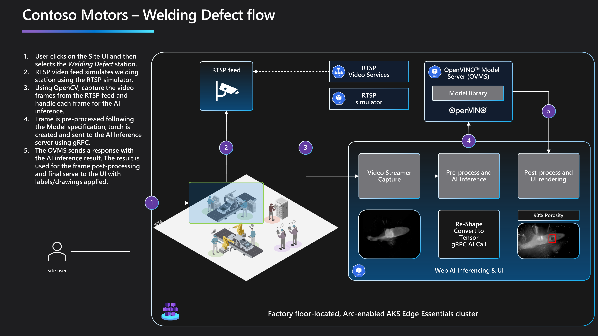
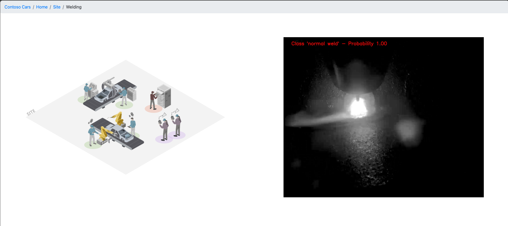
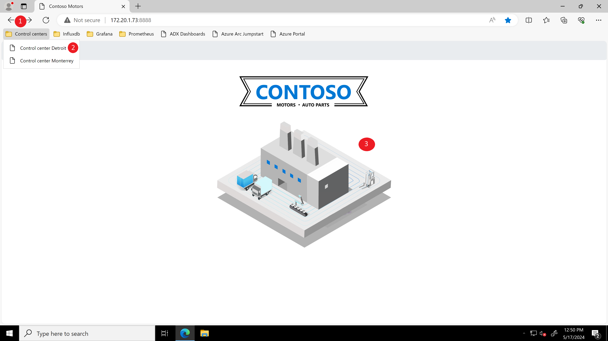
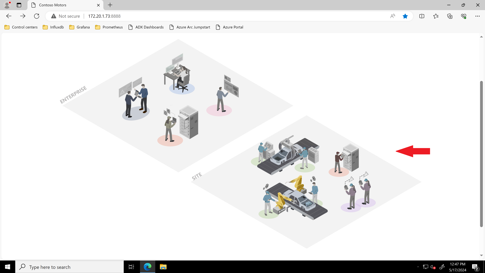
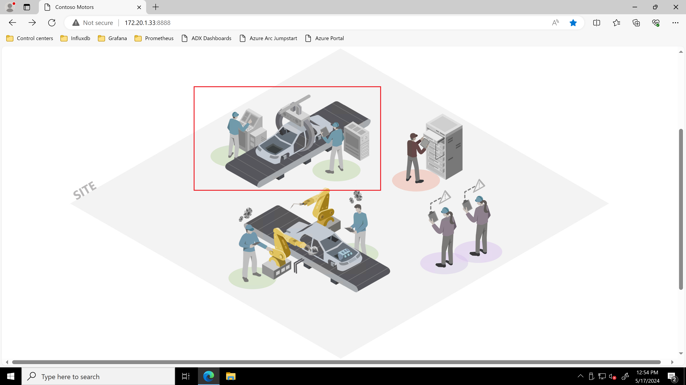
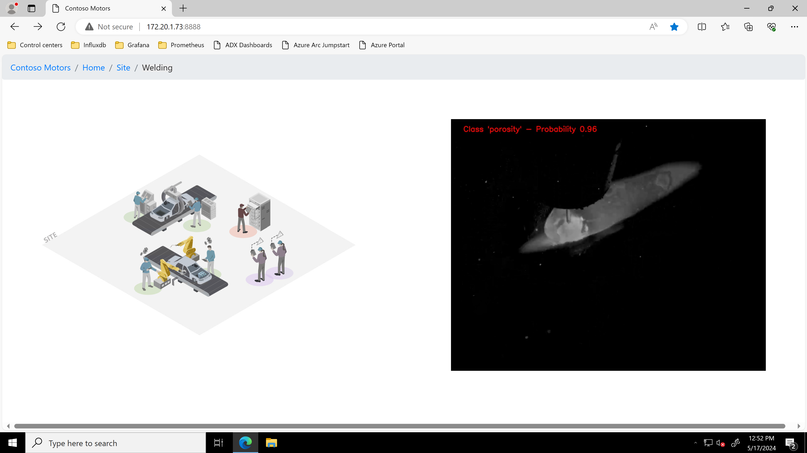

# Welding defect scenario using OpenVINO™ and Kubernetes

## Overview

Contoso Motors uses AI-enhanced computer vision to improve welding operations on its assembly lines. Welding is one of the four computer vision use cases that Contoso Motors uses, which also include object detection, human pose estimation, and safety helmet detection. While each use case has its own unique characteristics, they all follow the same inferencing architecture pattern and data flow.

Welding is a process of joining two or more metal parts by melting and fusing them together. Welding defects are flaws or irregularities that occur during or after the welding process, which can affect the quality, strength, and appearance of the weld. Welding defects can be caused by various factors, such as improper welding parameters, inadequate preparation, poor welding technique, or environmental conditions. In this scenario, an AI model is used to automatically detect and classify welding defects from a video feed. Welding defect inference can help improve the efficiency, accuracy, and safety of weld inspection and quality control.

## Architecture

This diagram shows the welding defect inference flow, which consists of five main steps: UI selection, RTSP video simulation, frame capturing, image pre-processing/inferencing, and post-processing/rendering.

1. **Select Site UI:** The user selects a working station from the interactive UI. Each station corresponds to a specific AI flow. In particular, when the user selects the welding working station (highlighted in the image above), the welding detection flow is triggered.

1. **RTSP video simulation:** The welding defect flow requires a particular video of a welding to apply the AI inference. In this scenario, due to the lack of a real video camera, an RTSP simulated feed is used. The simulated feed is designed to closely mimic the behavior of a real welding scenario, providing a reliable video for the AI inference process.

1. **Frame capturing:** This step involves using **OpenCV** to establish a connection with the RTSP video feed and retrieve the welding video frames. Each frame is then passed to the appropriate welding AI inference class, which applies the required preprocessing and post process to the frame. The welding AI inference class is implemented in *[welding.py](https://github.com/microsoft/jumpstart-agora-apps/blob/main/contoso_manufacturing/developer/webapp-decode/welding.py)* and is designed to handle the specific requirements of the welding defect detection process.

1. **Frame pre-processing/inferencing:** This step involves applying various techniques to enhance, transform and normalize the captured frames. For this welding model, the image preprocessing consists of the following transformations:
    1. Convert the color space of the input image from BGR to RGB.
    2. Resize the input image to the specified width and height.
    3. Convert the data type of the input image to float32
    4. Transpose the dimensions of the input image from (height, width, channels) to (channels, height, width).
    5. Add a new dimension to the input image at the beginning of the array to create a "batch" of images.
    6. Flip the order of the color channels from RGB to BGR.

    After the pre-processing step is completed, the final frame data is sent to the OpenVINO™ model server for inference. This is achieved using gRPC and the [ovmsclient](https://pypi.org/project/ovmsclient/) library, which provides a convenient and efficient way to communicate with the server. The server uses the OpenVINO™ toolkit to perform the inference process, which involves running the input data through a trained machine learning model to generate predictions or classifications. Once the inference is complete, the results are returned to the client for further processing or display.

1. **Frame post-processing/rednering:** this is the final step and involves parsing the inference reposnse and apply the required post-process. For this welding model, the post-process involves the following transformations:

    1. Apply the `softmax` function to the output of the model to convert it into a probability distribution.
    2. Flatten the probability distribution into a 1D array.
    3. Find the index of the highest probability value in the array.
    4. Find the highest probability value in the array.
    5. Map the index of the highest probability value to a corresponding class label.
    6. Draw the label containing the predicted class and its corresponding probability on the input image

    Once the image is processed, is then served to the main application to render it to the user. Final image contains the result of the welding inference (**no weld**, **normal weld**, **porosity**) and the probability of the result.

If you're interested in learning more about the AI inference flow, check out the [AI Inference Architecture](../ai_inferencing/#architecture) page for additional information.

### Model

The model used was created by Intel, and can be downloaded from [weld-porosity-detection-0001](https://docs.openvino.ai/2024/omz_models_model_weld_porosity_detection_0001.html).

#### Inputs

Image, name: image, shape: 1, 3, 224, 224 in the format B, C, H, W, where:
- B - batch size
- C - number of channels
- H - image height
- W - image width

Expected color order is BGR.

#### Outputs

The output is a torch with the shape 1, 3 containing probability scores for three output classes (**no weld**, **normal weld** and **porosity**).

## Operation technology (OT) Manager Experience

Contoso leverages their AI-enhanced computer vision to monitor the welding process and help OT managers detect welding defects through the "Control Center" interface.

- To access the "Control Center" interface, select the Control center [_env_] option from the _Control center_ Bookmarks folder. Each environment will have it's own "Control Center" instance with a different IP. Select one of the sites and click on the factory image to start navigating the different factory control centers.

  

- Click on the "Site" control center.

  

- Click on the "Welding" control center image.

  

- You can now see the AI-enhanced computer vision in action analyzing the video feed and showing the probability of the welding process detecting any defects.

  

## Next steps

Now that you have completed the data pipeline scenario, it's time to continue to the next scenario, [Workers safety using AI](../workers_safety/).