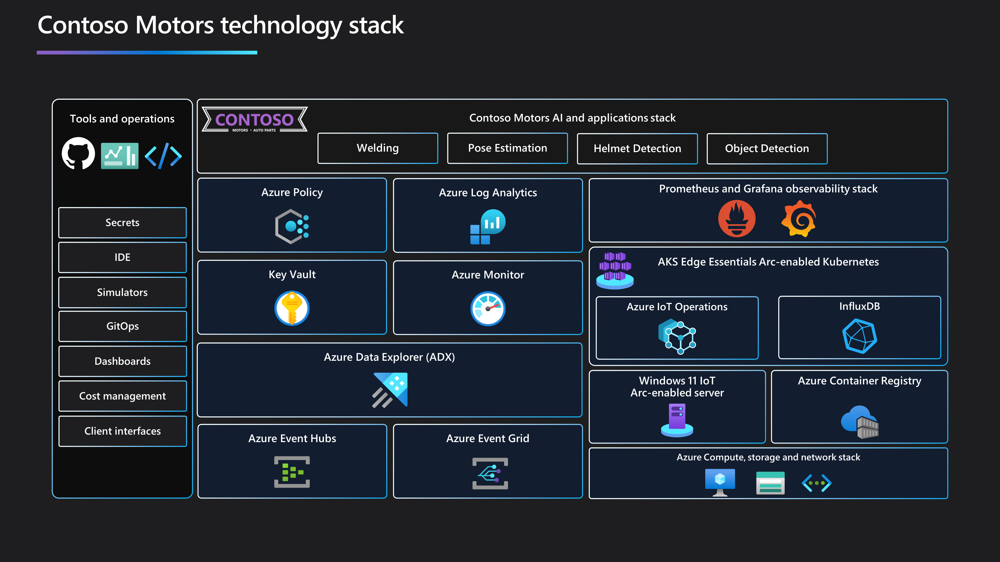

## Contoso Motors overview

Contoso Motors continues to lead the automotive industry with its unwavering commitment to innovation and employee safety. Positioned at the forefront of the industrial revolution, Contoso Motors seamlessly integrates cutting-edge technologies into every aspect of their operations, embodying the essence of Industrial IoT (Industry 4.0).

At the heart of Contoso Motors' digital infrastructure lies Azure IoT Operations, a transformative solution that harnesses protocols like OPC UA and MQTT. This advanced tool empowers Contoso Motors to extract insights from various equipment and systems within their manufacturing plants, facilitating real-time decision-making and operational optimization. Through data simulation and analytics, Contoso Motors refines processes and makes informed decisions with precision.

Furthermore, Contoso Motors leverages the power of Artificial Intelligence (AI) across multiple domains, including welding, pose estimation, helmet detection, and object detection. These AI models not only optimize manufacturing processes but also play a crucial role in ensuring employee safety. By proactively identifying potential hazards and monitoring workplace conditions, Contoso Motors fosters a culture of safety and well-being among its workforce.

Additionally, Kubernetes plays a vital role in Contoso Motors' infrastructure, streamlining the deployment and management of containerized applications. With Kubernetes, Contoso Motors ensures smooth manufacturing operations while maintaining scalability to adapt to changing demands, solidifying their position as an industry leader.

Looking ahead, Contoso Motors embraces Microsoft's Adaptive cloud approach, with Azure Arc serving as the foundation. This strategic move unifies teams, sites, and systems into a cohesive operational framework, enabling the harnessing of cloud-native and AI technologies across hybrid, multicloud, edge, and IoT environments. Leveraging Azure Arc, Contoso Motors embarks on a transformative journey towards operational agility, security, and innovation, setting new standards in the automotive industry.

## Architecture and technology stack

To support their digital transformation aspirations, Contoso Motors stores has a robust technology stack, services, and processes. To demonstrate the various use cases mentioned below, a set of reference use-cases is included:

- **Welding** - Optimizing welding processes for precision and efficiency, ensuring high-quality welds and minimizing defects through advanced techniques and technologies.
- **AI-driven Safety** - Implementing artificial intelligence to enhance safety protocols, proactively identifying potential hazards and mitigating risks to ensure a secure working environment for personnel.
- **Computer Vision for Object and Defect Detection** - Leveraging computer vision algorithms to detect and classify objects on the manufacturing line, as well as identifying defects with high accuracy and speed, streamlining quality control processes.
- **IT/OT Operations and Observability** - Integrating IT and operational technology (OT) systems to enhance visibility and control over manufacturing operations, enabling real-time monitoring, analysis, and optimization for increased productivity and reliability.

## Getting started

To get started with the "Contoso Motors" Jumpstart Agora scenario, we provided you with a dedicated guide for each step of the way. The guides are designed to be as simple as possible but also keep the detailed-oriented spirit of the Jumpstart.

| **Guide**  | **Contoso Motors service or platform** | **Technology stack** |
|----------------------------------------------------------------------------------------------------------------------------------------------------------------------------------------|-----------------------------------------------------------------------------------------------|
| [Deployment guide](../contoso_motors/deployment/) | Not applicable | Not applicable |
| [Data pipeline and reporting across cloud and edge](../contoso_motors/data_opc/) | OT | Azure IoT Operations, Azure Data Explorer, MQTT, Event Grid, Event Hub, AKS Edge Essentials |
| [Enabling AI at the Edge to enhance workers safety](../contoso_motors/workers_safety/) | Workers safety  | Azure IoT Operations, Azure Data Explorer, MQTT, RTSP simulator, OPC simulator, Intel OpenVino Inference Engine, Grafana, InfluxDB, AKS Edge Essentials |
| [Optimizing welding processes for precision and efficiency](../contoso_motors/welding_defect/)  | Welding monitoring  | Azure IoT Operations, Azure Data Explorer, MQTT, RTSP simulator, OPC simulator, Intel OpenVino Inference Engine, Grafana, InfluxDB, AKS Edge Essentials  |
| [Infrastructure observability for Kubernetes and Arc-enabled Kubernetes](../contoso_motors/k8s_infra_observability/) | Infrastructure | AKS Edge Essentials, Prometheus, Grafana  |
| [Infrastructure observability for Arc-enabled servers using Azure Monitor](../contoso_motors/arc_monitoring_servers/) |Infrastructure   | Azure Arc-enabled servers, Azure Monitor |
| [Cleanup deployment](../contoso_motors/cleanup/) | Not applicable | Not applicable |
| [Troubleshooting](../contoso_motors/troubleshooting/) | Not applicable  | Not applicable |
| [Frequently asked questions (FAQ)](../../faq/) | Not applicable  | Not applicable  |
