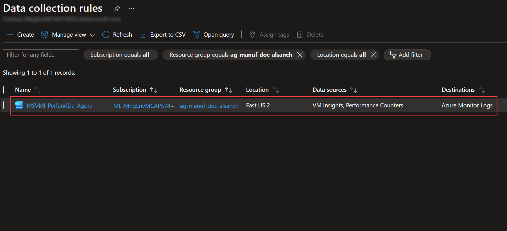
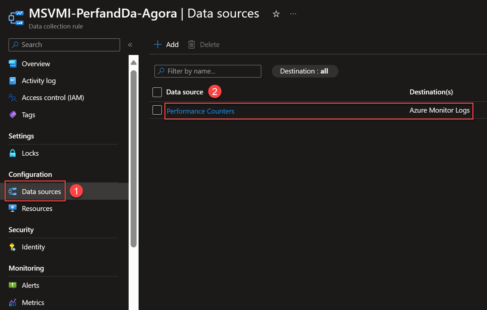
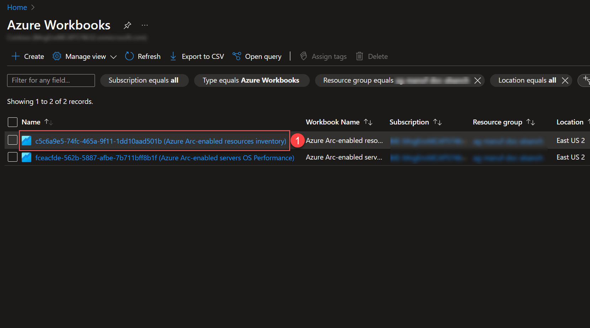

# Infrastructure observability for Arc-enabled servers using Azure Monitor

## Overview

Infrastructure observability is crucial for Contoso Motors to understand the performance and health of their Arc-enabled servers. This is where [Azure Monitor](https://learn.microsoft.com/azure/cloud-adoption-framework/scenarios/hybrid/arc-enabled-servers/eslz-management-and-monitoring-arc-server) steps in, playing a vital role in offering visibility into every facet of their Arc-enabled servers ecosystem.

Azure Monitor empowers Contoso with the capability to monitor and gather telemetry data from their Arc-enabled servers. It serves as a central hub, providing near real-time insights into server performance, health, and resource utilization. Azure Monitor offers a comprehensive view of the entire infrastructure, ensuring proactive identification and resolution of potential issues.

## Enable and configure Azure Monitor

Azure Monitor can collect data directly from your Arc-enabled servers into a Log Analytics workspace for detailed analysis and correlation. It requires installing the Azure Monitor Agent (AMA) VM extension on your Arc-enabled servers, enabling VM insights to collect data from your machines.

As part of the automated deployment, an Azure Policy monitoring initiative and a Data Collection Rule (DCR) are deployed. They allow collecting monitoring data from your Arc-enabled servers.

Follow these steps to verify that these required Azure Monitor artifacts have been successfully deployed:

- In the top bar of the Azure portal, search for **policy** and click on **Policy**:

    

- Click on **Assignments**. You will see the Azure Policy initiative **(Ag) Enable Azure Monitor for Hybrid VMs with AMA**. This initiative enables Azure Monitor for the hybrid virtual machines with AMA. It takes a Log Analytics workspace as and a Data Collection Rule (DCR) as parameters.

    

- The DCR is in charge of collecting monitoring data from the Arc-enabled servers. In the top bar, search for **Data collection rules**:

    

- You will find the DCR that has been created to collect insights from the Arc-enabled servers:

    

- Click on the DCR. You will see the data sources collected, in this case, performance counters:

    

## Arc-enabled servers and Azure Monitor VM insights Integration

Now that we have checked that the required monitoring artifacts have been successfully enabled, it's time to leverage VM insights. It monitors the performance of your Arc-enabled servers by collecting the required data with AMA.

- Search for **Azure Arc**, go to **Machines** and click in one of your **Arc-enabled servers**:

    

- Click on **Insights** and then on **Performance**. You will find a set of performance charts that target several key performance indicators to help you determine how well your Arc-enabled server is performing. The charts show resource utilization over a period of time:

    

## Operating System (OS) Performance Workbook

An Azure Workbook for Operating System (OS) Performance is also available as part of the deployment. It complements the views provided by VM insights.

- Search for **workbooks** and click on **Azure workbooks**:

  

- Click on the workbook whose name contains **Arc-enabled servers OS Performance** and then click on **Open workbook**:

  

  

- You will find a table that summarizes the OS performance status for your servers (CPU, Memory and Disk):
  
  

- If you scroll down, you can use the charts and tables available per each key performance counter:

  

## Arc-enabled resources inventory Workbook

The second Azure Workbook functions as an inventory report detailing the various Arc-enabled resources that have been deployed.

- Search for **workbooks** and click on **Azure workbooks**:

  

- Click on the workbook whose name contains **Arc-enabled resources inventory** and then click on **Open workbook**:

  

  

- You will find the first inventory for **Machines overall status and configurations**, which counts the number of machines by type and by their status:

  

- The second and third inventories list your **Arc-enabled servers** and your **Arc-enabled Kubernetes clusters**. It provides information about the status, Arc agent version, the operating system, location, and the number of compliant and non-compliant policies.

  

- There is also an inventory for checking the **Updates Data** of the servers:

  

- The last inventory will list any **Defender for Cloud active alerts**:

  

## Next steps

Now that you have successfully completed all of the Contoso Motors scenarios, continue to the next step to learn how to [cleanup the deployment](../cleanup/).
