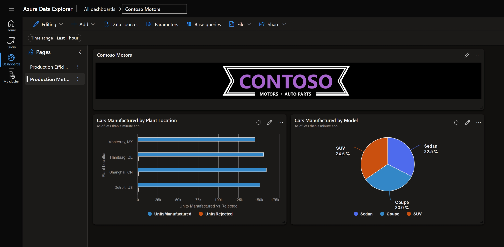

# Data pipeline and reporting across cloud and edge for Contoso Motors

## Overview

One of Contoso's biggest objectives is how to use the data coming from their manufacturing assembly line, welding robots, battery assemblies and visualize it for business intelligence by leveraging the power of the cloud.

In this scenario, Contoso wants to use their data pipeline so that data coming from automobile parts manufactured at various plants flow to [Azure Data Explorer (ADX)](https://learn.microsoft.com/azure/data-explorer/data-explorer-overview) database and generate near real-time reports for production and operational efficiency. By doing so, Contoso management can leverage these reports to adjust their production, improve quality, reduce wastage, and save manufacturing cost.

## Architecture

Below is an architecture diagram that shows how the data flows from the manufacturing plant and into the ADX database to generate near real-time reports of production line, batteries, and welding equipment received and processed across various manufacturing plants. This architecture includes a local InfluxDB, running at the edge in the plant, [Azure Event Grid](https://learn.microsoft.com/en-us/azure/event-grid/overview), [Azure Event Hub](https://learn.microsoft.com/en-us/azure/event-hubs/event-hubs-about), and ADX cluster in Azure cloud. MQTT broker at the edge receives event data from MQTT simulator and sends to Azure Event Grid in the cloud. Azure Event Grid routes these messages into Azure Event Hub. Data connection that is created in ADX cluster connects to Azure Event Hub and ingests data into ADX database for realtime analytics and dashboard reports.

## Contoso Motors dashboard reports

Contoso supports dashboard reports for the manufacturing analytics and monitoring. These reports are created in ADX to allow users to view dashboards reports. These reports are generated based on live data received from the MQTT Broker into the ADX database using data integration.

## Manually import dashboards

Follow the below steps in order to view the Contoso Motors dashboard reports as you will need to import these into ADX.

- On the Client VM (_Ag-VM-Client_), open Windows Explorer and navigate to folder _C:\Ag\AdxDashboards_ folder. This folder contains ADX dashboard report JSON file _adx-dashboard-contoso-motors-auto-parts.json_ with the ADX name and URI updated when the deployment PowerShell logon script is completed.

  

- Copy this ADX dashboards report JSON file on your local machine in a temporary folder to import into ADX dashboards. Alternatively, you can log in to ADX Dashboards directly on the Client VM.

  > **Note:** Depending on the account being used to log in to the ADX portal, the Microsoft Entra ID tenant of that account may have conditional access policies enabled to allow access only from corporate-managed devices (for example managed by Microsoft Intune) and might prevent login to ADX Dashboards from the Client VM as this VM is not managed by your organization.

- On your local machine open the browser of your choice OR on the Client VM open the Edge browser and log in to [ADX Dashboards](https://dataexplorer.azure.com/). Use the same user account that you deployed Jumpstart Agora in your subscription. Failure to use the same account will prevent access to the ADX manufacturing database to generate reports.

- Once you are logged in to ADX dashboards, click on Dashboards in the left navigation to import the Contoso Motors dashboard report.

  

- Select _Import dashboard from file_ to select previously copied file from the Client VM to your local machine or the _C:\Ag\AdxDashboards_ folder on the Client VM.

  

- Choose to import the _adx-dashboard-contoso-motors-auto-parts.json_ file.

  

- Confirm the dashboard report name, accept the suggested name (or choose your own), and click Create.

  

- By default, there is no data available in the ADX manufacturing database to display in the report after deployment. Click Save to save the dashboard report in ADX.

  

  > **Note:** Depending on the type of user account being used to access ADX dashboards, you might have issues accessing data in the _manufacturing_ database in the ADX cluster with an error _User principal 'msauser=xyz@abc.com' is not authorized to read database 'manufacturing'_. If you experience this access issue, refer to [Jumpstart Agora - Contoso Motors scenario troubleshooting](../troubleshooting/#user-principal-is-not-authorized-to-read-database-manufacturing) guide to troubleshoot and address this access issue.

## Generate sample data using Data Emulator

Once the Agora Contoso Motors scenarios is deployed and fully functions, MQTT simulators start sending assemblyline, battery, and welding data to Azure Event Hub and is ingested to ADX database using ADX database connection. While this data is realtime, it takes time to produce enough data to view dashboards reports, this scenario comes with a Data Emulator tool available on the Agora client VM. Data Emulator can produce data for past several days or weeks to view dashboard reports. Use instructions below to generate sample data using the Data Emulator tool.

- On the Client VM, locate Data Emulator icon on the desktop.

  

- Double click on the Data Emulator desktop icon to launch executable and generate sample data. Confirm by entering option **1** for past data or **2** to start generating current data. Select 1 to generate past data.

  > **Note:** You can still generate additional sample data by running this tool multiple times, but there might be duplicate key errors and fails to generate data in subsequent attempts.

- Enter no of days to generate past data until current date and time.

  

  

  

- Once the sample data generation is complete, from [ADX Dashboards](https://dataexplorer.azure.com/) open Contoso Motors and Auto Parts dashboard report to view simulated manufacturing data. Allow some time to propagate data into the ADX database using an integrated data pipeline.

  

- Contoso Motors dashboard report is configured to display data from the _"Last 1 hour"_ by default. To view all the simulated manufacturing data, change report time range to _"Last 7 days"_ as shown in the picture below. Dashboard report will refresh data and display reports for the selected time range.

  

  

  

## Next steps

Now that you have completed the first data pipeline scenario, it's time to continue to the next scenario, [Data pipeline and reporting across cloud and edge for sensor telemetry](../freezer_monitor/).
