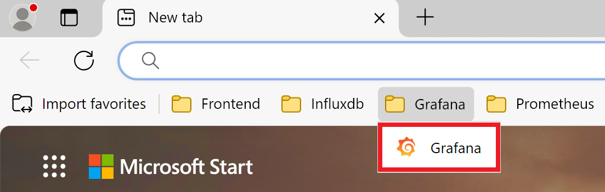

# Infrastructure observability for Kubernetes and Arc-enabled Kubernetes

## Overview

Infrastructure observability plays a crucial role in the success of Contoso Motors' cloud to edge strategy. By implementing infrastructure observability, Contoso gains comprehensive monitoring and visualization capabilities for their Kubernetes and Arc-enabled Kubernetes environments. This empowers them to proactively monitor the health and performance of their infrastructure, identify potential issues, and make data-driven decisions to optimize their operations. With infrastructure observability, Contoso can ensure that their cloud and edge infrastructure remain reliable, efficient, and resilient, enabling them to deliver exceptional customer experiences.

[Prometheus](https://prometheus.io/) is a highly efficient open source monitoring system that collects and stores metrics from various sources in real-time. It provides a flexible query language for analyzing the collected metrics and offers robust alerting capabilities. On the other hand, [Grafana](https://grafana.com/) is a powerful open source data visualization and analytics platform. It allows users to create interactive and customizable dashboards to visualize the collected metrics in real-time.

By leveraging Prometheus and Grafana for infrastructure observability, Contoso enjoys several advantages. Firstly, Prometheus's efficient data collection ensures that Contoso can monitor crucial performance indicators and resource utilization in real-time. Secondly, Grafana provides a user-friendly interface for visualizing the collected metrics, enabling Contoso to create interactive and customizable dashboards. These dashboards enable valuable insights into their infrastructure’s health and performance, facilitate trend identification, and support informed decision-making. Lastly, the combination of Prometheus and Grafana supports troubleshooting and root cause analysis.

## Architecture

The observability infrastructure stack architecture leverages the [Kube Prometheus Stack](https://github.com/prometheus-community/helm-charts/tree/main/charts/kube-prometheus-stack). This stack is a collection of Kubernetes manifests, Grafana dashboards, and Prometheus rules that are used to set up and configure monitoring for Kubernetes clusters.

The manufacturing plants deploy Prometheus instances, which periodically scrape metrics from the AKS edge essentials cluster. A Grafana instance is set up separately to centralize monitoring and visualization. The Prometheus instances send their metrics data to this central Grafana instance. Grafana dashboards are configured to display relevant metrics, allowing operators and administrators to monitor the health and performance of the entire infrastructure.

## Grafana dashboards

Grafana's dashboards in Contoso's implementation provide a visually appealing and customizable interface for monitoring their infrastructure. With Grafana, they can create intuitive and interactive dashboards that display key metrics and insights, empowering them to make data-driven decisions and quickly identify any issues or trends within their cloud to edge infrastructure. The following Grafana dashboards are automatically deployed as part of advanced automation for all the manufacturing plants:

- **Kubernetes / Views / Global**: The Kubernetes Global Dashboard in Grafana offers a concise overview of your Kubernetes cluster, allowing you to quickly assess its overall health and performance. The dashboard includes panels that highlight key metrics, such as total cluster CPU, RAM, and network utilization, as well as resource usage across namespaces and nodes. Additionally, it tracks the number of resource types used in the cluster and helps detect misconfigured application resources by comparing real usage with requested and limited resources.

- **Node Exporter Full**: The Kubernetes Nodes Dashboard in Grafana provides a detailed view of node-level metrics and resources in your Kubernetes cluster. It enables you to monitor CPU and RAM usage, track pods running on each node, and identify any resource anomalies or performance issues. The dashboard also offers system-level metrics such as system load, context switches, and file descriptors, allowing for troubleshooting and optimization. Additionally, it provides insights into storage capacity, volumes, and I/O operations on the nodes, aiding in the effective management of storage resources.

> **Grafana Dashboard Credits:**
> The Kubernetes dashboards included in this guide are based on the work of publicly available dashboards. We would like to express our appreciation for authors' efforts in creating this insightful dashboard that enhances our monitoring capabilities for Kubernetes.
> The original dashboards can be found at:
> - [Node Exporter Full](https://grafana.com/grafana/dashboards/1860-node-exporter-full)
> - [Grafana Dashboards Kubernetes](https://github.com/dotdc/grafana-dashboards-kubernetes)

## Access the dashboards

As an Operations team member at Contoso, you will have access to the Grafana dashboards for infrastructure observability. These dashboards provide a comprehensive view of the health, performance, and metrics of the cloud to edge infrastructure. To access the Grafana dashboards follow the below steps.

- Connect to the Client VM _Ag-VM-Client_ using the instructions in the [deployment guide](../deployment/#connecting-to-the-agora-client-virtual-machine).

- Open the Edge browser, expand Grafana in the Favorites Bar and select `Grafana`.

    

- Login using the Windows Admin Username and Password you provided when you created your deployment.

    

- Click `Detroit - Kubernetes / Views / Global` dashboard to review the overall health of the cluster.

    

    

- Review the different panels in the dashboard to see the metrics collected from the Kubernetes cluster.

    

    

- Click `Home` to go back to the home page and review the other dashboards available.

    

- Click `Detroit - Node Exporter Full` dashboard to review the Detroit plant node metrics.

    

    

- Review the different panels in the dashboard to see the metrics collected from the Kubernetes cluster.

    

    

    

- Repeat the same steps to access the `Monterrey` dashboards and review the cluster and node metrics.

    

## Next steps

Continuing with the next Contoso Motors scenario, you can now proceed to the next guide to learn about [infrastructure observability for Arc-enabled servers using Azure Monitor](../arc_monitoring_servers/).
