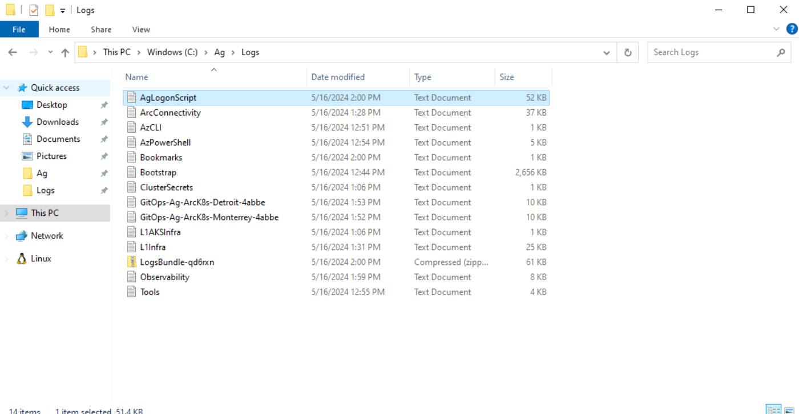

# Contoso Motors scenario troubleshooting

## Basic troubleshooting

Occasionally deployments of Jumpstart Agora Contoso Motors may fail at various stages. Common reasons for failed deployments include:

- Invalid Azure credentials such as service principal id, service principal secret, service principal Azure tenant ID, or custom location resource provider id provided in _main.parameters.json_ file.

- Not enough vCPU quota available in your target Azure region - check vCPU quota and ensure you have at least 40 available vCPU.
  - You can use the command *`az vm list-usage --location <your location> --output table`* to check your available vCPU quota.

    

- Target Azure region does not support all required Azure services - ensure you are running Agora in one of the supported regions listed in the [deployment guide](../deployment/).

- Not enough Microsoft Entra ID quota to create additional service principals. You may receive a message stating "The directory object quota limit for the Principal has been exceeded. Please ask your administrator to increase the quota limit or delete objects to reduce the used quota."
  - If this occurs, you must delete some of your unused service principals and try the deployment again.

    

### Exploring logs from the _Ag-VM-Client_ virtual machine

Occasionally, you may need to review log output from scripts that run on the _Ag-VM-Client_ virtual machine in case of deployment failures. To make troubleshooting easier, the Agora deployment scripts collect all relevant logs in the _C:\Ag\Logs_ folder on _Ag-VM-Client_. A short description of the logs and their purpose can be seen in the list below:

| Log file | Description |
| ------- | ----------- |
| _C:\Ag\Logs\AgLogonScript.log_ | Output from the primary PowerShell script that drives most of the automation tasks. |
| _C:\Ag\Logs\ArcConnectivity.log_ | Output from the tasks that onboard servers and Kubernetes clusters to Azure Arc. |
| _C:\Ag\Logs\AzCLI.log_ | Output from Az CLI login. |
| _C:\Ag\Logs\AzPowerShell.log_ | Output from the installation of PowerShell modules. |
| _C:\Ag\Logs\Bookmarks.log_ | Output from the configuration of Microsoft Edge bookmarks. |
| _C:\Ag\Logs\Bootstrap.log_ | Output from the initial bootstrapping script that runs on _Ag-VM-Client_. |
| _C:\Ag\Logs\ClusterSecrets.log_ | Output of secret creation on Kubernetes clusters. |
| _C:\Ag\Logs\GitOps-Ag-*.log_ | Output of scripts that collect GitOps logs on the remote Kubernetes clusters. |
| _C:\Ag\Logs\L1AKSInfra.log_ | Output of scripts that configure AKS Edge Essentials clusters on the nested virtual machines. |
| _C:\Ag\Logs\Observability.log_ | Output from the script that configures observability components of the solution. |
| _C:\Ag\Logs\Tools.log_ | Output from the tasks that set up developer tools on _Ag-VM-Client_. |

  

### Authorization errors when deploying Azure IoT Operations

If you see authorization errors during the automation, please make sure to review the [prerequisites](../deployment/#prerequisites) in the deployment guide.

### Error loading dashboards with Azure Data Explorer

If you have access to mulitple Azure environments, you may receive an error when first accessing the dashboards in Azure Data Explorer.

The screenshot below shows this type of error.

  

Follow the below steps to address this permissions error.

- Click your user icon in the upper-right of Azure Data Explorer and "Switch Directory" to the correct Azure environment where you deployed Contoso Motors.

  
