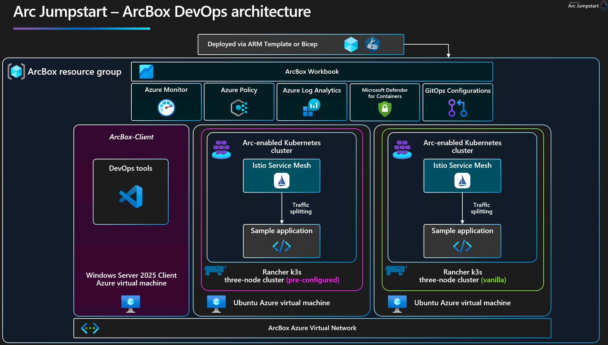
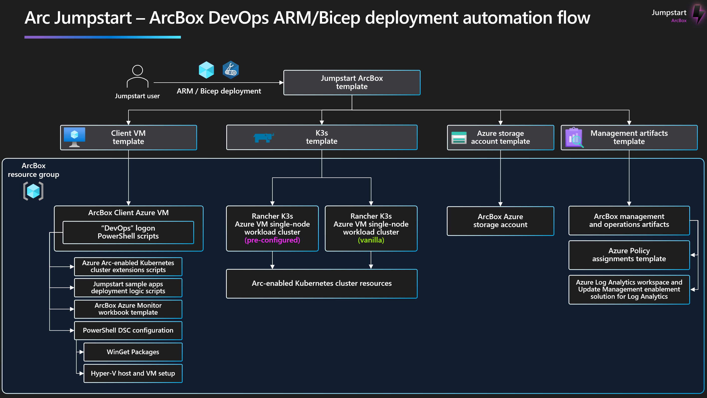
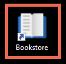
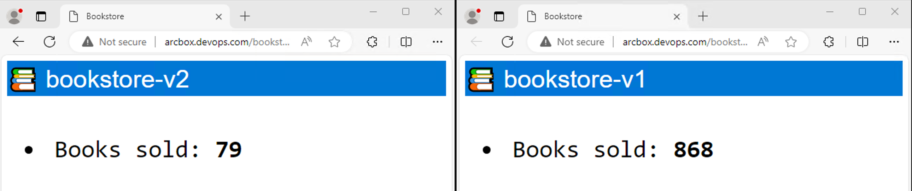
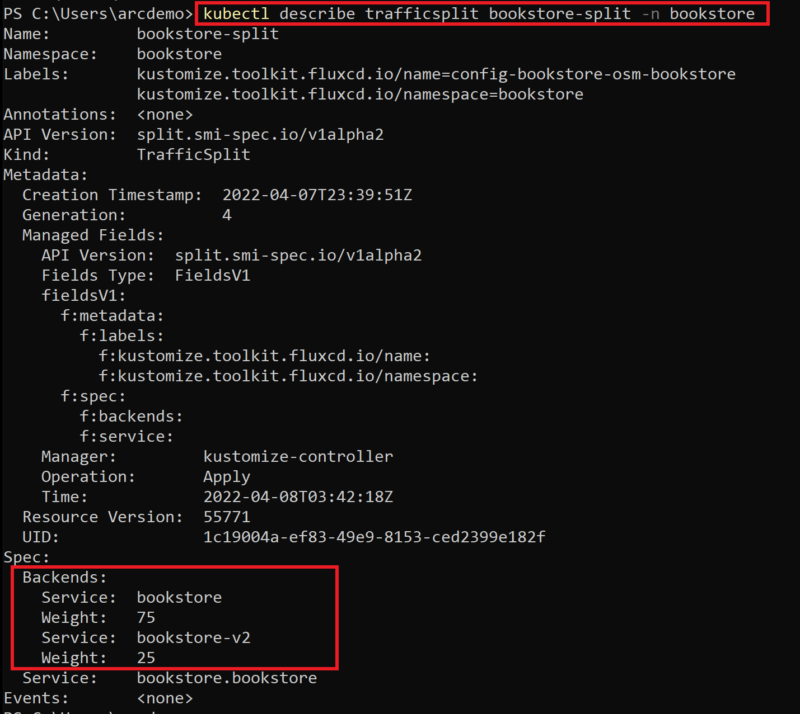

# Jumpstart ArcBox for DevOps

## Overview

ArcBox for DevOps is a special "flavor" of ArcBox that's intended for users who want to experience Azure Arc-enabled Kubernetes capabilities in a sandbox environment.



### Use cases

- Sandbox environment for getting hands-on with Azure Arc technologies and [Azure Arc-enabled Kubernetes landing zone accelerator](https://aka.ms/ArcK8sLZSandbox)
- Accelerator for Proof-of-concepts or pilots
- Training solution for Azure Arc skills development
- Demo environment for customer presentations or events
- Rapid integration testing platform
- Infrastructure-as-code and automation template library for building hybrid cloud management solutions

## Azure Arc capabilities available in ArcBox for DevOps

### Azure Arc-enabled Kubernetes

ArcBox for DevOps deploys two Kubernetes clusters to give you multiple options for exploring Azure Arc-enabled Kubernetes capabilities and potential integrations.

- _**ArcBox-K3s-Data**_ - Three-node Rancher K3s cluster running on an Azure virtual machine. ArcBox automatically deploys multiple [GitOps configurations](#gitops-configurations) on this cluster for you, so you have an easy way to get started exploring GitOps capabilities.
- _**ArcBox-K3s**_ - Three-node Rancher K3s cluster running on an Azure virtual machine. This cluster is then connected to Azure as an Azure Arc-enabled Kubernetes resource. ArcBox provides the user with [PowerShell scripts](#additional-optional-scenarios-on-the-arcbox-k3s-cluster) that can be manually run to apply GitOps configurations on this cluster.

### Sample applications

ArcBox for DevOps deploys two sample applications on the _ArcBox-K3s-Data_ cluster. The cluster has multiple [GitOps configurations](https://learn.microsoft.com/azure/azure-arc/kubernetes/conceptual-gitops-flux2) that deploy and configure the sample apps. You can use your own fork of the [sample applications GitHub repo](https://github.com/microsoft/azure-arc-jumpstart-apps) to experiment with GitOps configuration flows.

The sample applications included in ArcBox are:

- [Hello-Arc](https://github.com/microsoft/azure-arc-jumpstart-apps/tree/main/hello-arc) - A simple Node.js web application. ArcBox will deploy **three Kubernetes pod replicas** of the _Hello-Arc_ application in the _hello-arc_ namespace onto the _ArcBox-K3s-Data_ cluster.

- [Bookstore](https://github.com/microsoft/azure-arc-jumpstart-apps/tree/main/bookstore/yaml) - A sample microservices Golang (Go) application. ArcBox will deploy the following **five different Kubernetes pods** as part of the Bookstore app.

  - `bookbuyer` is an HTTP client making requests to bookstore.
  - `bookstore` is a server, which responds to HTTP requests. It's also a client making requests to the _bookwarehouse_ service.
  - `bookwarehouse` is a server and should respond only to _bookstore_.
  - `mysql` is a MySQL database only reachable by _bookwarehouse_.
  - `bookstore-v2` - this is the same container as the first bookstore, but for [Istio Service Mesh](#istio-service-mesh-integration) traffic split scenario we will assume that it's a new version of the app we need to upgrade to.

The `bookbuyer`, `bookstore`, and `bookwarehouse` pods will be in separate Kubernetes namespaces with the same names. `mysql` will be in the `bookwarehouse` namespace. `bookstore-v2` will be in the `bookstore` namespace.

### Istio Service Mesh integration

ArcBox deploys Istio service mesh by using the [Istioctl](https://istio.io/latest/docs/setup/install/istioctl/) on the _ArcBox-K3s-Data_ cluster. Bookstore application namespaces will be added to Istio control plane. Each new pod in the service mesh will be injected with an Envoy sidecar container.

[Istio](https://istio.io/latest/about/service-mesh/) is an open-source service mesh that helps manage communication, security, and observability in microservices architectures. Istio uses a sidecar proxy model, typically with Envoy proxies, to intercept and manage all network traffic between microservices. This setup allows Istio to provide its features without requiring changes to the application code.

### GitOps

GitOps on Azure Arc-enabled Kubernetes uses [Flux](https://fluxcd.io/docs/). Flux is deployed by installing the [Flux extension](https://learn.microsoft.com/azure/azure-arc/kubernetes/conceptual-gitops-flux2#flux-cluster-extension) on the Kubernetes cluster. Flux is a tool for keeping Kubernetes clusters in sync with sources of configuration (such as Git repositories) and automating updates to the configuration when there is a new code to deploy. Flux provides support for common file sources (Git and Helm repositories, Buckets) and template types (YAML, Helm, and Kustomize).

ArcBox deploys four GitOps configurations onto the _ArcBox-K3s-Data_ cluster:

- Cluster scope config to deploy [NGINX-ingress controller](https://kubernetes.github.io/ingress-nginx/).
- Cluster scope configuration to deploy the "Bookstore" application.
- Namespace scope configuration to deploy the "Bookstore" application Role-based access control (RBAC).
- Namespace scope configuration to deploy the "Hello-Arc" web application.

### Microsoft Defender for Cloud / k8s integration

ArcBox deploys several management and operations services that work with ArcBox's Azure Arc resources. One of these services is Microsoft Defender for Cloud that's deployed by installing the [Defender extension](https://learn.microsoft.com/azure/defender-for-cloud/defender-for-containers-enable?tabs=aks-deploy-portal%2Ck8s-deploy-cli%2Ck8s-verify-cli%2Ck8s-remove-arc%2Caks-removeprofile-api#protect-arc-enabled-kubernetes-clusters) on your Kubernetes cluster in order to start collecting security related logs and telemetry.

### Unified Operations

ArcBox deploys several management and operations services that work with ArcBox's Azure Arc resources. These resources include an Azure Automation account, an Azure Log Analytics workspace, an Azure Monitor workbook, Azure Policy assignments for deploying Kubernetes cluster monitoring and security extensions on the included clusters, Azure Policy assignment for adding tags to resources, and a storage account used for staging resources needed for the deployment automation.

## ArcBox Azure Consumption Costs

ArcBox resources generate Azure consumption charges from the underlying Azure resources including core compute, storage, networking, and auxiliary services. Note that Azure consumption costs vary depending on the region where ArcBox is deployed. Be mindful of your ArcBox deployments and ensure that you disable or delete ArcBox resources when not in use to avoid unwanted charges.  In an effort to reduce the costs, by default the client VM will auto-shutdown at 1800 UTC.  This can be changed either during the deployment by altering the parameters for autoShutdownEnabled, autoShutdownTime, and autoShutdownTimezone within the Bicep template or after deployment by changing the [auto-shutdown](https://learn.microsoft.com/azure/virtual-machines/auto-shutdown-vm?tabs=portal) parameters from the Azure Portal.  When the ArcBox-Client VM is stopped, there will be no compute charges; however, there will still be charges for the storage components.


Please see the [Jumpstart FAQ](../../faq/) for more information on consumption costs.

## Deployment Options and Automation Flow

ArcBox provides multiple paths for deploying and configuring ArcBox resources. Deployment options include:

- Azure portal
- Azure Bicep



ArcBox uses an advanced automation flow to deploy and configure all necessary resources with minimal user interaction. The previous diagrams provide an overview of the deployment flow. A high-level summary of the deployment is:

- User deploys the Bicep template (_main.bicep_). These objects contain several nested objects that will run simultaneously.
  - Client virtual machine ARM template/plan - deploys the Client Windows VM. This is a Windows Server VM that comes preconfigured with kubeconfig files to work with the two Kubernetes clusters, as well multiple tools such as Visual Studio Code to make working with ArcBox simple and easy.
  - Storage account template/plan - used for staging files in automation scripts.
  - Management artifacts template/plan - deploys Azure Log Analytics workspace, its required Solutions, and Azure Policy artifacts.
- User remotes into Client Windows VM, which automatically kicks off multiple scripts that:
  - Deploys Istio service mesh on the _ArcBox-K3s-Data_ cluster, create application namespaces and add namespaces to Istio control plane.
  - Applies five GitOps configurations on the _ArcBox-K3s-Data_ cluster to deploy nginx-ingress controller, Hello Arc web application, Bookstore application and Bookstore RBAC/Istio configurations.
  - Configures Ingress for Hello-Arc and Bookstore application.
  - Deploy an Azure Monitor workbook that provides example reports and metrics for monitoring and visualizing ArcBox's various components.

## Prerequisites

- [Install or update Azure CLI to version 2.65.0 and above](https://learn.microsoft.com/cli/azure/install-azure-cli?view=azure-cli-latest). Use the below command to check your current installed version.

  ```shell
  az --version
  ```

- Login to Azure CLI using the _`az login`_ command.

- Ensure that you have selected the correct subscription you want to deploy ArcBox to by using the _`az account list --query "[?isDefault]"`_ command. If you need to adjust the active subscription used by Azure CLI, follow [this guidance](https://learn.microsoft.com/cli/azure/manage-azure-subscriptions-azure-cli#change-the-active-subscription).

- ArcBox must be deployed to one of the following regions. **Deploying ArcBox outside of these regions may result in unexpected behavior or deployment errors.**

  - East US
  - East US 2
  - Central US
  - West US 2
  - North Europe
  - West Europe
  - France Central
  - UK South
  - Australia East
  - Japan East
  - Korea Central
  - Southeast Asia

- **ArcBox DevOps requires 30 B-series vCPUs** when deploying with default parameters such as VM series/size. Ensure you have sufficient vCPU quota available in your Azure subscription and the region where you plan to deploy ArcBox. You can use the below Azure CLI command to check your vCPU utilization.

  ```shell
  az vm list-usage --location <your location> --output table
  ```

  

- Some Azure subscriptions may also have SKU restrictions that prevent deployment of specific Azure VM sizes. You can check for SKU restrictions used by ArcBox by using the below command:

  ```shell
  az vm list-skus --location <your location> --size Standard_D2s --all --output table
  az vm list-skus --location <your location> --size Standard_D4s --all --output table
  ```

  In the screenshots below, the first screenshot shows a subscription with no SKU restrictions in West US 2. The second shows a subscription with SKU restrictions on D4s_v4 in the East US 2 region. In this case, ArcBox won't be able to deploy due to the restriction.

  

  

- Register necessary Azure resource providers by running the following commands.

  ```shell
  az provider register --namespace Microsoft.Kubernetes --wait
  az provider register --namespace Microsoft.KubernetesConfiguration --wait
  az provider register --namespace Microsoft.PolicyInsights --wait
  az provider register --namespace Microsoft.ExtendedLocation --wait
  az provider register --namespace Microsoft.AzureArcData --wait
  ```

- Fork the [sample applications GitHub repo](https://github.com/microsoft/azure-arc-jumpstart-apps) to your own GitHub account. You will use this forked repo to make changes to the sample apps that will be applied using GitOps configurations. The name of your GitHub account is passed as a parameter to the template files so take note of your GitHub user name.

  

  

- The name of your GitHub account is passed as the _`githubUser`_ parameter to the template files so take note of your GitHub user name in your forked repo.

  

- [Generate a new SSH key pair](https://learn.microsoft.com/azure/virtual-machines/linux/create-ssh-keys-detailed) or use an existing one (Windows 10 and above now comes with a built-in ssh client). The SSH key is used to configure secure access to the Linux virtual machines that are used to run the Kubernetes clusters.

  ```shell
  ssh-keygen -t rsa -b 4096
  ```

  To retrieve the SSH public key after it's been created, depending on your environment, use one of the below methods:
  - In Linux, use the `cat ~/.ssh/id_rsa.pub` command.
  - In Windows (CMD/PowerShell), use the SSH public key file that by default, is located in the _`C:\Users\WINUSER/.ssh/id_rsa.pub`_ folder.

  SSH public key example output:

  ```shell
  ssh-rsa o1djFhyNe5NXyYk7XVF7wOBAAABgQDO/QPJ6IZHujkGRhiI+6s1ngK8V4OK+iBAa15GRQqd7scWgQ1RUSFAAKUxHn2TJPx/Z/IU60aUVmAq/OV9w0RMrZhQkGQz8CHRXc28S156VMPxjk/gRtrVZXfoXMr86W1nRnyZdVwojy2++sqZeP/2c5GoeRbv06NfmHTHYKyXdn0lPALC6i3OLilFEnm46Wo+azmxDuxwi66RNr9iBi6WdIn/zv7tdeE34VAutmsgPMpynt1+vCgChbdZR7uxwi66RNr9iPdMR7gjx3W7dikQEo1djFhyNe5rrejrgjerggjkXyYk7XVF7wOk0t8KYdXvLlIyYyUCk1cOD2P48ArqgfRxPIwepgW78znYuwiEDss6g0qrFKBcl8vtiJE5Vog/EIZP04XpmaVKmAWNCCGFJereRKNFIl7QfSj3ZLT2ZXkXaoLoaMhA71ko6bKBuSq0G5YaMq3stCfyVVSlHs7nzhYsX6aDU6LwM/BTO1c= user@pc
  ```

- You will need to get the Azure Custom Location Resource Provider (RP) Object ID (OID) and export it as an environment variable. This is required to enable [Custom Location](https://learn.microsoft.com/azure/azure-arc/platform/conceptual-custom-locations) on your cluster.

> **Note:** You need permissions to list all the service principals.

### Option 1: Bash

```shell
customLocationRPOID=$(az ad sp list --filter "displayname eq 'Custom Locations RP'" --query "[?appDisplayName=='Custom Locations RP'].id" -o tsv)
```

### Option 2: PowerShell

```powershell
$customLocationRPOID=(az ad sp list --filter "displayname eq 'Custom Locations RP'" --query "[?appDisplayName=='Custom Locations RP'].id" -o tsv)
```

## Deployment Option 1: Azure portal

- Click the <a href="https://portal.azure.com/#create/Microsoft.Template/uri/https%3A%2F%2Fraw.githubusercontent.com%2Fmicrosoft%2Fazure_arc%2Fmain%2Fazure_jumpstart_arcbox%2FARM%2Fazuredeploy.json" target="_blank"></a> button and enter values for the ARM template parameters.

  

  

  

    > **Note:** If you see any failure in the deployment, please check the [troubleshooting guide](#basic-troubleshooting).

## Deployment Option 2: Bicep deployment

- Clone the Azure Arc Jumpstart repository

  ```shell
  git clone https://github.com/microsoft/azure_arc.git
  ```

- Upgrade to latest Bicep version

  ```shell
  az bicep upgrade
  ```

- Edit the [main.bicepparam](https://github.com/microsoft/azure_arc/blob/main/azure_jumpstart_arcbox/bicep/main.bicepparam) template parameters file and supply values for your environment.
  - _`sshRSAPublicKey`_ - Your SSH public key
  - _`tenantId`_ - Your Azure tenant id
  - _`windowsAdminUsername`_ - Client Windows VM Administrator username
  - _`windowsAdminPassword`_ - Client Windows VM Password. Password must have 3 of the following: 1 lower case character, 1 upper case character, 1 number, and 1 special character. The value must be between 12 and 123 characters long.
  - _`logAnalyticsWorkspaceName`_ - Name for the ArcBox Log Analytics workspace
  - _`flavor`_ - Use the value _"DevOps"_ to specify that you want to deploy this specific flavor of ArcBox
  - _`resourceTags`_ - Tags to assign for all ArcBox resources
  - _`namingPrefix`_ - The naming prefix for the nested virtual machines and all Azure resources deployed. The maximum length for the naming prefix is 7 characters,example if the value is _Contoso_: `Contoso-Win2k19`
  - _`deployBastion`_ - Set to _`true`_ if you want to use Azure Bastion to connect to _ArcBox-Client_
  - _`githubUser`_ - Specify the name of your GitHub account where you cloned the Sample Apps repo

  

- Now you will deploy the Bicep file. Navigate to the local cloned [deployment folder](https://github.com/microsoft/azure_arc/tree/main/azure_jumpstart_arcbox/bicep) and run the below command:

### Bicep deployment option 1: Azure CLI

```shell
az login
az group create --name "<resource-group-name>"  --location "<preferred-location>"
az deployment group create -g "<resource-group-name>" -f "main.bicep" -p "main.parameters.json" -p customLocationRPOID="$customLocationRPOID"
```

  > **Note:** If you see any failure in the deployment, please check the [troubleshooting guide](#basic-troubleshooting).

### Bicep deployment option 2: Azure PowerShell


```powershell
Connect-AzAccount

$RGname = "<resource-group-name>"
$Location= "<preferred-location>"

New-AzResourceGroup -Name $RGname -Location $location

New-AzResourceGroupDeployment -Name arcbox -ResourceGroupName $RGname -TemplateFile "./main.bicep" -TemplateParameterFile "./main.bicepparam"
```

  > **Note:** If you see any failure in the deployment, please check the [troubleshooting guide](#basic-troubleshooting).

## Start post-deployment automation

Once your deployment is complete, you can open the Azure portal and see the ArcBox resources inside your resource group. You will be using the _ArcBox-Client_ Azure virtual machine to explore various capabilities of ArcBox such as GitOps configurations and Istio integration. You will need to remotely access _ArcBox-Client_.

  

   > **Note:** For enhanced ArcBox security posture, RDP (3389) and SSH (22) ports aren't open by default in ArcBox deployments. You will need to create a network security group (NSG) rule to allow network access to port 3389, or use [Azure Bastion](https://learn.microsoft.com/azure/bastion/bastion-overview) or [Just-in-Time (JIT)](https://learn.microsoft.com/azure/defender-for-cloud/just-in-time-access-usage?tabs=jit-config-asc%2Cjit-request-asc) access to connect to the VM.

### Connecting to the ArcBox Client virtual machine

Various options are available to connect to _ArcBox-Client_ VM, depending on the parameters you supplied during deployment.

- [RDP](#connecting-directly-with-rdp) - available after configuring access to port 3389 on the _ArcBox-NSG_, or by enabling [Just-in-Time access (JIT)](#connect-using-just-in-time-access-jit).
- [Azure Bastion](#connect-using-azure-bastion) - available if _`true`_ was the value of your _`deployBastion`_ parameter during deployment.

#### Connecting directly with RDP

By design, ArcBox doesn't open port 3389 on the network security group. Therefore, you must create an NSG rule to allow inbound 3389.

- Open the _ArcBox-NSG_ resource in Azure portal and click "Add" to add a new rule.

  

  

- Specify the IP address that you will be connecting from and select RDP as the service with "Allow" set as the action. You can retrieve your public IP address by accessing [https://whatismyip.com](https://whatismyip.com).

  

  

  

#### Connect using Azure Bastion

- If you have chosen to deploy Azure Bastion in your deployment, use it to connect to the VM.

  

  > **Note:** When using Azure Bastion, the desktop background image isn't visible. Therefore some screenshots in this guide may not exactly match your experience if you are connecting to _ArcBox-Client_ with Azure Bastion.

#### Connect using just-in-time access (JIT)

If you already have [Microsoft Defender for Cloud](https://learn.microsoft.com/azure/defender-for-cloud/just-in-time-access-usage?tabs=jit-config-asc%2Cjit-request-asc) enabled on your subscription and would like to use JIT to access the Client VM, use the following steps:

- In the Client VM configuration pane, enable just-in-time. This will enable the default settings.

  

  

  

#### The Logon scripts

- Once you log into the _ArcBox-Client_ VM, multiple automated scripts will open and start running. These scripts usually take 10-20 minutes to finish, and once completed, the script windows will close automatically. At this point, the deployment is complete.

  

- Deployment is complete! Let's begin exploring the features of Azure Arc-enabled Kubernetes with ArcBox for DevOps!

  

- Before you move on, make sure to verify that the deployment status shown on the desktop background doesn't indicate any failures. If so, inspect the log files in the ArcBox logs-directory by navigating to the desktop shortcut _Logs_. For more information about troubleshooting, please check the [troubleshooting guide](#basic-troubleshooting)

## Using ArcBox

After deployment is complete, it's time to start exploring ArcBox. Most interactions with ArcBox will take place either from Azure itself (Azure portal, CLI, or similar) or from inside the _ArcBox-Client_ virtual machine. When establishing a remote connection into the VM, here are some things to try:

### GitOps configurations

ArcBox deploys multiple GitOps configurations on the _ArcBox-K3s-Data_ cluster. Click on the GitOps tab of the cluster to explore these configurations:

- You can now see the five GitOps configurations on the _ArcBox-K3s-Data_ cluster.

  - `config-nginx` to deploy NGINX-ingress controller.
  - `config-bookstore` to deploy the "Bookstore" application.
  - `config-bookstore-rbac` to deploy the "Bookstore" application RBAC.
  - `config-helloarc` to deploy the "Hello Arc" web application.

  

- Click on the _Hello-Arc_ icon on the desktop to open Hello-Arc application.

  

- We've installed the “Tab Auto Refresh” extension for the browser. This will help you to show the real-time changes on the application in an automated way. Open "Hello-Arc" application to configure the “Tab Auto Refresh” extension for the browser to refresh every 3 seconds.

  

  

- To show the GitOps flow for the Hello-Arc application open two side-by-side windows.

  - A browser window with the open Hello-Arc application _`http://arcbox.devops.com/`_ URL.
  - PowerShell running the command _`kubectl get pods -n hello-arc -w`_ command.

    The result should look like this:

    

- In your fork of the “Azure Arc Jumpstart Apps” GitHub repository, open the _`hello_arc.yaml`_ file (_`/hello-arc/yaml/hello_arc.yaml`_), change the text under the “MESSAGE” section and commit the change.

    

- Upon committing the changes, notice how the Kubernetes pods rolling upgrade will begin. Once the pods are up & running, refresh the browser, the new “Hello Arc” application version window will show the new message, showing the rolling upgrade is completed and the GitOps flow is successful.

    

### RBAC configurations

ArcBox deploys Kubernetes RBAC configuration on the bookstore application for limiting access to deployed Kubernetes resources. You can explore this configuration by following these steps:

- Show Kubernetes RBAC Role and Role binding applied using GitOps Configuration.

  - Review the [RBAC configuration](https://github.com/microsoft/azure-arc-jumpstart-apps/blob/main/k8s-rbac-sample/namespace/namespacerole.yaml) applied to the _ArcBox-K3s-Data_ cluster.

  - Show the bookstore namespace Role and Role Binding.

    ```shell
    kubectl --namespace bookstore get role
    kubectl --namespace bookstore get rolebindings.rbac.authorization.k8s.io
    ```

    

  - Verify that the RBAC role allows user "Jane" to access the pods.

    ```shell
    kubectl --namespace bookstore get pods --as=jane
    ```

    

  - To test the RBAC role assignment, attempt to delete the pods as "Jane" user. You'll notice the operation fails because Jane is assigned the "pod-reader" role.

    The "pod-reader" role only allows _get_, _watch_ and _list_ Kubernetes operations permissions in the _bookstore_ namespace but doesn't allow for _delete_ operations permissions.

    ```shell
    $pod=kubectl --namespace bookstore get pods --selector=app=bookstore --output="jsonpath={.items..metadata.name}"
    kubectl --namespace bookstore delete pods $pod --as=jane
    ```

      

  - Optionally, you can test the access using [_auth can-i_](https://kubernetes.io/docs/reference/access-authn-authz/authorization/#checking-api-access) command to validate RBAC access.

    ```shell
    kubectl --namespace bookstore auth can-i get pods --as=jane
    kubectl --namespace bookstore auth can-i delete pods --as=jane
    ```

    

### Istio service mesh Traffic Split using GitOps

ArcBox uses a GitOps configuration on the bookstore application to split traffic to the bookstore APIs using Istio weighted load balancing. Follow these steps to explore this capability further:

  

  

- Review the [Istio Traffic Split manifest](https://github.com/microsoft/azure-arc-jumpstart-apps/blob/main/bookstore/yaml/istio-virtualservice.yaml) applied to the _ArcBox-K3s-Data_ cluster  

- To show the Istio traffic split, open the below windows.

  - Click on the _Bookstore_ icon on the desktop to open bookstore applications.

    

    

  - The count for the books sold from the bookstore-v2 browser window should remain at 0. This is because the current traffic split policy is configured as weighted 100 for bookstore as well because the bookbuyer client is sending traffic to the bookstore service and no application is sending requests to the bookstore-v2 service.

- In your fork of the “Azure Arc Jumpstart Apps” GitHub repository, open the _`istio-virtualservice.yaml`_ file (_`/bookstore/yaml/istio-virtualservice.yaml`_), update the weight to "75" and bookstore-v2 weight to "25" and commit the change.

  

- Wait for the changes to propagate and observe the counters increment for bookstore and bookstore-v2 as well.

  We've updated the Istio virtual service to direct 75 percent of the traffic sent to the root bookstore service and 25 percent to the bookstore-v2 service by modifying the weight fields for the bookstore-v2 backend.

- You can verify the traffic split running the below command and examine the Backends properties.

  ```shell
  kubectl get virtualservices.networking.istio.io -n bookstore bookstore-virtualservice -o yaml
  ```

  

  

- In your fork of the “Azure Arc Jumpstart Apps” GitHub repository, open the _`istio-virtualservice.yaml`_ file (_`/bookstore/yaml/istio-virtualservice.yaml`_), update the bookstore weight to "0" and bookstore weight to "100" and commit the change.

  

- Wait for the changes to propagate and observe the counters increment for bookstore-v2 and freeze for bookstore.

  

### Microsoft Defender for Cloud

After you have finished the deployment of ArcBox, you can verify that Microsoft Defender for Cloud is working properly and alerting on security threats by running the below command to simulate an alert on the _ArcBox-K3s-Data_ cluster:

```shell
kubectx arcbox-k3s-data
kubectl get pods --namespace=asc-alerttest-662jfi039n
```

After a period of time (typically less than an hour), Microsoft Defender for Cloud will detect this event and trigger a security alert that you will see in the Azure portal under Microsoft Defender for Cloud's security alerts and also on the security tab of your Azure Arc-enabled Kubernetes cluster.


> **Note:** This feature requires Microsoft Defender for Cloud to be [enabled on your Azure subscription](https://learn.microsoft.com/azure/defender-for-cloud/enable-enhanced-security).

### Additional optional scenarios on the _ArcBox-K3s_ cluster

Optionally, you can explore additional GitOps and RBAC scenarios in a manual fashion using the _ArcBox-K3s_ cluster. When remotely connecting into the _ArcBox-Client_ virtual machine, here are some things to try:

- Browse to the Azure portal and notice how currently there is no GitOps configuration and Flux extension installed on the _ArcBox-K3s_ cluster.

  

  

- Deploy multiple GitOps configurations on the _ArcBox-K3s_ cluster.

  - Browse to the _K3sGitOps.ps1_ script placed under _C:\ArcBox\GitOps_. The script will:
    - Log in to your Azure subscription using Client VM system identity
    - Connect to _ArcBox-K3s_ cluster
    - Create the GitOps configurations to install the Flux extension as well deploying the NGINX ingress controller and the “Hello Arc” application
    - Create an icon for the Hello-Arc application on the desktop

  - Optionally, you can open the script with Visual Studio Code to review.

    

    

  - Right click _K3sGitOps.ps1_ script and select Run with PowerShell to execute the script. This will take about 5-10 minutes to run.

    

  - You can verify below GitOps configurations applied on the _ArcBox-K3s_ cluster.

    - config-nginx to deploy NGINX-ingress controller
    - config-helloarc to deploy the "Hello Arc" web application

    

  - To show the GitOps flow for the Hello-Arc application open two side-by-side windows.

    - A browser window with the open Hello-Arc application _`http://k3sdevops.devops.com/`_ URL.
    - PowerShell running the command _`kubectl get pods -n hello-arc -w`_ command.
      
      ```shell
      kubectx arcbox-k3s
      kubectl get pods -n hello-arc -w
      ```

      The result should look like this:

      

    - In your fork of the “Azure Arc Jumpstart Apps” GitHub repository, open the _`hello_arc.yaml`_ file (_`/hello-arc/yaml/hello_arc.yaml`_). Change the replica to 2 and text under the “MESSAGE” section and commit the change.

      

    - Upon committing the changes, notice how the Kubernetes pods rolling upgrade will begin. Once the pods are up and running, refresh the browser, the new “Hello Arc” application version window will show the new message, showing the rolling upgrade is completed and the GitOps flow is successful.

      

- Deploy Kubernetes RBAC configuration on the Hello-Arc application to limit access to deployed Kubernetes resources.

  - Browse to the _K3sRBAC.ps1_ script placed under _C:\ArcBox\GitOps_. The script will:
    - Log in to your Azure subscription using Client VM system identity
    - Connect to _ArcBox-K3s_ cluster
    - Create the GitOps configurations to deploy the RBAC configurations for _hello-arc_ namespace and cluster scope

  - Right click _K3sRBAC.ps1_ script and select Run with PowerShell to execute the script.

    

  - You can verify below GitOps configurations applied on the _ArcBox-K3s_ cluster.

    - _config-helloarc-rbac_ to deploy the _hello-arc_ namespace RBAC.

      

  - Show the _hello-arc_ namespace Role and Role Binding.

    ```shell
    kubectx arcbox-k3s
    kubectl --namespace hello-arc get role
    kubectl --namespace hello-arc get rolebindings.rbac.authorization.k8s.io
    ```

    

  - Validate the namespace RBAC role to get the pods as user Jane.

    ```shell
    kubectl --namespace hello-arc get pods --as=jane
    ```

    

  - To test the RBAC role assignment, attempt to delete the pods as "Jane" user. You'll notice the operation fails because Jane is assigned the "pod-reader" role.

    The "pod-reader" role only allows _get_, _watch_ and _list_ Kubernetes operations permissions in the _hello-arc_ namespace but doesn't allow for _delete_ operations permissions.

    ```powershell
    $pod=kubectl --namespace hello-arc get pods --selector=app=hello-arc --output="jsonpath={.items..metadata.name}"
    kubectl --namespace hello-arc delete pods $pod --as=jane
    ```

    

  - Show the Cluster Role and Role Binding.

    ```shell
    kubectl get clusterrole | Select-String secret-reader
    kubectl get clusterrolebinding | Select-String read-secrets-global
    ```

    

  - Validate the cluster role to get the secrets as user Dave.

    ```shell
    kubectl get secrets --as=dave
    ```

    

  - Test the RBAC role assignment to check if Dave can create the secrets. The operation should fail, as the user Dave is assigned to the role of secret-reader. The secret-reader role only allows get, watch and list permissions.

    ```shell
    kubectl create secret generic arcbox-secret --from-literal=username=arcdemo --as=dave
    ```

    

### ArcBox Azure Monitor workbook

Open the [ArcBox Azure Monitor workbook documentation](/azure_jumpstart_arcbox/workbook/flavors/DevOps) and explore the visualizations and reports of hybrid cloud resources.

  

### Included tools

The following tools are including on the _ArcBox-Client_ VM.

- Azure CLI
- Azure PowerShell
- Git
- PowerShell 7
- Visual Studio Code
- Windows Terminal
- WinGet
- kubectl, kubectx, helm
- Putty
- ZoomIt

### Next steps

ArcBox is a sandbox that can be used for a large variety of use cases, such as an environment for testing and training or a kickstarter for proof of concept projects. Ultimately, you are free to do whatever you wish with ArcBox. Some suggested next steps for you to try in your ArcBox are:

- Deploy new GitOps configurations with Azure Arc-enabled Kubernetes
- Build policy initiatives that apply to your Azure Arc-enabled resources
- Write and test custom policies that apply to your Azure Arc-enabled resources
- Incorporate your own tooling and automation into the existing automation framework

## Clean up the deployment

To clean up your deployment, simply delete the resource group using Azure CLI or Azure portal.

```shell
az group delete -n <name of your resource group>
```


## Basic troubleshooting

Occasionally deployments of ArcBox may fail at various stages. Common reasons for failed deployments include:

- Invalid SSH public key provided in _azuredeploy.parameters.json_ file.
  - An example SSH public key is shown here. Note that the public key includes "ssh-rsa" at the beginning. The entire value should be included in your _azuredeploy.parameters.json_ file.

      

- Not enough vCPU quota available in your target Azure region - check vCPU quota and ensure you have at least 30 available. See the [prerequisites](#prerequisites) section for more details.
- The selected Azure region doesn't support all the necessary services. Ensure you are deploying ArcBox in one of the supported regions listed in the "ArcBox Azure Region Compatibility" section above.
- Ensure the kubeconfig context is set to the correct cluster before running any kubectl commands. For _ArcBox-K3s-Data-xxxx_ cluster _$Env:KUBECONFIG="C:\Users\$Env:adminUsername\.kube\config"_ and for _ArcBox-K3s-xxxx_ cluster _$Env:KUBECONFIG="C:\Users\$Env:adminUsername\.kube\config-k3s"_.

### Exploring logs from the _ArcBox-Client_ virtual machine

Occasionally, you may need to review log output from scripts that run on the _ArcBox-Client_, _ArcBox-K3s-Data_ or _ArcBox-K3s_ virtual machines in case of deployment failures. To make troubleshooting easier, the ArcBox deployment scripts collect all relevant logs in the _C:\ArcBox\Logs_ folder on _ArcBox-Client_. A short description of the logs and their purpose can be seen in the list below:

| Log file | Description |
| ------- | ----------- |
| _C:\ArcBox\Logs\Bootstrap.log_ | Output from the initial bootstrapping script that runs on _ArcBox-Client_. |
| _C:\ArcBox\Logs\DevOpsLogonScript.log_ | Output of _DevOpsLogonScript.ps1_ which configures the Hyper-V host and guests and onboards the guests as Azure Arc-enabled servers. |
| _C:\ArcBox\Logs\installK3s-*.log_ | Output from the custom script extension which runs on _ArcBox-K3s_ and _ArcBox-K3s-Data_ configures the Rancher cluster and onboards it as an Azure Arc-enabled Kubernetes cluster. If you encounter ARM deployment issues with _ubuntuRancherK3sDeployment_ or the _ubuntuRancherK3sDataSvcDeployment_ then review the respective k3s log. |
| _C:\ArcBox\Logs\MonitorWorkbookLogonScript.log_ | Output from _MonitorWorkbookLogonScript.ps1_ which deploys the Azure Monitor workbook. |
| _C:\ArcBox\Logs\K3sGitOps.log_ | Output from K3sGitOps.ps1 which deploys GitOps configurations on _ArcBox-K3s_. This script must be manually run by the user. Therefore the log is only present if the user has run the script. |
| _C:\ArcBox\Logs\K3sRBAC.log_ | Output from K3sRBAC.ps1 which deploys GitOps RBAC configurations on _ArcBox-K3s_. This script must be manually run by the user. Therefore the log is only present if the user has run the script. |
| _C:\ArcBox\Logs\WinGet-provisioning-*.log_ | Output from WinGet.ps1 which installs WinGet and applies WinGet Configuration. |

  

### Exploring installation logs from the Linux virtual machines

In the case of a failed deployment, pointing to a failure in either the _ubuntuRancherK3sDeployment_ or the _ubuntuRancherK3sDataSvcDeployment_ Azure deployments, an easy way to explore the deployment logs is available directly from the associated virtual machines.

- Depending on which deployment failed, connect using SSH to the associated virtual machine public IP:
  - _ubuntuRancherK3sDataSvcDeployment_ - _ArcBox-K3s-Data-xxxx_ virtual machine.
  - _ubuntuRancherK3sDeployment_ - _ArcBox-K3s-xxxx_ virtual machine.

    

    

    > **Note:** Port 22 isn't open by default in ArcBox deployments. You will need to [create an NSG rule](#connecting-directly-with-rdp) to allow network access to port 22, or use Azure Bastion or JIT to connect to the VM.

- As described in the message of the day (motd), depending on which virtual machine you logged into, the installation log can be found in the _jumpstart_logs_ folder. This installation logs can help determine the root cause for the failed deployment.
  - _ArcBox-K3s-Data-xxxx_ log path: _jumpstart_logs/installk3s-*.log_
  - _ArcBox-K3s-xxxx_ log path: _jumpstart_logs/installK3s-*.log_

      

If you are still having issues deploying ArcBox, please [submit an issue](https://aka.ms/JumpstartIssue) on GitHub and include a detailed description of your issue, the Azure region you are deploying to, the flavor of ArcBox you are trying to deploy. Inside the _C:\ArcBox\Logs_ folder you can also find instructions for uploading your logs to an Azure storage account for review by the Jumpstart team.
