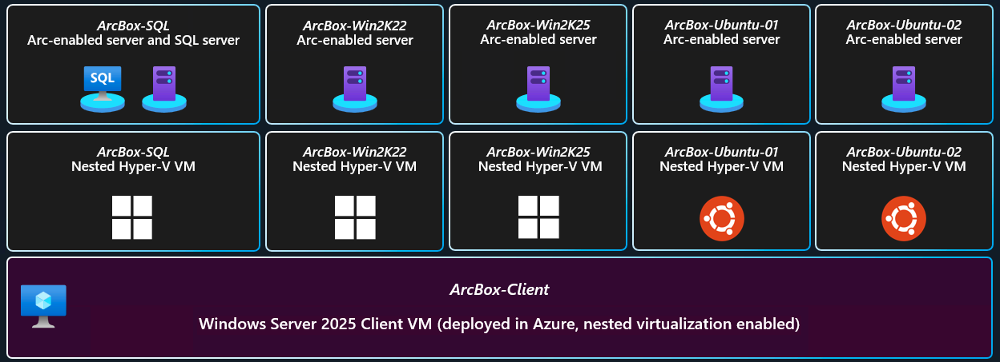
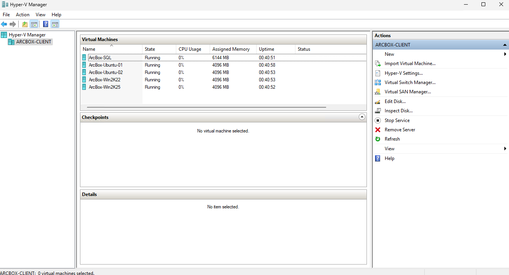

# Jumpstart ArcBox for IT Pros

## Overview

ArcBox for IT Pros is a special "flavor" of ArcBox that's intended for users who want to experience Azure Arc-enabled servers capabilities in a sandbox environment.


### Use cases

- Sandbox environment for getting hands-on with Azure Arc technologies
- Accelerator for Proof-of-concepts or pilots
- Training tool for Azure Arc skills development
- Demo environment for customer presentations or events
- Rapid integration testing platform
- Infrastructure-as-code and automation template library for building hybrid cloud management solutions

## Azure Arc capabilities available in ArcBox for IT Pros

### Azure Arc-enabled servers



ArcBox includes three Azure Arc-enabled server resources that are hosted using nested virtualization in Azure. As part of the deployment, a Hyper-V host (_ArcBox-Client_) is deployed with three guest virtual machines. These machines, _ArcBoxWin_, _ArcBoxUbuntu_, and _ArcBoxSQL_ are connected as Azure Arc-enabled servers via the ArcBox automation.

### Unified Operations

ArcBox deploys several management and operations services that work with ArcBox's Azure Arc resources. These resources include an Azure Log Analytics workspace, an Azure Monitor workbook, Azure Policy assignments for deploying Azure Monitor agents on Windows and Linux Azure Arc-enabled servers, Azure Policy assignment for adding tags to resources, and a storage account used for staging resources needed for the deployment automation.


## ArcBox Azure Consumption Costs

ArcBox resources generate Azure Consumption charges from the underlying Azure resources including core compute, storage, networking and auxiliary services. Note that Azure consumption costs vary depending the region where ArcBox is deployed. Be mindful of your ArcBox deployments and ensure that you disable or delete ArcBox resources when not in use to avoid unwanted charges. Please see the [Jumpstart FAQ](../../faq/) for more information on consumption costs.

## Deployment Options and Automation Flow

ArcBox provides multiple paths for deploying and configuring ArcBox resources. Deployment options include:

- Azure portal
- Bicep


ArcBox uses an advanced automation flow to deploy and configure all necessary resources with minimal user interaction. The previous diagrams provide an overview of the deployment flow. A high-level summary of the deployment is:

- User deploys the Bicep template (main.bicep). These objects contain several nested objects that will run simultaneously.
  - ClientVM ARM template/plan - deploys the Client Windows VM. This is the Hyper-V host VM where all user interactions with the environment are made from.
  - Storage account template/plan - used for staging files in automation scripts
  - Management artifacts template/plan - deploys Azure Log Analytics workspace and solutions and Azure Policy artifacts
- User remotes into Client Windows VM, which automatically kicks off multiple scripts that:
  - Deploy and configure five (5) nested virtual machines in Hyper-V
    - Windows Server 2022 VM - onboarded as Azure Arc-enabled server
    - Windows Server 2025 VM - onboarded as Azure Arc-enabled server
    - Windows VM running SQL Server - onboarded as Azure Arc-enabled SQL Server (as well as Azure Arc-enabled server)
    - 2 x Ubuntu VM - onboarded as Azure Arc-enabled servers
  - Deploy an Azure Monitor workbook that provides example reports and metrics for monitoring ArcBox components

## Prerequisites

- [Install or update Azure CLI to version 2.65.0 and above](https://learn.microsoft.com/cli/azure/install-azure-cli?view=azure-cli-latest). Use the below command to check your current installed version.

  ```shell
  az --version
  ```

- Login to Azure CLI using the _`az login`_ command.

- Ensure that you have selected the correct subscription you want to deploy ArcBox to by using the *`az account list --query "[?isDefault]"`* command. If you need to adjust the active subscription used by Azure CLI (`az`), follow [this guidance](https://learn.microsoft.com/cli/azure/manage-azure-subscriptions-azure-cli#change-the-active-subscription).

- ArcBox must be deployed to one of the following regions. **Deploying ArcBox outside of these regions may result in unexpected results or deployment errors.**

  - East US
  - East US 2
  - Central US
  - West US 2
  - North Europe
  - West Europe
  - France Central
  - UK South
  - Australia East
  - Japan East
  - Korea Central
  - Southeast Asia

- **ArcBox for IT Pros requires 8 DSv5-series vCPUs** when deploying with default parameters such as VM series/size. Ensure you have sufficient vCPU quota available in your Azure subscription and the region where you plan to deploy ArcBox. You can use the below `az` command to check your vCPU utilization.

  ```shell
  az vm list-usage --location <your location> --output table
  ```

  

- Register necessary Azure resource providers by running the following commands.

  ```shell
  az provider register --namespace Microsoft.HybridCompute --wait
  az provider register --namespace Microsoft.GuestConfiguration --wait
  az provider register --namespace Microsoft.AzureArcData --wait
  az provider register --namespace Microsoft.OperationsManagement --wait
  az provider register --namespace Microsoft.Insights--wait
  ```

## Deployment Option 1: Azure portal

- Click the <a href="https://portal.azure.com/#create/Microsoft.Template/uri/https%3A%2F%2Fraw.githubusercontent.com%2Fmicrosoft%2Fazure_arc%2Fmain%2Fazure_jumpstart_arcbox%2FARM%2Fazuredeploy.json" target="_blank"></a> button and enter values for the ARM template parameters.

  

  

  

    > **Note:** If you see any failure in the deployment, please check the [troubleshooting guide](#basic-troubleshooting).

## Deployment Option 2: Bicep deployment

- Clone the Azure Arc Jumpstart repository

  ```shell
  git clone https://github.com/microsoft/azure_arc.git
  ```

- Upgrade to latest Bicep version

  ```shell
  az bicep upgrade
  ```

- Edit the [main.bicepparam](https://github.com/microsoft/azure_arc/blob/main/azure_jumpstart_arcbox/bicep/main.bicepparam) template parameters file and supply values for your environment.
  - _`tenantId`_ - Your Azure tenant id.
  - _`windowsAdminUsername`_ - Client Windows VM Administrator username.
  - _`windowsAdminPassword`_ - Client Windows VM Password. Password must have 3 of the following: 1 lower case character, 1 upper case character, 1 number, and 1 special character. The value must be between 12 and 123 characters long.
  - _`logAnalyticsWorkspaceName`_ - Unique name for the ArcBox Log Analytics workspace.
  - _`flavor`_ - Use the value _"ITPro"_ to specify that you want to deploy ArcBox for IT Pros.
  - _`autoShutdownEnabled`_ - Optionally, you can set this to true if you want to configure the ArcBox Client VM to automatically shutdown to save costs.
  - _`autoShutdownTime`_ - If _autoShutdownEnabled_ is set to true, this value specifies what time of the day to shut down the VM. If not specified, the default value is 18.00.
  - _`autoShutdownTimezone`_ - If _autoShutdownEnabled_ is set to true, this value specifies what timezone will be used on conjunction with the value specified for _autoShutdownTime_ to shut down the VM. If not specified, the default value is _UTC_.
  - _`autoShutdownEmailRecipient`_ - If _autoShutdownEnabled_ is set to true, this value specifies what e-mail address to notify 30 minutes prior to the scheduled shutdown.
  - _`resourceTags`_ - Tags to assign for all ArcBox resources.
  - _`namingPrefix`_ - The naming prefix for the nested virtual machines and all Azure resources.deployed. The maximum length for the naming prefix is 7 characters,example if the value is _Contoso_: `Contoso-Win2k25`.
  - _`sqlServerEdition`_ - SQL Server edition to deploy on the Hyper-V guest VM. Supported values are Developer, Standard, and Enterprise. Default is Developer edition. Azure Arc-enabled SQL Server features such as performance metrics requires Standard or Enterprise edition. Use this parameter to experience SQL Server performance metrics enabled by Azure Arc.

  

- Now you will deploy the Bicep file. Navigate to the local cloned [deployment folder](https://github.com/microsoft/azure_arc/tree/main/azure_jumpstart_arcbox/bicep) and run the below commands:

### Bicep deployment option 1: Azure CLI

```shell
az login
az group create --name "<resource-group-name>" --location "<preferred-location>"
az deployment group create -g "<resource-group-name>" -f "main.bicep" -p "main.bicepparam"
```

### Bicep deployment option 2: Azure PowerShell

```powershell
Connect-AzAccount
$RGname = "<resource-group-name>"
$Location= "<preferred-location>"
New-AzResourceGroup -Name $RGname -Location $location
New-AzResourceGroupDeployment -Name arcbox -ResourceGroupName $RGname -TemplateFile "./main.bicep" -TemplateParameterFile "./main.bicepparam"
```

  > **Note:** If you see any failure in the deployment, please check the [troubleshooting guide](#basic-troubleshooting).

## Start post-deployment automation

Once your deployment is complete, you can open the Azure portal and see the ArcBox resources inside your resource group. You will be using the _ArcBox-Client_ Azure virtual machine to explore various capabilities of ArcBox such as SSH access to Arc-enabled Server and Azure Update Manager. You will need to remotely access _ArcBox-Client_.

  

   > **Note:** For enhanced ArcBox security posture, RDP (3389) port aren't open by default in ArcBox deployments. You will need to create a network security group (NSG) rule to allow network access to port 3389, or use [Azure Bastion](https://learn.microsoft.com/azure/bastion/bastion-overview) or [Just-in-Time (JIT)](https://learn.microsoft.com/azure/defender-for-cloud/just-in-time-access-usage?tabs=jit-config-asc%2Cjit-request-asc) access to connect to the VM.

### Connecting to the ArcBox Client virtual machine

Various options are available to connect to _ArcBox-Client_ VM, depending on the parameters you supplied during deployment.

- [RDP](#connecting-directly-with-rdp) - available after configuring access to port 3389 on the _ArcBox-NSG_, or by enabling [Just-in-Time access (JIT)](#connect-using-just-in-time-access-jit).
- [Azure Bastion](#connect-using-azure-bastion) - available if _`true`_ was the value of your _`deployBastion`_ parameter during deployment.

#### Connecting directly with RDP

By design, ArcBox doesn't open port 3389 on the network security group. Therefore, you must create an NSG rule to allow inbound 3389.

- Open the _ArcBox-NSG_ resource in Azure portal and click "Add" to add a new rule.

  

  

- Specify the IP address that you will be connecting from and select RDP as the service with "Allow" set as the action. You can retrieve your public IP address by accessing [https://icanhazip.com](https://icanhazip.com) or [https://whatismyip.com](https://whatismyip.com).

  

  

  

#### Connect using Azure Bastion

- If you have chosen to deploy Azure Bastion in your deployment, use it to connect to the VM.

  

  > **Note:** When using Azure Bastion, the desktop background image isn't visible. Therefore some screenshots in this guide may not exactly match your experience if you are connecting to _ArcBox-Client_ with Azure Bastion.

#### Connect using just-in-time access (JIT)

If you already have [Microsoft Defender for Cloud](https://learn.microsoft.com/azure/defender-for-cloud/just-in-time-access-usage?tabs=jit-config-asc%2Cjit-request-asc) enabled on your subscription and would like to use JIT to access the Client VM, use the following steps:

- In the Client VM configuration pane, enable just-in-time. This will enable the default settings.

  

  

  

#### The Logon scripts

- Once you log into the _ArcBox-Client_ VM, multiple automated scripts will open and start running. Unless you have overwritten the `vmAutologon` parameter in the parameters-file, the VM will automatically launch the logon scripts directly after the Azure-deployment has completed without waiting for a user to manually logon. These scripts usually take 10-20 minutes to finish, and once completed, the script windows will close automatically.

  

- Deployment is complete! Let's begin exploring the features of Azure Arc-enabled servers with ArcBox for IT Pros!

  

Before you move on, make sure to verify that the deployment status shown on the desktop background doesn't indicate any failures. If so, inspect the log files in the ArcBox logs-directory by navigating to the desktop shortcut *Logs*. For more information about troubleshooting, please check the [troubleshooting guide](#basic-troubleshooting)

  

## Using ArcBox for IT Pros

After deployment is complete, its time to start exploring ArcBox. Most interactions with ArcBox will take place either from Azure itself (Azure portal, CLI or similar) or from inside the _ArcBox-Client_ virtual machine. Once established a remote connection into the client VM, here are some things to try:

- Open the Hyper-V Manager to access the ArcBox nested virtual machines, that are onboarded as Azure Arc-enabled servers.
&nbsp;

  Windows virtual machine credentials:

  ```text
  Username: Administrator
  Password: JS123!!
  ```

  Ubuntu virtual machine credentials:

  ```text
  Username: jumpstart
  Password: JS123!!
  ```

  

## SSH access to Azure Arc-enabled servers

[SSH for Arc-enabled servers](https://learn.microsoft.com/azure/azure-arc/servers/ssh-arc-overview) enables SSH based connections to Arc-enabled servers without requiring a public IP address or additional open ports. This functionality can be used interactively, automated, or with existing SSH based tooling, allowing existing management tools to have a greater impact on Azure Arc-enabled servers.

You can use Azure CLI or Azure PowerShell to connect to one of the Azure Arc-enabled servers using SSH. Open a PowerShell session and use the below commands.

1. From the _ArcBox-Client_ VM, open a PowerShell session in Windows Terminal and use the below commands to connect to **ArcBox-Ubuntu-01** using SSH:

### Azure CLI

```shell
$serverName = "ArcBox-Ubuntu-01"
$localUser = "jumpstart"

az ssh arc --resource-group $Env:resourceGroup --name $serverName --local-user $localUser
```

 

> **Note:** You aren't prompted for a password since ArcBox includes an SSH key-pair installed on ArcBox client VM and the hybrid Linux VMs.

or

### Azure PowerShell

```powershell
$serverName = "ArcBox-Ubuntu-01"
$localUser = "jumpstart"
Enter-AzVM -ResourceGroupName $Env:resourceGroup -Name $serverName -LocalUser $localUser
```


- Following the previous method, you can also use Azure CLI to connect to one of the Azure Arc-enabled servers, Hyper-V Windows Server virtual machines via SSH.

  ```powershell
  az login --identity
  
  $serverName = "ArcBox-Win2K25"
  $localUser = "Administrator"
  
  az ssh arc --resource-group $Env:resourceGroup --name $serverName --local-user $localUser
  ```

Following the previous method, connect to _ArcBox-Win2K22_ via SSH.

### Azure CLI

```shell
$serverName = "ArcBox-Win2K25"
$localUser = "Administrator"
az ssh arc --resource-group $Env:resourceGroup --name $serverName --local-user $localUser
```

or

### Azure PowerShell

```powershell
$serverName = "ArcBox-Win2K25"
$localUser = "Administrator"
Enter-AzVM -ResourceGroupName $Env:resourceGroup -Name $serverName -LocalUser $localUser
```

  

  

In addition to SSH, you can also connect to the Azure Arc-enabled servers, Windows Server virtual machines using **Remote Desktop** tunneled via SSH.

### Azure CLI

```shell
$serverName = "ArcBox-Win2K25"
$localUser = "Administrator"
az ssh arc --resource-group $Env:resourceGroup --name $serverName --local-user $localUser --rdp
```

or

### Azure PowerShell

```powershell
$serverName = "ArcBox-Win2K25"
$localUser = "Administrator"
Enter-AzVM -ResourceGroupName $Env:resourceGroup -Name $serverName -LocalUser $localUser -Rdp
```

  

### Microsoft Entra ID based SSH Login

1. The _Entra ID based SSH Login - Azure Arc VM extension_ can be added from the extensions menu of the Arc server in the Azure portal. The Azure AD login extension can also be installed locally via a package manager via `apt-get install aadsshlogin` or the following command:

  ```shell
  $serverName = "ArcBox-Ubuntu-01"
  az connectedmachine extension create --machine-name $serverName --resource-group $Env:resourceGroup --publisher Microsoft.Azure.ActiveDirectory --name AADSSHLogin --type AADSSHLoginForLinux --location $env:azureLocation
  ```

2. Configure role assignments for the Arc-enabled server _ArcBox-Ubuntu-01_ using the Azure portal. Two Azure roles are used to authorize VM login:
    - **Virtual Machine Administrator Login**: Users who have this role assigned can log in to an Azure virtual machine with administrator privileges.
    - **Virtual Machine User Login**: Users who have this role assigned can log in to an Azure virtual machine with regular user privileges.

3. After assigning one of the two roles for your personal Entra ID user account, run the following command to connect to _ArcBox-Ubuntu-01_ using SSH and AAD/Entra ID-based authentication:

### Azure CLI

```shell
# Log out from the Service Principal context
az logout

# Log in using your personal account
az login

$serverName = "ArcBox-Ubuntu-01"

az ssh arc --resource-group $Env:resourceGroup --name $serverName
```

or

### Azure PowerShell

```powershell
# Log out from the Service Principal context
Disconnect-AzAccount

# Log in using your personal account
Connect-AzAccount
$serverName = "ArcBox-Ubuntu-01"

Enter-AzVM -ResourceGroupName $Env:resourceGroup -Name $serverName
```

### Remote PowerShell to Azure Arc-enabled servers

[Remote PowerShell over SSH](https://learn.microsoft.com/powershell/scripting/security/remoting/ssh-remoting-in-powershell) is available for Windows and Linux machines.

[SSH for Arc-enabled servers](https://learn.microsoft.com/azure/azure-arc/servers/ssh-arc-powershell-remoting) enables SSH based PowerShell remote connections to Arc-enabled servers without requiring a public IP address or additional open ports.

You can use Azure CLI or Azure PowerShell to generate an SSH proxy configuration file to one of the Azure Arc-enabled servers.

1. From the _ArcBox-Client_ VM, open a PowerShell session in Windows Terminal and use the below commands to connect to **ArcBox-Ubuntu-01** using SSH:

### Azure CLI

```shell
$serverName = "ArcBox-Ubuntu-01"
$localUser = "jumpstart"
$configFile = "C:\ArcBox\$serverName"

az extension add --name ssh

az ssh config --resource-group $Env:resourceGroup --name $serverName  --local-user $localUser --resource-type Microsoft.HybridCompute --file "C:\ArcBox\$serverName"
```

Expected output:


or

### Azure PowerShell

```powershell
Install-Module -Name Az.Ssh -Scope CurrentUser -Repository PSGallery
Install-Module -Name Az.Ssh.ArcProxy -Scope CurrentUser -Repository PSGallery

$serverName = "ArcBox-Ubuntu-01"
$localUser = "jumpstart"
$configFile = "C:\ArcBox\$serverName"

Export-AzSshConfig -ResourceGroupName $Env:resourceGroup -Name $serverName -LocalUser $localUser -ResourceType Microsoft.HybridCompute/machines -ConfigFilePath "C:\ArcBox\$serverName"
```

Expected output:


2. Next, we need to extract the values for the SSH proxy command:

  ```powershell
  # Use a regex pattern to find the ProxyCommand line and extract its value
  $proxyCommandPattern = 'ProxyCommand\s+"([^"]+)"\s+-r\s+"([^"]+)"'
  $match = Select-String -Path $configFile -Pattern $proxyCommandPattern

  $proxyCommandValue1 = [regex]::Match($match.Line, $proxyCommandPattern).Groups[1].Value
  $proxyCommandValue2 = [regex]::Match($match.Line, $proxyCommandPattern).Groups[2].Value
  $fullProxyCommandValue = "`"$proxyCommandValue1 -r $proxyCommandValue2`""

  $options = @{ ProxyCommand = $fullProxyCommandValue }
  ```

3. Lastly, we can leverage native remote PowerShell constructs to interact with the remote machine:

  ```powershell
  # Create PowerShell Remoting session
  New-PSSession -HostName $serverName -UserName $localUser -Options $options -OutVariable session
  
  # Run a command
  Invoke-Command -Session $session -ScriptBlock {Write-Output "Hello $(whoami) from $(hostname)"}
  
  # Enter an interactive session
  Enter-PSSession -Session $session[0]
  
  # Disconnect
  exit
  
  # Clean-up
  $session | Remove-PSSession
  ```

  Expected output:
  
  

### ArcBox Azure Monitor workbooks

Two Azure Monitor workbooks are included in ArcBox for IT Pro.

One contains inventory information:


The other contains performance data:


Open the [ArcBox Azure Monitor workbook documentation](/azure_jumpstart_arcbox/workbook/flavors/ITPro/) to get more information and explore the included visualizations and reports of hybrid cloud resources.

### Azure Update Manager

Azure Update Manager is a unified service to help manage and govern updates for all your machines. You can monitor Windows and Linux update compliance across your deployments in Azure, on-premises, and on the other cloud platforms from a single dashboard. Using Azure Update Manager, you can make updates in real-time or schedule them within a defined maintenance window.

As part of the ArcBox deployment, Periodic Assessment is configured.

Periodic Assessment is a setting on your machine that enables you to see the latest updates available for your machines and removes the hassle of performing assessment manually every time you need to check the update status. Once you enable this setting, Azure Update Manager fetches updates on your machine once every 24 hours.

As part of the deployment, one on-demand assessment triggered.

This means any available updates can be viewed immediately after a successful deployment when navigating to the Updates-blade for the hybrid machines.

Example from a Linux machine:

  

Example from a Windows machine:

  

### SSH Posture Control

[SSH Posture Control](https://learn.microsoft.com/azure/osconfig/overview-ssh-posture-control-mc) enables you to audit and configure SSH Server security posture on supported Linux distributions including Ubuntu, Red Hat, Azure Linux, and more.

In ArcBox, an Azure policy assignment is included for an SSH Posture Control policy in audit-only mode.

To inspect the compliance status of the assigned policy, perform the following:

1. Navigate to the resource group you have deployed ArcBox to and select on of the Arc-enabled Linux machines. For this example, we're using _Arcbox-Ubuntu-01_:

    

2. Navigate to _Machine Configuration_ in the menu on the left side:

   

3. Click on the configuration name starting with _LinuxSshServerSecurityBaseline*_:

    

4. Click on the highlighted dropdown menu and select the checkbox _Compliant_. Now you should see all settings included in the SSH Posture Control policy:

    

5. The compliance information is also available via Azure Resource Graph for reporting at scale across multiple machines. Navigate to "Azure Resource Graph Explorer" in the Azure portal:

    

6. Paste the following query into the query window and click _Run query_:

   ```kql
   // SSH machine counts by compliance status
   guestconfigurationresources
   | where name contains "LinuxSshServerSecurityBaseline"
   | extend complianceStatus = tostring(properties.complianceStatus)
   | summarize machineCount = count() by complianceStatus
   ```

    

7. Paste the following query into the query window and click _Run query_:

   ```kql
   // SSH rule level detail
   GuestConfigurationResources
   | where name contains "LinuxSshServerSecurityBaseline"
   | project report = properties.latestAssignmentReport,
    machine = split(properties.targetResourceId,'/')[-1],
    lastComplianceStatusChecked=properties.lastComplianceStatusChecked
   | mv-expand report.resources
   | project machine,
   rule = report_resources.resourceId,
   ruleComplianceStatus = report_resources.complianceStatus,
   ruleComplianceReason = report_resources.reasons[0].phrase,
   lastComplianceStatusChecked
   ```

    

To learn more about how to configure the settings in audit-and-configure mode, check out the [documentation](https://learn.microsoft.com/azure/osconfig/overview-ssh-posture-control-mc).

If you are interested to learn how to create your own configurations for Machine Configuration, check out the following related Jumpstart scenarios:

- [Create Automanage Machine Configuration custom configurations for Linux](https://azurearcjumpstart.io/azure_arc_jumpstart/azure_arc_servers/day2/arc_automanage/arc_automanage_machine_configuration_custom_linux).
- [Create Automanage Machine Configuration custom configurations for Windows](https://azurearcjumpstart.io/azure_arc_jumpstart/azure_arc_servers/day2/arc_automanage/arc_automanage_machine_configuration_custom_windows).

### Arc-enabled SQL Server - Best practices assessment

As part of the ArcBox deployment, SQL Server best practices assessment is configured and run. Open _ArcBox-SQL_ Arc-enabled SQL Server resource from the resource group deployed or Azure Arc service blade to view SQL Server best practice assessment results.

- The following screenshot shows the SQL Server best practices assessment page and the scheduled and previously ran assessments. If this page doesn't show assessment results click on the Refresh button to show assessments. Once displayed the assessments and results click on _View assessment_ results to see results.

  

  

  

### SQL Server migration assessment

Once you connect SQL Server running in on-premises or other cloud environment it's ready to support  running migration assessment to review migration readiness to Microsoft Azure cloud. Arc-enabled [SQL Server migration assessment](https://learn.microsoft.com/sql/sql-server/azure-arc/migration-assessment?view=sql-server-ver16) greatly simplifies migration assessment by eliminating any additional infrastructure to run SQL Server discovery and assessment tools.

As part of the ArcBox ITPro deployment on-demand SQL Server migration assessment is ran show case the SQL Server migration readiness, which includes server level and database level compatibilities to migrate to different target SQL Servers such as Azure SQL Server, SQL Server Managed Instance, and SQL Server on Azure VMs.

Follow the steps below to review migration readiness of the ArcBox-SQL server running on the ArcBox-Client as a guest VM.

- Navigate to the resource group overview page in Azure Portal.

- Locate ArcBox-SQL Arc-enabled SQL Server resources and open resource details view.

  

- Click on Migration in left navigation.

  

- Review migration readiness of the SQL server. For detailed information on readiness review refer product documentation [here](https://learn.microsoft.com/sql/sql-server/azure-arc/migration-assessment?view=sql-server-ver16#review-readiness).

  

- Review migration readiness to migrate to Azure SQL Managed Instance.

  

- Review migration readiness to migrate to SQL Server on Virtual Machines.

  

### Microsoft Defender for Cloud - SQL server on machines

This section guides you through different settings for enabling Microsoft Defender for Cloud - SQL servers on machines. Follow the steps below to use Defender for Cloud for SQL server on machines.

- Open Microsoft Defender for Cloud, go to environments settings, select subscription where the ArcBox is deployed.

  

- Select options shown below and specify email address to receive notifications and save changes.

  

- Locate _ArcBox-SQL_ Arc-enabled SQL Server resource in the resource group deployed.

- Click on the Microsoft Defender for Cloud in the left navigation and review the current status of the Microsoft Defender for SQL server on machines.

  

- Click on _Enable_ button shown in the image above to enable Defender for Cloud on the Arc-enabled SQL Server.

> **Note:** Status might differ depending on if the Microsoft Defender for SQL server on machines is already enabled at subscription level.

- The below screenshot shows the test script used to generate SQL threats, detect, and alert using Defender for Cloud for SQL servers. This script is copied on the nested _ArcBox-SQL_ Hyper-V virtual machine and can be used to run additional tests to generate security incidents and alerts.

  

- Logon to the _ArcBox-SQL_ Hyper-V virtual machine, open PowerShell window, and change the directory to _C:\ArcBox\agentScript_ folder and run _testDefenderForSQL.ps1_.

- Run the PowerShell script to generate Defender for SQL incidents and alerts.

  

- The below screenshot shows the SQL threats detected by Microsoft Defender for Cloud.

  

- Microsoft Defender for Cloud generates an email and sends it to the registered email for alerts. The below screenshot shows an email alert sent by Defender for Cloud when a SQL threat is detected. By default, this email is sent to the registered contact email at the subscription level.
  
  

### Arc-enabled SQL Server - least privilege access

As part of least privilege security best practice principle, [Arc-enabled SQL server supports running agent extension under least privilege access](https://learn.microsoft.com/sql/sql-server/azure-arc/configure-least-privilege?view=sql-server-ver16). By default SQL server agent extension runs under Local System account. After enabling the least privilege access, agent extension runs under _NT Service\SQLServerExtension_. Refer [permissions required and assigned to _NT Service\SQLServerExtension_ service account](https://learn.microsoft.com/sql/sql-server/azure-arc/configure-windows-accounts-agent?view=sql-server-ver16) for more details.

- Screenshot below shows Arc-enabled SQL server extension service running under _NT Service\SQLServerExtension_ service account.


- To view the status of Arc-enabled SQL server agent extension service, logon to the _ArcBox-SQL_ Hyper-V virtual machine, open Windows services from Control Panel -> System and Security -> Administrative Tools.


### Arc-enabled SQL Server - automated backups and restore

#### Automated backups

[Arc-enabled SQL Server supports automated backups](https://learn.microsoft.com/sql/sql-server/azure-arc/backup-local?view=sql-server-ver16&tabs=azure) to recover data during the disaster recovery process or when customers would like to go back to certain restore point. ArcBox deployment is now enabled to perform scheduled backups at instance level to take full database backup every 7 days,  differential backup every 12 hours, and log backup every 5 minutes to support lowest RPO. These schedules are customizable, refer documentation [here](https://learn.microsoft.com/sql/sql-server/azure-arc/backup-local?view=sql-server-ver16&tabs=azure#backup-frequency-and-retention-days) for more details. These backups can be configured at database server instance level or individual database level based on the recovery needs.

- Screenshot below shows automated backup schedule configured in ArcBox-SQL Arc-enabled SQL Server at the instance level.


- Screenshot below shows automated backup schedule inherited from the instance level backup policy.


#### Restore database

Once the SQL Server backups are enabled and have the backups available to restore from certain restore points, customers can restore database to a new database from the specific restore point that would like to restore data from.

- Screenshot below shows earliest available restore points to restore database from. Click on the _Restore_ link restore _AdventurWorksLT2022_ database from one of the restore point.


- Screenshot below shows available restore points for _AdventurWorksLT2022_ database. To restore this database 1) Select available restore point, 2) Specify new database name, and 3) Click on Create to restore database to the desired restore points.


- Review final details and click Review + Create to start restoring the database.


- Once the database restore request is submitted, review restore status in the Azure Portal as shown in the screenshot below. Notice new database is created on the _ArcBox-SQL_ database server.


- You can also verify restored database on the ArcBox-SQL guest VM as shown in the screenshot below.


### Monitor SQL Server enabled by Azure Arc

Arc-enabled SQL Server now supports [monitoring using the performance dashboards](https://learn.microsoft.com/sql/sql-server/azure-arc/sql-monitoring?view=sql-server-ver16) in Azure Portal. Performance dashboard feature is supported only on SQL Server Standard and Enterprise editions. ArcBox deployment now supports deploying SQL Server Standard and Enterprise editions. Choose the correct edition based on the requirement to experience performance dashboards. Refer deployment parameters documented in this document to select desired SQL Server edition using the parameter _sqlServerEdition_.

- To view performance dashboards in Arc-enabled SQL Server, go to the resource group deployed in the Azure Portal, locate ArcBox-SQL Arc-enabled SQL server and open resource details.

- Click on _Performance Dashboard_ under Monitoring section as shown below to view performance dashboard.


- Screenshot below shows SQL Server performance dashboard enabled by Azure Arc.


### Included tools

The following tools are including on the _ArcBox-Client_ VM.

- Azure CLI
- Azure PowerShell
- Git
- PowerShell 7
- Visual Studio Code
- Windows Terminal
- WinGet

### Windows Server Management Enabled by Azure Arc

There are a host of other features enabled by [Azure Arc for Windows Server management](https://learn.microsoft.com/azure/azure-arc/servers/windows-server-management-overview?tabs=portal) such as Azure Site Recovery Configuration, Best Practices Assessment, and Windows Admin Center in Azure for Arc.  Some of these capabilities are specific to Windows Server 2025 and require the use of either Software Assurance or a pay-as-you-go (PAYG) license.  To use these features, first activate a license on _ArcBox-Win2K25_.


If you have Software Assurance, click on the Activate Benefits and attest to having active Software Assurance.


In the license section of _ArcBox-Win2K25_ in the Azure Portal, the machine will now show as licensed.


Once the license is active, enable the features of interest from the Azure Portal.

### Next steps

ArcBox is a sandbox that can be used for a large variety of use cases, such as an environment for testing and training or a kickstarter for proof of concept projects. Ultimately, you are free to do whatever you wish with ArcBox. Some suggested next steps for you to try in your ArcBox are:

- Build policy initiatives that apply to your Azure Arc-enabled resources
- Write and test custom policies that apply to your Azure Arc-enabled resources
- Incorporate your own tooling and automation into the existing automation framework
- Build a certificate/secret/key management strategy with your Azure Arc resources

Do you have an interesting use case to share? [Submit an issue](https://aka.ms/JumpstartIssue) on GitHub with your idea and we will consider it for future releases!

## Clean up the deployment

To clean up your deployment, simply delete the resource group using Azure CLI or Azure portal.

```shell
az group delete -n <name of your resource group>
```


## Basic troubleshooting

Occasionally deployments of ArcBox may fail at various stages. Common reasons for failed deployments include:

- Not enough vCPU quota available in your target Azure region - check vCPU quota and ensure you have at least 16 available. See the [prerequisites](#prerequisites) section for more details.
- The selected Azure region doesn't support all the necessary services. Ensure you are deploying ArcBox in one of the supported regions listed in the "ArcBox Azure Region Compatibility" section above.
- "BadRequest" error message when deploying - this error returns occasionally when the Log Analytics solutions in the ARM templates are deployed. Typically, waiting a few minutes and re-running the same deployment resolves the issue. Alternatively, you can try deploying to a different Azure region.

  

  

### Exploring logs from the _ArcBox-Client_ virtual machine

Occasionally, you may need to review log output from scripts that run on the _ArcBox-Client_ virtual machine in case of deployment failures. To make troubleshooting easier, the ArcBox deployment scripts collect all relevant logs in the _C:\ArcBox\Logs_ folder on _ArcBox-Client_. A short description of the logs and their purpose can be seen in the list below:

| Log file | Description |
| ------- | ----------- |
| _C:\ArcBox\Logs\Bootstrap.log_ | Output from the initial bootstrapping script that runs on _ArcBox-Client_. |
| _C:\ArcBox\Logs\ArcServersLogonScript.log_ | Output of ArcServersLogonScript.ps1 which configures the Hyper-V host and guests and onboards the guests as Azure Arc-enabled servers. |
| _C:\ArcBox\Logs\MonitorWorkbookLogonScript.log_ | Output from MonitorWorkbookLogonScript.ps1 which deploys the Azure Monitor workbook. |
| _C:\ArcBox\Logs\WinGet-provisioning-*.log_ | Output from WinGet.ps1 which installs WinGet and applies WinGet Configuration. |

  

If you are still having issues deploying ArcBox, please [submit an issue](https://aka.ms/JumpstartIssue) on GitHub and include a detailed description of your issue, the Azure region you are deploying to, and the flavor of ArcBox you are trying to deploy. Inside the _C:\ArcBox\Logs_ folder you can also find instructions for uploading your logs to an Azure storage account for review by the Jumpstart team.
