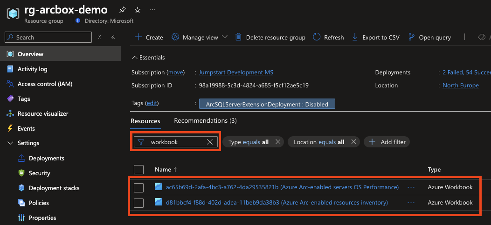
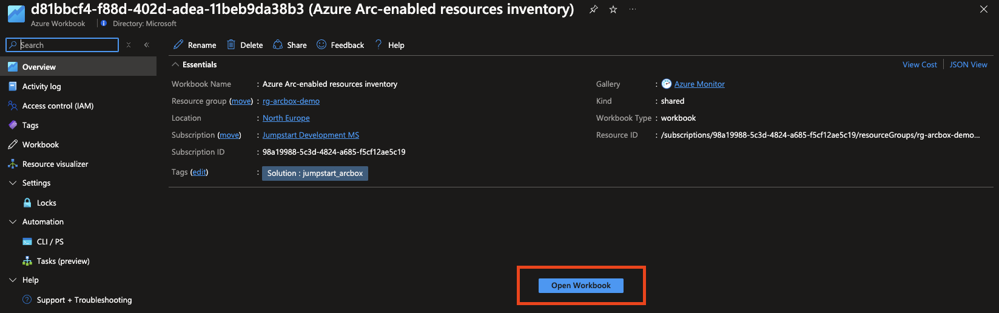
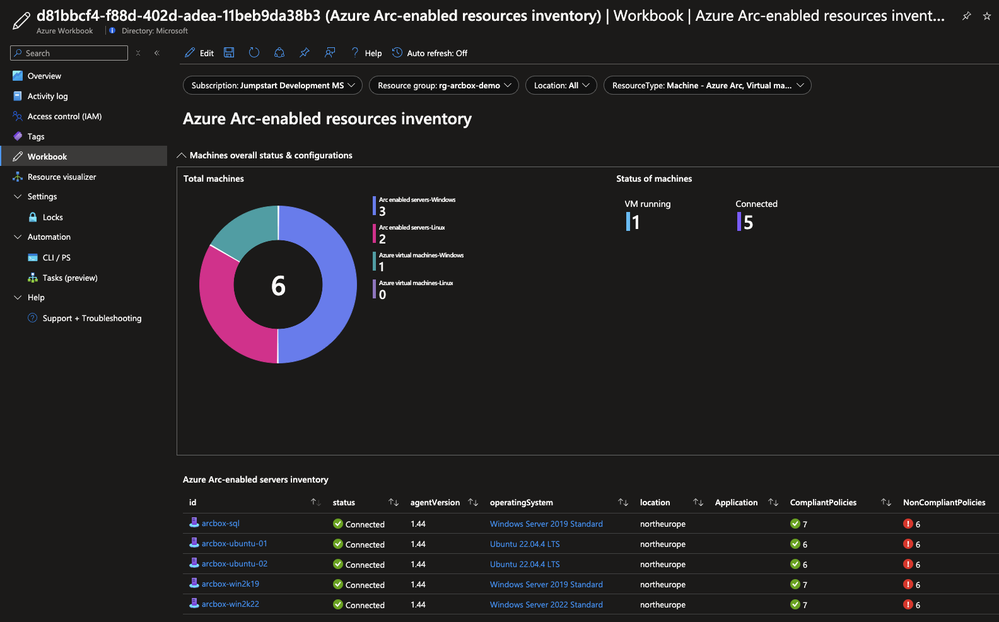
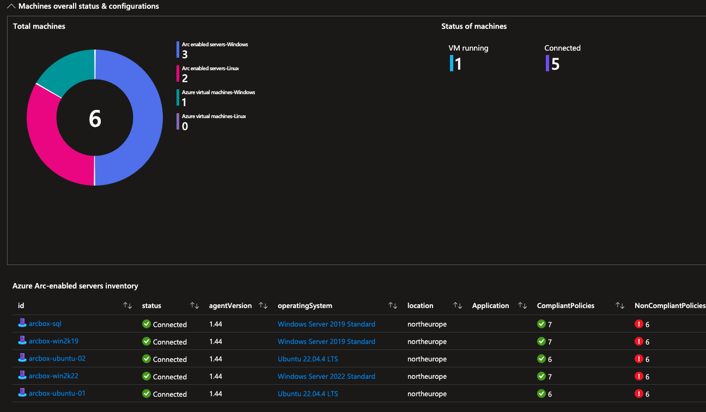
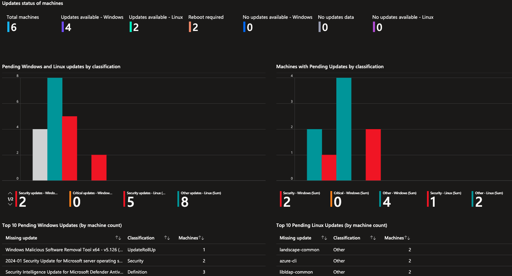
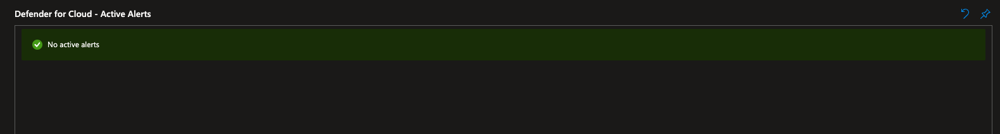
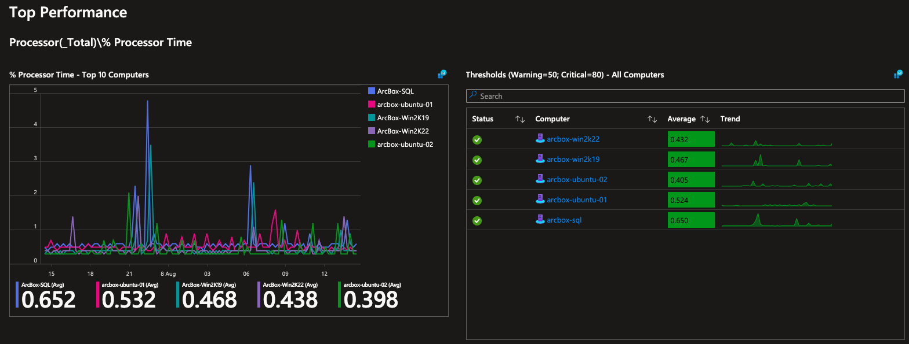
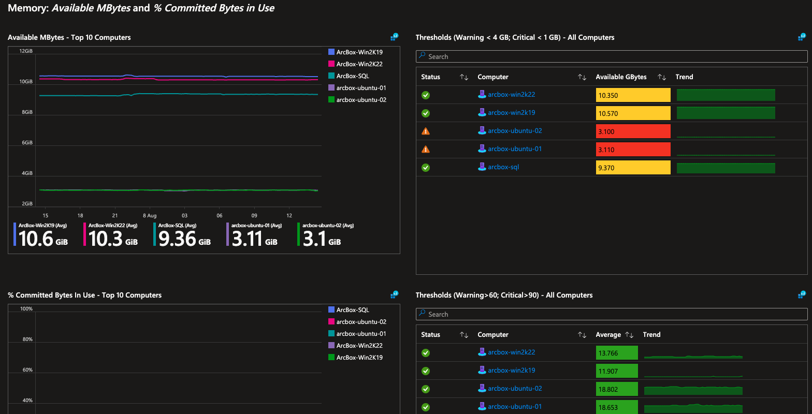
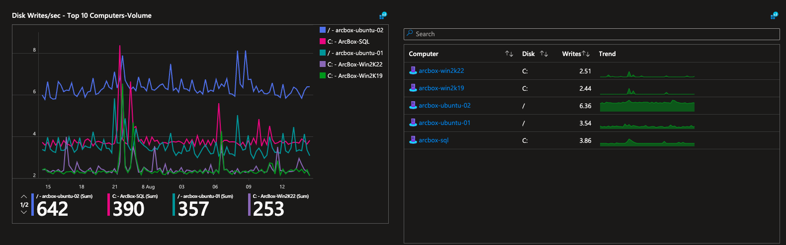

# Jumpstart ArcBox for IT Pros - Azure Monitor Workbooks

ArcBox for IT Pros is a special "flavor" of ArcBox that is intended for users who want to experience Azure Arc-enabled servers capabilities in a sandbox environment. This document provides specific guidance on the included ArcBox [Azure Monitor Workbook](https://learn.microsoft.com/azure/azure-monitor/visualize/workbooks-overview). Please refer to the main [ArcBox documentation](/azure_jumpstart_arcbox/) for information on deploying and using ArcBox.

As part of ArcBox for IT Pros, two Azure Monitor workbooks is deployed to provide a single pane of glass for monitoring and reporting on ArcBox resources. Using Azure's management and operations tools in hybrid, multi-cloud and edge deployments provides the consistency needed to manage each environment through a common set of governance and operations management practices. The Azure Monitor workbooks acts as a flexible canvas for data analysis and visualization in the Azure portal, gathering information from several data sources from across ArcBox and combining them into an integrated interactive experience.

   > **Note:** Due to the number of Azure resources included in a single ArcBox deployment and the data ingestion and analysis required, it is expected that metrics and telemetry for the workbook can take several hours to be fully available.

## Access the ArcBox for IT Pros workbooks

The Jumpstart ArcBox workbook is automatically deployed for you as part of ArcBox's advanced automation. To access the Jumpstart ArcBox workbook use the Azure portal to follow the next steps.

- From the ArcBox resource group, select the Azure Workbook, then click "Open Workbook"

   

Click on the workbook you want to open and select _Open Workbook_:

   

- The selected Jumpstart ArcBox for IT Pros Workbook will be displayed.

**Inventory workbook**

**Performance workbook**

## ArcBox for IT Pros Workbook capabilities

The ArcBox for IT Pros Workbooks combines data from different sources and services, providing a unified view across resources, enabling richer data and insights for unified operations.

### Inventory

By using Azure Arc, your on-premises and multi-cloud resources become visible through Azure Resource Manager. Therefore, you can use tools such as Azure Resource Graph as a way to explore your inventory at scale. Your Azure Resource Graph queries can now include Azure Arc-enabled resources with filtering, using tags, or tracking changes.

The "Inventory" tab in the ArcBox for IT Pros Workbook has three sections:

Overall status and policy compliance:

   

Update status:

   

Active alerts in Defender for Cloud:

   

### Monitoring

Enabling a resource in Azure Arc gives you the ability to perform configuration management and monitoring tasks on those services as if they were first-class citizens in Azure. You are able to monitor your connected machine guest operating system performance at the scope of the resource with VM insights. In ArcBox for IT Pros the Azure Arc-enabled servers have been onboarded onto Azure Monitor.

The _Azure Arc-enabled servers OS Performance_ Workbook shows metrics and alerts for ArcBox for IT Pros resources organized in three sections:

- _Operating System - Performance and capacity_ - Shows metrics for CPU and memory usage on the Azure Arc-enabled servers.

**CPU metrics**

   

**Memory metrics**

   

**Disk metrics**

   
