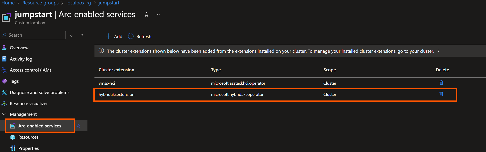
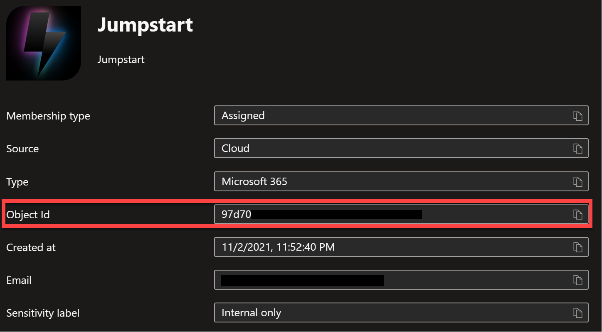
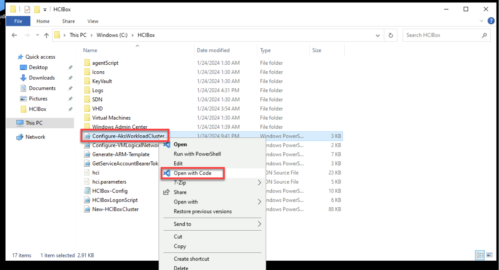
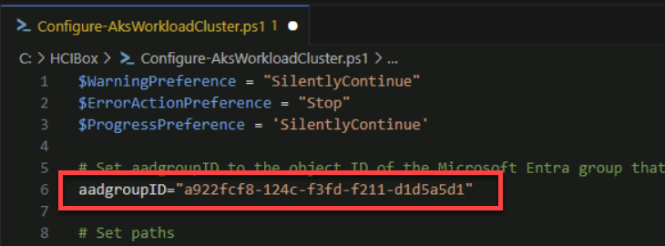
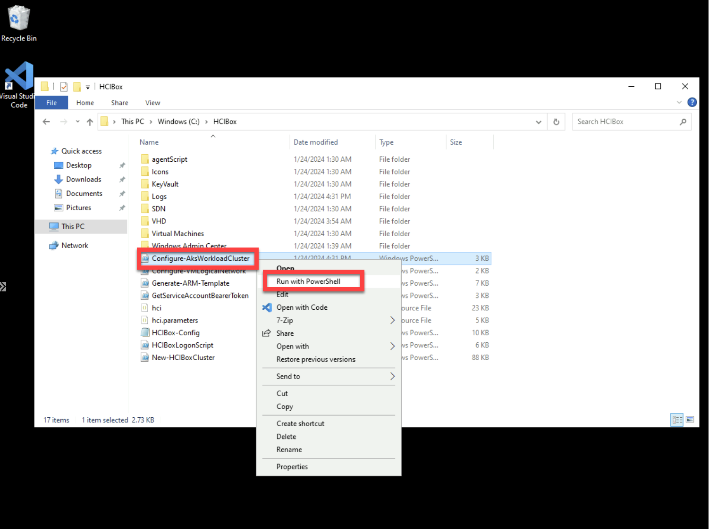
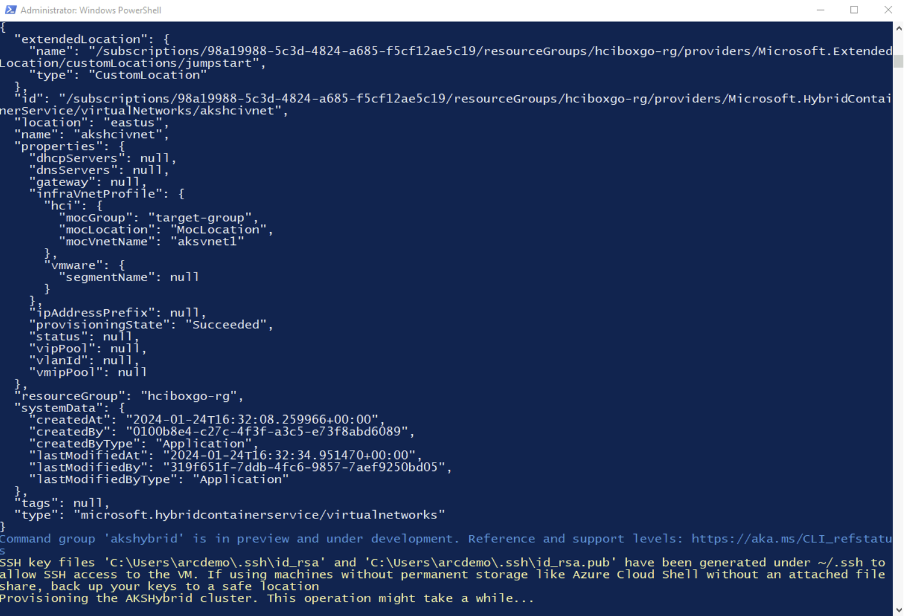
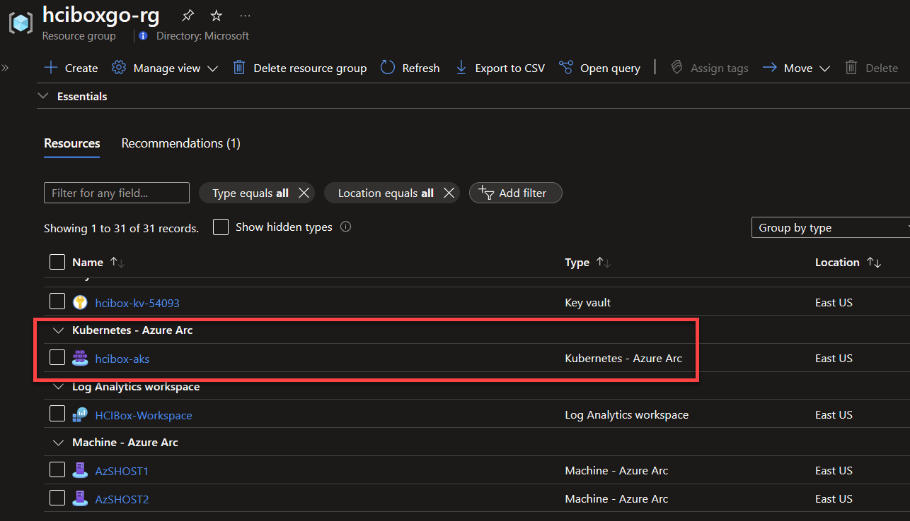
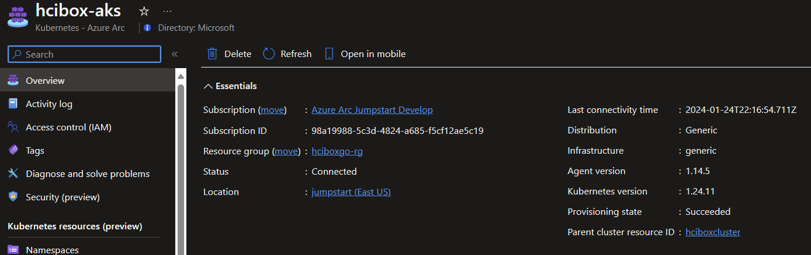
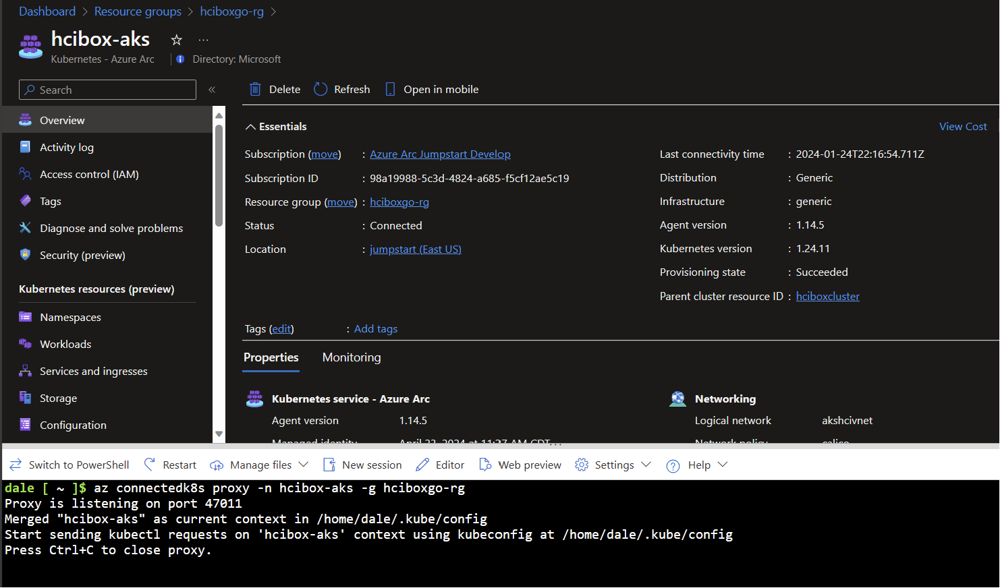

# Azure Kubernetes Service on your Azure Local HCIBox

Azure Local can provide host infrastructure for [Azure Kubernetes Service clusters](https://learn.microsoft.com/azure-stack/aks-hci/). HCIBox comes pre-configured with Azure Kubernetes Service on Azure Local. To see this in action, navigate to the resource group where you deployed HCIBox and follow these steps.

## Explore AKS on Azure Local

HCIBox is preconfigured with a network subnet dedicated to AKS deployment. Subnet details are as follows:

  | Network details |                  |
  | ---------- | --------------------- |
  | Subnet     | 10.10.0.0/24          |
  | Gateway    | 10.10.0.1             |
  | VLAN Id    | 110                   |
  | DNS Server | 192.168.1.254         |

Before creating an AKS workload cluster, you must create a local virtual network object. HCIBox includes a script that will complete this task using the pre-configured network. The script will then create a new AKS workload cluster.

- Open your HCIBox resource group and click on the _jumpstart_ custom location resource, then click "Arc-enabled services." Here you should see the hybridaksextension service available on the cluster. This is installed by default on Azure Local instance(s), and is required for creating AKS workload clusters on Azure Local.

  

Access to the AKS cluster is [managed through Azure RBAC](https://learn.microsoft.com/azure/aks/hybrid/aks-create-clusters-cli#before-you-begin). Create a new Microsoft Entra group or use an existing one where you are a member for this exercise.

- [Create a Microsoft Entra group](https://learn.microsoft.com/entra/fundamentals/how-to-manage-groups) or use an existing one.

- Retrieve the object id of the Microsoft Entra group and copy it down for use in the next step.

  

- From the _HCIBox-Client_ virtual machine, open File Explorer and navigate to the _C:\HCIBox_ folder. Right-click on "Configure-AksWorkloadCluster.ps1" and then select Open with Code

  

- Uncomment line 6 in the script and edit the placeholder value for the _$aadgroupID_ parameter with the object ID of your Microsoft Entra group. Save the script and close VSCode when finished.

  

- From the _HCIBox-Client_ virtual machine, open File Explorer and navigate to the "C:\HCIBox" folder. Right-click on "Configure-AksWorkloadCluster.ps1" and then select "Run with PowerShell."

  

- Let the script run its course. It will close automatically when complete.

  

- Once complete, you should have an AKS workload cluster called _hcibox-aks_ in your HCIBox resource group.

  

- Click on the AKS cluster to view details such as Kubernetes version. "Status" may show connecting for some time while the cluster fully connects to Azure.

  

> [!IMPORTANT]
> Before running the following command, make sure to update the `connectedk8s` extension by running:
> ```
> az extension update --name connectedk8s
> ```


- From Azure portal, open Cloud Shell and run the following command, using the name of your HCIBox resource group.

  ```
  az connectedk8s proxy -n hcibox-aks -g <name of your resource group>
  ```

  

- From Cloud Shell, click "New Session" and then in the new shell you will have kubectl access to your cluster. Try running some kubectl commands for yourself.

  

## Next steps

Azure Kubernetes Service on Azure Local provides many more capabilities not directly covered here. Review the documentation to continue your journey with [AKS on Azure Local](https://learn.microsoft.com/azure-stack/aks-hci/).
