# Virtual machine provisioning with Azure Arc in your HCIBox

Azure Local supports [VM provisioning the Azure portal](https://learn.microsoft.com/azure-stack/hci/manage/manage-arc-virtual-machines). Like all Azure Local instances, the HCIBox instance comes preconfigured with the components needed for VM management through Azure portal. Follow this guide to configure a basic VM from a marketplace image.

## Create Virtual Machine images from Azure marketplace

Before you can create virtual machines on your Azure Local instance from Azure portal, you must create some VM images that can be used as a base. These images can be imported from Azure marketplace or provided directly by the user. In this use case, you will create an image from Azure marketplace.

- Navigate to your instance resource inside the HCIBox resource group and click it.

  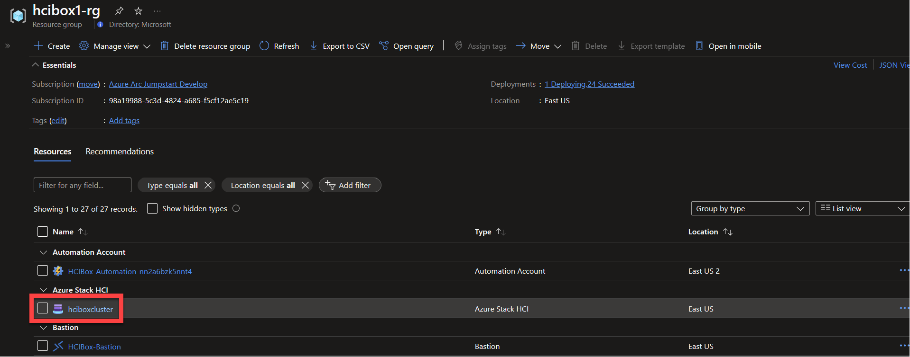

- Click on "VM Images" in the menu and then click the "Add VM image" dropdown and select "From Azure Marketplace."

  

- Select an image from the list of images. Give your VM image a name, select the default custom location from the dropdown, and leave the storage path set to "Choose automatically." When everything looks good, click "Review and Create."

  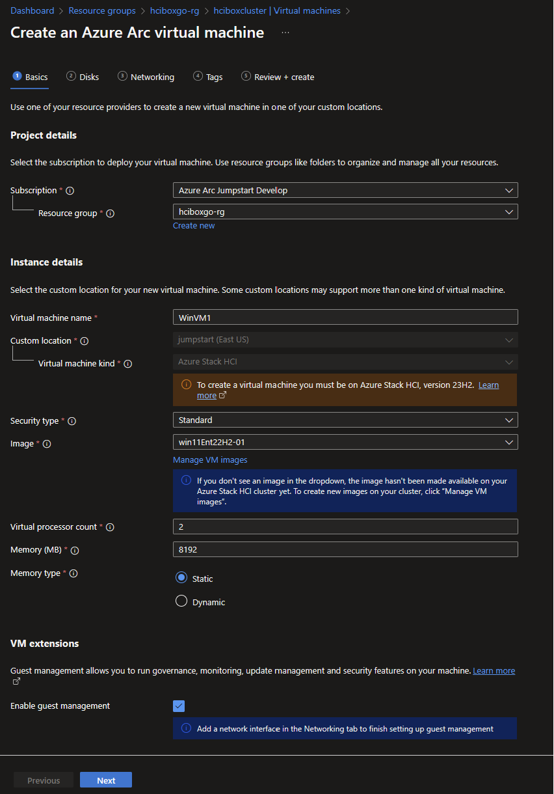

- It will take some time for the VM image to download to your instance from Azure marketplace. You can monitor progress by visiting the VM Image resource in your resource group and reviewing the resource properties.

  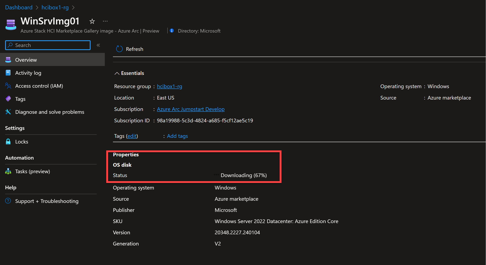

- Monitor the image as needed until is it finished downloading. While you wait, proceed to the next section to create the logical network on the instance.

## Create a logical network on your Azure Local instance

HCIBox networking includes a 192.168.200.0/24 subnet tagged to VLAN200. This network is designed for use with Arc-enabled VMs on HCIBox. To use this preconfigured network, you must create a logical network resource that maps to this subnet.

  | Network details |                  |
  | ---------- | --------------------- |
  | Subnet     | 192.168.200.0/24      |
  | Gateway    | 192.168.200.1         |
  | VLAN Id    | 200                   |
  | DNS Server | 192.168.1.254         |

- From inside the _HCIBox-Client_ VM, open File Explorer and navigate to _C:\HCIBox_. Right-click on the _Configure-VMLogicalNetwork.ps1_ PowerShell file and choose "Run with PowerShell." If you wish you can also review the file in VSCode.

  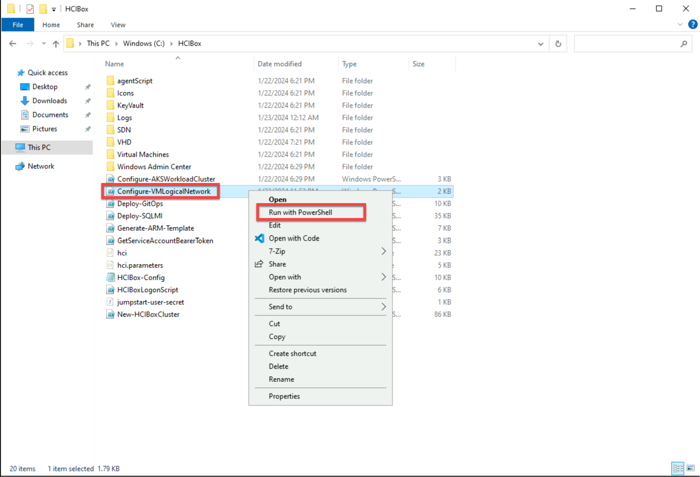

- Once complete the script window will automatically close. You can now check your resource group and find the newly created logical network resource.

  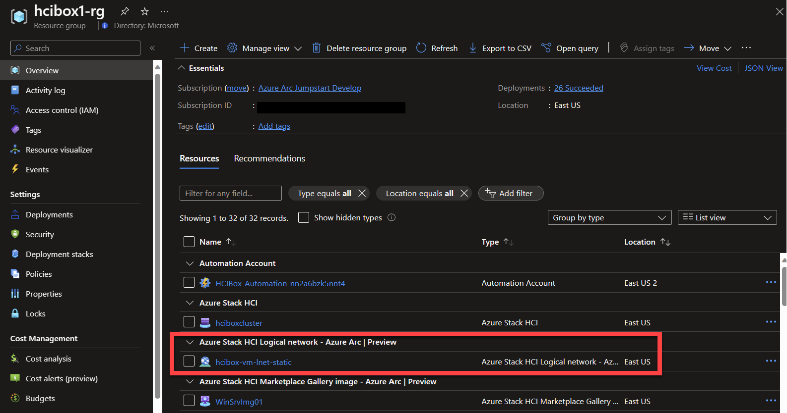

## Create a virtual machine

- Open the VM image resource and verify that your VM image has finished downloading.

  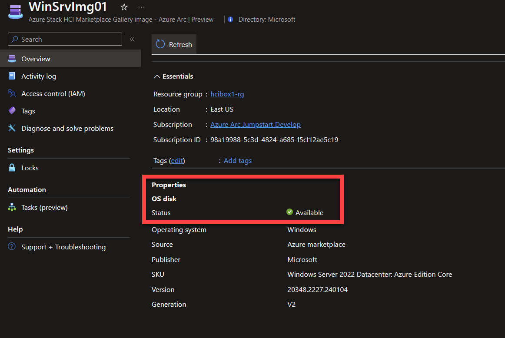

- Open your Azure Local instance resource and then open the Virtual machines blade, then click the "Create virtual machine" button.

  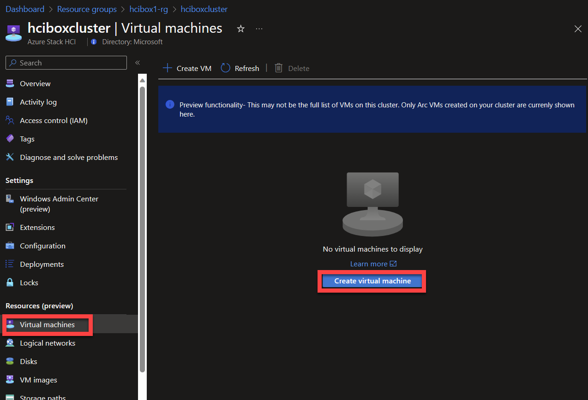

- Choose your HCIBox resource group, give your VM a name, select "Standard" for security type, and select the VM image you created earlier for the image. Set processor count to 2 and memory to 8192. Click next, and then next again to continue to the network tab.

  

- Click "Add network interface" and then give the interface a name and select the network you created earlier from the dropdown. Leave allocation method set to Automatic. Add the network card and then click next.

  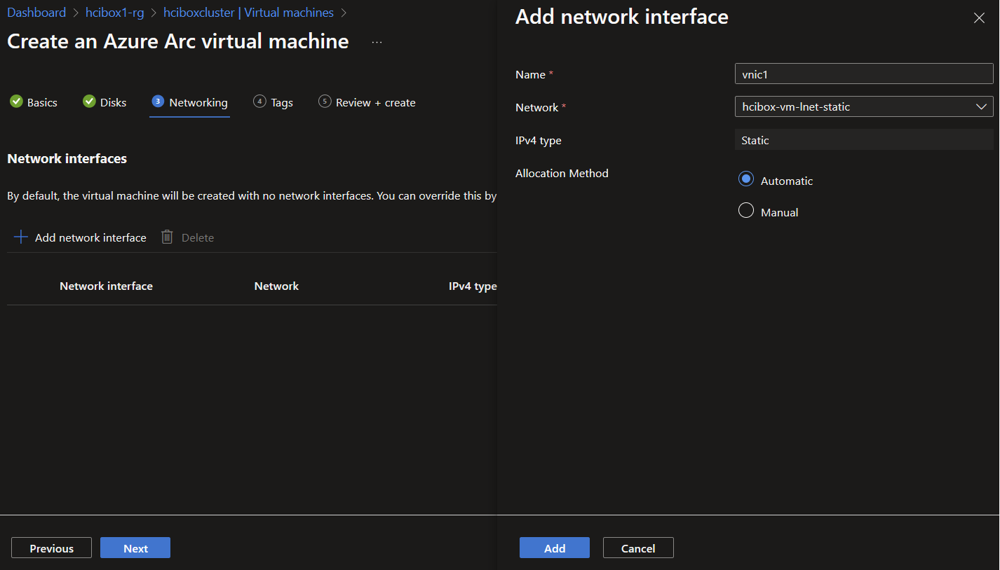

  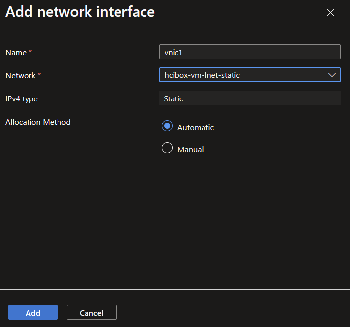

- Review the virtual machine details and click "Review + create" when ready.

  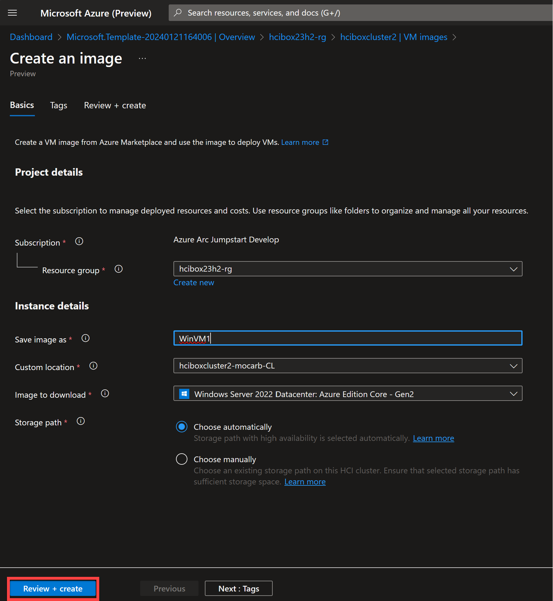

- Open the Azure Local VM resource and see connectivity to Arc and other details.

  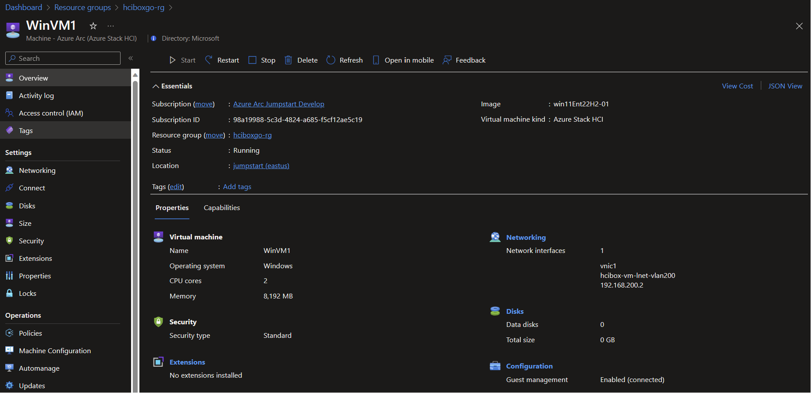

## Next steps

Review the [Azure Local VM management](https://learn.microsoft.com/azure-stack/hci/manage/azure-arc-enabled-virtual-machines#what-is-azure-arc-resource-bridge) documentation for additional information.
