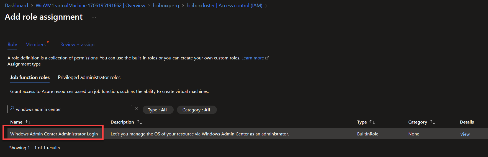

## Windows Admin Center operations

Windows Admin Center (preview) is available from inside the Azure portal and can be used with HCIBox.

## Windows Admin Center in Azure portal

Windows Admin Center can be used directly from the Azure portal. To set this up for your HCIBox cluster, follow these steps:

- Navigate to the _HCIBox-Cluster_ resource and select the Windows Admin Center blade.

  

- Leave the port set to the default value and click Install. Installation will take a few minutes to complete.

  

- Once installation is complete, click Connect from the Windows Admin Center blade on the cluster resource.

  

- Connecting to Windows Admin Center requires adding your user to the "Windows Admin Center Administrator Login" Azure RBAC role.

  

  

- Once complete, you can now connect and your cluster using Windows Admin Center in Azure portal.

  

## Next steps

For additional Windows Admin Center operations, review the [official documentation](https://learn.microsoft.com/windows-server/manage/windows-admin-center/overview).
