# Connecting to HCIBox

## Start post-deployment automation

Once your bicep deployment is complete with Azure CLI or Azure Developer CLI, you can open the Azure portal to see the initial HCIBox resources inside your resource group. Now you must remote into the _HCIBox-Client_ VM to continue the next phase of the deployment.

  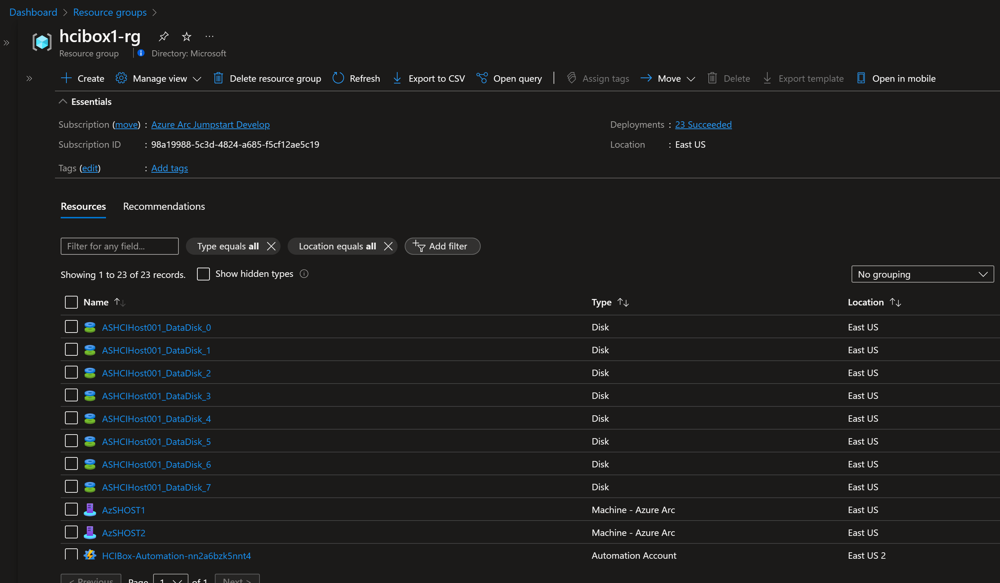

   > **Note:** RDP (3389) and SSH (22) ports are not open by default in HCIBox deployments. You will need to create a network security group (NSG) rule to allow network access to port 3389, or use [Azure Bastion](https://learn.microsoft.com/azure/bastion/bastion-overview) or [Just-in-Time (JIT)](https://learn.microsoft.com/azure/defender-for-cloud/just-in-time-access-usage?tabs=jit-config-asc%2Cjit-request-asc) access to connect to the VM.

## Connecting to the HCIBox Client virtual machine

> **Note:** As the subnet the Azure Local VMs resides on is on the second nested layer, it is necessary to connect to the AzSMGMT machine to be able to connect to those VMs:
> The Azure Local VM subnet is also not routable into the Azure Virtual Network, hence it won't be possible to connect to virtual machines on the Azure Local instance using Azure Bastion.
>
> If you are having difficulties connecting into a Azure Local VM:
> You can run `mstsc /v:192.168.1.11` from HCIBox-Client to connect to the AzSMGMT nested VM.
> From there, run `mstsc /v:192.168.200.x` to connect to the Azure Local VMs (replace x with the IP of your deployed VM).

Various options are available to connect to _HCIBox-Client_ VM, depending on the parameters you supplied during deployment.

- [RDP](#connecting-directly-with-rdp) - available after configuring access to port 3389 on the _Arc-App-Client-NSG_, or by enabling [Just-in-Time access (JIT)](#connect-using-just-in-time-access-jit).
- [Azure Bastion](#connect-using-azure-bastion) - available if *`true`* was the value of your _`deployBastion`_ parameter during deployment.

### Connecting directly with RDP

By design, HCIBox does not open port 3389 on the network security group. Therefore, you must create an NSG rule to allow inbound 3389.

  > **Note:** If you deployed with Azure Developer CLI then this step is automatically done for you as part of the automation.

- Open the _HCIBox-NSG_ resource in Azure portal and click "Add" to add a new rule.

  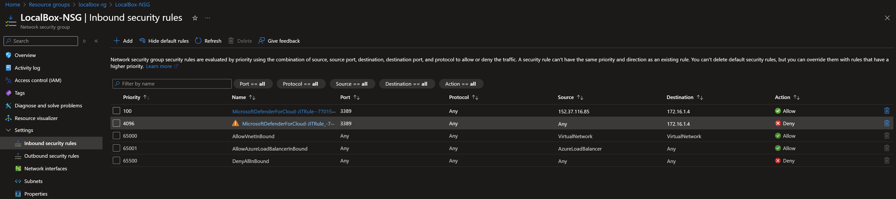

  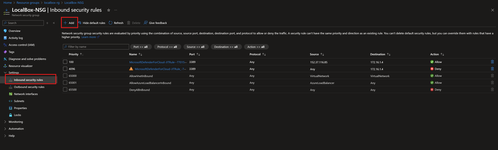

- Specify the IP address that you will be connecting from and select RDP as the service with "Allow" set as the action. You can retrieve your public IP address by accessing [https://icanhazip.com](https://icanhazip.com) or [https://whatismyip.com](https://whatismyip.com).

  

  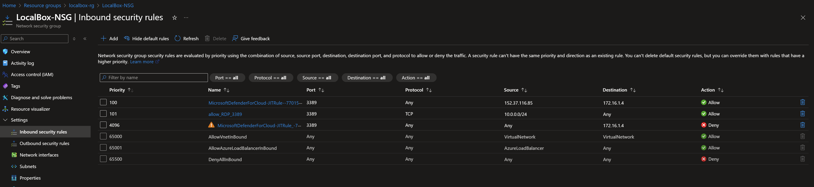

  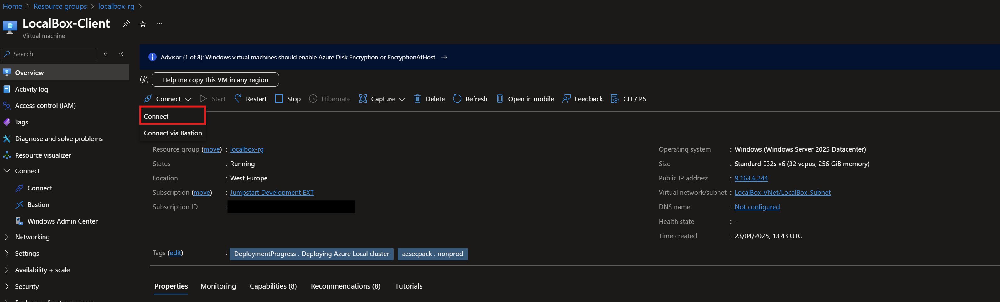

### Connect using Azure Bastion

- If you have chosen to deploy Azure Bastion in your deployment, use it to connect to the VM.

  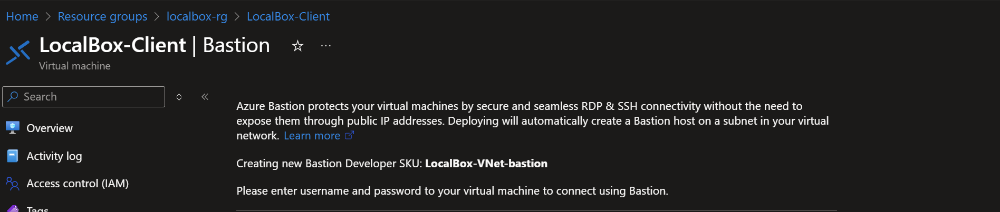

  > **Note:** When using Azure Bastion, the desktop background image is not visible. Therefore some screenshots in this guide may not exactly match your experience if you are connecting to _HCIBox-Client_ with Azure Bastion.

### Connect using just-in-time access (JIT)

If you already have [Microsoft Defender for Cloud](https://learn.microsoft.com/azure/defender-for-cloud/just-in-time-access-usage?tabs=jit-config-asc%2Cjit-request-asc) enabled on your subscription and would like to use JIT to access the Client VM, use the following steps:

- In the Client VM configuration pane, enable just-in-time. This will enable the default settings.

  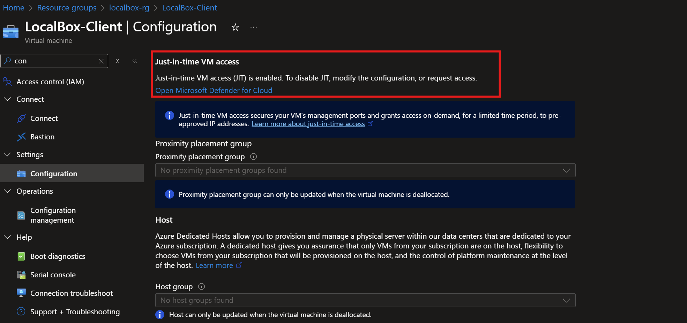

  

  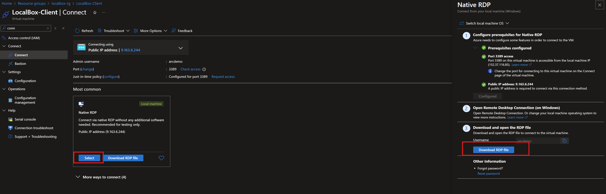

### The Logon scripts

- Once you log into the _HCIBox-Client_ VM, a PowerShell script will open and start running. This script will take anywhere between 1-2 hours to finish, and once completed, the script window will close automatically. At this point, the infrastructure deployment is complete.

  

- In Azure portal, validate that both Azure Local machines (AzSHOST1 and AzSHOST2) have been created as Arc-enabled servers.

- Verify that both of the Arc-enabled servers have successfully installed the three Azure Local extensions: AzureEdgeTelemetryAndDiagnostics, AzureEdgeLifecycleManager, and AzureEdgeDeviceManagement

  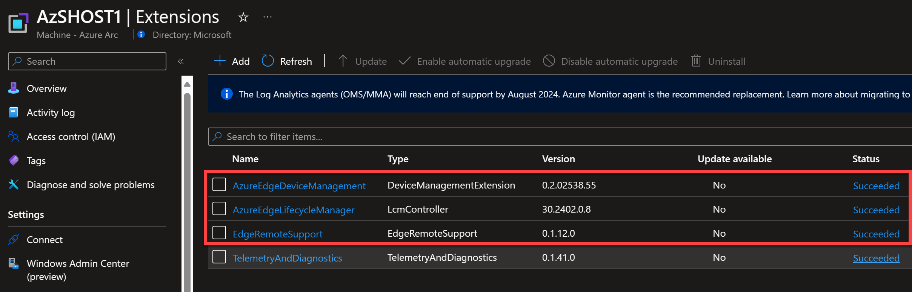

- If everything looks good, and you did not choose to configure the `autoDeployClusterResource` parameter with the value `true` in your deployment, proceed to the next section to validate and deploy your instance. If you did enable this parameter, you may proceed to the section _Deployment complete_ at the end of this page.
Visit [troubleshooting](/azure_jumpstart_hcibox/troubleshooting/) if needed for deployment issues.

## Azure portal Azure Local instance validation and deployment

Azure Local uses a two-step process to create and register instances in Azure using an ARM template.

  1. **Validate** - an ARM template is deployed with a "validate" flag. This begins the final instance validation step and takes around 20 minutes.
  2. **Deploy** - the same ARM template is redeployed with the "deploy" flag. This deploys the instance and Arc infrastructure and registers the instance. This step takes around 2-3 hours.

### Validate instance in Azure portal

- Before submitting the ARM deployment, you need to add your user account as a Key Vault Administrator on the HCIBox resource group. Navigate to the resource group then click "Access Control (IAM)" and then "Add role assignment". Select the "Key Vault Administrator role" then click on to the next screen to select your user account and assign your user the role.

  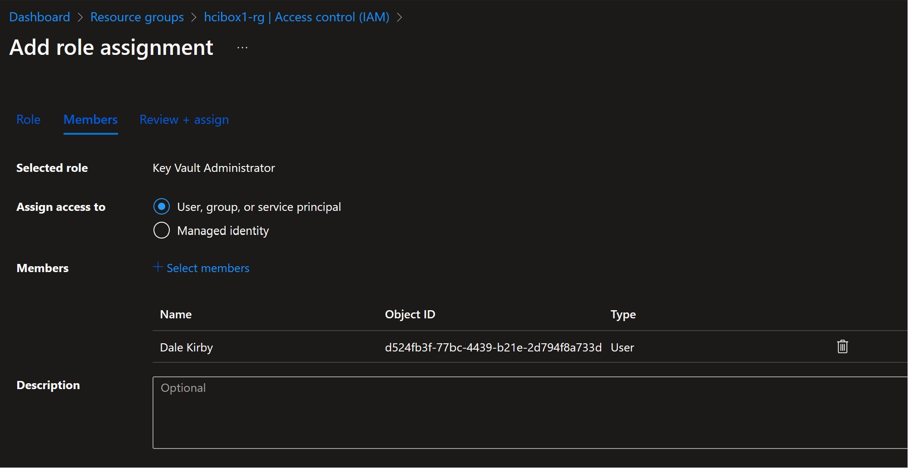

- Repeat this process to add your user account as a "Storage Account Contributor" on the HCIBox resource group.

- Now you will use the generated ARM template to validate the Azure Local instance in Azure portal. Open File Explorer on _HCIBox-Client_ and navigate to the _C:\HCIBox_ folder. Right-click on the folder and open it in VSCode.

- Open and review the hci.json and hci.parameters.json files in VSCode. Verify that the hci.parameters.json file looks correct without "_-staging_" placeholder parameter values.

- Navigate to Azure portal and type "custom deployment" in the search bar, then select "Deploy a custom template".

  

- Select "Build your own template in the editor".

  

- Paste the contents of hci.json into the editor and click "Save".

  

- Click "Edit parameters" and then paste the contents of hci.parameters.json into the editor and click "Save."

  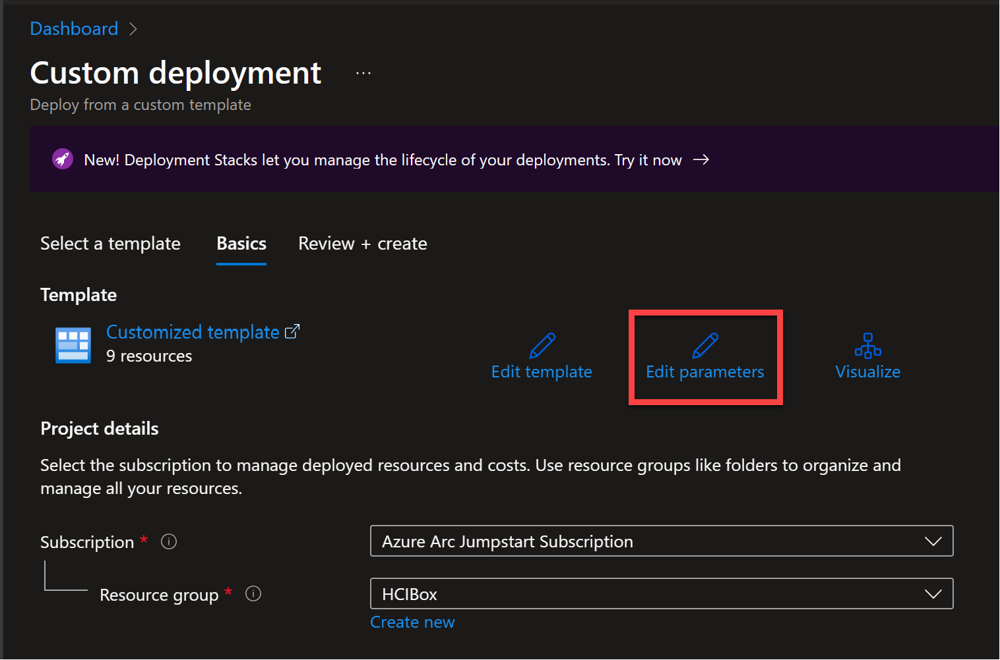

- Click through again on "Create" and then "Review and Create" to start the validation phase of instance deployment.

  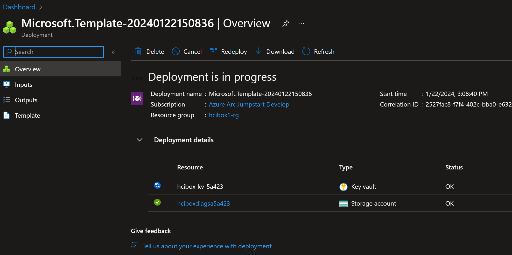

- Monitor validation as needed until complete.

## Deploy instance in Azure portal

- When validation is complete navigate to the instance resource in your HCIBox resource group. The banner should indicate that your instance is validated but not yet deployed. Click the "Deploy now" link.

  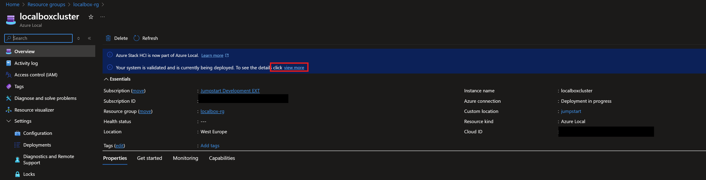

- Click through to submit the deployment. The instance may take some time to deploy. If you navigate elsewhere in the Azure Portal, you can return to monitor progress on the _Deployments_ tab of the instance. Click Refresh to get the latest status on deployment.

  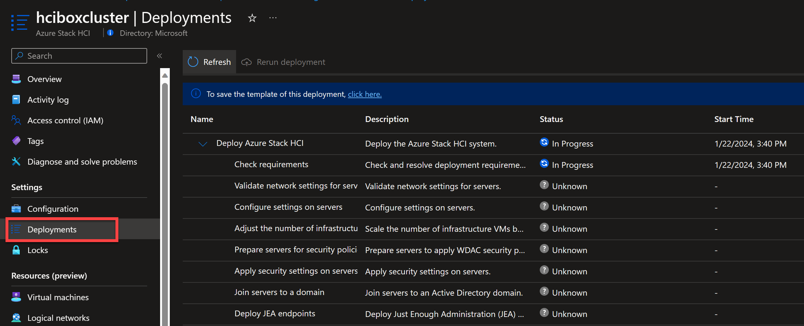

## Deployment complete

- Once the HCIBox instance is deployed it's time to start exploring various HCIBox features. Head on to the [Using HCIBox](/azure_jumpstart_hcibox/using_hcibox) guide for the next steps.

  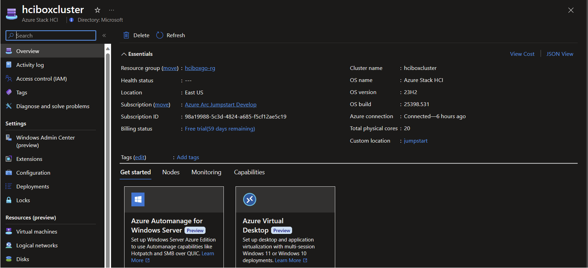
