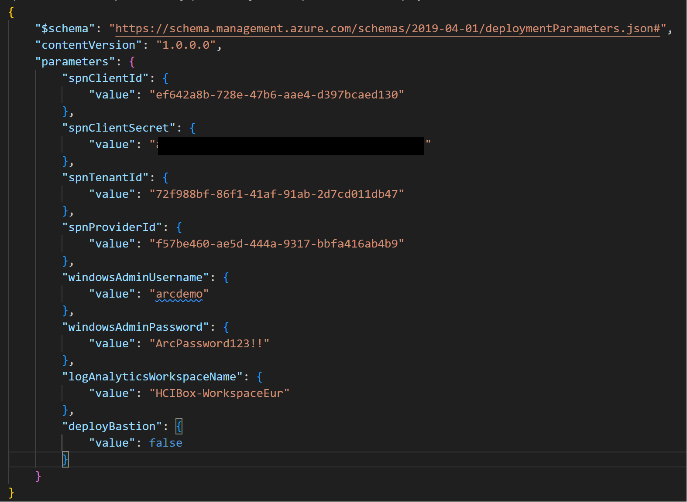
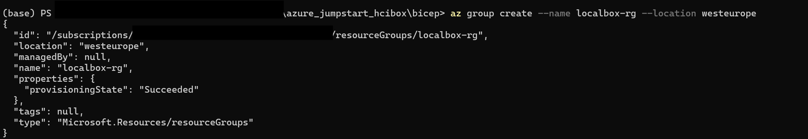
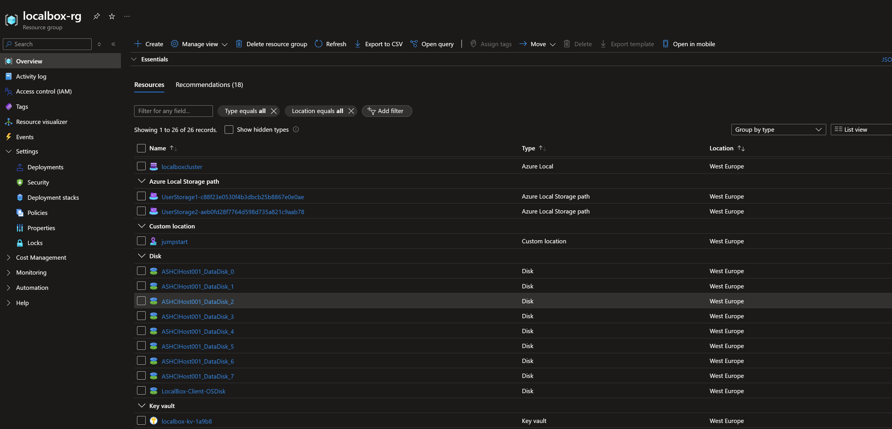

# Deploy HCIBox infrastructure with Azure CLI

## Azure CLI

Azure CLI can be used to deploy HCIBox into your Azure subscription. Azure CLI is recommended if you have been provided a service principal by your Azure administrator for use with HCIBox. If you can create application registrations in Microsoft Entra ID, then [Azure Developer CLI](/azure_jumpstart_hcibox/deployment_azd) will be the optimal deployment option that satisfies most other prerequisites. Otherwise, read on to learn how to deploy HCIBox with Azure CLI.

### Prepare the environment

- Clone the Azure Arc Jumpstart repository

  ```shell
  git clone https://github.com/microsoft/azure_arc.git
  ```

- [Install or update Azure CLI to version 2.56.0 or above](https://learn.microsoft.com/cli/azure/install-azure-cli?view=azure-cli-latest). Use the below command to check your current installed version.

  ```shell
  az --version
  ```

- Login to AZ CLI using the *`az login`* command.

- Ensure that you have selected the correct subscription you want to deploy HCIBox to by using the *`az account list --query "[?isDefault]"`* command. If you need to adjust the active subscription used by Az CLI, follow [this guidance](https://learn.microsoft.com/cli/azure/manage-azure-subscriptions-azure-cli#change-the-active-subscription).

- **HCIBox requires 32 ESv5-series vCPUs** when deploying with default parameters such as VM series/size. Ensure you have sufficient vCPU quota available in your Azure subscription and the region where you plan to deploy HCIBox. You can use the below Az CLI command to check your vCPU utilization.

  ```shell
  az vm list-usage --location <your location> --output table
  ```

  

- Create Azure service principal (SP). To deploy HCIBox, an Azure service principal assigned with the _Owner_ Role-based access control (RBAC) role is required. You can use Azure Cloud Shell (or other Bash shell), or PowerShell to create the service principal. If you are not able to create your own service principal, you can ask your Azure administrator to create one for you scoped to a pre-created resource group.

  - (Option 1) Create service principal using [Azure Cloud Shell](https://shell.azure.com/) or Bash shell with Azure CLI:

    ```shell
    az login
    subscriptionId=$(az account show --query id --output tsv)
    az ad sp create-for-rbac -n "<Unique SP Name>" --role "Owner" --scopes /subscriptions/$subscriptionId
    ```

    For example:

    ```shell
    az login
    subscriptionId=$(az account show --query id --output tsv)
    az ad sp create-for-rbac -n "JumpstartHCIBox" --role "Owner" --scopes /subscriptions/$subscriptionId
    ```

    Output should look similar to this:

    ```json
    {
    "appId": "XXXXXXXXXXXXXXXXXXXXXXXXXXXX",
    "displayName": "JumpstartHCIBox",
    "password": "XXXXXXXXXXXXXXXXXXXXXXXXXXXX",
    "tenant": "XXXXXXXXXXXXXXXXXXXXXXXXXXXX"
    }
    ```

  - (Option 2) Create service principal using PowerShell. If necessary, follow [this documentation](https://learn.microsoft.com/powershell/azure/install-az-ps?view=azps-8.3.0) to install Azure PowerShell modules.

    ```powershell
    $account = Connect-AzAccount
    $spn = New-AzADServicePrincipal -DisplayName "<Unique SPN name>" -Role "Owner" -Scope "/subscriptions/$($account.Context.Subscription.Id)"
    echo "SPN App id: $($spn.AppId)"
    echo "SPN secret: $($spn.PasswordCredentials.SecretText)"
    ```

    For example:

    ```powershell
    $account = Connect-AzAccount
    $spn = New-AzADServicePrincipal -DisplayName "HCIBoxSPN" -Role "Owner" -Scope "/subscriptions/$($account.Context.Subscription.Id)"
    echo "SPN App id: $($spn.AppId)"
    echo "SPN secret: $($spn.PasswordCredentials.SecretText)"
    ```

    Output should look similar to this:

    

    > **Note:** If you create multiple subsequent role assignments on the same service principal, your client secret (password) will be destroyed and recreated each time. Therefore, make sure you grab the correct password.

    > **Note:** It's optional but highly recommended to scope the service principal to a specific [Azure subscription and resource group](https://learn.microsoft.com/cli/azure/ad/sp?view=azure-cli-latest) as well considering using a [less privileged service principal account](https://learn.microsoft.com/azure/role-based-access-control/best-practices).

## Deploy the Bicep template

- Upgrade to latest Bicep version

  ```shell
  az bicep upgrade
  ```

- Retrieve the object id of your directory's Azure Stack HCI resource provider.

  ```shell
  az ad sp list --display-name "Microsoft.AzureStackHCI Resource Provider"
  ```

  


> **Note:** Please avoid using the $ symbol in the `windowsAdminPassword`. Using this symbol can cause the LogonScript to fail.

- Edit the [main.parameters.json](https://github.com/microsoft/azure_arc/blob/main/azure_jumpstart_hcibox/bicep/main.parameters.json) template parameters file and supply some values for your environment.
  - _`spnClientId`_ - Your Azure service principal id
  - _`spnClientSecret`_ - Your Azure service principal secret
  - _`spnTenantId`_ - Your Azure tenant id
  - _`spnProviderId`_ - Your Azure Stack HCI resource provider id, retrieved in an earlier step
  - _`windowsAdminUsername`_ - Client Windows VM Administrator username
  - _`windowsAdminPassword`_ - Client Windows VM Password. Password must have 3 of the following: 1 lower case character, 1 upper case character, 1 number, and 1 special character. The value must be between 12 and 123 characters long.
  - _`logAnalyticsWorkspaceName`_ - Unique name for the HCIBox Log Analytics workspace
  - _`deployBastion`_ - Option to deploy Azure Bastion which used to connect to the _HCIBox-Client_ VM instead of normal RDP.
  - _`autoDeployClusterResource`_ - Option to enable automatic deployment of the Azure Arc-enabled HCI cluster after the client VM deployment and automation script execution is complete.
  - _`autoUpgradeClusterResource`_ - Option to enable automatic upgrade of the Azure Arc-enabled HCI cluster after the cluster deployment is complete (only applicable if autoDeployClusterResource is set to `true`).

  

- Create a new resource group and then deploy the Bicep file. Navigate to the local cloned [deployment folder](https://github.com/microsoft/azure_arc/tree/main/azure_jumpstart_hcibox/bicep) and run the following command:

  ```shell
  az group create --name "<resource-group-name>"  --location "<location>"
  az deployment group create -g "<resource-group-name>" -f "main.bicep" -p "main.parameters.json"
  ```

  

    > **Note:** HCIBox can be deployed in East US, Australia East, and West Europe. Deploying in other regions will result in unexpected behavior or failures.

## Start post-deployment automation

Once your deployment is complete, you can open the Azure portal and see the initial HCIBox resources inside your resource group. Now you must remote into the _HCIBox-Client_ VM to continue the next phase of the deployment. [Continue in Cloud Deployment guide](/azure_jumpstart_hcibox/cloud_deployment) for the next steps.

  

## Clean up the deployment

To clean up your deployment, simply delete the resource group using Azure CLI or Azure portal.

- Clean up Using Azure CLI

  ```shell
  az group delete -n <name of your resource group>
  ```

