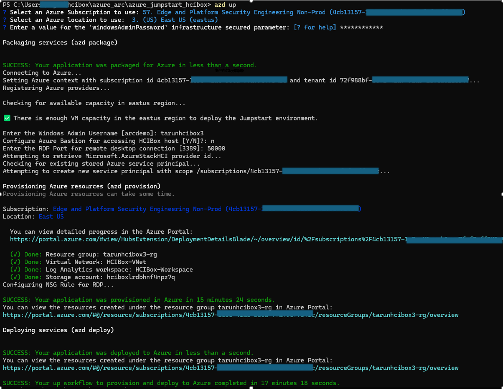

# Deploy HCIBox infrastructure with Azure Developer CLI

[Azure Developer CLI](https://learn.microsoft.com/azure/developer/azure-developer-cli/overview) automates the creation or retrieval of several HCIBox deployment requirements. It's best used when the deploying user has permission to [create applications in Microsoft Entra ID](https://learn.microsoft.com/entra/identity/role-based-access-control/permissions-reference#cloud-application-administrator).

## Prepare environment

- Clone the Azure Arc Jumpstart repository

  ```shell
  git clone https://github.com/microsoft/azure_arc.git
  ```

- Follow to install guide for the [Azure Developer CLI](https://learn.microsoft.com/azure/developer/azure-developer-cli/install-azd?tabs=winget-windows%2Cbrew-mac%2Cscript-linux&pivots=os-linux) for your environment.

  > **Note:** PowerShell is required for using azd with HCIBox. If you are running in a Linux environment be sure that you have [PowerShell for Linux](https://learn.microsoft.com/powershell/scripting/install/installing-powershell-on-linux?view=powershell-7.3) installed.

- Login with azd using *`azd auth login`* which will open a browser for interactive login.

  

- Run the *`azd init`* command from the _*azure_jumpstart_hcibox*_ folder within your cloned repo.
  
  

## Deploy the environment

- Run the *`azd up`* command to deploy the environment. Azd will prompt you to enter the target subscription, region, and all required parameters. It is highly recommended to use _eastus_ as your region.

  > **Note:** It is possible that you might experience an error such as "Unable to acquire token". Please run ```Connect-AzAccount``` in PowerShell with the correct credential and re-run ```azd up```. Reference: [https://github.com/microsoft/azure_arc/issues/2443](https://github.com/microsoft/azure_arc/issues/2443). 
  
  

- Wait for the deployment to complete, then continue by logging into the _HCIBox-Client_ VM using RDP or Bastion.

## Start post-deployment automation

Once your deployment is complete, you can open the Azure portal and see the initial HCIBox resources inside your resource group. Now you must remote into the _HCIBox-Client_ VM to continue the next phase of the deployment. [Continue in Cloud Deployment guide](/azure_jumpstart_hcibox/cloud_deployment) for the next steps.

  

## Clean up the deployment

After you are finished with your HCIBox deployment use ```azd down``` to delete your resources.

  ```Azure Developer CLI
  azd down
  ```

  
