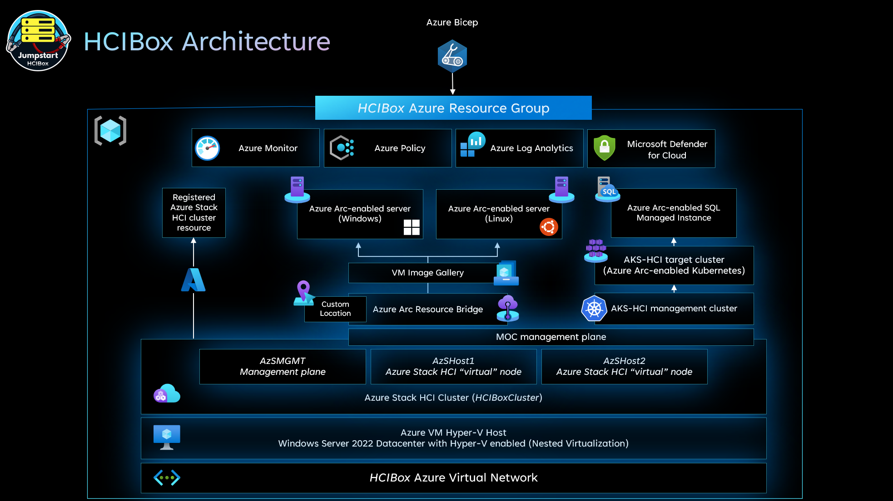
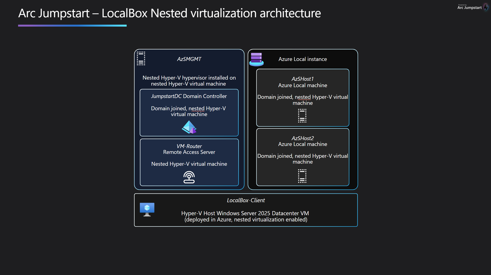
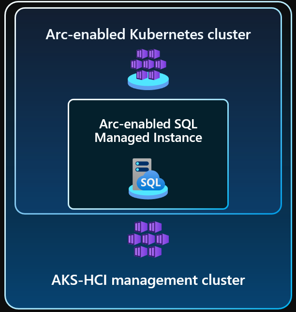
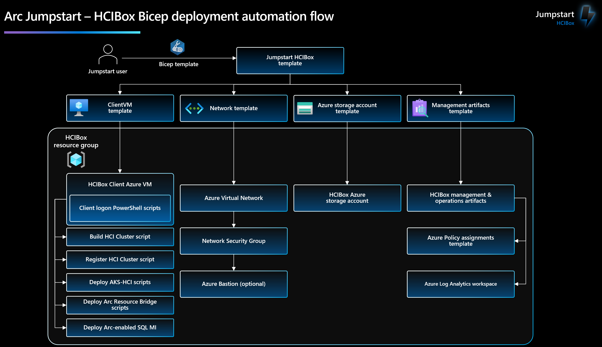

## Getting started

HCIBox is a turnkey solution that provides a complete sandbox for exploring [Azure Stack HCI](https://learn.microsoft.com/azure-stack/hci/overview) capabilities and hybrid cloud integration in a virtualized environment. HCIBox is designed to be completely self-contained within a single Azure subscription and resource group, which will make it easy for a user to get hands-on with Azure Stack HCI and [Azure Arc](https://learn.microsoft.com/azure/azure-arc/overview) technology without the need for physical hardware.

  > **Note:** [Azure Stack HCI 23H2](https://learn.microsoft.com/azure-stack/hci/whats-new) is now available in public preview. 23H2 introduces changes to the deployment process for HCI clusters and related workloads like [Resource Bridge](https://learn.microsoft.com/azure-stack/hci/manage/azure-arc-vm-management-overview) for VM self-service management in Azure portal. HCIBox now offers clusters built on the new 23H2 OS, and prior Azure Stack HCI releases are no longer part of HCIBox or supported by the Jumpstart team. [Join the discussion](https://github.com/microsoft/azure_arc/discussions/1454) here to learn more.

## Use cases

- Sandbox environment for getting hands-on with Azure Stack HCI and Azure Arc technologies
- Accelerator for Proof-of-concepts or pilots
- Training tool for skills development
- Demo environment for customer presentations or events
- Rapid integration testing platform
- Infrastructure-as-code and automation template library for building hybrid cloud management solutions

## Azure Stack HCI capabilities available in HCIBox

### 2-node Azure Stack HCI cluster

HCIBox automatically provisions and configures a two-node Azure Stack HCI cluster. HCIBox simulates physical hardware by using nested virtualization with Hyper-V running on an Azure Virtual Machine. This Hyper-V host provisions three guest virtual machines: two Azure Stack HCI nodes (_AzSHost1_, _AzSHost2_), and one nested Hyper-V host (_AzSMGMT_). _AzSMGMT_ itself hosts three guest VMs: a [Windows Admin Center](https://learn.microsoft.com/windows-server/manage/windows-admin-center/overview) gateway server, an [Active Directory domain controller](https://learn.microsoft.com/windows-server/identity/ad-ds/get-started/virtual-dc/active-directory-domain-services-overview), and a [Routing and Remote Access Server](https://learn.microsoft.com/windows-server/remote/remote-access/remote-access) acting as a BGP router.

### Azure Arc Resource Bridge

HCIBox comes with [Azure Arc Resource Bridge](https://learn.microsoft.com/azure/azure-arc/resource-bridge/overview). This allows full virtual machine lifecycle management from Azure portal or CLI. HCIBox also configures a [custom location](https://learn.microsoft.com/azure-stack/hci/manage/deploy-arc-resource-bridge-using-command-line?tabs=for-static-ip-address#create-a-custom-location-by-installing-azure-arc-resource-bridge) and deploys a [gallery image](https://learn.microsoft.com/azure-stack/hci/manage/deploy-arc-resource-bridge-using-command-line?tabs=for-static-ip-address#create-virtual-network-and-gallery-image) (Windows Server 2022). This gallery image can be used to create virtual machines through the Azure portal.

### Azure Kubernetes Service on Azure Stack HCI and Azure Arc-enabled data services

Azure Stack HCI includes [Azure Kubernetes Services on Azure Stack HCI (AKS-HCI)](https://learn.microsoft.com/azure-stack/aks-hci/) as part of the default configuration. HCIBox includes this capability and also provides the ability to deploy [Azure Arc-enabled data services](https://learn.microsoft.com/azure/azure-arc/data/overview) on the HCIBox cluster.

  > **Note:** [AKS on HCI](https://learn.microsoft.com/azure-stack/hci/whats-new) is now available in public preview. 23H2 introduces changes to the deployment process for HCI clusters and related workloads like [Resource Bridge](https://learn.microsoft.com/azure-stack/hci/manage/azure-arc-vm-management-overview) for VM self-service management in Azure portal. HCIBox now offers clusters built on the new 23H2 OS, and prior OS releases are no longer part of HCIBox or supported by the Jumpstart team. [Join the discussion](https://github.com/microsoft/azure_arc/discussions/1454) here to learn more.

HCIBox also provides the option to deploy [Azure Arc-enabled SQL Managed Instance on Azure Stack HCI](https://learn.microsoft.com/azure/azure-arc/data/managed-instance-overview). HCIBox uses the AKS-HCI [workload cluster](https://learn.microsoft.com/azure-stack/aks-hci/kubernetes-concepts)to deploy an Azure Arc-enabled SQL Managed Instance.

### Hybrid unified operations

HCIBox includes capabilities to support managing, monitoring and governing the cluster. The deployment automation configures [Azure Stack HCI Insights](https://learn.microsoft.com/azure-stack/hci/manage/monitor-hci-multi) along with [Azure Monitor](https://learn.microsoft.com/azure/azure-monitor/overview) and a [Log Analytics workspace](https://learn.microsoft.com/azure/azure-monitor/logs/log-query-overview). Additionally, [Azure Policy](https://learn.microsoft.com/azure/governance/policy/overview) can be configured to support automation configuration and remediation of resources.

## HCIBox Azure Consumption Costs

HCIBox resources generate Azure Consumption charges from the underlying Azure resources including core compute, storage, networking and auxiliary services. Note that Azure consumption costs may vary depending the region where HCIBox is deployed. Be mindful of your HCIBox deployments and ensure that you disable or delete HCIBox resources when not in use to avoid unwanted charges. Please see the [Jumpstart HCIBox FAQ](../faq/) for more information on consumption costs.

## Deployment Options and Automation Flow

HCIBox provides two methods for deploying and configuring the necessary resources in Azure.

- A [Bicep](https://learn.microsoft.com/azure/azure-resource-manager/bicep/overview?tabs=bicep) template that can be deployed manually via Azure CLI.

- An [Azure Developer CLI](https://learn.microsoft.com/azure/developer/azure-developer-cli/overview) template that can be used to for a more streamlined experience.

HCIBox uses an advanced automation flow to deploy and configure all necessary resources with minimal user interaction. The previous diagram provides an overview of the deployment flow. A high-level summary of the deployment is:

- User deploys the primary Bicep file (_main.bicep_). This file contains several nested objects that will run simultaneously.
  - Host template - deploys the _HCIBox-Client_ VM. This is the Hyper-V host VM that uses nested virtualization to host the complete HCIBox infrastructure. Once the Bicep template finishes deploying, the user remotes into this client using RDP to start the second step of the deployment.
  - Network template - deploys the network artifacts required for the solution
  - Storage account template - used for staging files in automation scripts and as the cloud witness for the HCI cluster
  - Management artifacts template - deploys Azure Log Analytics workspace and solutions and Azure Policy artifacts
- User remotes into _HCIBox-Client_ VM, which automatically kicks off a PowerShell script that:
  - Deploys and configure three (3) nested virtual machines in Hyper-V
    - Two (2) Azure Stack HCI virtual nodes
    - One (1) Windows Server 2019 virtual machine
  - Configures the necessary virtualization and networking infrastructure on the Hyper-V host to support the HCI cluster.
  - Deploys an Active Directory domain controller, a Windows Admin Center server in gateway mode, and a Remote Access Server acting as a BGP router
  - Generates an ARM template and parameters file to use to validate and deploy the cluster via Azure portal
- User takes the generated ARM template and parameters file and uses them to validate and deploy the cluster in Azure portal

## Deployment options and prerequisites

Deploying HCIBox is a multi-step process.

  1) Deploy Azure infrastructure
  2) Automation scripts configure virtual HCI cluster and generate ARM template
  3) User deploys ARM template (HCI cluster validate phase)
  4) User re-deploys ARM template (HCI cluster deploy phase)

HCIBox includes Bicep templates that can be used with Azure Developer CLI or Azure CLI. If your user can create application registrations in Microsoft Entra ID, then [Azure Developer CLI](/azure_jumpstart_hcibox/deployment_azd) will be the optimal deployment option that satisfies most other prerequisites. Otherwise, [Azure CLI](/azure_jumpstart_hcibox/deployment_az) can be used with a pre-configured service principal.

- [Deploy HCIBox with Azure Developer CLI](/azure_jumpstart_hcibox/deployment_azd)

- [Deploy HCIBox with Azure CLI](/azure_jumpstart_hcibox/deployment_az)

Looking for something else related to HCIBox?

- [Cloud deployment](/azure_jumpstart_hcibox/cloud_deployment)

- [HCIBox FAQ](/azure_jumpstart_hcibox/faq)

- [HCIBox FAQ](/azure_jumpstart_hcibox/faq)
