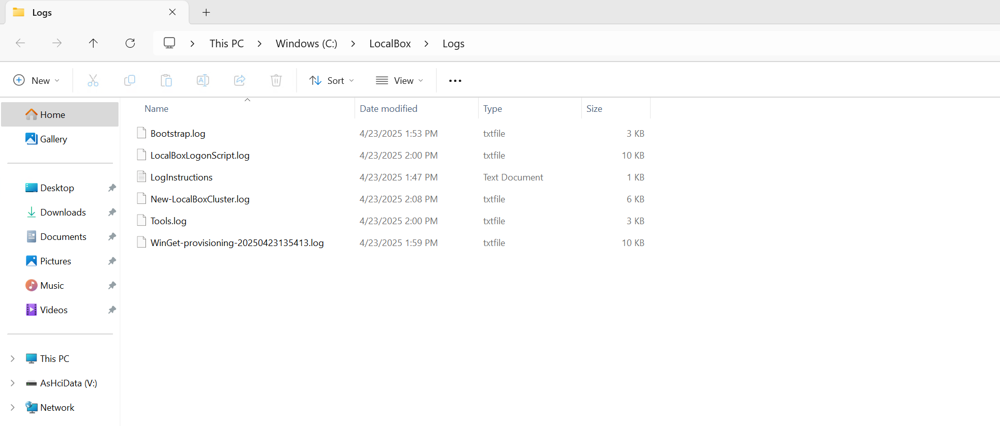

# Troubleshooting HCIBox

## Troubleshooting Deployments

Occasionally deployments of HCIBox may fail at various stages. Common reasons for failed deployments include:

- Invalid service principal id, service principal secret, or service principal Azure tenant ID provided in _main.parameters.json_ file. This can cause failures when running automation that requires logging into Azure, such as the scripts that register the HCI cluster, deploy AKS-HCI, or configure Arc Resource Bridge.
- Not enough vCPU quota available in your target Azure region - check vCPU quota and ensure you have at least 32 available. See the [prerequisites](/azure_jumpstart_hcibox/getting_started/#prerequisites) section for more details.
- Corruption when downloading HCIBox VHD files can interrupt deployments. HCIBox should automatically halt if this occurs. Re-running the PowerShell script at _C:\HCIBox\HCIBoxLogonScript.ps1_ can often repair this issue.

If you have issues that you cannot resolve when deploying HCIBox please submit an issue on the [Github repo](https://github.com/microsoft/azure_arc/issues)

### Exploring logs from the _HCIBox-Client_ virtual machine

Occasionally, you may need to review log output from scripts that run on the _HCIBox-Client_ virtual machines in case of deployment failures. To make troubleshooting easier, the HCIBox deployment scripts collect all relevant logs in the _C:\HCIBox\Logs_ folder on _HCIBox-Client_. A short description of the logs and their purpose can be seen in the list below:

| Log file                                      | Description                                                                                                                               |
| --------------------------------------------- | ----------------------------------------------------------------------------------------------------------------------------------------- |
| _C:\HCIBox\Logs\Bootstrap.log_                | Output from the initial bootstrapping script that runs on _HCIBox-Client_.                                                                |
| _C:\HCIBox\Logs\New-HCIBoxCluster.log_        | Output of _New-HCIBoxCluster.ps1_ which configures the Hyper-V host and builds the HCI cluster, management VMs, and other configurations. |
| _C:\HCIBox\Logs\Generate-ARM-Template.log_    | Log output of the script that builds the _hci.json_ and _hci.parameters.json_ file                                                        |
| _C:\HCIBox\Logs\HCIBoxLogonScript.log_        | Log output from the orchestrator script that manages the install                                                                          |
| _C:\HCIBox\Logs\Tools.log_                    | Log output from tools installation during bootstrap                                                                                       |

  

If you are still having issues deploying HCIBox, please [submit an issue](https://aka.ms/JumpstartIssue) on GitHub and include a detailed description of your issue and the Azure region you are deploying to. Inside the _C:\HCIBox\Logs_ folder you can also find instructions for uploading your logs to an Azure storage account for review by the Jumpstart team.
