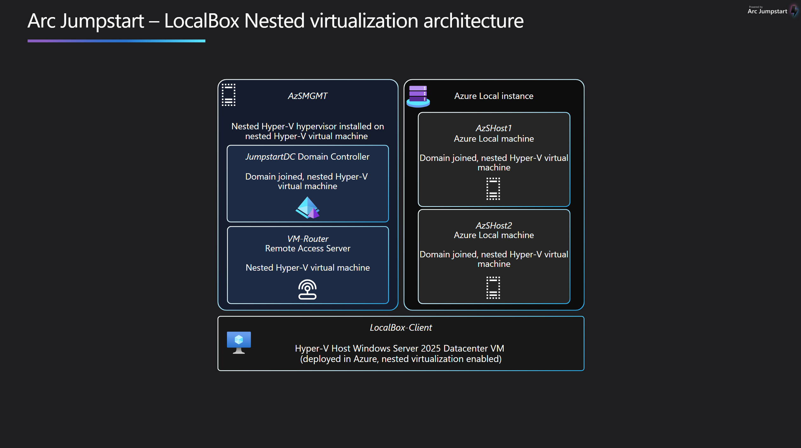
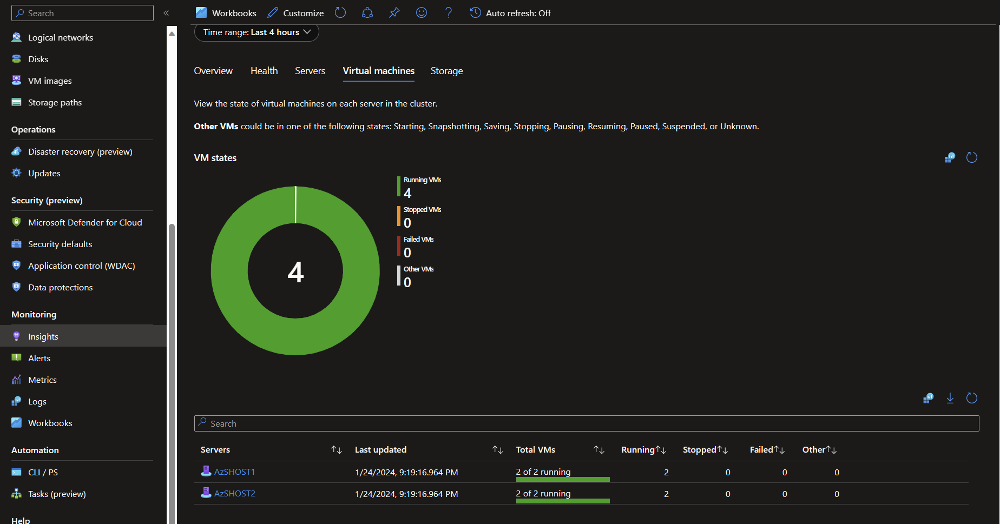
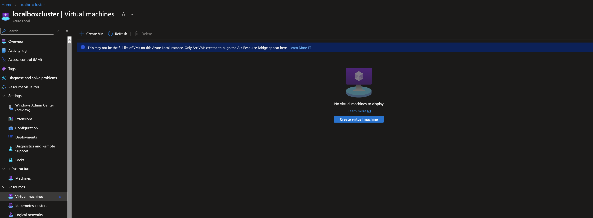
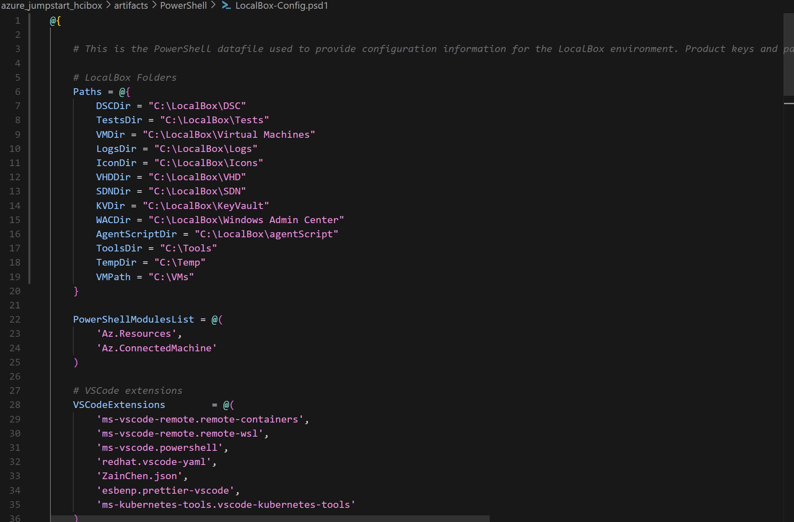
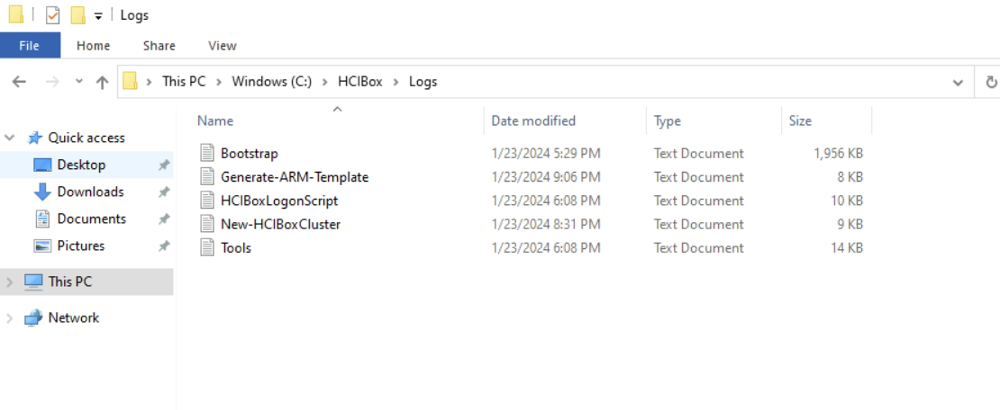

## Using HCIBox

HCIBox has many features that can be explored through the Azure portal or from inside the _HCIBox-Client_ virtual machine. To help you navigate all the features included, read through the following sections to understand the general architecture and how to use various features.

### Nested virtualization

HCIBox simulates a 2-node physical deployment of Azure Stack HCI by using [nested virtualization on Hyper-V](https://learn.microsoft.com/virtualization/hyper-v-on-windows/user-guide/nested-virtualization). To ensure you have the best experience with HCIBox, take a moment to review the details below to help you understand the various nested VMs that make up the solution.

  

| Computer Name    | Role                                | Domain Joined | Parent Host     | OS                  |
| ---------------- | ----------------------------------- | ------------- | --------------- | ------------------- |
| _HCIBox-Client_  | Primary host                        | No            | Azure           | Windows Server 2022 |
| _AzSHOST1_       | HCI node                            | Yes           | _HCIBox-Client_ | Azure Stack HCI     |
| _AzSHOST2_       | HCI node                            | Yes           | _HCIBox-Client_ | Azure Stack HCI     |
| _AzSMGMT_        | Nested hypervisor                   | No            | _HCIBox-Client_ | Windows Server 2022 |
| _JumpstartDC_    | Domain controller                   | Yes (DC)      | _AzSMGMT_       | Windows Server 2022 |
| _Bgp-Router_     | Remote Access Server                | No            | _AzSMGMT_       | Windows Server 2022 |

### Active Directory domain user credentials

Once you are logged into the _HCIBox-Client_ VM using the local admin credentials you supplied in your template parameters during deployment you will need to switch to using a domain account to access most other functions, such as logging into the HCI nodes or accessing Windows Admin Center. This domain account is automatically configured for you using the same username and password you supplied at deployment. The default domain name is _jumpstart.local_, so if the username supplied at deployment is "_arcdemo_", your domain account in UPN format would be **_arcdemo@jumpstart.local_**.

  > **Note:** The password for this account is set as the same password you supplied during deployment for the local account. Many HCIBox operations will use the domain account wherever credentials are required.

### Monitoring Azure Stack HCI

Azure Stack HCI integrates with [Azure Monitor](https://learn.microsoft.com/azure-stack/hci/manage/monitor-hci-single) to support monitoring HCI clusters through the Azure portal. Follow these steps to configure monitoring on your HCIBox cluster.

- From the Overview blade of the _HCIBox-Cluster_ resource, select the "Capabilities" tab, then click on "Not configured" on the "Logs" box.

  

- On the dialog box, select the HCIBox-Workspace log analytics workspace in the dropdown, then click "Add". This will begin the process of installing the Log Analytics extensions on the host nodes and will take a few minutes. When complete, the Logs box will show as "Configured" on the Capabilities tab.

  

- On the "Capabilities" tab, click on "Not configured" on the "Insights" box.

- On the dialog box, click "Turn on". After a few seconds, the Insights box should show as "Configured" on the Capabilities tab.

  

- It will take time for logs data to flow through to Log Analytics. Once data is available, click on the Insights blade of the _HCIBox-Cluster_ resource to view the Insights workbook and explore logs from your cluster.

  

### Virtual machine provisioning through Azure portal with Arc Resource Bridge

Azure Stack HCI supports [VM provisioning through the Azure portal](https://learn.microsoft.com/azure-stack/hci/manage/azure-arc-enabled-virtual-machines). Open the [HCIBox VM provisioning documentation](/azure_jumpstart_hcibox/RB/) to get started.

### Azure Kubernetes Service

HCIBox comes pre-configured with [Azure Kubernetes Service on Azure Stack HCI](https://learn.microsoft.com/azure-stack/aks-hci/). Currently AKS on HCI is an experimental feature in HCIBox. Open the [HCIBox AKS-HCI documentation](/azure_jumpstart_hcibox/AKS/) to explore currently available features.

### Windows Admin Center

Windows Admin Center can be used from directly in the Azure portal. Windows Admin Center offers additional capabilities for cluster management and operations directly from Azure portal.

### Advanced Configurations

HCIBox provides a full Azure Stack HCI sandbox experience with minimal configuration required by the user. Some users may be interested in changing HCIBox's default configuration. Many advanced settings can be configured by modifying the values in the [_HCIBox-Config.psd1_](https://raw.githubusercontent.com/microsoft/azure_arc/main/azure_jumpstart_hcibox/artifacts/HCIBox-Config.psd1) PowerShell file. If you wish to make changes to this file, you must fork the Jumpstart repo and make the changes in your fork, then set the optional _githubAccount_ and _githubBranch_ deployment template parameters to point to your fork.

  > **Note:** Advanced configuration deployments are not supported by the Jumpstart team. Changes made to the _HCIBox-Config.psd1_ file may result in failures at any point in HCIBox deployment. Make changes to this file only if you understand the implications of the change.

### Next steps
  
HCIBox is a sandbox that can be used for a large variety of use cases, such as an environment for testing and training or a to jumpstart a proof of concept projects. You are free to do whatever you wish with HCIBox. Some suggested next steps for you to try in your HCIBox are:

- Explore Windows Admin Center from either Azure portal or from the WAC gateway server
- Deploy GitOps configurations with Azure Arc-enabled Kubernetes
- Build policy initiatives that apply to your Azure Arc-enabled resources
- Write and test custom policies that apply to your Azure Arc-enabled resources
- Reuse automation for external solutions or proof-of-concepts

## Basic troubleshooting

Occasionally deployments of HCIBox may fail at various stages. Common reasons for failed deployments include:

- Invalid service principal id, service principal secret or service principal Azure tenant ID provided in _main.parameters.json_ file. This can cause failures when running automation that requires logging into Azure, such as the scripts that register the HCI cluster, deploy AKS-HCI, or configure Arc resource bridge.
- Not enough vCPU quota available in your target Azure region - check vCPU quota and ensure you have at least 48 available. See the [prerequisites](#prerequisites) section for more details.
- Target Azure region does not support all required Azure services - ensure you are running HCIBox in one of the supported regions. See the [prerequisites](#prerequisites) section for more details.
- Authentication issues - Most HCIBox operations require the use of the domain credentials configured during deployment. These credentials take the UPN format of _<username>@jumpstart.local_. If you have issues accessing services such as Windows Admin Center make sure you are using the correct credential.
- Script failures due to upstream dependencies - This can happen due to network issues or failures in upstream services that HCIBox depends on (such as package repositories) - usually deleting the deployment and redeploying is the simplest resolution.

If you have issues that you cannot resolve when deploying HCIBox please submit an issue on the [Github repo](https://github.com/microsoft/azure_arc/issues)

### Exploring logs from the _HCIBox-Client_ virtual machine

Occasionally, you may need to review log output from scripts that run on the _HCIBox-Client_ virtual machines in case of deployment failures. To make troubleshooting easier, the HCIBox deployment scripts collect all relevant logs in the _C:\HCIBox\Logs_ folder on _HCIBox-Client_. A short description of the logs and their purpose can be seen in the list below:

| Log file                                      | Description                                                                                                                               |
| --------------------------------------------- | ----------------------------------------------------------------------------------------------------------------------------------------- |
| _C:\HCIBox\Logs\Bootstrap.log_                | Output from the initial bootstrapping script that runs on _HCIBox-Client_.                                                                |
| _C:\HCIBox\Logs\New-HCIBoxCluster.log_        | Output of _New-HCIBoxCluster.ps1_ which configures the Hyper-V host and builds the HCI cluster, management VMs, and other configurations. |

  

If you are still having issues deploying HCIBox, please [submit an issue](https://aka.ms/JumpstartIssue) on GitHub and include a detailed description of your issue and the Azure region you are deploying to. Inside the _C:\HCIBox\Logs_ folder you can also find instructions for uploading your logs to an Azure storage account for review by the Jumpstart team.