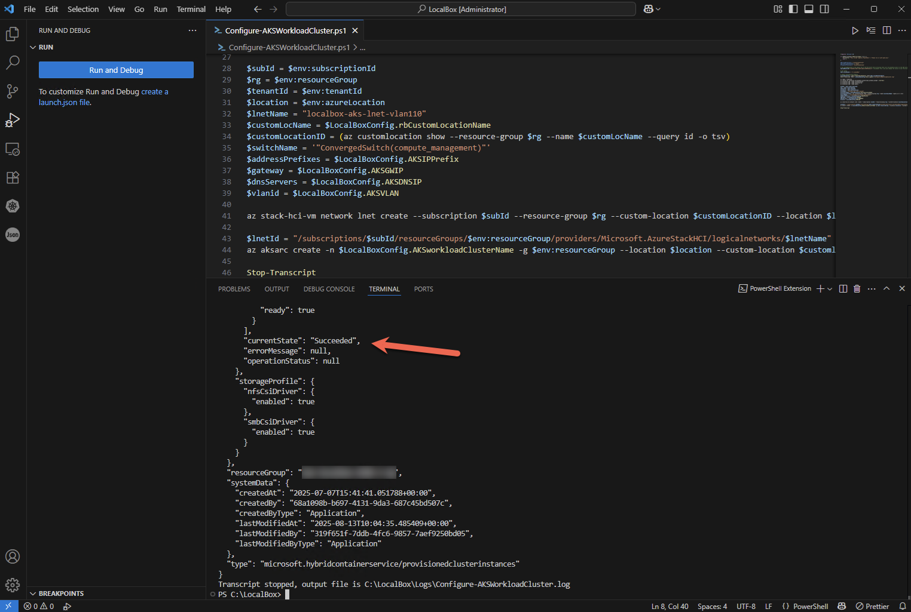

# Azure Kubernetes Service on your Azure Local LocalBox

Azure Local can provide host infrastructure for [AKS enabled by Azure Arc](https://learn.microsoft.com/azure/aks/aksarc/aks-overview).

## Explore AKS on Azure Local

LocalBox is preconfigured with a network subnet dedicated to AKS deployment. Subnet details are as follows:

  | Network detail |        Value          |
  | ---------- | --------------------- |
  | Subnet     | 10.10.0.0/24          |
  | Gateway    | 10.10.0.1             |
  | VLAN Id    | 110                   |
  | DNS Server | 192.168.1.254         |

Before creating an AKS workload cluster, you must create a local virtual network object. LocalBox includes a script that will complete this task using the pre-configured network. The script will then create a new AKS workload cluster.

- Open your LocalBox resource group and click on the _jumpstart_ custom location resource, then click "Arc-enabled services." Here you should see the hybridaksextension service available on the cluster. This is installed by default on Azure Local instance(s), and is required for creating AKS workload clusters on Azure Local.

  

Access to the AKS cluster is [managed through Azure RBAC](https://learn.microsoft.com/azure/aks/hybrid/aks-create-clusters-cli#before-you-begin). Create a new Microsoft Entra group or use an existing one where you are a member for this exercise.

- [Create a Microsoft Entra group](https://learn.microsoft.com/entra/fundamentals/how-to-manage-groups) or use an existing one.

- Retrieve the object id of the Microsoft Entra group and copy it down for use in the next step.

  

- From the _LocalBox-Client_ virtual machine, open File Explorer and navigate to the _C:\LocalBox_ folder. Right-click on "Configure-AksWorkloadCluster.ps1" and then select "Open with Visual Studio Code".

  

- Uncomment line 6 in the script and edit the placeholder value for the _$aadgroupID_ parameter with the object ID of your Microsoft Entra group. Save the script (Ctrl + S).

  

- After saving the script, click the "Run"-button.

  

- Let the script run its course and look for the "Succeeded" value for the "currentState" property:

  

- Once complete, you should have an AKS workload cluster called _localbox-aks_ in your LocalBox resource group.

  

- Click on the AKS cluster to view details such as Kubernetes version. "Status" may show connecting for some time while the cluster fully connects to Azure.

  

- From the _LocalBox-Client_ virtual machine, in Visual Studio Code, run the following from the terminal window to authenticate using a user which is a member of the previously configured Entra ID group:

  ```powershell
  az logout
  az login --use-device-code --tenant $env:tenantId
  ```


You may perform the device authentication in a browser on your local machine in case there are any Conditional Access policies in place enforcing sign-ins from a compliant device.

- Run the following from the same terminal window as the previous step to setup a proxy connection to the AKS cluster, then click on the +-button as highlighted to open a second terminal-session:

  ```powershell
  az connectedk8s proxy -n localbox-aks -g $env:resourceGroup
  ```

  

- From the new terminal, you will have kubectl access to your cluster. Try running some kubectl commands for yourself.

  

- You may also use other Kubernetes tooling, such as the Kubernetes extension in Visual Studio Code which is pre-installed on the LocalBox Client VM:

  


## Next steps

Azure Kubernetes Service on Azure Local provides many more capabilities not directly covered here. Review the documentation to continue your journey with [AKS enabled by Azure Arc](https://learn.microsoft.com/azure/aks/aksarc/aks-overview).
