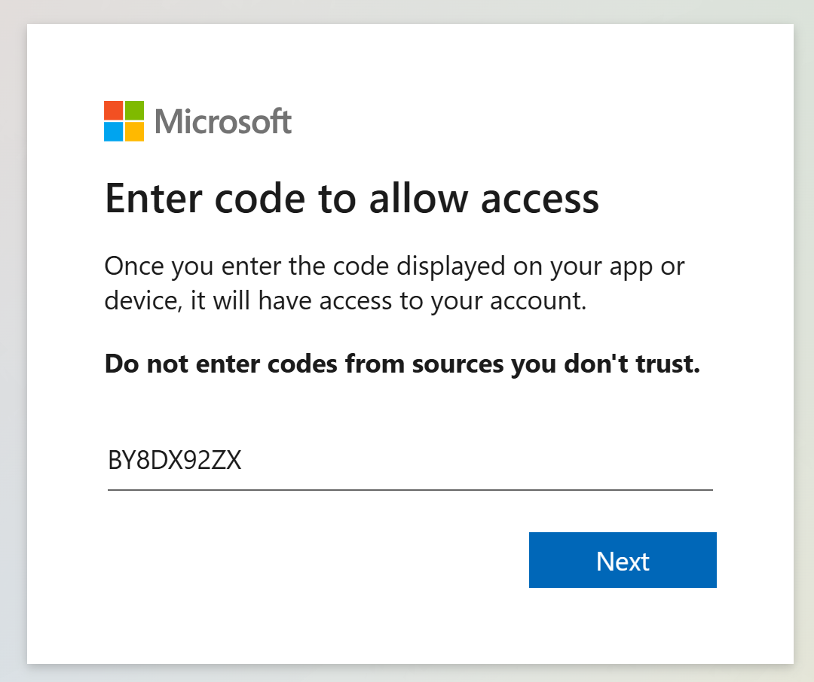

## Arc-enabled SQL Managed Instance on Azure Local

Azure Local can provide host infrastructure for [AKS enabled by Azure Arc](https://learn.microsoft.com/azure/aks/aksarc/aks-overview) which can be used to deploy Azure Arc-enabled SQL Managed Instance. To deploy Azure Arc-enabled SQL Managed Instance on Azure Local, you must first deploy an [AKS enabled by Azure Arc](https://learn.microsoft.com/azure/aks/aksarc/aks-overview) cluster as a prerequisite. Once your AKS cluster is deployed, come back here and follow the instructions below to deploy and configure Arc-enabled SQL Managed Instance.

- Open Windows Explorer on the _LocalBox-Client_ VM and navigate to the C:\LocalBox folder. Locate _Configure-SQLManagedInstance.ps1_ file and run with PowerShell.

  

- Open PowerShell 7 commandline window to and change directory to _C:\LocalBox\_ directory and run _$PSVersionTable_ command to confirm PowerShell version.

  

> [!IMPORTANT]
> Prior to running the following command, make sure proxy created using the command _az connectedk8s proxy_ is not running from the earlier sessions. Doing so will create conflict and the script will fail. Close any proxy and wait for few minutes to release the default proxy port.

- Run _Configure-SQLManagedInstance.ps1_ at the commandline and follow instructions to login to Azure.

  

  

  

  

- Wait for the script to finish, will take approximately 20 minutes. This scripts configures following on the Azure Local.

  - Increase AKS node size to Standard_D8s_v3
  - Increase AKS node pool count from 1 to 3 nodes
  - Create Network Extension
  - Creates Metal LB configuration
  - Creates Azure Arc-enabled Data Services extention
  - Creates Custom Location
  - Creates Arc-enabled Data Controller
  - Creates Arc-enabled SQL Managed Instance
  - Create port forward rules to access SQL MI deployed on AKS cluster on Azure Local
  - Installs SqlQueryStress tool
  - Creates desktop shortcuts for connecting to Arc-enabled SQL Managed Instance

- Once this script completes, open the resource group and group by type to see the Azure Arc-enabled SQL Managed Instance deployed with LocalBox.

  

  

## Connect to the Azure Arc-enabled SQL Managed Instance using Azure Data Studio

Azure Data Studio is installed and pre-configured on the _LocalBox-Client_ computer to allow you to connect and manage your Arc-enabled SQL Managed Instance.

- To start, click on the Azure Data Studio shortcut on the desktop of the _LocalBox-Client_ computer.

  

- Connect to the pre-configured connection, and click _Enable Trust server certificate_

  

  

- Once connected, you can now browse to the sample AdventureWorks database.

  

## Azure Arc-enabled SQL Managed Instance stress simulation

LocalBox includes a dedicated SQL stress simulation tool named SqlQueryStress automatically installed for you on the Client VM. SqlQueryStress will allow you to generate load on the Azure Arc-enabled SQL Managed Instance that can be done used to showcase how the SQL database and services are performing as well as the Azure Local instance.

- To start with, open the SqlQueryStress desktop shortcut and connect to the Arc-enabled SQL Managed Instance primary endpoint Ip address. This can be found in the _SQLMI Endpoints_ text file desktop shortcut that was created for you.

  

  

- To connect, use "SQL Server Authentication", use the credentials in the SQLMI Endpoints file, and select the deployed sample AdventureWorks2019 database (you can use the "Test" button to check the connection). Click OK once the test is successful.

  

- To generate some load, we will be running a simple stored procedure. Copy the below procedure and change the number of iterations you want it to run as well as the number of threads to generate even more load on the database. In addition, change the delay between queries to 1ms for allowing the stored procedure to run for a while. Click on Go to start generating load.

    ```sql
    exec [dbo].[uspGetEmployeeManagers] @BusinessEntityID = 8
    ```

- As you can see from the example below, the configuration settings are 100,000 iterations, five threads per iteration, and a 1ms delay between queries. These configurations should allow you to have the stress test running for a while.

  

- To monitor the performance of the Azure Local instance, click on the Insights workbook and explore logs from your cluster.

    

## Next steps

Azure Arc-enabled SQL Managed Instance provides many more capabilities not directly covered here. Review the documentation to continue your journey with [Azure Arc-enabled SQL Managed Instance](https://learn.microsoft.com/azure/azure-arc/data/managed-instance-overview).
