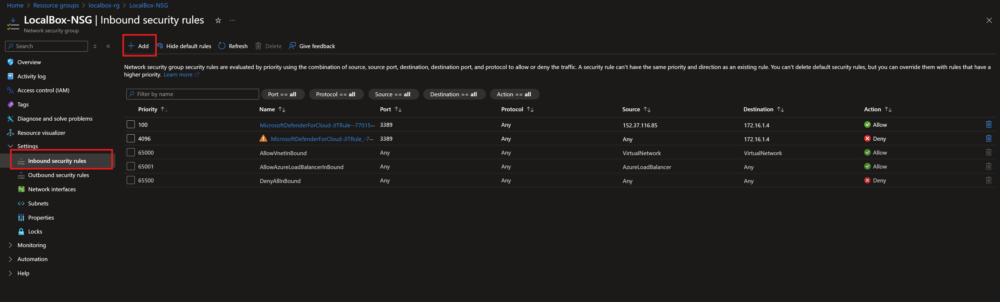
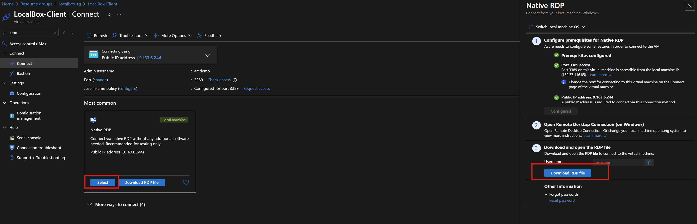

# Connect to LocalBox

## Start post-deployment automation

Once your Bicep deployment is complete, you can open the Azure portal to see the initial LocalBox resources inside your resource group. Now you must remote into the _LocalBox-Client_ VM to continue the next phase of the deployment.

  

   > **Note:** RDP (3389) and SSH (22) ports are not open by default in LocalBox deployments. You will need to create a network security group (NSG) rule to allow network access to port 3389, or use [Azure Bastion](https://learn.microsoft.com/azure/bastion/bastion-overview) or [Just-in-Time (JIT)](https://learn.microsoft.com/azure/defender-for-cloud/just-in-time-access-usage?tabs=jit-config-asc%2Cjit-request-asc) access to connect to the VM.

## Connecting to the LocalBox Client virtual machine

> **Note:** As the subnet the Azure Local VMs resides on is on the second nested layer, it is necessary to connect to the AzLMGMT machine to be able to connect to those VMs:
> The Azure Local VM subnet is also not routable into the Azure Virtual Network, hence it won't be possible to connect to virtual machines on the Azure Local instance using Azure Bastion.
>
> If you are having difficulties connecting into a Azure Local VM:
> You can run `mstsc /v:192.168.1.11` from LocalBox-Client to connect to the AzLMGMT nested VM.
> From there, run `mstsc /v:192.168.200.x` to connect to the Azure Local VMs (replace x with the IP of your deployed VM).

Various options are available to connect to _LocalBox-Client_ VM, depending on the parameters you supplied during deployment.

- [RDP](#connecting-directly-using-rdp) - available after configuring access to port 3389 on the _Arc-App-Client-NSG_, or by enabling [Just-in-Time access (JIT)](#connect-using-just-in-time-access-jit).
- [Azure Bastion](#connect-using-azure-bastion) - available if *`true`* was the value of your _`deployBastion`_ parameter during deployment.

### Connecting directly using RDP

By design, LocalBox does not open port 3389 on the network security group. Therefore, you must create an NSG rule to allow inbound 3389.

- Open the _LocalBox-NSG_ resource in Azure portal and click "Add" to add a new rule.

  

  

- Specify the IP address that you will be connecting from and select RDP as the service with "Allow" set as the action. You can retrieve your public IP address by accessing [https://icanhazip.com](https://icanhazip.com) or [https://whatismyip.com](https://whatismyip.com).

  

  

  

### Connect using Azure Bastion

- If you have chosen to deploy Azure Bastion in your deployment, use it to connect to the VM.

  

  > **Note:** When using Azure Bastion, the desktop background image is not visible. Therefore some screenshots in this guide may not exactly match your experience if you are connecting to _LocalBox-Client_ with Azure Bastion.

### Connect using just-in-time access (JIT)

If you already have [Microsoft Defender for Cloud](https://learn.microsoft.com/azure/defender-for-cloud/just-in-time-access-usage?tabs=jit-config-asc%2Cjit-request-asc) enabled on your subscription and would like to use JIT to access the Client VM, use the following steps:

- In the Client VM configuration pane, enable just-in-time. This will enable the default settings.

  

  

  

### The Logon scripts

- Once you log into the _LocalBox-Client_ VM, a PowerShell script will open and start running. This script will take approximately 4-5 hours to finish, and once completed, the script window will close automatically. If there are any Azure Local updates available, we need to add 1 additional hour to the estimated deployment time.
At this point, the infrastructure deployment is complete.

  

- In the Azure portal, validate that both Azure Local machines (AzLHOST1 and AzLHOST2) have been created as Arc-enabled servers.

## Azure Local instance validation and deployment from the Azure portal

If you chose to configure the `autoDeployClusterResource` parameter with the value `false` in your deployment, please refer to the [Manual Deployment](../manual_deployment/) guide to validate and deploy your Azure Local instance manually. If you did not override this parameter, you may proceed to the section [_Deployment complete_](#deployment-complete) below.

Visit [troubleshooting](../troubleshooting/) if needed for deployment issues.

## Deployment complete

In your LocalBox resource group, open the cluster resource `localboxcluster`, navigate to `Settings` -> `Deployments` and verify that all steps has completed successfully.

  

Once the LocalBox instance is deployed it's time to start exploring various LocalBox features. Head on to the [Using LocalBox](../using_localbox/) guide for the next steps.

  
