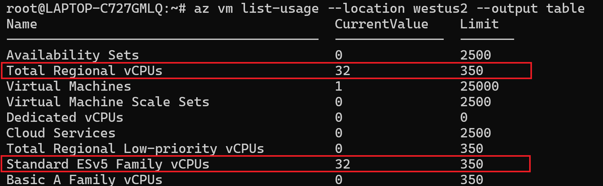
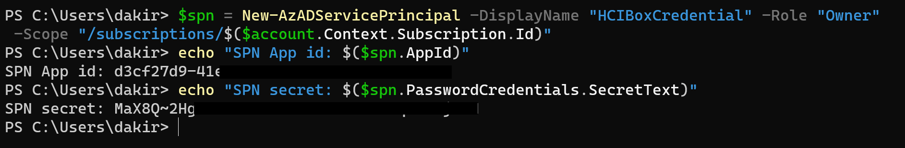
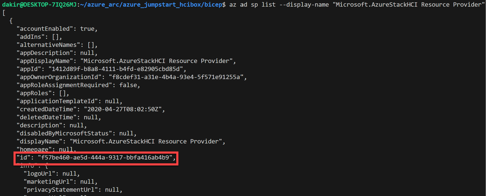
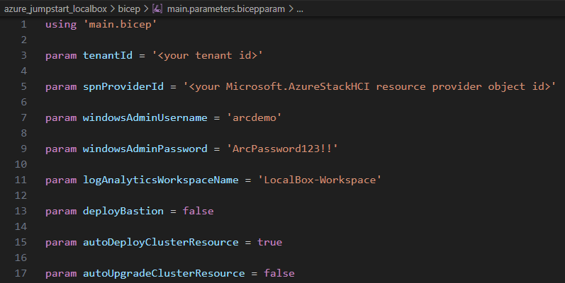
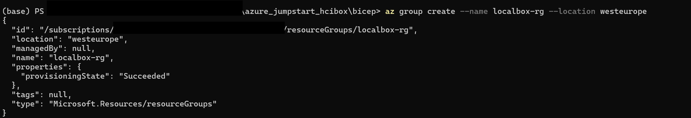
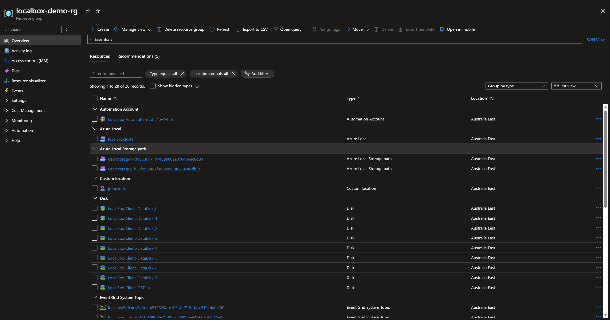

# Deploy LocalBox infrastructure with Azure Bicep

## Azure Bicep

Azure Bicep is used to deploy LocalBox into your Azure subscription. To deploy, you require a service principal by your Azure administrator for use with LocalBox. Read on to learn how to deploy LocalBox with Azure CLI.

### Prepare the environment

> **Note:** LocalBox can be deployed in the East US, Australia East, Canada Central and West Europe Azure regions. Deploying in other regions will result in unexpected behavior or failures. It requires 32 ESv5-series or 32 ESv6-series vCPUs when deploying with default parameters such as VM series/size. Ensure you have sufficient vCPU quota available in your Azure subscription and the region where you plan to deploy LocalBox. You can use the below Az CLI command to check your vCPU utilization.

- Clone the Arc Jumpstart GitHub repository

  ```shell
  git clone https://github.com/microsoft/azure_arc.git
  ```

- [Install or update Azure CLI to version 2.65.0 or above](https://learn.microsoft.com/cli/azure/install-azure-cli?view=azure-cli-latest). Use the below command to check your current installed version.

  ```shell
  az --version
  ```

- Login to AZ CLI using the *`az login`* command.

- Ensure that you have selected the correct subscription you want to deploy LocalBox to by using the *`az account list --query "[?isDefault]"`* command. If you need to adjust the active subscription used by Az CLI, follow [this guidance](https://learn.microsoft.com/cli/azure/manage-azure-subscriptions-azure-cli#change-the-active-subscription).

  ```shell
  az vm list-usage --location <your location> --output table
  ```

  

- Create Azure service principal (SP). To deploy LocalBox, an Azure service principal assigned with the _Owner_ Role-based access control (RBAC) role is required. You can use Azure Cloud Shell (or other Bash shell), or PowerShell to create the service principal. If you are not able to create your own service principal, you can ask your Azure administrator to create one for you scoped to a pre-created resource group.

  - (Option 1) Create service principal using [Azure Cloud Shell](https://shell.azure.com/) or Bash shell with Azure CLI:

    ```shell
    az login
    subscriptionId=$(az account show --query id --output tsv)
    az ad sp create-for-rbac -n "<Unique SP Name>" --role "Owner" --scopes /subscriptions/$subscriptionId
    ```

    For example:

    ```shell
    az login
    subscriptionId=$(az account show --query id --output tsv)
    az ad sp create-for-rbac -n "JumpstartLocalBox" --role "Owner" --scopes /subscriptions/$subscriptionId
    ```

    Output should look similar to this:

    ```json
    {
    "appId": "XXXXXXXXXXXXXXXXXXXXXXXXXXXX",
    "displayName": "JumpstartLocalBox",
    "password": "XXXXXXXXXXXXXXXXXXXXXXXXXXXX",
    "tenant": "XXXXXXXXXXXXXXXXXXXXXXXXXXXX"
    }
    ```

  - (Option 2) Create service principal using PowerShell. If necessary, follow [this documentation](https://learn.microsoft.com/powershell/azure/install-az-ps?view=azps-8.3.0) to install Azure PowerShell modules.

    ```powershell
    $account = Connect-AzAccount
    $spn = New-AzADServicePrincipal -DisplayName "<Unique SPN name>" -Role "Owner" -Scope "/subscriptions/$($account.Context.Subscription.Id)"
    echo "SPN App id: $($spn.AppId)"
    echo "SPN secret: $($spn.PasswordCredentials.SecretText)"
    ```

    For example:

    ```powershell
    $account = Connect-AzAccount
    $spn = New-AzADServicePrincipal -DisplayName "LocalBoxSPN" -Role "Owner" -Scope "/subscriptions/$($account.Context.Subscription.Id)"
    echo "SPN App id: $($spn.AppId)"
    echo "SPN secret: $($spn.PasswordCredentials.SecretText)"
    ```

    Output should look similar to this:

    

    > **Note:** If you create multiple subsequent role assignments on the same service principal, your client secret (password) will be destroyed and recreated each time. Therefore, make sure you grab the correct password.

    > **Note:** It's optional but highly recommended to scope the service principal to a specific [Azure subscription and resource group](https://learn.microsoft.com/cli/azure/ad/sp?view=azure-cli-latest) as well considering using a [less privileged service principal account](https://learn.microsoft.com/azure/role-based-access-control/best-practices).

## Deploy the Bicep template

- Upgrade to latest Bicep version

  ```shell
  az bicep upgrade
  ```

- Retrieve the object id of your directory's Azure Local resource provider.

  ```shell
  az ad sp list --display-name "Microsoft.AzureStackHCI Resource Provider"
  ```

  


> **Note:** If the ```az ad sp list --display-name "Microsoft.AzureStackHCI Resource Provider"``` command returns an empty array, you should first register the provider with this command : ```az provider register --namespace Microsoft.AzureStackHCI```

> **Note:** Please avoid using the $ symbol in the `windowsAdminPassword`. Using this symbol can cause the LogonScript to fail.

- Edit the [main.bicepparam](https://github.com/microsoft/azure_arc/blob/main/azure_jumpstart_localbox/bicep/main.bicepparam) template parameters file and supply values for your environment.

| Name | Type | Description | Default |
| --- | --- | --- | --- |
| `autoDeployClusterResource` | bool | Choice to enable automatic deployment of Azure Local enabled by Arc cluster resource after the client VM deployment is complete. | true |
| `autoUpgradeClusterResource` | bool | Choice to enable automatic upgrade of Azure Local enabled by Arc cluster resource after the client VM deployment is complete. Only applicable when autoDeployClusterResource is true. | false |
| `deployBastion` | bool | Choice to deploy Bastion to connect to the client VM | false |
| `githubAccount` | string | Target GitHub account | "microsoft" |
| `githubBranch` | string | Target GitHub branch | "main" |
| `governResourceTags` | bool | Setting this parameter to `true` will add the `CostControl` and `SecurityControl` tags to the provisioned resources. These tags are applicable to ONLY Microsoft-internal Azure lab tenants and designed for managing automated governance processes related to cost optimization and security controls | true |
| `location` | string | Location to deploy resources | Resource group`s location |
| `logAnalyticsWorkspaceName` | string | Name for your log analytics workspace |  |
| `natDNS` | string | Public DNS to use for the domain | "8.8.8.8" |
| `rdpPort` | string | Override default RDP port using this parameter. Default is 3389. No changes will be made to the client VM. | "3389" |
| `spnClientId` | string | Azure service principal client id |  |
| `spnClientSecret` | securestring | Azure service principal client secret |  |
| `spnProviderId` | string | Azure AD object id for your Microsoft.AzureStackHCI resource provider |  |
| `spnTenantId` | string | Azure AD tenant id for your service principal |  |
| `tags` | object | Tags to be added to all resources | {"Project": "jumpstart_LocalBox"} |
| `vmAutologon` | bool | Enable automatic logon into LocalBox Virtual Machine | true |
| `windowsAdminPassword` | securestring | Password for Windows account. Password must have 3 of the following: 1 lower case character, 1 upper case character, 1 number, and 1 special character. The value must be between 12 and 123 characters long |  |
| `windowsAdminUsername` | string | Username for Windows account |  |
| `vmSize` | string | The size of the Virtual Machine | Standard_E32s_v6 |

  > **Disclaimer:** The *governResourceTags* parameter is optional and set to true by default. If not specified, both *CostControl: 'Ignore'* and *SecurityControl: 'Ignore'* tag values will be added. These tags are applicable to **ONLY Microsoft-internal Azure lab tenants** and designed for managing automated governance processes related to cost optimization and security controls. As mentioned, it will get added to the deployment **only** if the *governResourceTags* parameter was set to true. If you are deploying LocalBox from a Microsoft-internal tenant and Azure subscription, this parameter is required to be set to 'true'. Failure to do so will cause your deployment to have issues and most likely to fail.

Example parameter-file:



- Create a new resource group and then deploy the Bicep file. Navigate to the local cloned [deployment folder](https://github.com/microsoft/azure_arc/tree/main/azure_jumpstart_localbox/bicep) and run the following command:

  ```shell
  az group create --name "<resource-group-name>"  --location "<location>"
  az deployment group create -g "<resource-group-name>" -f "main.bicep" -p "main.bicepparam"
  ```

  

## Start post-deployment automation

Once your deployment is complete, you can open the Azure portal and see the initial LocalBox resources inside your resource group. Now you must remote into the *LocalBox-Client* VM to continue the next phase of the deployment. [Continue to learn how to deploy instance in Azure portal](../cloud_deployment/#azure-local-instance-validation-and-deployment-from-the-azure-portal) for the next steps.

  

## Clean up the deployment

To clean up your deployment, simply delete the resource group using Azure CLI or Azure portal.

- Clean up Using Azure CLI

  ```shell
  az group delete -n <name of your resource group>
  ```
