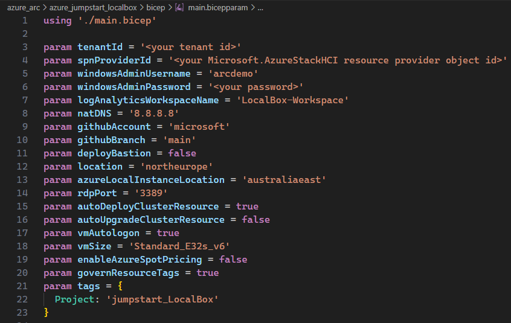
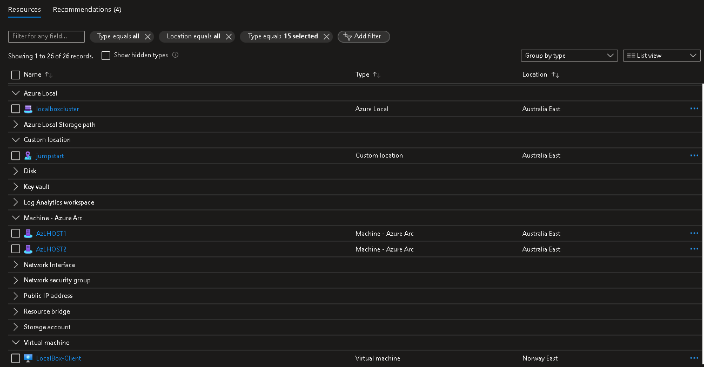

# Deploy LocalBox infrastructure with Azure Bicep

## Azure Bicep

Azure Bicep is used to deploy LocalBox into your Azure subscription. Read on to learn how to deploy LocalBox with Azure CLI.

### Prepare the environment

- Register required Azure resource providers. Make sure that your Azure subscription is registered against the required resource providers. To register, you must be an owner or contributor on your subscription. You can also ask an administrator to register.

  Run the following PowerShell commands to register:

  ```powershell
  Register-AzResourceProvider -ProviderNamespace "Microsoft.HybridCompute"
  Register-AzResourceProvider -ProviderNamespace "Microsoft.GuestConfiguration"
  Register-AzResourceProvider -ProviderNamespace "Microsoft.HybridConnectivity"
  Register-AzResourceProvider -ProviderNamespace "Microsoft.AzureStackHCI"
  Register-AzResourceProvider -ProviderNamespace "Microsoft.Kubernetes"
  Register-AzResourceProvider -ProviderNamespace "Microsoft.KubernetesConfiguration"
  Register-AzResourceProvider -ProviderNamespace "Microsoft.ExtendedLocation"
  Register-AzResourceProvider -ProviderNamespace "Microsoft.ResourceConnector"
  Register-AzResourceProvider -ProviderNamespace "Microsoft.HybridContainerService"
  Register-AzResourceProvider -ProviderNamespace "Microsoft.Attestation"
  Register-AzResourceProvider -ProviderNamespace "Microsoft.Storage"
  Register-AzResourceProvider -ProviderNamespace "Microsoft Insights"
  ```

  Alternatively, you can register these providers using Azure CLI:

  ```shell
  az provider register --namespace Microsoft.HybridCompute
  az provider register --namespace Microsoft.GuestConfiguration
  az provider register --namespace Microsoft.HybridConnectivity
  az provider register --namespace Microsoft.AzureStackHCI
  az provider register --namespace Microsoft.Kubernetes
  az provider register --namespace Microsoft.KubernetesConfiguration
  az provider register --namespace Microsoft.ExtendedLocation
  az provider register --namespace Microsoft.ResourceConnector
  az provider register --namespace Microsoft.HybridContainerService
  az provider register --namespace Microsoft.Attestation
  az provider register --namespace Microsoft.Storage
  az provider register --namespace Microsoft.Insights
  ```

- Clone the Arc Jumpstart GitHub repository

  ```shell
  git clone https://github.com/microsoft/azure_arc.git
  ```

- [Install or update Azure CLI to version 2.65.0 or above](https://learn.microsoft.com/cli/azure/install-azure-cli?view=azure-cli-latest). Use the below command to check your current installed version.

  ```shell
  az --version
  ```

- Login to AZ CLI using the *`az login`* command.

- Ensure that you have selected the correct subscription you want to deploy LocalBox to by using the *`az account list --query "[?isDefault]"`* command. If you need to adjust the active subscription used by Az CLI, follow [this guidance](https://learn.microsoft.com/cli/azure/manage-azure-subscriptions-azure-cli#change-the-active-subscription).

> **Note:** LocalBox can be deployed in any region with sufficient compute capacity (vCPU quotas) for the chosen VM SKU (Standard E32s v5 or v6). It requires 32 ESv6-series vCPUs when deploying with default parameters such as VM series/size. Ensure you have sufficient vCPU quota available in your Azure subscription and the region where you plan to deploy LocalBox. You can use the below Azure CLI command to check your vCPU utilization.

  ```shell
  az vm list-usage --location <your location> --output table
  ```

  

## Deploy the Bicep template

- Upgrade to latest Bicep version

  ```shell
  az bicep upgrade
  ```

- Retrieve the object id of your directory's Azure Local resource provider.

  ```shell
  az ad sp list --display-name "Microsoft.AzureStackHCI Resource Provider"
  ```

  

> **Note:** If the ```az ad sp list --display-name "Microsoft.AzureStackHCI Resource Provider"``` command returns an empty array, you should first register the provider with this command : ```az provider register --namespace Microsoft.AzureStackHCI```

> **Note:** Please avoid using the $ symbol in the `windowsAdminPassword`. Using this symbol can cause the LogonScript to fail.

- Edit the [main.bicepparam](https://github.com/microsoft/azure_arc/blob/main/azure_jumpstart_localbox/bicep/main.bicepparam) template parameters file and supply values for your environment.

| Name | Type | Description | Default |
| --- | --- | --- | --- |
| `autoDeployClusterResource` | bool | Choice to enable automatic deployment of Azure Local enabled by Arc instance resource after the client VM deployment is complete. | true |
| `autoUpgradeClusterResource` | bool | Choice to enable automatic upgrade of Azure Local enabled by Arc instance resource after the client VM deployment is complete. Only applicable when autoDeployClusterResource is true. | false |
| `deployBastion` | bool | Choice to deploy Bastion to connect to the client VM | false |
| `githubAccount` | string | Target GitHub account | "microsoft" |
| `githubBranch` | string | Target GitHub branch | "main" |
| `governResourceTags` | bool | Setting this parameter to `true` will add the `CostControl` and `SecurityControl` tags to the provisioned resources. These tags are applicable to ONLY Microsoft-internal Azure lab tenants and designed for managing automated governance processes related to cost optimization and security controls | true |
| `location` | string | Location to deploy resources | Resource group`s location |
| `azureLocalInstanceLocation` | string | Region to register Azure Local instance in. This is the region where the Azure Local instance resources will be created. The region must be one of the supported Azure Local regions: australiaeast,southcentralus,eastus,westeurope,southeastasia,canadacentral,japaneast,centralindia | australiaeast |
| `logAnalyticsWorkspaceName` | string | Name for your log analytics workspace |  |
| `natDNS` | string | Public DNS to use for the domain | "8.8.8.8" |
| `rdpPort` | string | Override default RDP port using this parameter. Default is 3389. No changes will be made to the client VM. | "3389" |
| `spnProviderId` | string | Entra ID object id for your _Microsoft.AzureStackHCI_ resource provider |  |
| `tenantId` | string | Entra ID tenant id for your subscription |  |
| `tags` | object | Tags to be added to all resources | {"Project": "jumpstart_LocalBox"} |
| `vmAutologon` | bool | Enable automatic logon into LocalBox Client VM | true |
| `windowsAdminPassword` | securestring | Password for Windows account. Password must have 3 of the following: 1 lower case character, 1 upper case character, 1 number, and 1 special character. The value must be between 12 and 123 characters long |  |
| `windowsAdminUsername` | string | Username for Windows account |  |
| `vmSize` | string | The size of the LocalBox Client VM. Valid values: Standard_E32s_v5 and Standard_E32s_v6 | Standard_E32s_v6 |
| `enableAzureSpotPricing` | string | Enable Azure VM Spot pricing for the LocalBox Client VM | false |

  > **Disclaimer:** The _governResourceTags_ parameter is optional and set to true by default. If not specified, both _CostControl: 'Ignore'_ and _SecurityControl: 'Ignore'_ tag values will be added. These tags are applicable to **ONLY Microsoft-internal Azure lab tenants** and designed for managing automated governance processes related to cost optimization and security controls. As mentioned, it will get added to the deployment **only** if the _governResourceTags_ parameter was set to true. If you are deploying LocalBox from a Microsoft-internal tenant and Azure subscription, this parameter is required to be set to 'true'. Failure to do so will cause your deployment to have issues and most likely to fail.

Example parameter-file:



- Create a new resource group and then deploy the Bicep file. Navigate to the local cloned [deployment folder](https://github.com/microsoft/azure_arc/tree/main/azure_jumpstart_localbox/bicep) and run the following command:

  ```shell
  az group create --name "<resource-group-name>"  --location "<location>"
  az deployment group create -g "<resource-group-name>" -f "main.bicep" -p "main.bicepparam"
  ```

  

## Start post-deployment automation

Once your deployment is complete, you can open the Azure portal and see the initial LocalBox resources inside your resource group. Now you must remote into the *LocalBox-Client* VM to continue the next phase of the deployment. [Continue to learn how to deploy instance in Azure portal](../cloud_deployment/#azure-local-instance-validation-and-deployment-from-the-azure-portal) for the next steps.

  

## Clean up the deployment

To clean up your deployment, simply delete the resource group using Azure CLI or Azure portal.

- Clean up Using Azure CLI

  ```shell
  az group delete -n <name of your resource group>
  ```
