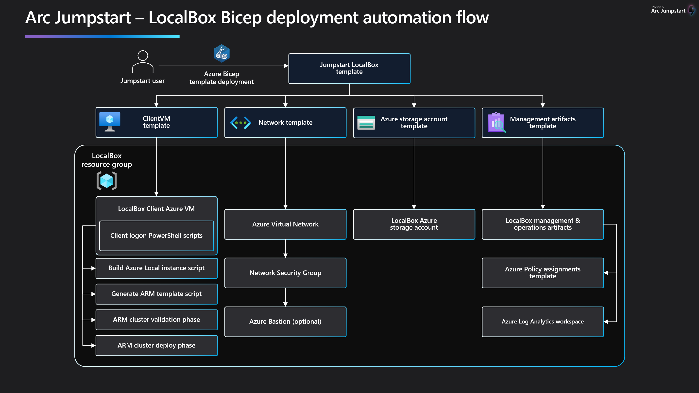

# Evaluating Azure Local with LocalBox

## Getting started

LocalBox is a turnkey solution that provides a complete sandbox for exploring [Azure Local](https://learn.microsoft.com/azure/azure-local/whats-new) capabilities and hybrid cloud integration in a virtualized environment. LocalBox is designed to be completely self-contained within a single Azure subscription and resource group, which will make it easy for a user to get hands-on with Azure Local and [Azure Arc](https://learn.microsoft.com/azure/azure-arc/overview) technology without the need for physical hardware.

## Use cases

- Sandbox environment for getting hands-on with Azure Local and Azure Arc technologies
- Accelerator for Proof-of-concepts or pilots
- Training tool for skills development
- Demo environment for customer presentations or events
- Rapid integration testing platform

## Azure Local capabilities available in LocalBox

### 2-node Azure Local instance

LocalBox automatically creates and configures a two-node Azure Local instance using nested virtualization with Hyper-V running on an Azure Virtual Machine. This Hyper-V host creates three guest virtual machines: two Azure Local machines (_AzLHOST1_, _AzLHOST2_), and one nested Hyper-V host (_AzLMGMT_). _AzLMGMT_ itself hosts two guest VMs: an [Active Directory domain controller](https://learn.microsoft.com/windows-server/identity/ad-ds/get-started/virtual-dc/active-directory-domain-services-overview), and a [Routing and Remote Access Server](https://learn.microsoft.com/windows-server/remote/remote-access/remote-access) acting as a virtual router.

### Virtual machine management

LocalBox comes with [guest VM management in Azure portal](https://learn.microsoft.com/azure/azure-local/manage/azure-arc-vm-management-overview). The LocalBox documentation will walk you through how to use this feature, including configuring VM images from Azure marketplace and creating VMs on your instance.

### AKS enabled by Azure Arc on Azure Local

Azure Local includes [AKS enabled by Azure Arc](https://learn.microsoft.com/azure/aks/aksarc/aks-overview) as part of the default configuration. A user script is provided that can be used to create a workload instance.

## LocalBox Azure Consumption Costs

LocalBox resources generate Azure Consumption charges from the underlying Azure resources including core compute, storage, networking and auxiliary services. Note that Azure consumption costs may vary depending the region where LocalBox is deployed. Be mindful of your LocalBox deployments and ensure that you disable or delete LocalBox resources when not in use to avoid unwanted charges. Please see the [Jumpstart LocalBox FAQ](../faq/) for more information on consumption costs.

## Deployment Options and Flow

LocalBox supports [Bicep](https://learn.microsoft.com/azure/azure-resource-manager/bicep/overview?tabs=bicep) templates to deploy and configure necessary Azure resources.

Deploying LocalBox is a multi-step process that includes:

1. Deploy Azure infrastructure
2. Automation scripts configure virtual Azure Local instance and generate ARM template
3. User or automation deploys ARM template (Azure Local instance validate phase)
4. User or automation re-deploys ARM template (Azure Local instance deploy phase)

## Deploy LocalBox

- [Deploy LocalBox with Azure Bicep](../deployment_az/) : Requires pre-configured service principal.

Looking for something else related to LocalBox?

- [Connect to LocalBox](../cloud_deployment/)

- [LocalBox FAQ](../faq/)
