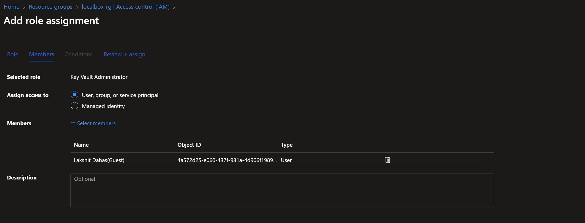
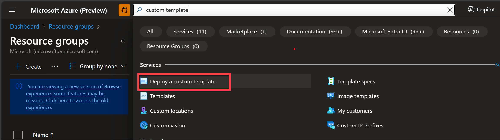
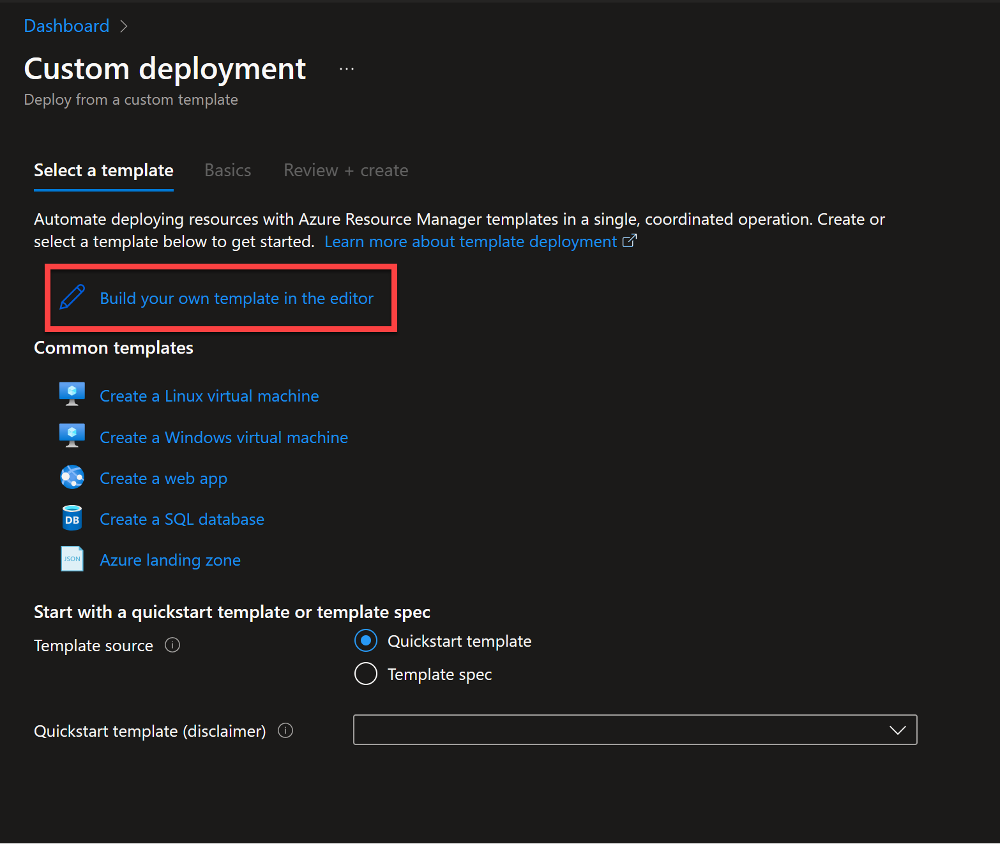
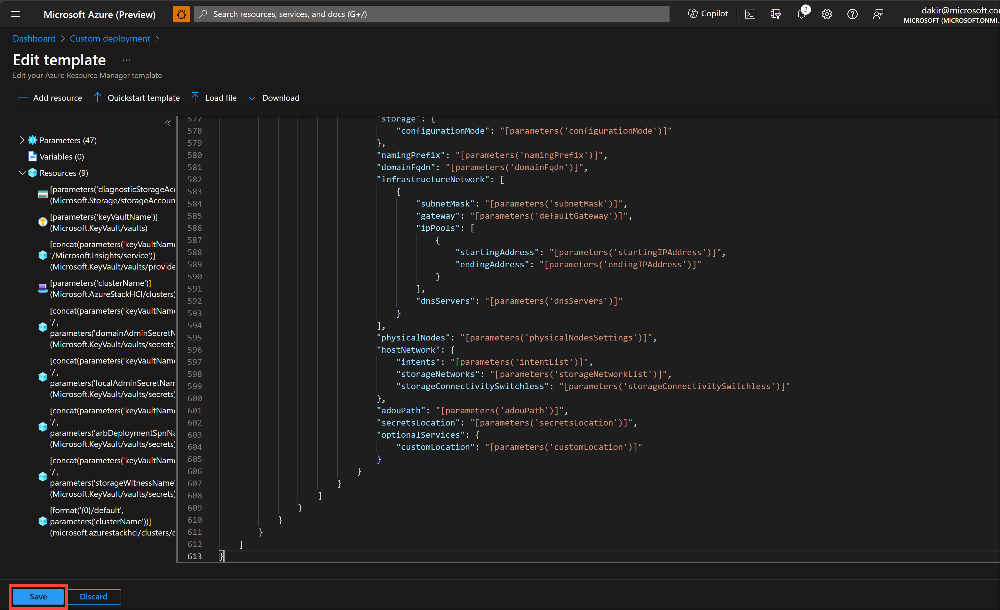
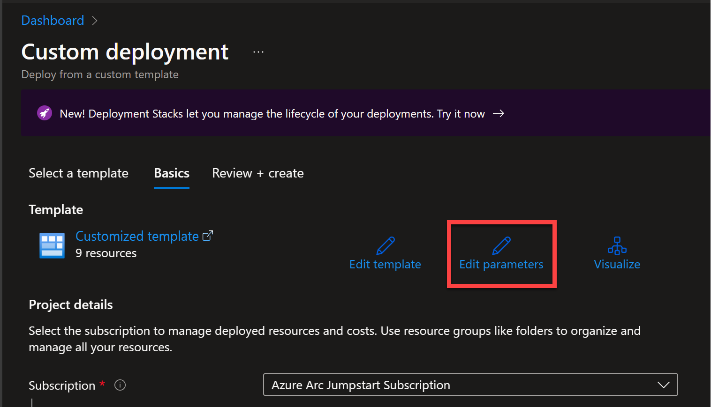
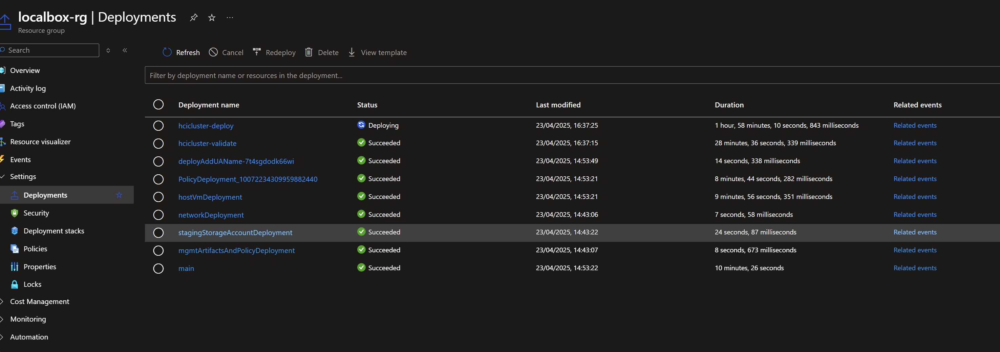
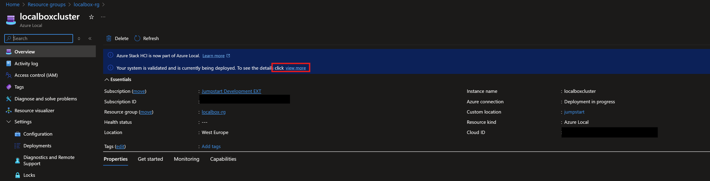
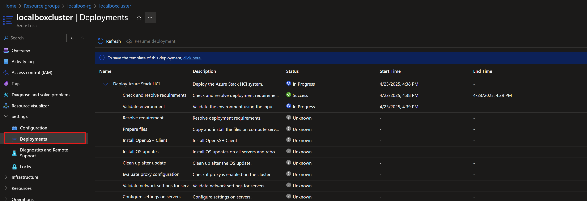
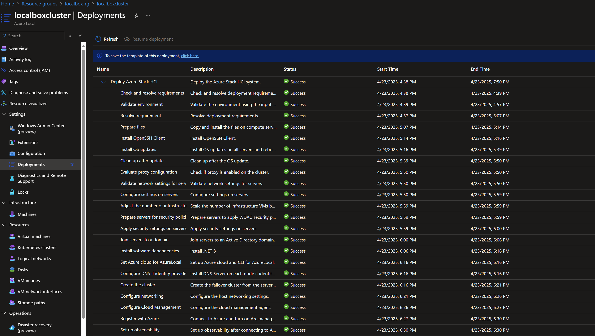
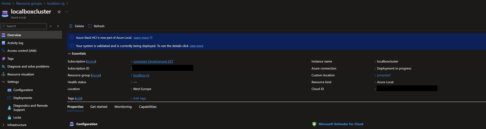

# Manual Azure Local Deployment

> **Important:** If you chose to configure the `autoDeployClusterResource` parameter with the value `false` in your deployment, proceed with the steps on this page to manually validate and deploy your Azure Local instance. This provides a hands-on learning experience for understanding the Azure Local deployment process.

## Overview

Manual deployment allows you to step through the Azure Local validation and deployment process, giving you greater control and understanding of each phase. Azure Local uses a two-step process to create and register instances in Azure using an ARM template:

1. **Validate** - an ARM template is deployed with a "validate" flag. This begins the final instance validation step and takes around 20 minutes.
2. **Deploy** - the same ARM template is redeployed with the "deploy" flag. This deploys the instance and Arc infrastructure and registers the instance. This step takes around 2-3 hours.

## Prerequisites

Before proceeding with manual deployment, ensure that:
- Your LocalBox infrastructure deployment has completed successfully
- You are logged into the _LocalBox-Client_ VM

## Manual Deployment via Azure Portal

### Step 1: Configure Required Permissions

Before submitting the ARM deployment, you need to add your user account with the necessary permissions:

- Navigate to your LocalBox resource group in the Azure portal
- Click "Access Control (IAM)" and then "Add role assignment"
- Select the "Key Vault Administrator" role, then select your user account and assign the role

  

- Repeat this process to add your user account as a "Storage Account Contributor" on the LocalBox resource group

### Step 2: Prepare ARM Templates

- On the _LocalBox-Client_ VM, open File Explorer and navigate to the _C:\LocalBox_ folder
- Right-click on the folder and open it in VSCode
- Open and review the `azlocal.json` and `azlocal.parameters.json` files
- Verify that the `azlocal.parameters.json` file looks correct without "_-staging_" placeholder parameter values

### Step 3: Validate Instance in Azure Portal

- Navigate to Azure portal and type "custom deployment" in the search bar
- Select "Deploy a custom template"

  

- Select "Build your own template in the editor"

  

- Paste the contents of `azlocal.json` into the editor and click "Save"

  

- Click "Edit parameters" and then paste the contents of `azlocal.parameters.json` into the editor and click "Save"

  

- Click through on "Create" and then "Review and Create" to start the validation phase of instance deployment

  

- Monitor validation progress until complete (approximately 20 minutes)

### Step 4: Deploy Instance in Azure Portal

- When validation is complete, navigate to the instance resource in your LocalBox resource group
- The banner should indicate that your instance is validated but not yet deployed
- Click the "Deploy now" link

  

- Click through to submit the deployment
- The instance may take 2-3 hours to deploy
- Monitor progress on the _Deployments_ tab of the instance (click Refresh to get the latest status)

  

## Verify Deployment Completion

- In your LocalBox resource group, open the cluster resource `localboxcluster`
- Navigate to `Settings` -> `Deployments`
- Verify that all steps have completed successfully

  

Once the LocalBox instance is deployed, you can start exploring various LocalBox features. Head to the [Using LocalBox](../using_localbox/) guide for the next steps.

  

## Troubleshooting Manual Deployment

If you encounter issues during manual deployment, visit the [troubleshooting](../troubleshooting/) guide for deployment issues and log analysis.

