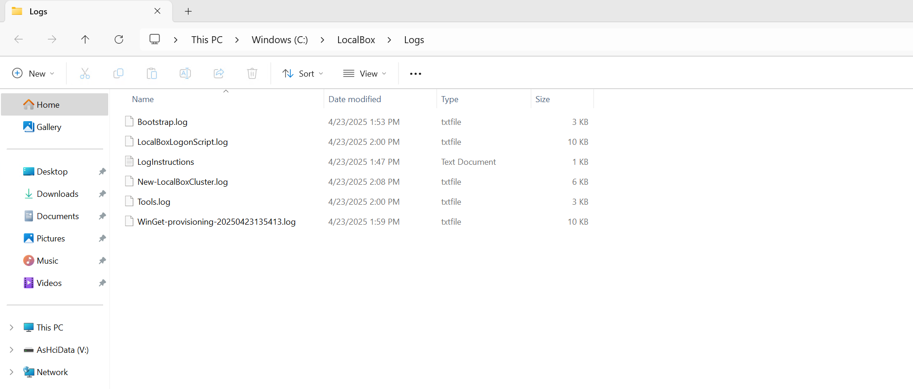

# Troubleshooting LocalBox

## Troubleshooting Deployments

Occasionally deployments of LocalBox may fail at various stages. Common reasons for failed deployments include:

- Invalid service principal id, service principal secret, or service principal Azure tenant ID provided in the _main.bicepparam_ Bicep template file. This can cause failures when running automation that requires logging into Azure, such as the scripts that register the Azure Local instance, deploy AKS enabled by Azure Arc cluster, or configure Arc Resource Bridge.
- Not enough vCPU quota available in your target Azure region - check vCPU quota and ensure you have at least 32 available. See the [prerequisites](../getting_started/#prerequisites) section for more details.
- Corruption when downloading LocalBox VHD files can interrupt deployments. LocalBox should automatically halt if this occurs. Re-running the PowerShell script at _C:\LocalBox\LocalBoxLogonScript.ps1_ can often repair this issue.

If you have issues that you cannot resolve when deploying LocalBox please submit an issue on the [GitHub repo](https://github.com/microsoft/azure_arc/issues)

### Exploring logs from the _LocalBox-Client_ virtual machine

Occasionally, you may need to review log output from scripts that run on the _LocalBox-Client_ virtual machines in case of deployment failures. To make troubleshooting easier, the LocalBox deployment scripts collect all relevant logs in the _C:\LocalBox\Logs_ folder on _LocalBox-Client_. A short description of the logs and their purpose can be seen in the list below:

| Log file                                      | Description                                                                                                                               |
| --------------------------------------------- | ----------------------------------------------------------------------------------------------------------------------------------------- |
| _C:\LocalBox\Logs\Bootstrap.log_              | Output from the initial bootstrapping script that runs on _LocalBox-Client_.                                                              |
| _C:\LocalBox\Logs\New-LocalBoxCluster.log_    | Output of _New-LocalBoxCluster.ps1_ which configures the Hyper-V host and builds the Azure Local instance, management VMs, and other configurations. |
| _C:\LocalBox\Logs\Generate-ARM-Template.log_  | Log output of the script that builds the _hci.json_ and _hci.parameters.json_ file                                                        |
| _C:\LocalBox\Logs\LocalBoxLogonScript.log_    | Log output from the orchestrator script that manages the install                                                                          |
| _C:\LocalBox\Logs\Tools.log_                  | Log output from tools installation during bootstrap                                                                                       |

  

If you are still having issues deploying LocalBox, please [submit an issue](https://aka.ms/JumpstartIssue) on GitHub and include a detailed description of your issue and the Azure region you are deploying to. Inside the _C:\LocalBox\Logs_ folder you can also find instructions for uploading your logs to an Azure storage account for review by the Jumpstart team.
