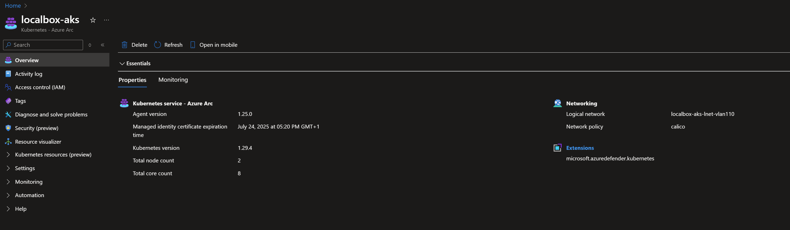

# Evaluating the LocalBox

## Using LocalBox

LocalBox has many features that can be explored through the Azure portal or from inside the _LocalBox-Client_ virtual machine. To help you navigate all the features included, read through the following sections to understand the general architecture and how to use various features.

## Nested virtualization

LocalBox simulates a 2-node physical deployment of Azure Local by using [nested virtualization on Hyper-V](https://learn.microsoft.com/virtualization/hyper-v-on-windows/user-guide/nested-virtualization). To ensure you have the best experience with LocalBox, take a moment to review the details below to help you understand the various nested VMs that make up the solution.

  

| Computer Name    | Role                                | Domain Joined | Parent Host     | OS                  |
| ---------------- | ----------------------------------- | ------------- | --------------- | ------------------- |
| _LocalBox-Client_  | Primary host                        | No            | Azure           | Windows Server 2025 |
| _AzLHOST1_       | Azure Local machine                            | Yes           | _LocalBox-Client_ | Azure Local     |
| _AzLHOST2_       | Azure Local machine                            | Yes           | _LocalBox-Client_ | Azure Local     |
| _AzLMGMT_        | Nested hypervisor                   | No            | _LocalBox-Client_ | Windows Server 2022 |
| _JumpstartDC_    | Domain controller                   | Yes (DC)      | _AzLMGMT_       | Windows Server 2022 |
| _Vm-Router_      | Remote Access Server                | No            | _AzLMGMT_       | Windows Server 2022 |

## Active Directory domain user credentials

Once you are logged into the _LocalBox-Client_ VM using the local admin credentials you supplied in your template parameters during deployment you will need to switch to using a domain account to access most other functions, such as logging into the Azure Local nodes. The default domain account is _administrator@jumpstart.local_.

  > **Note:** The password for this account is set as the same password you supplied during deployment for the local account. Many LocalBox operations will use the domain account wherever credentials are required.

## Monitoring Azure Local

Azure Local integrates with [Azure Monitor](https://learn.microsoft.com/azure/azure-local/manage/monitor-hci-single) to support monitoring Azure Local instance insights through the Azure portal. Follow these steps to configure monitoring on your LocalBox instance.

- Open the Overview blade of your instance and see that platform monitoring is available by default.

  

- From the Overview blade of the _LocalBox-Cluster_ resource, select the "Capabilities" tab, then click on Insights and then "Getting Started." Follow the wizard to create a new data collection rule and data collection endpoint.

  

- It will take time for the logs data to flow through to Insights. Once data is available, click on the Insights blade of the _LocalBox-Cluster_ resource to view the Insights workbook and explore logs from your instance.

  

## Upgrading Azure Local

LocalBox is regularly updated with the latest available version of the installation medium. The product group regularly publish updates which contains security fixes and feature improvements, which may be released after the latest LocalBox update.
Due to this, it might be required to trigger an update after the initial deployment of the Azure Local instance.

If you chose to enable the parameter `autoUpgradeClusterResource` to enable automatic upgrade of the Azure Local instance after the deployment is complete, you should already be on the latest version available.

If not, we recommend you to check whether there are any updates available.

  

If the _Status_-column does not indicate _Up to date_, you can trigger the update process by clicking _One-time update_.

See the [product documentation](https://learn.microsoft.com/azure/azure-local/update/about-updates-23h2) for more information about Azure Local updates.

## Virtual machine management through Azure portal

Azure Local supports [VM management through the Azure portal](https://learn.microsoft.com/azure/azure-local/manage/azure-arc-vm-management-overview). Open the [LocalBox VM provisioning documentation](../RB/) to get started.

## Azure Kubernetes Service (AKS)

LocalBox comes pre-configured with [AKS enabled by Azure Arc](https://learn.microsoft.com/azure/aks/aksarc/aks-overview). Open the [Azure Kubernetes Service on your Azure Local LocalBox documentation](../AKS/) to explore currently available features.

## Advanced Configurations

Some users may be interested in changing LocalBox's default configuration. Many settings can be configured by modifying the values in the [_LocalBox-Config.psd1_](https://github.com/microsoft/azure_arc/blob/main/azure_jumpstart_Localbox/artifacts/PowerShell/LocalBox-Config.psd1) PowerShell file. If you wish to make changes to this file, you must fork the Jumpstart repo and make the changes in your fork, then set the optional _githubAccount_ and _githubBranch_ deployment template parameters to point to your fork.

  > **Note:** Advanced configuration deployments are not supported by the Jumpstart team. Changes made to the _LocalBox-Config.psd1_ file may result in failures at any point in LocalBox deployment. Make changes to this file only if you understand the implications of the change.

## Next steps

LocalBox is a sandbox that can be used for a large variety of use cases, such as an environment for testing and training or to jumpstart proof of concept projects. You are free to do whatever you wish with LocalBox. Some suggested next steps for you to try in your LocalBox are:

- Explore Windows Admin Center from Azure portal
- Deploy GitOps configurations with Azure Arc-enabled Kubernetes
- Build policy initiatives that apply to your Azure Arc-enabled resources
- Write and test custom policies that apply to your Azure Arc-enabled resources
- Reuse automation for external solutions or proof-of-concepts
