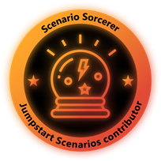
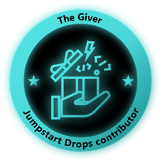
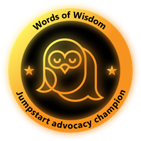
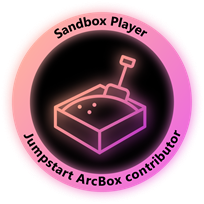
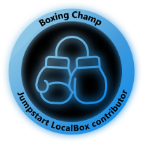
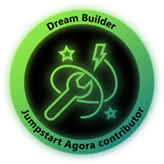
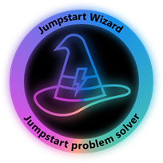
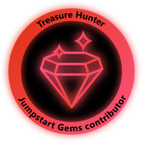
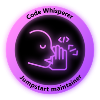

## Jumpstart Community Badges

**Welcome to Jumpstart Community Badges!**

Jumpstart Community Badges are a recognition system designed to celebrate and reward active participation and contributions within the Jumpstart community. They help foster engagement and acknowledge members’ efforts in various activities and initiatives.

### The Jumpstart Badges

| Badge         | Name          | Description   | How to earn it   | Tiers         |
| ------------- | ------------- | ------------- | -----------------| ------------- |
|  | Scenario Sorcerer | Jumpstart Scenario Contributor | A contirbutor of Jumpstart Scenarios. | ⭐ 1 Jumpstart Scenario contribution   ⭐⭐ 3 Jumpstart Scenario contributions   ⭐⭐⭐ 5 Jumpstart Scenario contributions  |
|  | The Giver | Jumpstart Drops Contributor | A contirbutor of Jumpstart Drops. | ⭐ 1 Jumpstart Drop contribution   ⭐⭐ 3 Jumpstart Drop contributions   ⭐⭐⭐ 5 Jumpstart Drop contributions  |
|  | Words of Wisdom | Jumpstart advocacy champion | A contributor who created a Jumpstart community advocacy asset (blog, video, webinar, presentation, etc.) | ⭐ 1 Jumpstart community contribution   ⭐⭐ 3 Jumpstart community contributions   ⭐⭐⭐ 5 Jumpstart community contributions  |
|  | Sandbox Player | Jumpstart ArcBox contributor | A contributor of Jumpstart ArcBox code and / or documentation | One-time badge  |
|  | Boxing Champ | Jumpstart HCIBox contributor | A contributor of Jumpstart HCIBox code and / or documentation | One-time badge  |
|  | Dream Builder | Jumpstart Agora contributor | A contributor of Jumpstart Agora code and / or documentation | One-time badge  |
|  | Jumpstart Wizard | Jumpstart problem solver | A contributor who received an "Accepted answer" on Jumpstart issue and/or Jumpstart GitHub Discussions and/or attended research activities | One-time badge  |
|  | Treasure Hunter | Jumpstart diagrams collaborator | A contributor who worked with the team on an existing or new published architecture diagram  | One-time badge  |
|  | Code Whisperer | Jumpstart maintainer | A Jumpstart core maintainer and an official team member. | One-time badge  |
|  | Movie Star | Jumpstart Lightning guest | A guest on Jumpstart Lightning | One-time badge  |

### Apply for a Jumpstart Community Badge

You can apply for a Jumpstart Community Badge using this for: https://aka.ms/JumpstartBadgesForm

### Frequently Asked Questions (FAQ)

**What are Jumpstart Community Badges?**  
Jumpstart Community Badges are a recognition system designed to celebrate and reward active participation and contributions within the Jumpstart community.

**How can I earn a Jumpstart Community Badge?**  
You can earn badges by participating in various community contributions and activities, such as contirbute code, contributing to discussions, write documentation, create diagrams, and helping other members. You can find more information about the different badges and how to earn it in the table above. You can then apply for a badge on https://aka.ms/JumpstartBadges.

**Where can I see the badges I’ve earned?**  
You can view your earned badges on your Credly profile page and add them also to your social media profiles such as LinkedIn.

**Are there different types of badges?**  
Yes, there are various types of badges that recognize different kinds of contributions and achievements, ranging from contributor to advocacy roles.

**Can I lose a badge once I’ve earned it?**  
Generally, once you earn a badge, it remains on your profile.

**How do badges benefit me?**  
Badges serve as a visible acknowledgment of your contributions, enhancing your reputation within the community.

**Can I suggest new badges?**  
Yes, community members are encouraged to suggest new badges. You can submit your ideas through the feedback section on the Jumpstart platform.

**Who can I contact if I have questions about badges?**  
If you have any questions or need assistance, you can reach out to the community support team via the contact options provided on the Jumpstart platform.
