## Jumpstart Drops contribution guidelines

**Welcome to Jumpstart Drops contribution guidelines!**

We welcome contributions following the guidelines described in the Arc Jumpstart [contribution guidelines](./../contribution_guidelines).
Our goal is to create a simplified contribution process for our users that ensures high-quality standards for all submissions. There are two ways to contribute to Jumpstart Drops:

1. Manual approach with a GitHub pull request
2. Using the Drop [Creation Wizard](https://preview.arcjumpstart.com/azure_jumpstart_drops_creation)

### Using the Drop Creation Wizard
The **"Create Drop"** wizard simplifies the contribution process by guiding contributors through each step, making it easy to submit a new Drop. With the wizard, contributors can also use the live preview option to see how the Drop will appear on the website before finalizing the submission. This ensures that everything is perfect before sharing it with the community.

For video instructions on how to use the wizard, see the Jumpstart Drops Wizard [video series](https://aka.ms/JumpstartDropsWizard).

To submit a Drop using this method, follow the step-by-step guide below:

#### Step 1: Access the Jumpstart Drop Creation Wizard

1. Open your preferred web browser.
1. Go to the Jumpstart Drops [site](https://arcjumpstart.com/azure_jumpstart_drops).
1. Select the **Create a Drop** button.
    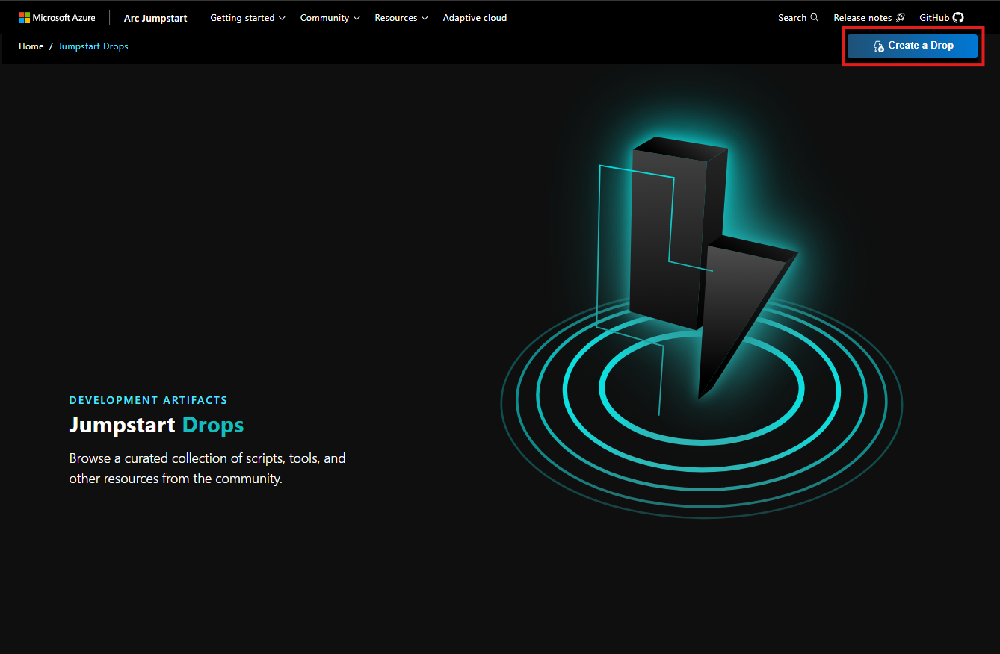

#### Step 2: Start the Wizard

When the page loads, you will be greeted with a welcome screen that introduces the Jumpstart Drop creation process. The wizard consists of three main components:

1. Top bar: It displays the progress of the two steps (Card details and Side panel details) and includes the **Create** button to submit the Drop.
2. Left-side preview bar: This allows you to preview how the content will be rendered once the Drop is approved and published.
3. Right-side content bar: This is where you input all the required information for the Drop submission.

    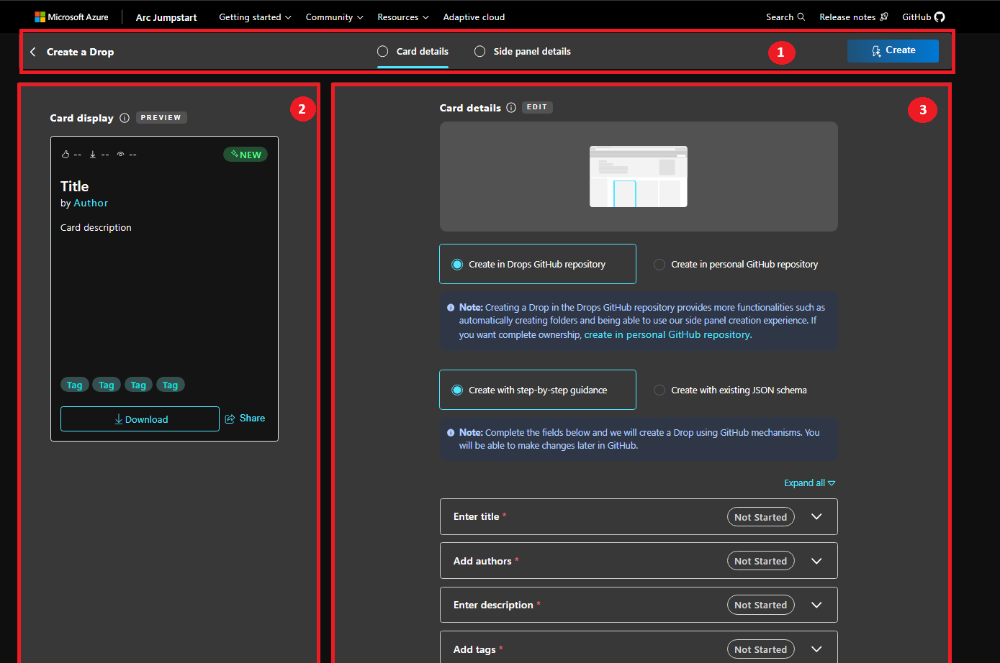

#### Step 3: Define the Card Details

In this step, you will need to input the data used to fill the [Drop JSON scheme](https://github.com/Azure/arc_jumpstart_drops/blob/main/SCHEMA.md). This data will be used to create the Drop definition file under the [drops](https://github.com/Azure/arc_jumpstart_drops/blob/main/drops) folder. 

1. Choose the GitHub hosting repository:
    - **Create in Jumpstart Drops GitHub repository**: In this case, all the source code and documentation of the Drop will be hosted inside the Jumpstart Drops [repo](https://github.com/Azure/arc_jumpstart_drops). Contributors will be able to use the **Side panel details** section to create the documentation of the Drop.
    - **Create in personal GitHub repository**: In this case, the source code and documentation of the Drop will be hosted in the contributor's GitHub repo, and the Drop schema will have a reference to the external repository. If you choose this option, the **Side panel details** section will preview the content from the GitHub repo, but the documentation wizard creator will not be available.

    For more information, see [Define source code hosting](#step-3-define-the-card-details).

1. Choose the creation process:
    1. **Create with step-by-step guidance:** In this case, you will be guided through the Wizard fields to complete all the required information.

    2. **Create with existing JSON schema**: Alternatively, you can upload a previously completed JSON definition. This option offers more flexibility but may be more prone to errors. If the JSON is uploaded, some checks will run to ensure the correct definition, and if it's correct, all the Wizard fields will be autopopulated.

1. Input and review all parameters. For more information about each input, refer to the [Drops definition](https://github.com/Azure/arc_jumpstart_drops/blob/main/SCHEMA.md). Each input has a tooltip with further details and validation to ensure accurate inputs.
As you fill in the parameters, you'll see that the top bar will show the status (In Progress or Completed).

    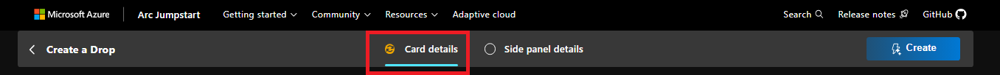

1. Preview Card details: Validate that the Drop Card is rendering correctly and that the provided information is clear and informative. Note that the action buttons such as Downloads or Share will not work in this preview.

    

1. After completing the **Card details** section, you can proceed to the **Side panel details** section. If you are hosting the Drop in the Jumpstart Drops GitHub repository, this section will provide a Wizard to create the documentation. However, if you are using an external repository, the section will render the content from the submitted repository as the source for the Drop.

    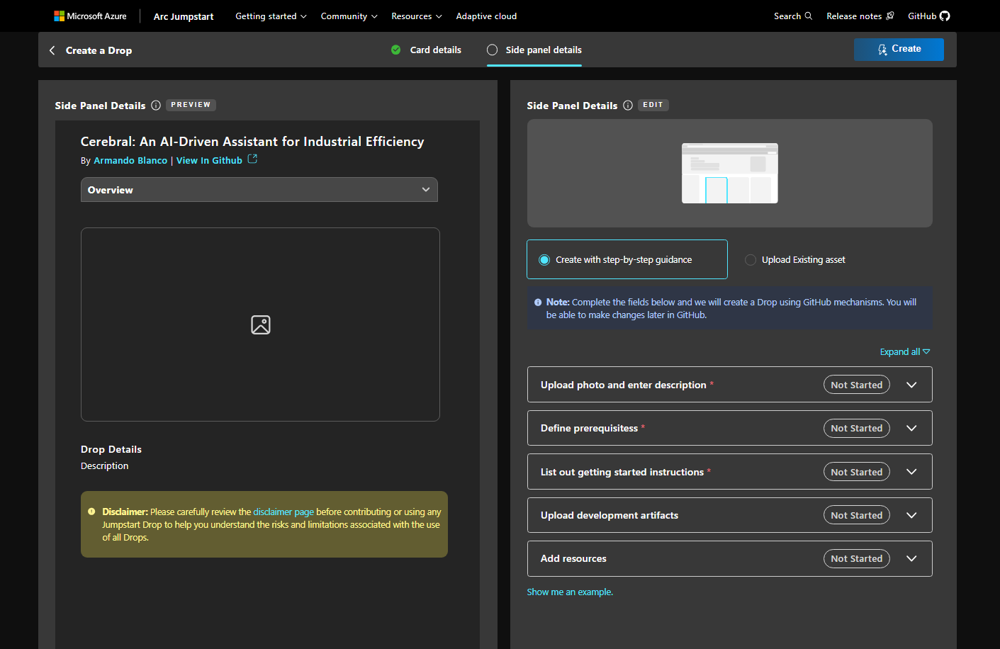

1. Choose the creation process for the side panel content:
    1. **Create with step-by-step guidance**: This option will guide you through the process of creating the side panel content by providing step-by-step instructions.
    2. **Upload Existing asset**: If you already have the side panel content prepared, you can upload it directly using this option.

1. The **Side panel details** creation process follows a similar approach to the **Card details** creation process. As you input all the information or submit pre-created files, you can preview the content in the right-side preview bar. The step-by-step guide aims to simplify the documentation creation process by suggesting certain sections for contributors. However, please note that this documentation can always be modified after the Drop is submitted and published. For more flexibility, you can also create an **_index.md** markdown file locally and upload it for the final submission.

    As you submit all content, you'll notice that the top bar will indicate that the section is **In progress**. 

    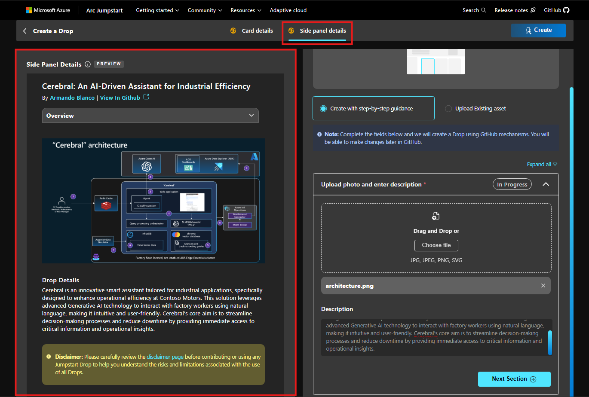

1. Once all the content is submitted and reviewed, you will notice that the two sections of the progress bar will turn green, indicating that all required information has been provided. At this point, you can proceed by clicking the **Create Drop** button. If there are any missing inputs or parameters, the progress bar will turn red, and the Drop creation process will be halted. In such cases, please review the content and ensure that all errors are fixed.

    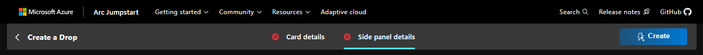

    On the other hand, if everything is correct, both sections of the progress bar will turn green, indicating successful data for submission. You will then be redirected to the final page, where you can view the status of submission.

    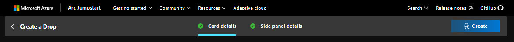

1. Complete the submission and wait for the content to be processed. The Drop Creation Wizard will automate the creation of a GitHub pull request. Once the pull request is created, a link to the public PR will be provided for the contributor to track the status of the Drop. If any additional content or comments need to be added, they can be done by commenting directly on the GitHub PR or by creating an [issue](https://github.com/Azure/arc_jumpstart_drops/issues).

    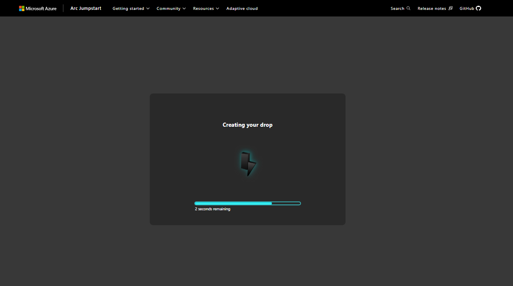

    Once the process is complete and the pull request is created, you will receive a successful message along with a link to review the PR.

    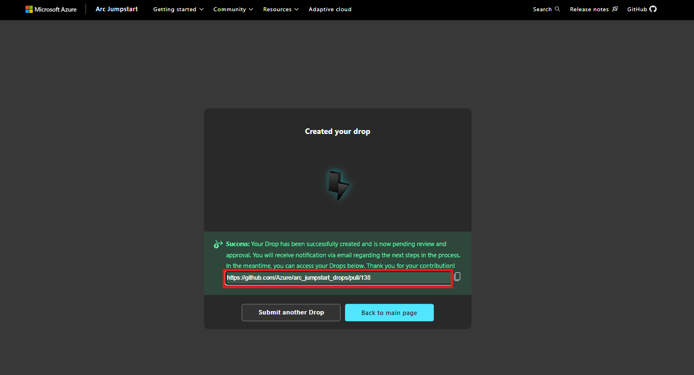
    
Once the pull request is created, the review and submission process is the same as the process discussed below for the **Manual PR creation approach**. The appropriate checks and review process will take place by the Jumpstart team, and after the review feedback loop, the Drop will be published. For more information, check the **Contribution process flow** below.

### Manual approach with a GitHub Pull Request

The first is by opening a GitHub Pull Request following a simple [JSON scheme](https://github.com/Azure/arc_jumpstart_drops/blob/main/SCHEMA.md). 

The contribution process consists of the following steps:

 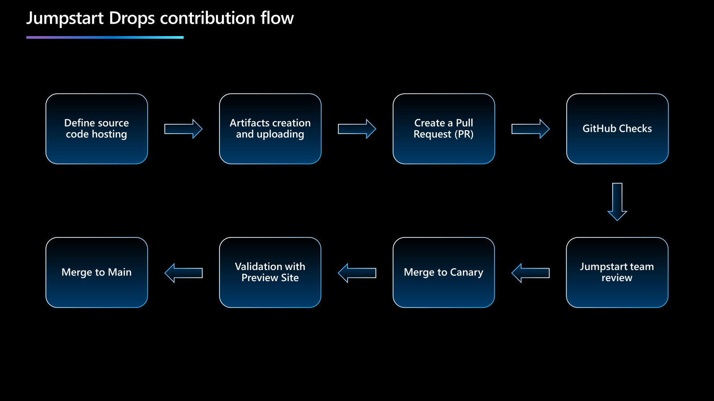

1. **Define source code hosting:** There are two alternatives to host the source code:

    - **Include Code in Pull Request:** Include the code/artifacts in the pull request and host all the content as part of the [Arc Jumpstart Drops repository](https://github.com/Azure/arc_jumpstart_drops).
    - **Reference to Author's Repository:** Keep the code in the author's repository and provide a reference URL under the _"Source"_ in the Drop definition file (check [Drops schema](https://github.com/Azure/arc_jumpstart_drops/blob/main/SCHEMA.md)). Ensure that the repository is publicly available.

1. **Artifacts creation and uploading:** Develop and validate the source code of your Jumpstart Drop and the JSON schema file. Before submitting your pull request, ensure to check the following:
    1. Test your Drop end-to-end in a new, unmodified environment to ensure it works as expected.
    1. Choose a descriptive and actionable title that accurately represents your Drop's purpose. Remember that users will see this title when browsing the Drops gallery and should have a good idea of your Drop just by seeing the Drop's card. 
    1. Provide clear documentation that includes screenshots or videos demonstrating the steps involved and potential outcomes.
    1. Have someone else review your code before submitting it. Don't include any credentials as part of your submission.
    1. Ensure checking the spelling, grammar, and wording of your submission. To help validation, use [Vale](https://vale.sh/), already configured as part of the project. Ensure to use `vale sync` before starting linting, to get the latest configurations.

    The final submission should contain the following files:

    - **Source Code**: Include all the code files you've created, along with any necessary documentation (README, images, videos, etc.). Ensure these files follow the correct structure defined in the [folder structure](#folder-structure) section. 

    - **Drop Definition**: Provide a JSON file with all the required fields as described in the [Drops Schema](https://github.com/Azure/arc_jumpstart_drops/blob/main/SCHEMA.md) definition. This file will be used by the Arc Jumpstart Drops page to create a Drop card with all the necessary information, as you can see in the following image. 

    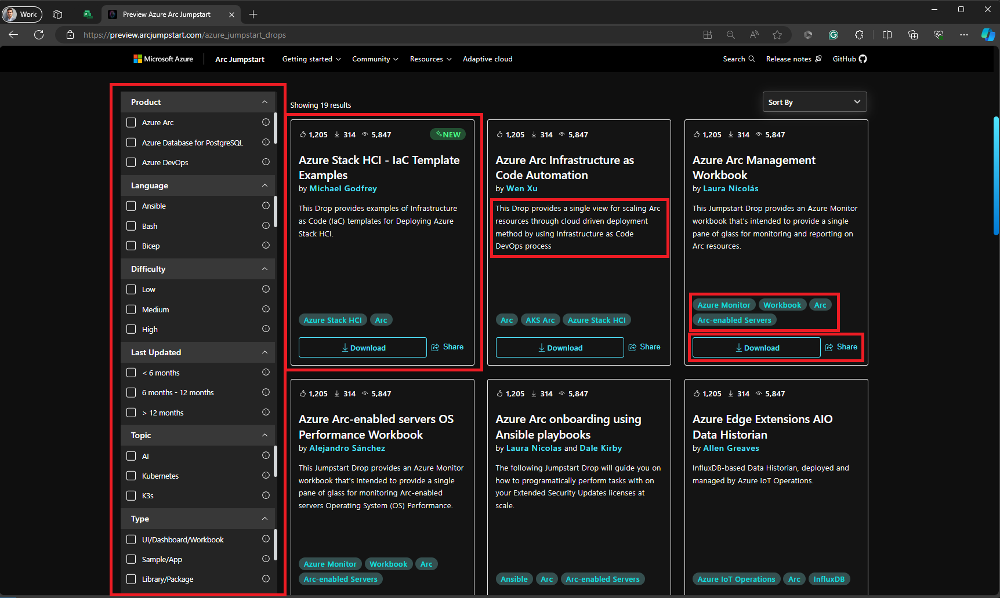

    1. Drop card created for each *JSON* definition schema file placed under the [drops](https://github.com/Azure/arc_jumpstart_drops/tree/main/drops) folder, with a unique *Title* and *Authors*. The name should be unique, have a proper description, and use **snake_case**.
    1. Description of the Drop
    1. Filter bar to filter Drops based on the metadata of the Drop, like tags, products, creation date, and topics.
    1. Tags and action buttons: _Download_ and _Share_.

1. **Create Pull Request to Canary**: Submit your pull request (PR) to the Canary branch of [Arc Jumpstart Drops](https://github.com/Azure/arc_jumpstart_drops). 

    For example, the following Drop submission aims to contribute the code to the [arc_jumsptart_drops](https://github.com/Azure/arc_jumpstart_drops) repository, hence as part of the pull request you can see the `win11_iot_ram_deduction.json` file under the `drops` folder, and then the artifacts under the `script_automation/win11_iot_ram_deduction` folder. Also, you can see that the *Source* is pointing to the [arc_jumsptart_drops](https://github.com/Azure/arc_jumpstart_drops) repository. 

    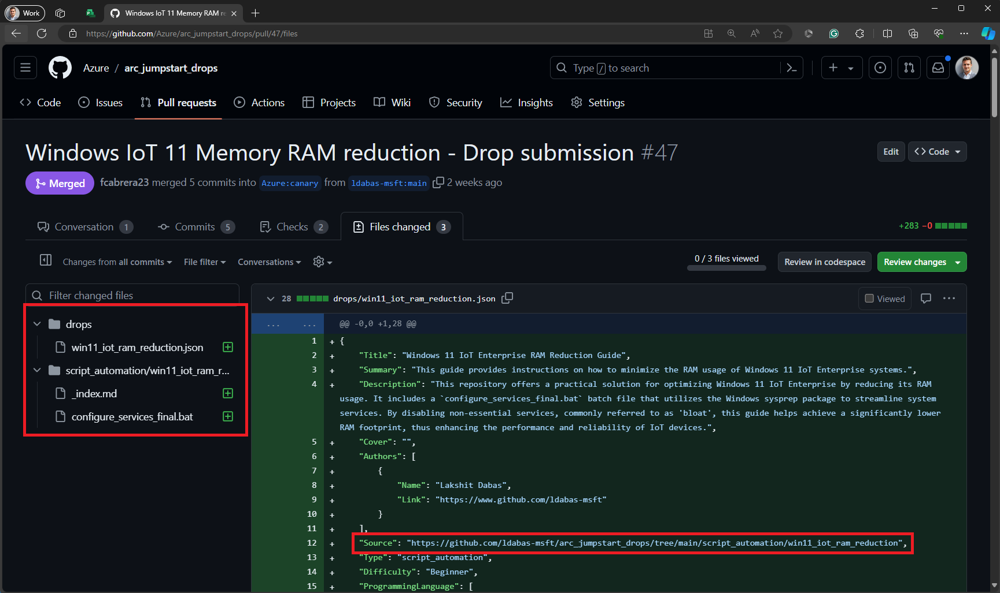

1. **GitHub Checks**: As part of the validation process, there are multiple [GitHub Actions](https://github.com/Azure/arc_jumpstart_drops/actions) that run during the pull request review process to ensure:
    - Drop JSON schema definition and folder structure.
    - [MIT licensing](https://github.com/Azure/arc_jumpstart_drops?tab=MIT-1-ov-file#readme) and Microsoft CLA license check.
    - CodeQL for vulnerabilities.
    - [Vale.sh](https://vale.sh/) linter for documentation grammar and styling. 

    When creating a pull request, you'll see your checks running for ~2-3 minutes. Carefully review the result of the checks, and fix any errors found on your submission.

     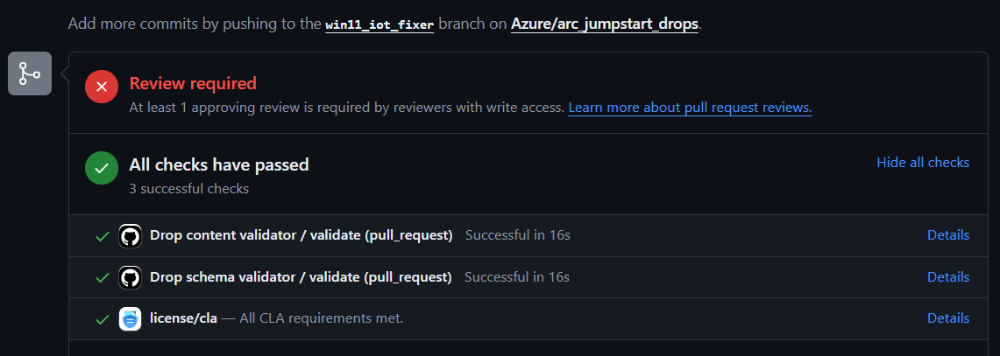

1. **Manual review from Jumpstart Core maintainers**: Reviewers will be added based on the products and type of Drop submitted. The PR can only be merged if all GitHub checks pass and at least 2 reviewers approve the submission.

1. **Merge to Canary**: If everything is correct, the PR will be merged to the **canary** branch, and the new Drop will be part of the approved Drops curated list. 

1. **Validation with Preview Site**: Validate the changes using the [Preview Azure Arc Jumpstart site](https://preview.arcjumpstart.com/azure_jumpstart_drops). Ensure to check that your Drop is rendering correctly. Take some time to review the Drop card, and once finished, review the right-sidebar with all the context from your _README.md_ or _Index.md_.

    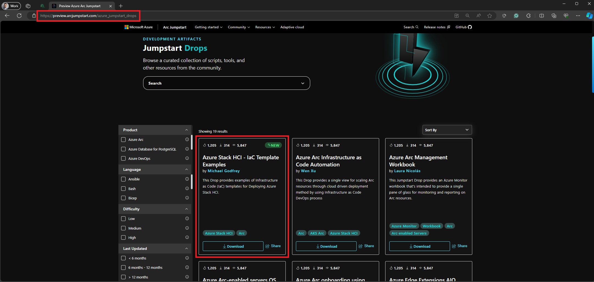

1. **Merge to Main**: Finally, once the **Canary** branch is merged to **Main** and published to Production, the Drop will be available as part of [Azure Arc Jumpstart Drops](https://arcjumpstart.com/azure_jumpstart_drops).

## Drop Index

When you select a Drop for more information, a right-sidebar will appear, displaying a more detailed view of the Drop. The content of the right bar is based on the *_README.md_ or _Index.md_ file of the Drop's source code, which is used to render different sections. To ensure that the right bar displays all the relevant information, headers (H2, H3, or H4) must be included in the _README.md_ or _Index.md_ file. 

  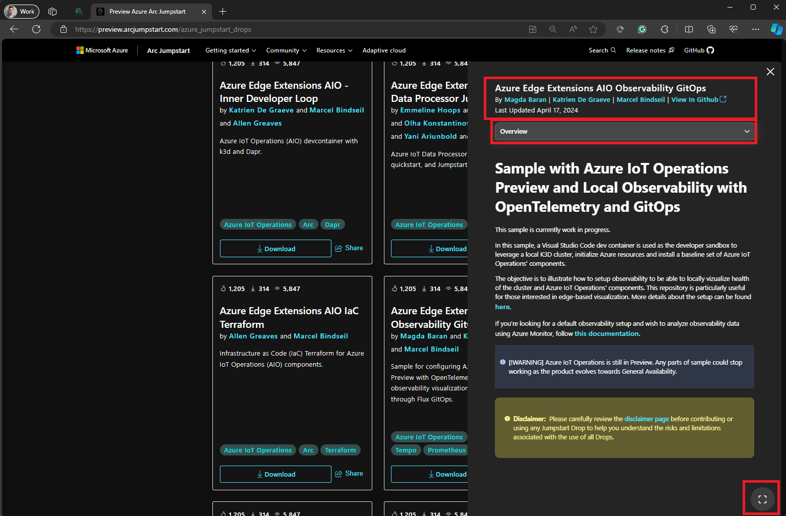

When accessing the right-sidebar, you'll be presented with the following sections:

1. **Metadata header**: This section will display important information from the Drop JSON schema file, allowing you to quickly and easily access key details about your Drop data.
1. **Section selector**: A dropdown menu will enable you to choose from different sections of the Drop Index file, making it easy to navigate through the Drop documentation.
1. **Selected content**: Once you've chosen a section, the content will be displayed, allowing you to view the information you need without having to navigate away from the page.
1. **Full-screen mode**: If you need more space to work with, you can switch to full-screen mode with the click of a button, giving you a larger view of your data and making it easier to work with.

To help contributors write effective documentation for their Drop Index page, we recommend including the following sections:

- **Overview**: This section should provide a detailed description of the Drop, including any important notes or information that users need to be aware of before running it.
- **Prerequisites**: This section should list all the prerequisites that need to be configured before running the Drop. For each prerequisite, we encourage authors to be descriptive about the specific version (if needed) and provide appropriate documentation links on how to configure it.
- **Getting Started**: This section should provide detailed instructions on how to run the Drop, including a quick start approach and coverage of the different configurations and parameters available. This section assumes that the prerequisites are already satisfied. If there's a way to run the Drop with one command, we recommend including it and explaining the different variables/parameters that could be used.
- **Resources**: This section should list resources that users can use to find helpful information regarding the Drop and the products/prerequisites used.
- **Others**: This section will render the content for all other headers that don't match the above. 

It's important to note that while the sections described above are recommended for an optimal user experience, contributors are free to use their own layouts and sections. If no matching sections are found, all content will be rendered in a single tab labeled **Overview**.

For example, if the **Manage Extended Security Updates (ESU) licenses at scale** contains an _index.md_ that contains the _Overview_, _Contributors_, _Prerequisites_, _Getting started_ and _Resources_ sections, the right-bar will render as the following image:

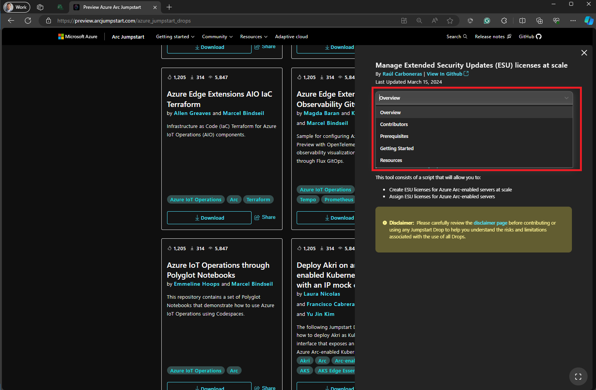

## Folder structure

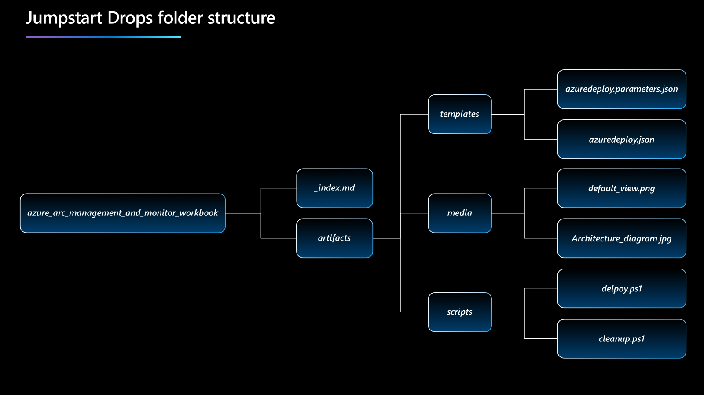

The folder structure guidelines for submitting Drop source code as part of a Pull Request into the Arc Jumpstart Drops repository are as follows:

1. Create a root folder with the name of the Drop using **snake_case**. For example, *azure_arc_management_and_monitor_workbook*.

1. Inside the root folder, include a file named *_index.md* that serves as a README file for the Drop. This file should provide a brief introduction and overview of the Drop, its objectives, prerequisites, deployment steps, and any additional resources or references.

1. Create a new folder named *artifacts* inside the root folder. This folder should contain all the files and scripts necessary to run the Drop.

1. Optionally, create a new folder named *media* inside the artifacts folder. This folder can contain any screenshots or architecture diagrams that showcase the Drop.
